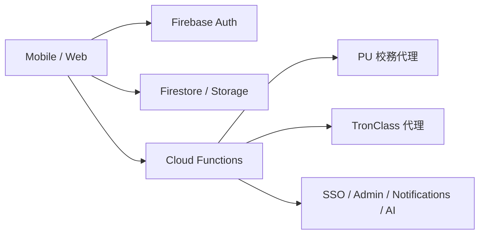

# 校園助手（Campus One）

<p align="center">
  
  
  
  
  
</p>

> 本 README 依據 2026-04-03 對目前 repo 程式碼、workspace 設定、GitHub workflow 與 env 範本的實際盤點重新整理。若其他文件與此處衝突，請先以本檔與程式碼本身為準。

## 這個專案現在是什麼

這是一個以 `pnpm workspace` 管理的校園平台 monorepo，包含：

- `apps/mobile`：Expo / React Native 行動端
- `apps/web`：Next.js App Router Web / PWA
- `backend/functions`：Firebase Cloud Functions v2
- `backend/firestore`、`backend/storage`：Firebase Rules 與索引
- `packages/shared`：共用型別、發布設定、學校資料、PU 驗證契約

目前產品對外主入口已明確收斂為 **靜宜大學（PU）學號登入**：

- Mobile 與 Web 的主要登入畫面都直接要求 `PU` 學號與 e 校園密碼
- 登入後會建立 Firebase session，並同步 PU 校務資料與 TronClass 資料
- 多校代碼、School directory、SSO provider、adapter 與校務抽象層仍保留在底層，作為後續擴充基礎

換句話說，**這不是一個只剩 demo mock 的作業倉庫**，也不是單純的畫面集合；它已經有明確的 client / backend / CI/CD / release workspace 結構，只是目前產品策略先收斂到 PU-only。

## 專案快照

| 面向 | 目前盤點結果 |
| --- | --- |
| Mobile | `81` 個 `*Screen.tsx`、`13` 個 `*Stack.tsx`，含 Today / 課程 / 校園 / 收件匣 / 我的主架構 |
| Web | `20` 個 `page.tsx` 頁面、`4` 個 route handlers，定位為 school-aware PWA |
| Backend | `64` 個 `onCall`、`13` 個 `onRequest`、`5` 個 `onSchedule`、`11` 個 Firestore triggers |
| 測試 | Mobile `16` 個測試檔、Web `5` 個測試檔、Functions `1` 個測試檔、Rules `1` 個測試檔 |
| GitHub 工作流 | `5` 個 workflow：CI、Release、EAS Build、Preview Deploy、Maestro E2E |
| E2E | `apps/mobile/.maestro/flows/` 下有 `10` 個 Maestro flow |

這些數字代表的是目前 repo 的實際表面積，不代表所有功能都已達 production quality，但足以說明這個倉庫已經超過單一 app prototype。

## 目前真實的產品定位

### 1. 對外流程：PU-only

目前版本最重要的真相只有一個：

- **登入主路徑是靜宜大學學號登入**
- 舊的多校入口、訪客登入、email/password 主要流程，不再是目前版本的產品入口
- `apps/web/src/app/login/page.tsx` 與 `apps/mobile/src/screens/SSOLoginScreen.tsx` 都明確寫了 PU-only 文案

### 2. 底層架構：保留多校能力

雖然對外流程收斂成 PU-only，但底層還保留：

- `packages/shared/src/schools.ts` 的學校目錄與 code/domain 正規化
- `apps/mobile/src/data/apiAdapters/` 的學校 adapter 抽象
- `backend/functions/sso/` 與 Web SSO helper
- `mock` / `firebase` / `hybrid` 三種 runtime data source 模式

這表示目前狀態比較準確的描述是：

> **產品入口先收斂到 PU，平台架構仍保留多校擴充能力。**

## 使用者面能做什麼

下列內容是依目前程式碼、路由、screen 命名與 Functions 匯出整理，不是憑舊企劃文件推測。

### Mobile

行動端的主導航已改成明確的 5-tab 心理模型：

1. `Today`
2. 角色導向第二入口
3. `校園`
4. `收件匣`
5. `我的`

第二個 tab 會依角色切換為：

- `課程`
- `教學`
- `服務`
- `審核`
- `管理`

目前在 `apps/mobile/src/screens/` 可以看到的主要功能面包含：

- `TodayScreen`、`HomeScreen`：首頁 / 今日儀表板
- `CoursesHomeScreen`、`CourseHubScreen`、`CourseModulesScreen`、`CourseScheduleScreen`
- `QuizCenterScreen`、`QuizTakingScreen`、`AttendanceScreen`、`ClassroomScreen`
- `LearningAnalyticsScreen`、`CourseGradebookScreen`、`GradesScreen`
- `AnnouncementsScreen`、`EventsScreen`
- `MapScreen`、`ARNavigationScreen`、`AccessibleRouteScreen`
- `BusScheduleScreen`、`CafeteriaScreen`、`MenuDetailScreen`、`OrderingScreen`
- `LibraryScreen`、`DormitoryScreen`、`HealthScreen`、`PrintServiceScreen`
- `InboxScreen`、`MessagesHomeScreen`、`GroupsScreen`、`GroupDetailScreen`
- `GroupAssignmentsScreen`、`AssignmentDetailScreen`、`ChatScreen`
- `AIChatScreen`、`AICourseAdvisorScreen`
- `NotificationsScreen`、`NotificationSettingsScreen`
- `QRCodeScreen`、`WidgetPreviewScreen`
- `CreditAuditScreen`、`AchievementsScreen`
- `ProfileScreen`、`SettingsScreen`、`AccessibilitySettingsScreen`
- `AdminDashboardScreen`、`DepartmentHubScreen`、`TeachingHubScreen`、`StaffHubScreen`

另外，行動端還有幾個很重要、容易被忽略的基礎能力：

- 離線同步與衝突處理：`src/services/offline.ts`
- 快取與 hybrid source：`src/data/cachedSource.ts`、`src/data/hybridSource.ts`
- 推播通知：`src/services/notifications.ts`
- 效能追蹤與錯誤回報：`src/services/performance.ts`、`src/services/errorReporting.ts`
- iOS / Android widget：`ios-widget/`、`android-widget/`、`src/widgets/`

### Web

Web 端不是 Next.js 預設樣板站，現在已是一個 school-aware 的 PWA shell。`apps/web/src/app/` 目前可見的頁面包括：

- `/`：首頁 / Today-style landing
- `/login`：PU 學號登入
- `/announcements`
- `/map`
- `/cafeteria`
- `/library`
- `/groups`
- `/timetable`
- `/grades`
- `/profile`
- `/settings`
- `/search`
- `/bus`
- `/clubs`
- `/course/[courseId]`
- `/teacher/course/[courseId]`
- `/join`
- `/sso-callback`
- `/sso/acs`
- `/privacy`
- `/terms`

Web 端還有這些明確能力：

- PWA manifest 與 service worker：`public/manifest.json`、`public/sw.js`
- school context / navigation helpers：`src/lib/pageContext.ts`、`src/lib/navigation.ts`
- Firebase auth / data helpers：`src/lib/firebase.ts`
- generalized web SSO helper：`src/lib/sso.ts`

### Backend

`backend/functions/index.js` 不是只有幾支驗證 API，而是一個功能很廣的 Functions 入口。從匯出可以看出目前涵蓋的區塊至少有：

- 校園公告、活動、群組貼文、作業、訊息通知 trigger
- `askCampusAssistant` AI 助理入口
- `signInPuStudentId`、`puFetchCampusData`、`puFetchTronClassData`
- `startSSOAuth`、`verifySSOCallback`、`getSSOConfig`、`updateSSOConfig`
- user profile、admin、school member role、service role
- groups / join code / leave group
- favorites、資料匯出、刪帳號
- library、座位預約、餐廳訂單、支付 / 錢包
- dormitory、print、health、bus
- live classroom / poll / reaction / achievement
- daily brief / weekly report 等 scheduled jobs

如果你需要一個簡單說法，可以把現在的 backend 理解成：

> **Firebase 為中心的校園平台後端，現在已同時負責登入、同步、通知、校務代理、互動能力與部分營運管理接口。**

## Monorepo 結構

```text
畢業專題/
├── apps/
│   ├── mobile/                  # Expo / React Native app
│   │   ├── src/
│   │   ├── ios/                 # iOS native project 已納入版控
│   │   ├── ios-widget/          # iOS Widget
│   │   ├── android-widget/      # Android Widget
│   │   └── .maestro/flows/      # E2E 測試流程
│   └── web/                     # Next.js 16 App Router / PWA
├── backend/
│   ├── functions/               # Firebase Cloud Functions
│   ├── firestore/               # Firestore rules / indexes
│   ├── storage/                 # Storage rules
│   └── tests/                   # Rules / backend 測試
├── packages/
│   └── shared/                  # 型別、release、tenant、school、PU auth 契約
├── docs/                        # 架構、API、release、法務文件
├── scripts/                     # seed、version bump、review 腳本
└── .github/workflows/           # CI / release / preview / E2E
```

`pnpm-workspace.yaml` 已明確將三個區塊都納入 workspace：

- `apps/*`
- `packages/*`
- `backend/*`

## 技術棧

| 區塊 | 主要技術 |
| --- | --- |
| Mobile | Expo 54、React Native 0.81、React 19、React Navigation 7、Firebase 12 |
| Web | Next.js 16 App Router、React 19、Vitest、PWA |
| Backend | Firebase Functions v2、Firebase Admin、Firestore、Storage Rules |
| Shared | TypeScript workspace package `@campus/shared` |
| Tooling | pnpm 10.28.2、ESLint 9、Prettier 3、Jest、Vitest |
| Release | EAS Build / Submit、GitHub Actions、Firebase CLI |

## 執行模型與資料流

### Runtime modes

Mobile 端目前支援三種資料來源模式：

| 模式 | 用途 |
| --- | --- |
| `mock` | 純前端 / UI 開發 |
| `firebase` | Firebase 驗證與 demo runtime |
| `hybrid` | 真實校務整合目標模式 |

實作位置在 `apps/mobile/src/config/runtime.ts`。目前重要設定是：

- 設計目標模式：`hybrid`
- 開發環境預設：`hybrid`
- 非開發環境 fallback：`firebase`

這一點很重要，因為它表示 **開發時不再只是 mock app**，而是傾向直接走真實整合路徑。

### Data boundary

目前 repo 的資料邊界可以簡化成：



對應的架構原則也已寫在 `docs/architecture/firebase-data-boundaries.md`：

- Firestore 適合 app-native、realtime、協作型資料
- 校務、成績、出缺席、館藏、支付等 institutional records 應由 adapter 或 backend 負責
- 畫面層不應直接自行拼 Firestore 業務邏輯，應透過 `DataSource` 或 feature repository

### 登入與同步

目前真正的登入流程為：

1. 使用者在 Mobile 或 Web 輸入 PU 學號與密碼
2. Backend `signInPuStudentId` 驗證帳密
3. Backend 建立 Firebase custom token / session
4. Client 與 backend 共同同步 PU 校務與 TronClass 資料
5. App 載入課表、成績、公告、課程與校園資料

雖然 Web / backend 仍有 generalized SSO 相關檔案，但 **那是平台底層能力，不是目前的主要對外入口**。

## 本機開發

### 需求

- Node.js `>=20 <21`
- pnpm `10.28.2`
- Java 21
  - `pnpm test:rules` 會嘗試使用本機 OpenJDK 21
- Firebase CLI
  - repo 已透過 devDependencies 提供 `firebase-tools`

### 安裝

```bash
pnpm install
```

### 環境變數檔案

目前 repo 內有四組主要範本：

| 檔案 | 用途 |
| --- | --- |
| `.env.example` | 根層級總範本，內容最廣，也包含一些較泛化 / 願景型設定 |
| `apps/mobile/.env.example` | Mobile 本機開發最常用的 env |
| `apps/web/.env.example` | Web PWA env |
| `backend/functions/.env.example` | Functions / backend env |

一般本機開發最常見的做法：

```bash
cp apps/mobile/.env.example apps/mobile/.env
cp apps/web/.env.example apps/web/.env.local
```

如果要跑 Functions 代理或 backend 功能，再依需求建立對應的 Functions env。

### Mobile release-like build 額外要求

`apps/mobile/app.config.ts` 對 preview / production build 有更嚴格的 env 要求。若要跑 release-like build，至少要補齊這類欄位：

- `EXPO_PUBLIC_EAS_PROJECT_ID`
- `EXPO_PUBLIC_FIREBASE_*`
- `EXPO_PUBLIC_RELEASED_SCHOOL_IDS`
- `EXPO_PUBLIC_LEGAL_BASE_URL`
- `EXPO_PUBLIC_ERROR_REPORTING_ENDPOINT`
- `EXPO_PUBLIC_GOOGLE_MAPS_API_KEY`
- `EXPO_PUBLIC_DEEP_LINK_HOST`（若開啟 deep links）

也就是說，**能在 dev mode 跑起來，不等於能直接做 preview / production build。**

### 啟動指令

```bash
pnpm dev:web
pnpm dev:mobile
pnpm dev:functions
```

根目錄 `pnpm dev` 目前等同於：

```bash
pnpm dev:web
```

若要直接跑原生 app：

```bash
pnpm --filter mobile ios
pnpm --filter mobile android
```

## 常用指令

| 指令 | 說明 |
| --- | --- |
| `pnpm lint` | 跑 mobile / web / functions / shared lint |
| `pnpm typecheck` | 跑 mobile / web / shared typecheck |
| `pnpm --filter mobile test` | Mobile Jest 測試 |
| `pnpm --filter web test` | Web Vitest 測試 |
| `pnpm --filter functions test` | Functions Jest 測試 |
| `pnpm test:rules` | Firestore / Storage rules 測試 |
| `pnpm --filter web build` | 建置 Web app |
| `pnpm release:preview` | 送出 mobile preview build |
| `pnpm release:production` | 送出 mobile production build |
| `pnpm submit:ios` | 提交最新 iOS build |
| `pnpm submit:android` | 提交最新 Android build |
| `pnpm version:patch` / `minor` / `major` | bump 版本號 |

## GitHub / CI / Release 現況

`.github/workflows/` 目前有 5 個 workflow：

| Workflow | 作用 |
| --- | --- |
| `ci.yml` | Security Gates、Lint、Typecheck、Mobile/Web/Functions tests、Build 驗證 |
| `release.yml` | 手動 release pipeline，支援 iOS / Android build 與 submit |
| `eas-build.yml` | 手動 EAS Build |
| `preview-deploy.yml` | PR label 為 `preview` 時發送 EAS update |
| `maestro-e2e.yml` | iOS 模擬器上的 Maestro E2E |

這代表 GitHub 層不是只有 code hosting，已經包含：

- 基礎安全檢查
- lint / typecheck / test gate
- Web build 驗證
- Expo / EAS 整合
- mobile preview update
- E2E automation

如果你想「更新 GitHub 首頁」而不是只改本地文件，根目錄 `README.md` 就是最重要的入口；這次重寫就是以這個目的為主。

## 文件導覽與可信度

### 可當主要入口的文件

- `README.md`
- `docs/architecture/firebase-data-boundaries.md`
- `docs/legal/*`

### 可作為補充，但仍要回頭對照程式碼的文件

- `docs/API.md`
  - 可用來快速理解 Functions / HTTP 介面，但實際匯出仍應以 `backend/functions/index.js` 為準
- `docs/AI_ASSISTANT_ARCHITECTURE.md`
  - 架構思路有參考價值，但裡面部分檔案路徑與舊狀態描述不應直接當成現況
- `docs/RELEASE.md`
  - 可用來理解 release 流程設計，但具體腳本與 workflow 細節仍應回頭對照 `package.json`、`apps/mobile/eas.json` 與 `.github/workflows/`

### 明顯帶有歷史狀態的文件

- `apps/mobile/DEMO.md`
  - 仍保留舊版 email/password、多校切換、訪客流程等展示腳本
- 舊的多校登入敘述
  - 若與目前登入畫面衝突，請以程式碼與本 README 為準

### 已處理的文件漂移

- `apps/web/README.md`
  - 原本仍是 create-next-app 預設模板
  - 已在這次整理中改成專案專用說明

## 你在這個 repo 內最值得先看的檔案

如果是第一次接手，建議閱讀順序：

1. `README.md`
2. `apps/mobile/App.tsx`
3. `apps/mobile/src/config/runtime.ts`
4. `apps/web/src/app/layout.tsx`
5. `apps/web/src/app/login/page.tsx`
6. `backend/functions/index.js`
7. `docs/architecture/firebase-data-boundaries.md`
8. `packages/shared/src/index.ts`
9. `packages/shared/src/schools.ts`

## 目前最重要的實話

如果要用一句話總結目前 repo 狀態：

> **這是一個已經有 mobile、web、backend、release 與 CI/CD 基礎設施的校園平台 monorepo；目前產品入口先收斂成 PU-only，但底層仍保留多校與 SSO 擴充能力。**

如果你在其他文件看到以下說法，請先視為歷史描述，而不是最新產品定義：

- 「主要是多校入口」
- 「主要登入方式是 email/password」
- 「訪客登入仍是正式流程」
- 「Web 只是 Next.js 預設模板」

## License

MIT
