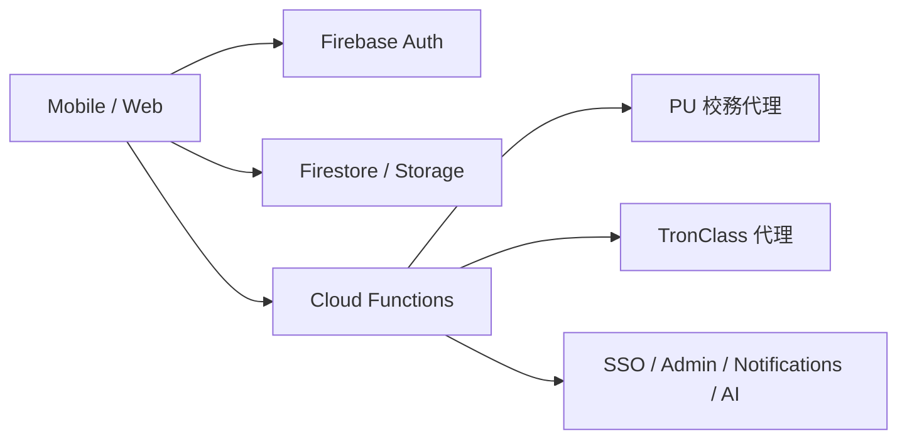

# 校園助手（Campus One）

<p align="center">
  <a href="https://github.com/Miiduoa/graduation"></a>
  <a href="https://github.com/Miiduoa/graduation/actions"></a>
  
  
  
  
  
  
</p>

> **官方倉庫：** [github.com/Miiduoa/graduation](https://github.com/Miiduoa/graduation)  
> 本 README 依據 **2026-04-26** 對目前 repo 的實際檔案、workspace 設定、`package.json`、GitHub workflow、env 範本與登入畫面進行盤點整理。若其他文件與此處衝突，請先以 **本 README 與程式碼本身** 為準。

## 快速連結

| 資源           | 位置                                                                                             |
| -------------- | ------------------------------------------------------------------------------------------------ |
| 原始碼         | [github.com/Miiduoa/graduation](https://github.com/Miiduoa/graduation)                           |
| GitHub Actions | [Actions](https://github.com/Miiduoa/graduation/actions)                                         |
| CI workflow    | [`.github/workflows/ci.yml`](.github/workflows/ci.yml)                                           |
| Release 流程   | [`docs/RELEASE.md`](docs/RELEASE.md)                                                             |
| 安全說明       | [`docs/SECURITY.md`](docs/SECURITY.md)                                                           |
| 架構邊界       | [`docs/architecture/firebase-data-boundaries.md`](docs/architecture/firebase-data-boundaries.md) |
| 法務文件       | [`docs/legal/`](docs/legal/)                                                                     |

## 這個專案現在是什麼

這是一個以 `pnpm workspace` 管理的校園平台 monorepo，核心由四個主體組成：

- `apps/mobile`：Expo / React Native 行動端
- `apps/web`：Next.js App Router Web / PWA
- `backend/functions`：Firebase Cloud Functions v2
- `packages/shared`：共用型別、學校資料、發布設定與 PU 驗證契約

除此之外，repo 內還有一條獨立的 AI 服務線：

- `backend/ai-server`：Python AI server，支援 `ollama` / `Together` / `Groq` 類 OpenAI-compatible provider，並有 `prepare` / `train` / `eval` / `grow` 腳本

這個倉庫不是只有畫面樣板，也不是純 demo mock。它已經有：

- Mobile、Web、Functions、Shared 的 workspace 結構
- Firebase Auth / Firestore / Functions / Rules
- GitHub CI、EAS Build、Preview Update、Maestro E2E
- 多個校園服務面向：課務、校園、訊息、支付、圖書館、交通、AI、管理端

## 目前最重要的 5 個事實

### 1. 產品入口已收斂成 PU-only

目前真正的登入主路徑是 **靜宜大學（PU）學號與 e 校園密碼登入**。
Web 的 [`apps/web/src/app/login/page.tsx`](apps/web/src/app/login/page.tsx) 與 Mobile 的 [`apps/mobile/src/screens/SSOLoginScreen.tsx`](apps/mobile/src/screens/SSOLoginScreen.tsx) 都明確寫出：

- 目前已鎖定為 `PU-only`
- 登入後會建立 Firebase session
- 會同步課表、成績、TronClass 與校園資料
- 舊的 SSO / email / 訪客登入，不再是現在版本的主要產品入口

### 2. 底層架構仍保留多校能力

雖然目前對外入口是 PU-only，但底層仍保留多校與 SSO 擴充能力，例如：

- `packages/shared/src/schools.ts`
- `apps/mobile/src/data/apiAdapters/`
- `apps/web/src/lib/sso.ts`
- `backend/functions/sso/`

比較準確的說法是：

> **產品入口先收斂到 PU，平台底層仍保留多校擴充能力。**

### 3. Mobile runtime 的「設計目標」與 `.env.example` 預設值不同

這點很容易讓接手者誤判。

- `apps/mobile/src/config/runtime.ts` 內的設計目標模式是 `hybrid`
- 若沒有提供 `EXPO_PUBLIC_DATA_SOURCE_MODE`，開發環境 fallback 也是 `hybrid`
- 但 `apps/mobile/.env.example` 寫的是 `EXPO_PUBLIC_DATA_SOURCE_MODE=mock`

也就是說：

- **你不設 env 時**，程式傾向走 `hybrid`
- **你直接複製 mobile 的 env 範本時**，程式會走 `mock`

README 下方的環境變數章節已把這個差異寫清楚。

### 4. CI 目前有完整 lint / typecheck / test / build gate，但沒有自動跑 rules 測試

目前 GitHub CI 會跑：

- Security audit
- gitleaks secret scan
- lint
- typecheck
- mobile tests
- web tests
- functions tests
- mobile / web build 驗證

但 **`pnpm test:rules` 目前沒有被放進 GitHub workflow**。
Firestore / Storage security rules 測試仍是 repo 內可手動執行的檢查，不是現行 CI gate 的一部分。

### 5. 根層 `.env.example` 很完整，但它比現在產品狀態更廣

根目錄 `.env.example` 仍保留了比較「平台願景 / 多校 / 多支付 / 多外部服務」的變數集合。
它有參考價值，但若目標是快速把目前專案跑起來，請優先看：

- `apps/mobile/.env.example`
- `apps/web/.env.example`
- `backend/functions/.env.example`
- `backend/ai-server/.env.example`

## 專案快照（2026-04-26 盤點）

下列數字來自 repo 內實際檔案與 `backend/functions/index.js` 的匯出盤點，之後若功能再增減，請以當下程式碼為準。

| 面向                | 盤點結果                                                                                            |
| ------------------- | --------------------------------------------------------------------------------------------------- |
| Mobile UI           | `81` 個 `*Screen.tsx`、`13` 個 `*Stack.tsx`                                                         |
| Web 路由            | `20` 個 `page.tsx`、`4` 個 `route.ts`                                                               |
| Backend Functions   | `64` 個 `onCall`、`14` 個 `onRequest`、`5` 個 `onSchedule`、`11` 個 Firestore `onDocument*` trigger |
| 測試檔              | Mobile `16`、Web `5`、Backend `4`（其中 Functions `3`、Rules `1`）                                  |
| GitHub workflow     | `5` 個：CI、Release、EAS Build、Preview Deploy、Maestro E2E                                         |
| E2E flow            | `10` 個 Maestro flow                                                                                |
| Repo utility script | 根層 `3` 個：`bump-version.mjs`、`live-file-review.mjs`、`seedFirestore.ts`                         |
| AI server           | `backend/ai-server/` 一整套 Python service 與 self-training pipeline                                |

## Monorepo 結構

```text
畢業專題/
├── apps/
│   ├── mobile/                  # Expo / React Native app
│   │   ├── src/
│   │   ├── ios/                 # iOS native project
│   │   ├── ios-widget/          # iOS Widget
│   │   ├── android-widget/      # Android Widget
│   │   └── .maestro/flows/      # Maestro E2E
│   └── web/                     # Next.js 16 App Router / PWA
├── backend/
│   ├── functions/               # Firebase Cloud Functions v2
│   ├── ai-server/               # Python AI service / training pipeline
│   ├── firestore/               # Firestore rules / indexes
│   ├── storage/                 # Storage rules
│   └── tests/                   # Security rules tests
├── packages/
│   └── shared/                  # 型別、school、release、PU auth 契約
├── docs/                        # 架構、API、法務、安全、release
├── scripts/                     # 版本、review、seed 工具
├── .github/workflows/           # CI / release / preview / E2E
├── package.json                 # root scripts / workspace tooling
└── pnpm-workspace.yaml
```

`pnpm-workspace.yaml` 目前納入的 workspace 範圍是：

- `apps/*`
- `packages/*`
- `backend/*`

## 技術棧

| 區塊              | 主要技術                                                                                      |
| ----------------- | --------------------------------------------------------------------------------------------- |
| Root runtime      | Node `>=20 <21`、pnpm `10.28.2`                                                               |
| Mobile            | Expo `~54.0.33`、React Native `0.81.5`、React `19.1.0`、React Navigation 7、Firebase `12.8.0` |
| Web               | Next.js `16.1.7`、React `19.2.3`、Vitest `4.1.0`、Leaflet / react-leaflet                     |
| Backend Functions | `firebase-functions` `^6.0.0`、`firebase-admin` `^13.0.0`、Node 20                            |
| Shared package    | TypeScript ESM package `@campus/shared`                                                       |
| Tooling           | ESLint 9、Prettier 3、Jest、Vitest、Maestro、EAS                                              |
| AI server         | Python service，provider 可選 `ollama` / `Together` / `Groq` 類相容端點                       |

## 現在產品的主要功能面

### Mobile

行動端的導航邏輯已經不是「首頁 + 功能拼盤」，而是明確的 5-tab 心理模型：

1. `Today`
2. 角色導向第二入口
3. `校園`
4. `收件匣`
5. `我的`

第二個 tab 會依角色切換為：

- `課程`
- `教學`
- `服務`
- `審核`
- `管理`

從 `apps/mobile/src/screens/` 的命名與實作來看，目前主要功能面至少包含：

- 今日首頁、公告、活動、個人化入口
- 課表、課程模組、教室、點名、作業、測驗、成績、學習分析
- 地圖、AR 導航、無障礙路線、公車、圖書館、餐廳、點餐、支付、宿舍、健康中心、列印
- 收件匣、群組、訊息、聊天室、作業協作
- QR Code、Widget Preview、Credit Audit、成就、AI Chat、AI Course Advisor
- Admin / Department / Teaching / Staff 多角色入口

另外還有幾個很重要的基礎能力：

- 離線同步與衝突處理：`src/services/offline.ts`
- cached / hybrid data source：`src/data/cachedSource.ts`、`src/data/hybridSource.ts`
- 推播通知：`src/services/notifications.ts`
- 效能與錯誤回報：`src/services/performance.ts`、`src/services/errorReporting.ts`
- iOS / Android widget：`ios-widget/`、`android-widget/`、`src/widgets/`

### Web

Web 端不是 `create-next-app` 預設模板，現在已經是校園入口型 PWA shell。

目前 `apps/web/src/app/` 可見的頁面與 route 包括：

- `/`
- `/login`
- `/announcements`
- `/map`
- `/cafeteria`
- `/library`
- `/groups`
- `/timetable`
- `/grades`
- `/profile`
- `/settings`
- `/search`
- `/bus`
- `/clubs`
- `/join`
- `/privacy`
- `/terms`
- `/sso-callback`
- `/course/[courseId]`
- `/teacher/course/[courseId]`
- `/.well-known/apple-app-site-association`
- `/.well-known/assetlinks.json`
- `/apple-app-site-association`
- `/sso/acs`

Web 端可明確確認的能力：

- PWA manifest 與 service worker：`public/manifest.json`、`public/sw.js`
- 安裝 / 更新 / 離線提示 banner：`src/components/PWAInstallBanner.tsx`、`UpdateBanner.tsx`、`OfflineBanner.tsx`
- auth shell：`src/components/AuthGuard.tsx`
- school-aware page context 與 navigation helper：`src/lib/pageContext.ts`、`src/lib/navigation.ts`
- Firebase auth helper：`src/lib/firebase.ts`
- Web SSO helper：`src/lib/sso.ts`

### Backend（Firebase Functions）

`backend/functions/index.js` 已經不是只有幾支登入 API，而是橫跨多個校園領域的 Functions 入口。從匯出名稱可以看到至少有：

- 認證 / SSO：`signInPuStudentId`、`startSSOAuth`、`verifySSOCallback`、`getSSOConfig`、`updateSSOConfig`
- PU / TronClass 整合：`puAuthenticate`、`puFetchData`、`puFetchCampusData`、`puRefreshTronClassSession`、`puFetchTronClassData`
- AI 助理：`askCampusAssistant`
- 使用者與權限：`getUserProfile`、`updateUserProfile`、school member role / service role 相關 callable
- 校園內容：公告、活動、群組、作業、訊息、通知 trigger
- 圖書館與座位：`searchBooks`、`borrowBook`、`renewBook`、`reserveSeat`
- 餐飲與支付：點餐、付款、錢包、退款、webhook
- 宿舍、洗衣、健康、列印、公車
- 成就、即時教室、投票、reaction、daily brief、weekly report

一句話理解目前 backend：

> **Firebase 為中心的校園平台後端，目前同時負責登入、同步、通知、校務代理、校園服務與部分營運管理接口。**

## 執行模型與資料流

### Runtime modes

Mobile 端目前支援三種資料來源模式：

| 模式       | 用途                                         |
| ---------- | -------------------------------------------- |
| `mock`     | 純前端 / UI 開發、快速展示                   |
| `firebase` | Firebase 驗證、demo runtime、整合驗證        |
| `hybrid`   | 真實校務整合目標模式，搭配 adapter / backend |

關鍵實作位於 [`apps/mobile/src/config/runtime.ts`](apps/mobile/src/config/runtime.ts)。

### Data boundary

目前 repo 的資料邊界與原則，對照 [`docs/architecture/firebase-data-boundaries.md`](docs/architecture/firebase-data-boundaries.md)，可以簡化成：



目前應遵守的原則：

- Firestore 適合 app-native、realtime、協作型資料
- 校務、成績、出缺席、圖書館、支付等 institutional records 應透過 adapter 或 backend
- 畫面層不應直接在 screen 裡自行拼 Firestore 業務邏輯，應透過 `DataSource` 或 feature repository
- Security Rules 負責 access control；敏感商業驗證應放在 Functions / backend

### 登入與同步流程

目前最主要的登入與同步流程是：

1. 使用者在 Web 或 Mobile 輸入 PU 學號與密碼
2. Backend `signInPuStudentId` 驗證 E 校園帳密
3. Backend 建立 Firebase custom token / session
4. 後端與 client 一起同步 PU 與 TronClass 資料
5. App 載入課表、成績、公告、課程與校園資料

`apps/mobile/src/services/studentIdAuth.ts` 的設計也很清楚：

- 優先走後端統一登入
- 若後端不可用，再降級為部分 hybrid 流程
- TronClass 登入不建議讓手機端直接處理

## 本機開發

### 需求

- Node.js `>=20 <21`
- pnpm `10.28.2`
- Java 21
  - `pnpm test:rules` 會使用 Firebase emulator，需要 Java
- Xcode / Android Studio
  - 若要跑原生 mobile build
- Python 環境
  - 若要啟動 `backend/ai-server`

### 安裝

```bash
git clone https://github.com/Miiduoa/graduation.git
cd graduation
pnpm install
```

### 環境變數檔案

目前 repo 內最重要的 env 範本如下：

| 檔案                             | 用途               | 備註                                                 |
| -------------------------------- | ------------------ | ---------------------------------------------------- |
| `.env.example`                   | 根層總範本         | 最完整，但也最泛化，包含較多多校 / 支付 / 願景型設定 |
| `apps/mobile/.env.example`       | Mobile 本機開發    | 預設 `EXPO_PUBLIC_DATA_SOURCE_MODE=mock`             |
| `apps/web/.env.example`          | Web PWA            | 包含 Firebase 與 server-side admin base64            |
| `backend/functions/.env.example` | Firebase Functions | OpenAI、SSO、webhook、email 等                       |
| `backend/ai-server/.env.example` | Python AI server   | `ollama` / `Together` / `Groq` provider 設定         |

常見起手式：

```bash
cp apps/mobile/.env.example apps/mobile/.env
cp apps/web/.env.example apps/web/.env.local
cp backend/functions/.env.example backend/functions/.env
cp backend/ai-server/.env.example backend/ai-server/.env
```

### Release-like build 額外要求

`apps/mobile/app.config.ts` 對 `preview` / `production` build 有更嚴格的 env 檢查。若要跑 release-like build，至少要補齊：

- `EXPO_PUBLIC_EAS_PROJECT_ID`
- `EXPO_PUBLIC_FIREBASE_API_KEY`
- `EXPO_PUBLIC_FIREBASE_AUTH_DOMAIN`
- `EXPO_PUBLIC_FIREBASE_PROJECT_ID`
- `EXPO_PUBLIC_FIREBASE_STORAGE_BUCKET`
- `EXPO_PUBLIC_FIREBASE_MESSAGING_SENDER_ID`
- `EXPO_PUBLIC_FIREBASE_APP_ID`
- `EXPO_PUBLIC_RELEASED_SCHOOL_IDS`
- `EXPO_PUBLIC_LEGAL_BASE_URL`
- `EXPO_PUBLIC_ERROR_REPORTING_ENDPOINT`
- `EXPO_PUBLIC_GOOGLE_MAPS_API_KEY`
- `EXPO_PUBLIC_DEEP_LINK_HOST`
  - 若啟用 deep links
- `IOS_BUILD_NUMBER`
- `ANDROID_VERSION_CODE`
  - release-like build 需要正整數

能在 dev mode 跑起來，不代表能直接進 preview / production build。

### 啟動指令

```bash
pnpm dev
pnpm dev:web
pnpm dev:mobile
pnpm dev:functions
pnpm dev:ai
```

說明：

- `pnpm dev` 目前等同於 `pnpm dev:web`
- `pnpm dev:mobile` 會啟動 Expo
- `pnpm dev:functions` 會啟動 Firebase Functions emulator
- `pnpm dev:ai` 會進入 `backend/ai-server` 執行 `run.sh`

若要直接跑原生 app：

```bash
pnpm --filter mobile ios
pnpm --filter mobile android
```

### AI server 相關命令

根目錄 `package.json` 另外提供：

```bash
pnpm ai:prepare
pnpm ai:train
pnpm ai:eval
pnpm ai:grow
```

## 常用指令

| 指令                                         | 說明                                      |
| -------------------------------------------- | ----------------------------------------- |
| `pnpm lint`                                  | 跑 mobile / web / functions / shared lint |
| `pnpm typecheck`                             | 跑 mobile / web / shared typecheck        |
| `pnpm --filter mobile test`                  | Mobile Jest 測試                          |
| `pnpm --filter web test`                     | Web Vitest 測試                           |
| `pnpm --filter functions test`               | Functions Jest 測試                       |
| `pnpm test:rules`                            | Firestore / Storage security rules 測試   |
| `pnpm --filter web build`                    | Next.js Web build                         |
| `pnpm release:preview`                       | 送出 mobile preview build                 |
| `pnpm release:production`                    | 送出 mobile production build              |
| `pnpm submit:ios`                            | 提交最新 iOS build                        |
| `pnpm submit:android`                        | 提交最新 Android build                    |
| `pnpm version:patch` / `minor` / `major`     | 更新 mobile 版本號                        |
| `pnpm live-review:file --file <path> --once` | 針對單檔跑 live review 腳本               |

### 版本號腳本的真實行為

`scripts/bump-version.mjs` 目前一定會更新：

- `apps/mobile/app.json`
- `apps/mobile/package.json`

它只會在 root `package.json` 存在 `version` 欄位時才更新 root 版本；目前 root `package.json` 沒有 `version` 欄位，因此不要假設 root package 也會一起 bump。

## GitHub / CI / Release 現況

目前 `.github/workflows/` 內共有 5 個 workflow。

| Workflow             | 觸發方式                                     | 目前實際作用                                                                                                        |
| -------------------- | -------------------------------------------- | ------------------------------------------------------------------------------------------------------------------- |
| `ci.yml`             | `push` / `pull_request` 到 `main`、`develop` | audit、gitleaks、lint、typecheck、mobile/web/functions tests、mobile/web build、main push 時可選擇 deploy functions |
| `release.yml`        | 手動 `workflow_dispatch`                     | preflight 後建置 iOS / Android、可選 submit、產生 draft GitHub Release                                              |
| `eas-build.yml`      | 手動 `workflow_dispatch`                     | 針對指定 platform / profile 發送 EAS Build                                                                          |
| `preview-deploy.yml` | PR 打上 `preview` label                      | 發送 EAS Update 到 `pr-<number>` branch 並留言到 PR                                                                 |
| `maestro-e2e.yml`    | 手動、排程、PR（mobile 相關變更）            | 在 macOS runner 上跑 iOS 模擬器的 Maestro E2E                                                                       |

### CI workflow 的重點

`ci.yml` 現在會做這些事：

- `pnpm install --frozen-lockfile`
- `pnpm audit --prod`
- `gitleaks` secret scan
- `pnpm lint`
- `pnpm typecheck`
- `pnpm --filter mobile test --coverage --ci`
- `pnpm --filter web test --coverage --ci`
- `pnpm --filter functions test --runInBand`
- `pnpm --filter web build`
- `expo-doctor`
- `eas-cli config`
- preview Android / iOS build submission 驗證

另外，在 `main` 分支 push 且有 `FIREBASE_TOKEN` 時，`ci.yml` 還會執行：

```bash
pnpm -w firebase deploy --only functions
```

### 目前沒有自動化的檢查

以下項目在 repo 內存在，但目前不是 GitHub CI 預設 gate：

- `pnpm test:rules`
- Android Maestro matrix
- 全 repo 的 link / markdown 檢查

### Release / Build 所需 secrets

依 workflow 內容，常見會用到的 secrets 包括：

- `EXPO_TOKEN`
- `FIREBASE_TOKEN`
- `FIREBASE_API_KEY`
- `FIREBASE_AUTH_DOMAIN`
- `FIREBASE_PROJECT_ID`
- `APPLE_ID`
- `ASC_APP_ID`
- `APPLE_TEAM_ID`
- Android submit 所需 service account key

Secrets 應放在 GitHub repository / environment secrets，不要寫入 README、程式碼或 `.env.example` 真值。

## 測試與品質面

### 目前可見的測試分布

- Mobile：16 個測試檔
  - hooks
  - services
  - data
  - runtime config
  - architecture boundary
  - components / utility
- Web：5 個測試檔
  - `firestorePath`
  - `navigation`
  - `pageContext`
  - `sso`
  - `useSchoolSsoConfig`
- Backend：4 個測試檔
  - Functions：`authz.test.js`、`cafeterias.test.js`、`notificationService.test.js`
  - Rules：`backend/tests/security-rules.test.js`

### Maestro E2E flow

`apps/mobile/.maestro/flows/` 目前包含 10 條流程：

1. onboarding
2. authentication
3. announcements
4. events
5. map
6. cafeteria
7. me features
8. settings
9. messages
10. full user journey

## 文件導覽與可信度

### 可當主要入口的文件

- `README.md`（本檔）
- `docs/architecture/firebase-data-boundaries.md`
- `apps/web/README.md`
- 各子專案 `package.json`
- `.github/workflows/*.yml`
- 各 `.env.example`

### 可當補充參考，但要回頭對照程式碼的文件

- `docs/API.md`
  - 可幫助理解 Functions 介面，但實際匯出仍應以 `backend/functions/index.js` 為準
- `docs/RELEASE.md`
  - 可幫助理解 release 思路，但實際指令、submit 與 build gate 應以 workflow 與 `eas.json` 為準
- `docs/SECURITY.md`
  - 可視為較廣義的安全與政策說明，但其中有些 auth / 平台面描述比目前產品入口更寬，閱讀時要記得現在主流程已經收斂為 PU-only

### 明顯帶有歷史狀態的文件

- `apps/mobile/DEMO.md`
  - 仍描述 email/password、多校切換、展示腳本
- 舊的多校登入敘述
  - 若與目前登入畫面衝突，請先以程式碼與本 README 為準

## 第一次接手時最值得先看的檔案

建議閱讀順序：

1. `README.md`
2. `apps/mobile/App.tsx`
3. `apps/mobile/src/config/runtime.ts`
4. `apps/mobile/src/services/studentIdAuth.ts`
5. `apps/web/src/app/login/page.tsx`
6. `apps/web/src/app/layout.tsx`
7. `backend/functions/index.js`
8. `packages/shared/src/index.ts`
9. `packages/shared/src/schools.ts`
10. `docs/architecture/firebase-data-boundaries.md`

## 如果只記一件事

> **這是一個已經有 mobile、web、backend、CI/CD、release 與 optional AI server 的校園平台 monorepo；目前產品入口已收斂成 PU-only，但底層仍保留多校與 SSO 擴充能力。**

若你在其他文件看到以下說法，請先視為歷史描述，而不是目前產品定義：

- 「主要登入方式是 email/password」
- 「訪客登入仍是正式流程」
- 「目前是多校入口優先」
- 「Web 只是 Next.js 預設模板」
- 「CI 會自動驗證所有 security rules」

## License

MIT
