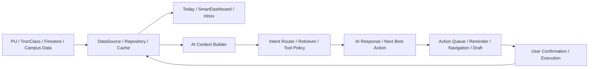
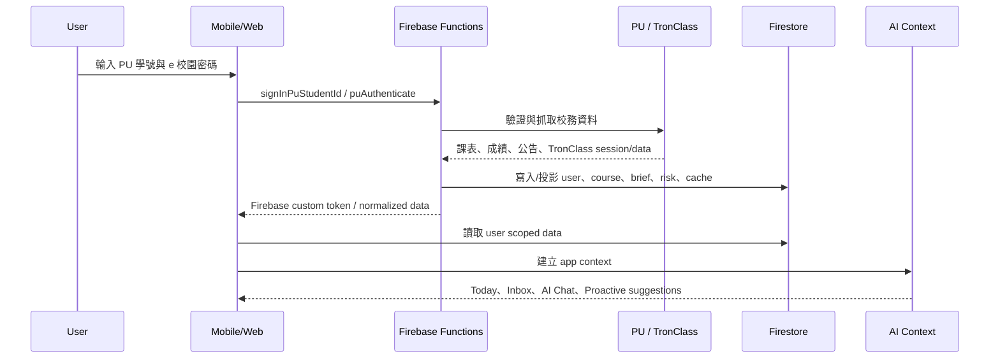

# Campus One - Campus Agent OS

<p align="center">
  <a href="https://github.com/Miiduoa/graduation"></a>
  <a href="https://github.com/Miiduoa/graduation/actions"></a>
  
  
  
  
  
  
</p>

> **產品定位：** Campus One 不是一般校園整合 App，而是 **Campus Agent OS（校園行動代理系統）**。它把課程、TronClass、校務資料、地圖、餐飲、交通、收件匣、學習風險、主動提醒與 AI 行動建議串成「今天下一步」的閉環，讓使用者不用先找功能，而是直接處理最重要的校園行動。

> **官方倉庫：** [github.com/Miiduoa/graduation](https://github.com/Miiduoa/graduation)  
> 本 README 依據 **2026-05-06** 對目前 repo 的實際檔案、workspace 設定、`package.json`、GitHub workflow、env 範本、Functions 匯出、AI/Agent 模組、測試配置與文件目錄進行盤點。若其他文件與此處衝突，請先以 **本 README 與程式碼本身** 為準。

## 快速連結

| 資源           | 位置                                                                                             |
| -------------- | ------------------------------------------------------------------------------------------------ |
| 原始碼         | [github.com/Miiduoa/graduation](https://github.com/Miiduoa/graduation)                           |
| GitHub Actions | [Actions](https://github.com/Miiduoa/graduation/actions)                                         |
| CI workflow    | [`.github/workflows/ci.yml`](.github/workflows/ci.yml)                                           |
| Release 流程   | [`docs/RELEASE.md`](docs/RELEASE.md)                                                             |
| API 文件       | [`docs/API.md`](docs/API.md)                                                                     |
| 安全說明       | [`docs/SECURITY.md`](docs/SECURITY.md)                                                           |
| 角色與資料流   | [`docs/APP_ROLE_DATA_FLOW_ARCHITECTURE.md`](docs/APP_ROLE_DATA_FLOW_ARCHITECTURE.md)             |
| 檔案整理索引   | [`docs/PROJECT_FILE_ORGANIZATION.md`](docs/PROJECT_FILE_ORGANIZATION.md)                         |
| AI 架構        | [`docs/AI_ASSISTANT_ARCHITECTURE.md`](docs/AI_ASSISTANT_ARCHITECTURE.md)                         |
| Firebase 邊界  | [`docs/architecture/firebase-data-boundaries.md`](docs/architecture/firebase-data-boundaries.md) |
| 法務文件       | [`docs/legal/`](docs/legal/)                                                                     |

## 目錄

- [這個專案是什麼](#這個專案是什麼)
- [目前最重要的事實](#目前最重要的事實)
- [專案快照](#專案快照)
- [Monorepo 結構](#monorepo-結構)
- [技術棧](#技術棧)
- [產品與功能地圖](#產品與功能地圖)
- [Campus Agent OS 與 AI 架構](#campus-agent-os-與-ai-架構)
- [資料流與權限邊界](#資料流與權限邊界)
- [本機開發](#本機開發)
- [常用指令](#常用指令)
- [測試與品質](#測試與品質)
- [GitHub CI 與 Release](#github-ci-與-release)
- [部署與發布](#部署與發布)
- [專題展示建議](#專題展示建議)
- [Troubleshooting](#troubleshooting)
- [文件導覽](#文件導覽)

## 這個專案是什麼

Campus One 是一個以 `pnpm workspace` 管理的校園平台 monorepo，核心由四個主體組成：

- `apps/mobile`：Expo / React Native 行動端，是目前最完整的主要產品體驗。
- `apps/web`：Next.js App Router Web / PWA，提供桌面、瀏覽器與補充入口。
- `backend/functions`：Firebase Cloud Functions v2，處理認證、校務代理、權限、通知、支付、AI agent 與資料同步。
- `packages/shared`：跨 Mobile、Web、Functions 共用的 TypeScript 契約、學校設定、PU auth、通知與畢業學分資料。

另外還有獨立的 AI server 線：

- `backend/ai-server`：Python / FastAPI AI service，包含 provider gateway、RAG、training、evaluation、self-training 與 web search 輔助能力。

這個 repo 不是單頁 demo，也不是只有 mock UI。它已經具備：

- Mobile、Web、Functions、Shared、AI server 的完整 workspace 分層。
- Firebase Auth / Firestore / Storage / Functions / Security Rules。
- GitHub CI、EAS Build、Preview Deploy、Release、Maestro E2E workflow。
- PU-only 產品入口，同時保留多校與 SSO 擴充契約。
- 課程、TronClass、課表、成績、點名、學習分析、AI 助理、校園地圖、餐飲、交通、圖書館、宿舍、健康、列印、失物招領、支付、群組、訊息、推播與角色管理。
- Campus Agent OS 的主動式智慧：SmartDashboard、Next Best Action、Proactive AI、risk snapshots、pulse aggregates、daily brief、weekly report 與 action queue。

## 目前最重要的事實

### 1. 產品入口目前是 PU-only

目前真正的登入主路徑是 **靜宜大學（PU）學號與 e 校園密碼登入**。Web 的 [`apps/web/src/app/login/page.tsx`](apps/web/src/app/login/page.tsx) 與 Mobile 的 [`apps/mobile/src/screens/SSOLoginScreen.tsx`](apps/mobile/src/screens/SSOLoginScreen.tsx) 都已把產品入口收斂到 PU。

登入後的目標流程是：

1. 使用 PU 學號與 e 校園密碼進入。
2. 後端代理驗證與資料抓取。
3. 建立 Firebase session。
4. 同步課表、成績、TronClass、公告與校園資料。
5. 將個人化資料餵給 Today、Inbox、AI Chat、SmartDashboard 與主動提醒。

### 2. 底層仍保留多校能力

雖然入口先收斂到 PU，但底層仍保留多校與 SSO 擴充能力：

- `packages/shared/src/schools.ts`
- `packages/shared/src/puAuth.ts`
- `apps/mobile/src/data/apiAdapters/`
- `apps/web/src/lib/sso.ts`
- `backend/functions/sso/`
- `backend/functions/authz.js`

比較精準的說法是：

> **產品先把 PU 做深，平台底層保留多校與校務系統擴充能力。**

### 3. Mobile runtime mode 需要看 env 與 fallback

`apps/mobile/src/config/runtime.ts` 與 `.env.example` 之間有一個容易誤判的差異：

- 程式設計目標與 development fallback 偏向 `hybrid`。
- `apps/mobile/.env.example` 目前範例值是 `EXPO_PUBLIC_DATA_SOURCE_MODE=mock`。

也就是說：

- 沒設 env 時，開發環境多半會嘗試 `hybrid`。
- 直接複製 mobile env 範本時，會走 `mock`。
- 要接 Firebase / Functions / PU 真實流程，需要明確設定 Firebase 與 backend endpoint。

### 4. CI 已把 rules test 納入 workflow

目前 `.github/workflows/ci.yml` 已包含：

- security gates：`pnpm audit --prod`、gitleaks secret scan。
- lint 與 typecheck。
- mobile tests。
- web tests。
- functions tests。
- Firestore / Storage rules tests：`pnpm test:rules`。
- mobile build 驗證。
- web build 驗證。
- main push 時的 Firebase Functions deploy。
- CI summary。

這表示 rules test 已不是只有本機手動檢查，而是 CI gate 的一部分。

### 5. README 是接手主文件，細節文件放在 docs

README 會提供足夠完整的全局視角，但不會把每個 schema、每個畫面、每個 function 的細節全部塞進同一份文件。深入設計請對照：

- [`docs/APP_ROLE_DATA_FLOW_ARCHITECTURE.md`](docs/APP_ROLE_DATA_FLOW_ARCHITECTURE.md)
- [`docs/PROJECT_FILE_ORGANIZATION.md`](docs/PROJECT_FILE_ORGANIZATION.md)
- [`docs/AI_ASSISTANT_ARCHITECTURE.md`](docs/AI_ASSISTANT_ARCHITECTURE.md)
- [`docs/API.md`](docs/API.md)
- [`docs/SECURITY.md`](docs/SECURITY.md)
- [`docs/RELEASE.md`](docs/RELEASE.md)
- [`docs/legal/`](docs/legal/)

## 專案快照

下列數字為 2026-05-06 對目前 repo 的實際盤點。後續功能增減時，請以程式碼與當下指令輸出為準。

| 面向              | 盤點結果                                                                                            |
| ----------------- | --------------------------------------------------------------------------------------------------- |
| Git tracked files | 約 `511` 個                                                                                         |
| Mobile UI         | `96` 個 `*Screen.tsx`、`13` 個 `*Stack.tsx`                                                         |
| Web routes        | `20` 個 `page.tsx`、`2` 個 `route.ts`                                                               |
| Backend Functions | `68` 個 `onCall`、`14` 個 `onRequest`、`5` 個 `onSchedule`、`11` 個 Firestore `onDocument*` trigger |
| 測試檔            | Mobile `30`、Web `5`、Backend Functions `4`、Rules `1`                                              |
| GitHub workflows  | `5` 個：CI、Release、EAS Build、Preview Deploy、Maestro E2E                                         |
| Maestro E2E       | `12` 個 mobile E2E 相關檔案                                                                         |
| Root scripts      | `3` 個：`bump-version.mjs`、`live-file-review.mjs`、`seedFirestore.ts`                              |
| AI server         | `backend/ai-server/` 包含 FastAPI service、RAG、training、evaluation、self-training、web search     |

## Monorepo 結構

```text
畢業專題/
├── apps/
│   ├── mobile/                  # Expo / React Native app
│   │   ├── src/
│   │   │   ├── app/             # app-level hooks: push, proactive AI, web learning sync
│   │   │   ├── config/          # runtime / env parsing
│   │   │   ├── data/            # mock/firebase/hybrid source, adapters, PU data
│   │   │   ├── features/        # domain repositories
│   │   │   ├── hooks/           # reusable hooks
│   │   │   ├── screens/         # navigation screens and stacks
│   │   │   ├── services/        # AI, auth, sync, notification, engines, external integrations
│   │   │   ├── state/           # React contexts and app-wide state
│   │   │   ├── ui/              # theme, reusable UI, visual system
│   │   │   ├── utils/           # stateless helpers
│   │   │   └── widgets/         # native widget bridge and data provider
│   │   ├── ios/                 # iOS native project
│   │   ├── ios-widget/          # iOS Widget
│   │   ├── android-widget/      # Android Widget
│   │   └── .maestro/            # Maestro E2E flows
│   └── web/                     # Next.js App Router / PWA
│       ├── src/app/             # pages and route handlers
│       ├── src/components/      # shell and UI components
│       ├── src/features/        # feature clients
│       └── src/lib/             # Firebase, runtime, navigation, SSO, PWA utilities
├── backend/
│   ├── functions/               # Firebase Cloud Functions v2
│   ├── ai-server/               # Python AI service, RAG, training, self-training
│   ├── firestore/               # Firestore rules and indexes
│   ├── storage/                 # Storage rules
│   └── tests/                   # emulator-based security rules tests
├── packages/
│   └── shared/                  # shared TS contracts, school config, auth, release, notification
├── docs/                        # architecture, API, security, release, legal, product docs
├── scripts/                     # repo-level utility scripts
├── .github/workflows/           # CI, release, EAS, preview, E2E workflows
├── package.json                 # root scripts and workspace tooling
├── pnpm-workspace.yaml          # workspace package boundaries
├── firebase.json                # Firebase emulator/deploy config
├── render.yaml                  # Render deployment blueprint
└── README.md
```

`pnpm-workspace.yaml` 目前納入：

- `apps/*`
- `packages/*`
- `backend/*`

## 技術棧

| 區塊                | 主要技術                                                                                      |
| ------------------- | --------------------------------------------------------------------------------------------- |
| Root runtime        | Node `>=20 <21`、pnpm `10.28.2`                                                               |
| Mobile              | Expo `~54.0.33`、React Native `0.81.5`、React `19.1.0`、React Navigation 7、Firebase `12.8.0` |
| Mobile native       | iOS native project、iOS Widget、Android Widget、Expo modules                                  |
| Web                 | Next.js `16.1.7`、React `19.2.3`、Vitest `4.1.0`、Leaflet / react-leaflet、PWA assets         |
| Backend Functions   | `firebase-functions` `^6.0.0`、`firebase-admin` `^13.0.0`、Node 20、Jest                      |
| Firestore / Storage | Firebase rules、indexes、emulator tests                                                       |
| Shared package      | TypeScript ESM package `@campus/shared`                                                       |
| AI server           | Python、FastAPI、Uvicorn、httpx、ChromaDB、sentence-transformers、MLX、Firebase Admin         |
| Tooling             | ESLint 9、Prettier 3、Jest、Vitest、Maestro、EAS、firebase-tools                              |

## 產品與功能地圖

### Mobile 主心理模型

Mobile 已經不是「首頁加功能列表」，而是角色導向的 5-tab 架構：

```text
Today -> 角色入口 -> 校園 -> 收件匣 -> 我的
```

第二個 tab 依角色切換：

| 角色                         | 第二 tab | 主要任務                                     |
| ---------------------------- | -------- | -------------------------------------------- |
| student                      | 課程     | 課表、作業、測驗、點名、成績、學習分析、學分 |
| teacher                      | 教學     | 課程、教材、點名、評量、成績簿、互動         |
| staff                        | 服務     | 宿舍、列印、健康、場館、服務工單             |
| department / department_head | 審核     | 部門資料、審核流程、報表                     |
| admin / school               | 管理     | 公告、角色、資料設定、餐廳與校園服務管理     |
| vendor / operator            | 店家     | 菜單、訂單、營運資料                         |
| visitor                      | 公開校園 | 公告、活動、地圖、交通、餐廳公開菜單         |

### Mobile 功能矩陣

| 領域               | 代表畫面 / 模組                                                                                        | 目前定位                                               |
| ------------------ | ------------------------------------------------------------------------------------------------------ | ------------------------------------------------------ |
| Today / 儀表板     | `SmartDashboardScreen`、`TodayScreen`、`HomeStack`                                                     | 整合下一步行動、學習風險、校園脈動、成就與快速入口     |
| 主動提醒           | `ProactiveScreen`、`proactiveAI.ts`、`proactiveIntelligenceEngine.ts`                                  | 課前提醒、作業截止、公告、風險、校園狀態、推播排程     |
| AI Chat            | `AIChatScreen`、`ai.ts`、`localAssistant.ts`、`agentReasoningEngine.ts`                                | 校園助理、個人化上下文、工具呼叫、web search、行動建議 |
| AI 模型管理        | `AIModelManagerScreen`、`localLLMInference.ts`                                                         | 本地/離線 AI 設定與模型狀態管理                        |
| 課程入口           | `CoursesHomeScreen`、`CourseHubScreen`、`CourseModulesScreen`、`CourseScheduleScreen`                  | 課程、教材、課表、TronClass 內容與課程任務             |
| 教室 / 課中        | `ClassroomScreen`、`AttendanceLiveScreen`、`AttendanceScreen`                                          | 課堂入口、即時點名、教師與學生出席流程                 |
| 學習分析           | `AcademicInsightsScreen`、`AttendanceAnalyticsScreen`、`LearningAnalyticsScreen`                       | GPA 趨勢、風險評估、出席分析、學習建議                 |
| 成績與學分         | `GradesScreen`、`CourseGradebookScreen`、`CreditAuditScreen`、`CreditAuditInputScreen`                 | 成績查詢、教師成績簿、畢業學分試算                     |
| AI 選課 / 課程建議 | `AICourseAdvisorScreen`、`CourseAdvisorScreen`、`courseRecommendationEngine.ts`                        | 依成績、學分、興趣與需求提供選課建議                   |
| 學伴與社群         | `StudyBuddyScreen`、`CampusSocialScreen`、`campusSocialEngine.ts`                                      | 讀書夥伴、校園貼文、課程/興趣連結                      |
| 遊戲化             | `GamificationScreen`、`gamificationEngine.ts`                                                          | XP、等級、成就、streak、週挑戰                         |
| 智慧行事曆         | `SmartCalendarScreen`、`smartCalendarEngine.ts`、`ical.ts`                                             | 課表、截止日、提醒、iCal 訂閱                          |
| 校園地圖           | `CampusHubScreen`、`MapScreen`、`MapStack`、`PoiDetailScreen`                                          | POI、地圖、地點詳情、校園導覽                          |
| AR / 無障礙        | `ARNavigationScreen`、`AccessibleRouteScreen`                                                          | AR 導航、無障礙路線與路徑輔助                          |
| 校園脈動           | `CampusPulseScreen`、`campusPulseEngine.ts`                                                            | 人潮、座位、餐廳、停車等即時/回報型狀態                |
| 交通               | `TransportHubScreen`、`BusScheduleScreen`、`tdxApi.ts`                                                 | 校車、公車、TDX 資料與提醒                             |
| 餐飲               | `CafeteriaScreen`、`MenuDetailScreen`、`OrderingScreen`、`MenuSubscriptionScreen`                      | 餐廳、菜單、訂餐、菜單訂閱                             |
| 支付 / 店家        | `PaymentScreen`、`MerchantHubScreen`、`VendorManagementScreen`                                         | 錢包、交易、店家訂單、營運管理                         |
| 圖書館             | `LibraryScreen`                                                                                        | 查書、借閱、續借、座位與圖書服務                       |
| 宿舍               | `DormitoryScreen`                                                                                      | 宿舍資訊、報修、包裹、洗衣機預約                       |
| 健康               | `HealthScreen`                                                                                         | 健康中心、預約、紀錄、校園健康資源                     |
| 列印               | `PrintServiceScreen`                                                                                   | 列印工作、費用、狀態追蹤                               |
| 失物招領           | `LostFoundScreen`、`LostFoundDetailScreen`、`LostFoundPostScreen`                                      | 失物列表、詳情、刊登與媒合                             |
| 收件匣 / 訊息      | `InboxScreen`、`MessagesHomeScreen`、`MessagesStack`、`ChatScreen`、`DmsScreen`                        | 通知、私訊、群組、課程任務與 action queue              |
| 群組 / 協作        | `GroupsScreen`、`GroupDetailScreen`、`GroupPostScreen`、`GroupAssignmentsScreen`、`GroupMembersScreen` | 群組、貼文、成員、協作作業                             |
| 我的 / 設定        | `MeScreen`、`MeStack`、`PersonalHubScreen`、`SettingsScreen`、`ProfileScreen`                          | 個人資料、偏好、通知、AI 模型、帳號與隱私              |
| 裝置整合           | `QRCodeScreen`、`WidgetPreviewScreen`、`PureQRCode`、`src/widgets/`                                    | QR Code、iOS/Android Widget、快速入口                  |
| 管理與角色入口     | `AdminDashboardScreen`、`DepartmentHubScreen`、`TeachingHubScreen`、`StaffHubScreen`                   | Admin / department / teacher / staff 的角色工作台      |
| 合規與支援         | `DataExportScreen`、`AccountDeletionScreen`、`FeedbackScreen`、`BugReportScreen`、`HelpScreen`         | 資料匯出、帳號刪除、回饋、錯誤回報、說明               |

### Web 功能矩陣

Web 端是 Next.js App Router / PWA shell，不是預設模板。它補足桌面與瀏覽器入口，也適合作為教師、管理與公開資訊展示面。

| Route                         | 用途                                   |
| ----------------------------- | -------------------------------------- |
| `/`                           | Web 首頁與校園入口                     |
| `/login`                      | PU login / SSO 入口                    |
| `/announcements`              | 公告                                   |
| `/map`                        | 校園地圖                               |
| `/cafeteria`                  | 餐廳                                   |
| `/library`                    | 圖書館                                 |
| `/groups`                     | 群組                                   |
| `/timetable`                  | 課表                                   |
| `/grades`                     | 成績                                   |
| `/profile`                    | 個人資料                               |
| `/settings`                   | 設定                                   |
| `/search`                     | 搜尋                                   |
| `/bus`                        | 公車                                   |
| `/clubs`                      | 社團                                   |
| `/join`                       | 加入 / 邀請                            |
| `/privacy`                    | 隱私權政策                             |
| `/terms`                      | 服務條款                               |
| `/sso-callback`               | SSO callback page                      |
| `/course/[courseId]`          | 課程詳情                               |
| `/teacher/course/[courseId]`  | 教師課程頁                             |
| `/sso/acs`                    | SAML ACS route handler                 |
| `/apple-app-site-association` | Apple associated domains route handler |

### Backend Functions 功能地圖

`backend/functions/index.js` 是主要 serverless 後端入口，包含：

- 公告、活動、群組、作業、成績、訊息、失物媒合的 Firestore triggers。
- `askCampusAssistant`：server-side AI agent 入口。
- `submitPulseReport`、`listPulseAggregates`：校園脈動回報與彙整。
- `getStudentRiskSnapshots`、`enqueueAssistantAction`：學習風險與 AI action queue。
- 推播與通知：`sendTestNotification`、`sendCustomNotification`、排程提醒、成績發布通知。
- PU 登入與資料同步：`signInPuStudentId`、`puAuthenticate`、`puFetchData`、`puFetchCampusData`、`puFetchTronClassData`。
- TronClass session refresh 與課程資料 proxy。
- SSO：start / verify / config update。
- User profile、資料匯出、帳號刪除。
- Admin：公告、活動、成員角色、服務角色、餐廳設定、測試資料清理。
- Groups：建立群組、join code、離開群組。
- Library：查書、借閱、歸還、續借、座位預約。
- Cafeteria / order：訂單建立、狀態更新、取消。
- Dormitory / service：報修、包裹、洗衣機。
- Print：列印工作與狀態。
- Health：健康中心預約、改期、取消、健康紀錄。
- Transport：TDX bus arrivals、訂閱與取消提醒。
- Payment / wallet：topup intent、payment intent、provider webhook、ledger、refund。
- Achievement / live session：成就、課堂 live session、poll、reaction。
- Scheduled intelligence：daily brief、weekly report。

### Shared package

`packages/shared` 是避免 Mobile、Web、Functions 各自複製契約的地方，目前包含：

- auth 與角色契約。
- school / tenant 設定。
- PU auth 型別。
- release 設定。
- notification 型別。
- mock data / sample usage。
- PU 畢業學分規則。
- credit audit 與 dev universal accounts。

## Campus Agent OS 與 AI 架構

### 核心概念

Campus Agent OS 的重點不是「有一個聊天機器人」，而是讓 App 能理解使用者當下的校園狀態，並把資訊轉成可執行行動。

核心閉環如下：


```mermaid
flowchart LR
  A["PU / TronClass / Firestore / Campus Data"] --> B["DataSource / Repository / Cache"]
  B --> C["Today / SmartDashboard / Inbox"]
  B --> D["AI Context Builder"]
  D --> E["Intent Router / Retriever / Tool Policy"]
  E --> F["AI Response / Next Best Action"]
  F --> G["Action Queue / Reminder / Navigation / Draft"]
  G --> H["User Confirmation / Execution"]
  H --> B
```

### AI 能力分層

| 層級              | 位置                                                        | 責任                                                                          |
| ----------------- | ----------------------------------------------------------- | ----------------------------------------------------------------------------- |
| Mobile AI UI      | `AIChatScreen`                                              | 對話、建議卡、工具確認、proactive banners、引用與行動入口                     |
| Mobile AI service | `ai.ts`、`localAssistant.ts`                                | provider routing、web search、context injection、本地 fallback                |
| Local agent       | `agentReasoningEngine.ts`、`agentToolkit.ts`                | 工具註冊、campus query、web search、calendar、reminder、navigation 等本地工具 |
| App context       | `aiAppContext.ts`                                           | 課程、公告、風險、校園脈動、週報、主動回報與長期記憶摘要                      |
| Proactive AI      | `proactiveAI.ts`、`proactiveIntelligenceEngine.ts`          | 課前、截止、公告、風險、校園狀態與推播排程                                    |
| Server agent      | `backend/functions/assistantAgent.js`、`askCampusAssistant` | 權限範圍、server-side web search、provider order、action normalization        |
| AI server         | `backend/ai-server`                                         | FastAPI AI service、RAG、training/eval、self-training、provider gateway       |

### Server-side assistant agent

`backend/functions/assistantAgent.js` 負責把 AI 放在後端安全邊界內：

- model provider order 預設偏向 server env。
- model keys 不應暴露成 `EXPO_PUBLIC_*`。
- personal intents 不走公開 web search。
- server web search 只在安全且需要即時/公開資訊時啟動。
- actions 會被 normalize，敏感行動標為 `requiresConfirmation=true`。
- action scope 會區分 `public`、`school_public`、`user_private`、`academic_private`。
- user id 會 hash，避免在 AI provider metadata 中暴露原始 uid。

### Web search 與 grounded answer

Mobile 與 backend 都有 web search 路徑：

- `apps/mobile/src/services/webSearch.ts`
- `apps/mobile/src/services/webLearning.ts`
- `backend/functions/assistantAgent.js`
- `backend/ai-server/web_search.py`

原則是：

- 校園內部問題優先用 Firestore / PU / TronClass / app cache。
- 最新公開資訊、天氣、路線、外部知識才用 web search。
- 個人成績、作業、出席、學分與私人課表不應透過公開搜尋。
- 回答要盡量附來源或 evidence refs。

### Proactive AI 與 Next Best Action

目前的主動智慧來源包含：

- 課前提醒。
- 作業/考試截止與逾期。
- 每日摘要。
- 重要公告。
- GPA / 學習風險。
- 出席風險。
- 校園脈動，例如擁擠度、安靜地點、停車、餐廳狀態。
- gamification，例如 streak、achievement、XP。
- study buddy 與課程建議。

輸出目標不是單純通知，而是 action-ready：

- 開啟對應 screen。
- 建立提醒草稿。
- 排入 action queue。
- 導航到地點。
- 開啟 AI Chat 並帶入 proactive report。
- 建議使用者確認敏感動作。

### AI 安全規則

AI 不應直接拿全部資料丟進 prompt。正式流程應是：

```text
Auth -> intent routing -> permission scope -> authorized retriever -> prompt builder -> model/tool call -> action mapper -> audit/feedback
```

敏感操作範例：

- 送出訊息。
- 建立正式提醒。
- 點名簽到。
- 支付。
- 修改成績或角色。
- 刪除資料。
- 讀取非本人或非授權課程資料。

這些動作都必須經過 Functions / rules / role policy，不能只靠前端 UI 隱藏。

## 資料流與權限邊界

### Runtime data modes

Mobile data source 目前有幾個模式：

| Mode       | 用途                           | 典型情境                                    |
| ---------- | ------------------------------ | ------------------------------------------- |
| `mock`     | 使用本機 demo/mock data        | 展示、無 Firebase、無 PU 帳號、快速 UI 測試 |
| `firebase` | 主要讀 Firebase / Functions    | 已有 Firebase 設定、需要真實同步            |
| `hybrid`   | Firebase 優先，必要時 fallback | 開發常用，兼顧真實資料與 demo resilience    |

### Data boundary

| 層級                      | 位置                                                                                      | 原則                                                                                       |
| ------------------------- | ----------------------------------------------------------------------------------------- | ------------------------------------------------------------------------------------------ |
| Screen                    | `apps/mobile/src/screens`、`apps/web/src/app`                                             | 負責 UI 與使用者互動，不直接承擔敏感資料邏輯                                               |
| Repository                | `apps/mobile/src/features/*/repository.ts`                                                | 包裝 domain data access，降低 screen 與 datasource 耦合                                    |
| DataSource                | `apps/mobile/src/data/source.ts`、`firebaseSource.ts`、`hybridSource.ts`、`mockSource.ts` | 決定 mock/firebase/hybrid 讀取策略                                                         |
| Service / Engine          | `apps/mobile/src/services`                                                                | AI、通知、校務同步、課程建議、學習分析、支付等商業邏輯                                     |
| Shared contracts          | `packages/shared`                                                                         | 共用型別與規則，避免多端漂移                                                               |
| Functions                 | `backend/functions`                                                                       | secret、校務帳密、支付、權限管理、AI server-side agent、資料代理                           |
| Firestore / Storage rules | `backend/firestore`、`backend/storage`                                                    | 最後防線，限制 self、school member、group member、editor、service role、cafeteria operator |

### 登入與同步流程


```mermaid
sequenceDiagram
  participant U as User
  participant M as Mobile/Web
  participant F as Firebase Functions
  participant PU as PU / TronClass
  participant FS as Firestore
  participant AI as AI Context

  U->>M: 輸入 PU 學號與 e 校園密碼
  M->>F: signInPuStudentId / puAuthenticate
  F->>PU: 驗證與抓取校務資料
  PU-->>F: 課表、成績、公告、TronClass session/data
  F->>FS: 寫入/投影 user、course、brief、risk、cache
  F-->>M: Firebase custom token / normalized data
  M->>FS: 讀取 user scoped data
  M->>AI: 建立 app context
  AI-->>M: Today、Inbox、AI Chat、Proactive suggestions
```

### 角色與權限

角色模型詳見 [`docs/APP_ROLE_DATA_FLOW_ARCHITECTURE.md`](docs/APP_ROLE_DATA_FLOW_ARCHITECTURE.md)。README 中的重點是：

- route / tab 層：控制主要入口。
- screen 層：用 `RouteGuard` / permission helper 防止直接開啟。
- UI 層：隱藏或 disable 不可用操作。
- repository / service 層：避免 screen 直接繞過資料邊界。
- backend 層：敏感操作一定要驗證 auth、school membership、service role、operator role。
- rules 層：即使 client 寫錯，Firestore / Storage rules 仍要擋住越權存取。

## 本機開發

### 需求

- Node.js `20.x`，符合 root `package.json` 的 `>=20 <21`。
- pnpm `10.28.2`，root `packageManager` 已指定。
- Firebase CLI，透過 root dev dependency 或 `pnpm -w firebase` 使用。
- Java 21，用於 Firebase emulator rules tests。
- Expo / EAS CLI，mobile build 與 native workflow 會用到。
- Python 3.11+，若要跑 `backend/ai-server`。

建議使用 `.nvmrc`：

```bash
nvm use
corepack enable
corepack prepare pnpm@10.28.2 --activate
pnpm install
```

### 環境變數檔案

專案有多個 `.env.example`，請依需要複製：

| 檔案                             | 用途                                                                 |
| -------------------------------- | -------------------------------------------------------------------- |
| `.env.example`                   | root 層總覽，包含平台願景、多校、多支付與多外部服務設定              |
| `apps/mobile/.env.example`       | Expo public env、Firebase、data source mode、AI provider、web search |
| `apps/web/.env.example`          | Next.js public Firebase env、Web/PWA runtime                         |
| `backend/functions/.env.example` | Functions server-side env，不應暴露到 client                         |
| `backend/ai-server/.env.example` | AI server provider、RAG、training、Firebase integration              |

基本複製方式：

```bash
cp .env.example .env
cp apps/mobile/.env.example apps/mobile/.env
cp apps/web/.env.example apps/web/.env.local
cp backend/functions/.env.example backend/functions/.env
cp backend/ai-server/.env.example backend/ai-server/.env
```

不要提交真實 `.env`。`.gitignore` 已保留 `*.env.example`，排除實際 `.env`。

### 最小可跑設定

如果只是要展示 UI：

```bash
pnpm install
pnpm dev:mobile
```

在 `apps/mobile/.env` 設：

```bash
EXPO_PUBLIC_DATA_SOURCE_MODE=mock
EXPO_PUBLIC_AI_PROVIDER=offline
```

如果要跑 Web：

```bash
pnpm dev:web
```

如果要接 Firebase / Functions：

1. 設定 Firebase project env。
2. 設定 `EXPO_PUBLIC_DATA_SOURCE_MODE=hybrid` 或 `firebase`。
3. 設定 Functions endpoint。
4. 啟動 emulator 或部署 Functions。
5. 用 PU login 或 dev account flow 測試。

### AI server 設定

AI server 位於 `backend/ai-server`。它不是 Expo app 的必要條件，但可支援進階 RAG、訓練與 provider gateway。

```bash
pnpm dev:ai
pnpm ai:prepare
pnpm ai:train
pnpm ai:eval
pnpm ai:grow
```

如果使用本地 provider，例如 Ollama，請確認 provider endpoint 可用。若使用 Together / Groq 類 provider，key 必須放 server-side env，不要放進 `EXPO_PUBLIC_*`。

## 常用指令

### Root

| 指令                 | 用途                                     |
| -------------------- | ---------------------------------------- |
| `pnpm dev`           | 預設啟動 Web                             |
| `pnpm dev:mobile`    | 啟動 Expo mobile                         |
| `pnpm dev:web`       | 啟動 Next.js Web                         |
| `pnpm dev:functions` | 啟動 Firebase Functions emulator         |
| `pnpm dev:ai`        | 啟動 AI server                           |
| `pnpm lint`          | mobile + web + functions + shared lint   |
| `pnpm typecheck`     | mobile + web + shared typecheck          |
| `pnpm format:check`  | Prettier check                           |
| `pnpm format`        | Prettier write                           |
| `pnpm test:rules`    | Firestore / Storage emulator rules tests |
| `pnpm version:patch` | bump patch version                       |
| `pnpm version:minor` | bump minor version                       |
| `pnpm version:major` | bump major version                       |

### Mobile

```bash
pnpm --filter mobile start
pnpm --filter mobile ios
pnpm --filter mobile android
pnpm --filter mobile web
pnpm --filter mobile lint
pnpm --filter mobile typecheck
pnpm --filter mobile test
pnpm --filter mobile test:coverage
pnpm --filter mobile test:ai:self
pnpm --filter mobile test:ai:proactive
pnpm --filter mobile test:ai:web
```

### Web

```bash
pnpm --filter web dev
pnpm --filter web build
pnpm --filter web start
pnpm --filter web lint
pnpm --filter web typecheck
pnpm --filter web test
```

### Functions

```bash
pnpm --filter functions serve
pnpm --filter functions test
pnpm --filter functions lint
pnpm --filter functions deploy
pnpm --filter functions logs
pnpm --filter functions backfill:canonical
```

### Release / build

```bash
pnpm release:preview
pnpm release:production
pnpm submit:ios
pnpm submit:android
```

## 測試與品質

### 測試分布

| 區塊      | 測試工具                      | 目前重點                                                                                                        |
| --------- | ----------------------------- | --------------------------------------------------------------------------------------------------------------- |
| Mobile    | Jest / jest-expo              | config、data source、AI、notifications、storage、web search、proactive AI、course navigation、components、hooks |
| Web       | Vitest / Testing Library      | navigation、SSO、runtime、Firestore path、page context                                                          |
| Functions | Jest                          | authz、cafeteria、assistant agent、notification service                                                         |
| Rules     | Firebase emulator + node test | Firestore / Storage security boundary                                                                           |
| E2E       | Maestro                       | mobile demo / regression flows                                                                                  |

### 建議 PR 前檢查

```bash
pnpm format:check
pnpm lint
pnpm typecheck
pnpm --filter mobile test --runInBand
pnpm --filter web test
pnpm --filter functions test --runInBand
pnpm test:rules
```

如果只改 README 或 docs，至少跑：

```bash
pnpm format:check
```

### 何時要加測試

- 新增 service / engine：加 unit test。
- 改 data source 或 repository：加 data source test，覆蓋 mock/firebase/hybrid 行為。
- 改 auth / role / rules：加 Functions test 或 rules test。
- 改 AI intent / action：加 AI routing、action executor、assistant agent policy test。
- 改 Web route 或 shared lib：加 Vitest。
- 改 navigation 或重要 screen：至少確認 stack route 與 permission guard。

## GitHub CI 與 Release

### CI workflow

`.github/workflows/ci.yml` 目前在 push / PR 到 `main`、`develop` 時執行。

Jobs：

| Job                  | 內容                                                                |
| -------------------- | ------------------------------------------------------------------- |
| `security-gates`     | checkout、pnpm install、production audit、gitleaks、audit artifact  |
| `lint-and-typecheck` | root lint、root typecheck                                           |
| `test-mobile`        | mobile Jest coverage、Codecov upload、test artifacts                |
| `test-web`           | web Vitest                                                          |
| `test-functions`     | functions Jest                                                      |
| `test-rules`         | Java 21 + Firebase emulator rules tests                             |
| `build-mobile`       | Expo Doctor、EAS config、preview Android/iOS build submission check |
| `build-web`          | Next.js build、upload `.next` artifact                              |
| `deploy-functions`   | main push 時，如果 `FIREBASE_TOKEN` 存在則 deploy Functions         |
| `summary`            | CI 結果 summary                                                     |

### 其他 workflows

| Workflow             | 用途                            |
| -------------------- | ------------------------------- |
| `release.yml`        | Release / production build path |
| `eas-build.yml`      | EAS build                       |
| `preview-deploy.yml` | Preview update / deploy         |
| `maestro-e2e.yml`    | Mobile E2E                      |

### 需要的 secrets

實際名稱請以 workflow 與部署平台為準，常見項目包括：

- `EXPO_TOKEN`
- `FIREBASE_TOKEN`
- Firebase public web/mobile config
- Firebase service/project settings
- AI provider server-side keys
- TDX credentials
- SSO encryption key
- Payment provider credentials
- App Store / Google Play / EAS submit credentials

## 部署與發布

### Web

Web 是 Next.js app，可部署到 Vercel、Render、Firebase Hosting 或其他 Node/Next 兼容平台。

本機 build：

```bash
pnpm --filter web build
```

部署前要確認：

- `NEXT_PUBLIC_FIREBASE_API_KEY`
- `NEXT_PUBLIC_FIREBASE_AUTH_DOMAIN`
- `NEXT_PUBLIC_FIREBASE_PROJECT_ID`
- PWA manifest / service worker
- `/privacy`、`/terms` 與 legal 文件一致

### Firebase Functions

Functions 部署：

```bash
pnpm --filter functions deploy
```

或 root：

```bash
pnpm -w firebase deploy --only functions
```

部署前要確認：

- Firebase project 指向正確。
- server-side secrets 已設好。
- rules tests 通過。
- payment / AI / TDX / SSO 等敏感設定不在 client env。

### Mobile

Mobile 使用 Expo / EAS：

```bash
pnpm release:preview
pnpm release:production
pnpm submit:ios
pnpm submit:android
```

發布前檢查：

- `apps/mobile/app.config.ts`
- `apps/mobile/eas.json`
- iOS privacy manifest：`apps/mobile/ios/mobile/PrivacyInfo.xcprivacy`
- App icon / splash assets。
- Push notification channel 與 credentials。
- Legal docs 與 store review notes。
- Demo account 或 review path。

### AI server

AI server 可以獨立部署，例如 Render：

- `backend/ai-server/Dockerfile`
- `backend/ai-server/render.yaml`
- root `render.yaml`

部署前確認：

- provider env。
- RAG index 路徑與 persistence。
- Firebase Admin credential。
- training / self-training data 不提交到 Git。
- server-to-server endpoint 不暴露給不可信 client。

## 專題展示建議

### 3 分鐘短展示

1. 開場：Campus One 是 Campus Agent OS，不只是校園 App。
2. 登入：PU 學號入口與校務/TronClass 同步。
3. Today / SmartDashboard：下一堂課、待辦、風險、校園脈動、成就。
4. AI Chat：問課程、問校園、產生行動建議。
5. 校園服務：地圖、餐飲、交通或圖書館選一個最穩的流程。
6. 收尾：角色、權限、Firebase、AI agent、CI 與 rules test。

### 8-10 分鐘完整展示

1. 產品定位與痛點：學生每天要跨 e 校園、TronClass、公告、地圖、群組、交通與餐飲。
2. 架構總覽：Mobile、Web、Functions、Firestore、AI server、Shared。
3. PU login 與資料同步：課表、成績、TronClass。
4. SmartDashboard：不是功能列表，而是下一步行動。
5. 課程流程：課程、教材、作業、點名、成績、學習分析。
6. AI Agent：個人化 context、web search、安全範圍、action queue。
7. 校園生活：地圖/AR、公車、餐飲/支付、圖書館、宿舍、健康、列印。
8. 社交與互動：群組、訊息、Study Buddy、Campus Social。
9. 管理與角色：教師、職員、系辦、管理端。
10. 工程品質：CI、rules test、env 分層、security docs、release docs。

### 答辯可強調的技術點

- Monorepo workspace 管理與跨端 shared contract。
- Firebase Functions v2 作為敏感資料與校務整合邊界。
- Firestore / Storage security rules 與 emulator tests。
- PU-only 深度整合，同時保留多校 adapter。
- AI agent 不直接讀全資料，而是透過 intent、permission scope、authorized retriever。
- Proactive AI 將資料轉成 Next Best Action。
- Mobile offline / hybrid data source，讓展示與真實資料切換更穩。
- Web / PWA 作為桌面補充入口。
- EAS / GitHub Actions / Maestro 的工程化流程。

## 已知限制與後續建議

- PU-only 已是目前主入口，多校能力仍需要正式產品化與更多學校 adapter 驗證。
- 部分功能已有 screen / service / mock / rules 雛形，但 production schema、後端驗證或真實外部 API 串接仍需逐步補齊。
- AI 目前同時存在 mobile local agent、Functions server agent、AI server 三條能力線，後續可再收斂 provider routing 與 observability。
- Payment / wallet / provider webhook 需要正式金流 provider、對帳與退款流程驗證。
- AR 導航與無障礙路線需要更多真實校園路網與定位資料。
- Store 上架前需再次檢查 privacy labels、app review notes、權限說明、demo account 與資料刪除流程。
- Firestore schema 變更要同步更新 rules、tests、docs 與 backfill。
- 建議持續把本機產物、debug log、AI 訓練資料、IDE/agent 狀態排除在 Git 外。

## Troubleshooting

### `pnpm install --frozen-lockfile` 失敗

確認 Node 與 pnpm 版本：

```bash
node -v
pnpm -v
corepack enable
corepack prepare pnpm@10.28.2 --activate
pnpm install
```

如果 lockfile 與 package manifest 不一致，先不要手動改 lockfile。確認是哪個 package 有 dependency 變更，再重新 install。

### Mobile 一直讀到 mock data

檢查：

- `apps/mobile/.env`
- `EXPO_PUBLIC_DATA_SOURCE_MODE`
- `apps/mobile/src/config/runtime.ts`
- Expo 是否重啟並清 cache。

常見處理：

```bash
EXPO_PUBLIC_DATA_SOURCE_MODE=hybrid
pnpm --filter mobile start -- --clear
```

### PU 登入不可用

檢查：

- Functions endpoint 是否正確。
- `signInPuStudentId` / `puAuthenticate` 是否部署或 emulator 可用。
- server-side PU / TronClass scraper 是否回應正常。
- Firebase custom token 是否可建立。
- app 是否有正確 Firebase config。
- 帳密是否為真實 PU/e 校園帳號。

### Web 顯示 mock 或 Firebase error

檢查 `apps/web/.env.local`：

```bash
NEXT_PUBLIC_FIREBASE_API_KEY=
NEXT_PUBLIC_FIREBASE_AUTH_DOMAIN=
NEXT_PUBLIC_FIREBASE_PROJECT_ID=
```

重新啟動：

```bash
pnpm --filter web dev
```

### `pnpm test:rules` 無法啟動

確認 Java 21：

```bash
java -version
```

macOS Homebrew 常見路徑已在 script 中處理，但如果仍失敗，先確認 OpenJDK 21 安裝與 `JAVA_HOME`。

### AI web search 沒反應

檢查：

- `EXPO_PUBLIC_AI_ENABLE_WEB_SEARCH`
- 網路連線。
- intent 是否屬於 personal data，personal intents 會避免公開 web search。
- backend provider env 是否存在。
- Functions logs 或 AI server logs。

### EAS preview / production build 失敗

檢查：

- `apps/mobile/eas.json`
- `apps/mobile/app.config.ts`
- Expo credentials。
- `EXPO_TOKEN`。
- iOS bundle id / Android package。
- native dependency 是否需要重新 prebuild 或 pod install。

### Functions deploy 失敗

檢查：

- Firebase project。
- `FIREBASE_TOKEN` 或登入狀態。
- Functions secrets。
- Node 20 runtime。
- `pnpm --filter functions lint`
- `pnpm --filter functions test`

### Git 出現 debug log 或暫存檔

這些不應進 Git：

- `_tmp_*`
- `firestore-debug.log`
- `.playwright-cli/`
- `outputs/`
- `tmp/`
- `.env`
- AI server runtime data

若曾被追蹤，使用：

```bash
git rm --cached firestore-debug.log
git rm -r --cached .playwright-cli
```

## 文件導覽

### 主要入口

| 文件                                                                                 | 用途                                    |
| ------------------------------------------------------------------------------------ | --------------------------------------- |
| [`README.md`](README.md)                                                             | 全局接手、開發、展示與部署入口          |
| [`docs/APP_ROLE_DATA_FLOW_ARCHITECTURE.md`](docs/APP_ROLE_DATA_FLOW_ARCHITECTURE.md) | 角色、功能、資料流、權限與跨功能閉環    |
| [`docs/PROJECT_FILE_ORGANIZATION.md`](docs/PROJECT_FILE_ORGANIZATION.md)             | 檔案放置規則與不應進 Git 的內容         |
| [`docs/AI_ASSISTANT_ARCHITECTURE.md`](docs/AI_ASSISTANT_ARCHITECTURE.md)             | AI 助理與 RAG / retriever / action 架構 |
| [`docs/API.md`](docs/API.md)                                                         | Functions / API 參考                    |
| [`docs/SECURITY.md`](docs/SECURITY.md)                                               | 安全政策與安全功能                      |
| [`docs/RELEASE.md`](docs/RELEASE.md)                                                 | 發布流程                                |
| [`docs/UI_GUIDELINES.md`](docs/UI_GUIDELINES.md)                                     | UI guidelines                           |

### 法務與上架

| 文件                                                                                           | 用途                    |
| ---------------------------------------------------------------------------------------------- | ----------------------- |
| [`docs/legal/privacy-policy.md`](docs/legal/privacy-policy.md)                                 | 隱私權政策              |
| [`docs/legal/terms-of-service.md`](docs/legal/terms-of-service.md)                             | 服務條款                |
| [`docs/legal/data-safety.md`](docs/legal/data-safety.md)                                       | Google Play data safety |
| [`docs/legal/app-store-review-notes.md`](docs/legal/app-store-review-notes.md)                 | App Store 審核說明      |
| [`docs/legal/apple-privacy-nutrition-labels.md`](docs/legal/apple-privacy-nutrition-labels.md) | Apple privacy labels    |

### 展示與藍圖

| 文件                                                                                   | 用途                      |
| -------------------------------------------------------------------------------------- | ------------------------- |
| [`apps/mobile/DEMO.md`](apps/mobile/DEMO.md)                                           | 口試 / 展示腳本           |
| [`docs/TRONCLASS_PLUS_PRODUCT_BLUEPRINT.md`](docs/TRONCLASS_PLUS_PRODUCT_BLUEPRINT.md) | TronClass Plus / 產品藍圖 |
| [`docs/角色畫面邏輯與使用情境設計.md`](docs/角色畫面邏輯與使用情境設計.md)             | 角色畫面邏輯與使用情境    |

## 第一次接手建議閱讀順序

1. 讀本 README 的「目前最重要的事實」、「Monorepo 結構」、「資料流與權限邊界」。
2. 讀 [`docs/PROJECT_FILE_ORGANIZATION.md`](docs/PROJECT_FILE_ORGANIZATION.md)，先知道新檔案要放哪裡。
3. 讀 [`docs/APP_ROLE_DATA_FLOW_ARCHITECTURE.md`](docs/APP_ROLE_DATA_FLOW_ARCHITECTURE.md)，理解角色與資料流。
4. 跑 `pnpm install`、`pnpm format:check`。
5. 用 `EXPO_PUBLIC_DATA_SOURCE_MODE=mock` 跑 mobile demo。
6. 再設定 Firebase / Functions / PU login。
7. 如果要改 AI，先讀 [`docs/AI_ASSISTANT_ARCHITECTURE.md`](docs/AI_ASSISTANT_ARCHITECTURE.md) 與 `backend/functions/assistantAgent.js`。
8. 如果要改 rules 或敏感資料，先跑 `pnpm test:rules`，改完再跑一次。

## 如果只記一件事

Campus One 的主軸不是把所有校園功能塞到一個 App，而是把校園資料、角色、時間、地點、課程、通知與 AI 串成可執行的下一步。

工程上要守住三條線：

1. **資料邊界清楚：** screen 不直接越權碰敏感資料。
2. **AI 有權限範圍：** 不把全量私有資料塞進 prompt。
3. **功能可驗證：** lint、typecheck、tests、rules tests 與 CI 都要能支撐後續擴充。

## License

MIT
