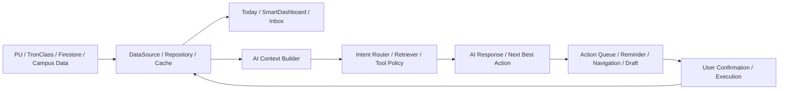
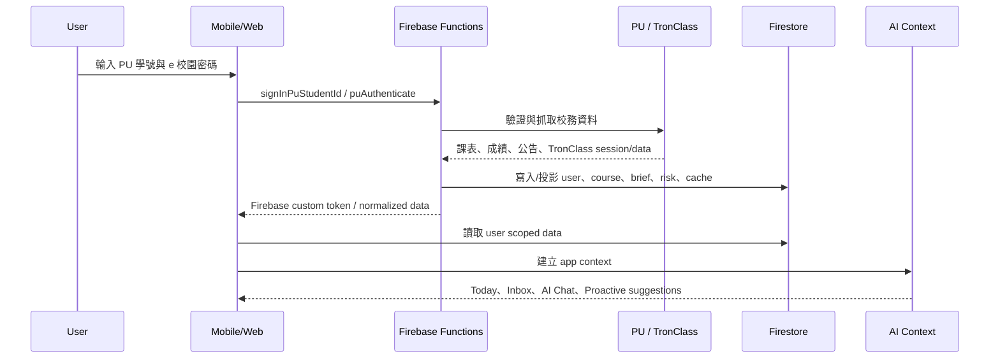

# Campus One - Campus Agent OS

<p align="center">
  <a href="https://github.com/Miiduoa/graduation"></a>
  <a href="https://github.com/Miiduoa/graduation/actions"></a>
  
  
  
  
  
  
</p>

> **產品定位：** Campus One 不是一般校園整合 App，而是 **Campus Agent OS（校園行動代理系統）**。它把課程、TronClass、校務資料、地圖、餐飲、交通、**訊息匣／群組協作**（Mobile bottom tab 鍵名為 **`訊息`**）、學習風險、主動提醒與 AI 行動建議串成「今天下一步」的閉環，讓使用者不用先找功能，而是直接處理最重要的校園行動。

> **官方倉庫：** [github.com/Miiduoa/graduation](https://github.com/Miiduoa/graduation)  
> **2026-05-15 再追加（README 對齊程式）：** **`…/group/:id/assignments`** 與 **`…/group/:id/hub`**（或 query **`hub`／`courseHub`／`learn`**）深連結經 **`parseGroupAssignmentsListDeepLink`／`parseGroupCourseHubDeepLink`／`isInterceptedMessagingDeepLink`** 導向 **`學習` → `CourseHub`**（見 [`assignmentDeepLink.ts`](apps/mobile/src/app/assignmentDeepLink.ts)、[`App.tsx`](apps/mobile/App.tsx)）；**[`tronClassWebUiGate.ts`](apps/mobile/src/services/tronClassWebUiGate.ts)** 與 LMS 資料開關同步，於 **`EXPO_PUBLIC_TRONCLASS_DATA_ENABLED=false`** 時 Alert 阻擋 **PU 玩課雲** **`tronclass.pu.edu.tw`** WebView／外開／[`useDeepLink`](apps/mobile/src/hooks/useDeepLink.ts) **`openUrl`**（非玩課雲連結不受影響）。本機離線：**[`localDocRAG.ts`](apps/mobile/src/services/localDocRAG.ts)**（AsyncStorage 輕量 RAG：`formatLocalDocRagAppendix` 注入 **`ai.ts`** **`tryChatWithOnDeviceAssistant`** 與 **[`localAssistant.ts`](apps/mobile/src/services/localAssistant.ts)** system prompt）；**`EXPO_PUBLIC_AI_PROVIDER=local-llm`** 且有已下載 GGUF 時可走裝置端推理鏈。[`localLLMInference.ts`](apps/mobile/src/services/localLLMInference.ts) **`getDefaultLocalLlmModelId()`** 預設對齊 **`qwen2.5-7b`**（可被 **`extra.localLlmDefaultModelId`／`EXPO_PUBLIC_LOCAL_LLM_MODEL`** 覆寫）。**`EXPO_PUBLIC_AI_OFFLINE_FIRST=true`**／**`extra.aiOfflineFirst`** 時 **`app.config.ts`** 將 **web search／web learning** 預設改關、[`localAssistant.ts`](apps/mobile/src/services/localAssistant.ts) **`enableWebSearch` 預設 false**。Release：**`EXPO_PUBLIC_RELEASE_AI_PROVIDER`** 可在 production-like build 覆寫原強制 **`cloud`** 行為。舊資料：**[`inboxTaskFromLegacyAssignmentActionTarget`](apps/mobile/src/services/inboxActions.ts)** 還原僅 **`actionTarget`** 指向 **`AssignmentDetail`** 的 **NBA**。**AI server：** [`prepare_data.py`](backend/ai-server/training/prepare_data.py) 產 **`messages`** 多輪代理軌跡（對齊裝置端 **`[EXECUTE:tool:…]`**），[`finetune.py`](backend/ai-server/training/finetune.py) **`DEFAULT_HF_MODEL`** → **`Qwen/Qwen2.5-7B-Instruct`** 並將 **`tool`** 回合正規化成 **`user`**。長測：**[`ai-app-scenario-marathon.sh`](scripts/ai-app-scenario-marathon.sh)** **`AI_MARATHON_FAIL_FAST`**（預設首錯即停）。  
> **2026-05-15 README 收斂：** 共享 **`planStudy`**（[`studyPlanner.ts`](packages/shared/src/lms/studyPlanner.ts)）、**MLX LoRA** 執行期 [`_mlx_lora_runtime.yaml`](backend/ai-server/training/_mlx_lora_runtime.yaml)、**hub query 護欄**（[`assignmentDeepLink.ts`](apps/mobile/src/app/assignmentDeepLink.ts) **`matchGroupIdForHubQueryParam`**）、**`pendingMessagingDeepLinkRef`**（[`App.tsx`](apps/mobile/App.tsx)）、**LMS Web 閘道**擴充（[`tronClassWebUiGate.ts`](apps/mobile/src/services/tronClassWebUiGate.ts) **`webViewShouldAllowRequestUrl`**／**`webBrowserOpenWithPuTronClassGate`** 等）與 **Jest**（[`studyPlanner.test.ts`](apps/mobile/src/__tests__/studyPlanner.test.ts)、[`notificationPlanner.test.ts`](apps/mobile/src/__tests__/notificationPlanner.test.ts)、[`gradePredictor.test.ts`](apps/mobile/src/__tests__/gradePredictor.test.ts)、[`mistakeRepertoire.test.ts`](apps/mobile/src/__tests__/mistakeRepertoire.test.ts)、[`tronClassWebUiGate.test.ts`](apps/mobile/src/__tests__/services/tronClassWebUiGate.test.ts)、[`socraticCoach.test.ts`](apps/mobile/src/__tests__/socraticCoach.test.ts)）— 詳見下方「本期程式與 QA 對照摘要」與「專案快照」；細部計數請以 **已 commit** 後之 `git ls-files | wc -l` 與下方的 **專案快照** 表格為準（歷史敘事中舊數字不保證與主表一致）。
> **2026-05-16 追加（程式＋資產＋對照中控台）：** 新增 **`apps/mobile/src/data/campusBusRoutes.ts`** — TypeScript **靜態路線資料庫**（校內 **A／B** 巡迴、台中市區服務靜宜之 **300/301/304/305/307/309/310**、長途／沙鹿車站／高鐵／台中車站接駁等類型，`CampusBusStop`/`CampusBusRoute`、**polyline**、發車時刻與壅擠層級枚舉）；檔頭註明對齊 **`BusScheduleScreen`** 即時地圖、類 **GoogleMaps**／**`MapScreen`／`MapStack`** POI／路線圖層與 **AI 搭車建議**（實際 `import` 以各畫面為準）。**[`TodayCockpitScreen.tsx`](apps/mobile/src/screens/TodayCockpitScreen.tsx)** 在錯題複習等 **metric chips** 下方追加 **「校園生活速覽」pill 列**：呼叫 [`demoUserStories.ts`](apps/mobile/src/data/demoUserStories.ts) **`getStudentLifeQuickFacts(uid)`**（宿舍／圖書／印表／餐廳餘額／運動／社團等示範欄位，依 **`tone`** 套邊框色）。**[`TeacherCockpitScreen.tsx`](apps/mobile/src/screens/TeacherCockpitScreen.tsx)** **`CockpitHero`**：**eyebrow** 於存在示範故事時附上 **`office.building` + `room`**；**summary** 另行串 **Office Hour**（`officeHours[].day/from/to`）；以 **`require('../data/demoUserStories').getDemoUserStory`** **動態載入**，避免循環依賴。Jest：**[`aiOrchestrator.test.ts`](apps/mobile/src/__tests__/aiOrchestrator.test.ts)** — **`aiVendorNextAction`** 空檔用例傳 **`hour: 12`**，斷言改為 **`/預備|食材|整理/`**，避開午夜／下午茶等時段分枝造成 **flake**。示範資產：**`demo_預覽/campus_bus_map_v2_mockup.html`**（離線巴士路網視覺 mockup）、根目錄 **`口試簡報_mobile_v6.pptx`**。**專案快照（早段）**：**`1064`** tracked、`**138**` 個 Mobile `*Screen.tsx`。**晚段累加請見下一則與下方快照表（**1084／142／78／29**）。  
> **2026-05-16 晚間／口試補強（Web `/admin`、`/ai-assistant`、`/credit-planner` × Mobile `BusV2` × AI 信任卡 × 商家預測）：** **Web：** [`apps/web/src/app/admin/page.tsx`](apps/web/src/app/admin/page.tsx) **`/admin`** — 離線示範之系所／管理端「待審公告」工作台（與 **`useDemoRole`／`getCapabilities`**、`DEMO_ANNOUNCEMENTS` 敘事一致）；[`apps/web/src/app/ai-assistant/page.tsx`](apps/web/src/app/ai-assistant/page.tsx) **`/ai-assistant`** — 將 [`apps/web/src/lib/aiContext.ts`](apps/web/src/lib/aiContext.ts) 的 **`buildAISystemContext`／`getCreditSummary`** 拼入對話側欄與離線往返（資料源為擴充後 [`apps/web/src/lib/demoData.ts`](apps/web/src/lib/demoData.ts)：**歷史學期／本學期／下學期選課／社團** 等）；[`apps/web/src/app/credit-planner/page.tsx`](apps/web/src/app/credit-planner/page.tsx) **`/credit-planner`** — 視覺化學分缺口、類別達成率、下學期候選課 **衝堂** 標示。**多頁學生端**（例：`/`、`/announcements`、`/course/[courseId]`、`/grades`、`/library`、`/profile`、`/timetable`）與 **教師課程子頁**（`attendance`／`gradebook`／`modules`／`quizzes`／`question-banks`）調整為與離線身分 pill、示範資料同源。**Mobile：** [`BusV2Screen.tsx`](apps/mobile/src/screens/BusV2Screen.tsx) 並於 [`MapStack.tsx`](apps/mobile/src/screens/MapStack.tsx) 註冊 **`BusV2`**（標題「校園公車」）；舊 **`BusSchedule`** 標為「（舊版）」。[`CampusHubScreen.tsx`](apps/mobile/src/screens/CampusHubScreen.tsx) 等入口對齊 **`BusV2`**；[`GoogleMapsLikeScreen.tsx`](apps/mobile/src/screens/GoogleMapsLikeScreen.tsx) 微小調用以配合地圖敘事。**[`aiStudyBuddyMatcher.ts`](apps/mobile/src/services/aiStudyBuddyMatcher.ts)**／**[`AIStudyBuddyScreen.tsx`](apps/mobile/src/screens/AIStudyBuddyScreen.tsx)** 擴充示範配對。**[`aiTrustCard.ts`](apps/mobile/src/services/aiTrustCard.ts)** — 期末「AI 信任卡」指標（`buildTrustCard`：採納率、護欄擋送、guardrail breakdown、分享文案）；**[`AITrustCardScreen.tsx`](apps/mobile/src/screens/AITrustCardScreen.tsx)**。**[`vendorPredictor.ts`](apps/mobile/src/services/vendorPredictor.ts)** — 餐廳 **週規律 vs 今日進度** 之預測級文案（對齊 `REALITY_AUDIT` 調整項）。輔材：**[`savedPlaces.ts`](apps/mobile/src/services/savedPlaces.ts)**、**[`voiceNav.ts`](apps/mobile/src/services/voiceNav.ts)**、**[`demoNotImplemented.ts`](apps/mobile/src/utils/demoNotImplemented.ts)**（離線占位提示）。**[`apps/mobile/src/utils/safeNavigate.ts`](apps/mobile/src/utils/safeNavigate.ts)**＋ **`safeNavigate.test.ts`**。**[`BusStopDetailScreen.tsx`](apps/mobile/src/screens/BusStopDetailScreen.tsx)** — 站點詳情版面（是否在 `Navigator`／`MapStack` 暴露為路由，請以 **`rg BusStopDetail apps/mobile`** 為準）。**Jest：** [`aiStudyBuddyMatcher.test.ts`](apps/mobile/src/__tests__/aiStudyBuddyMatcher.test.ts)、[`aiTrustCard.test.ts`](apps/mobile/src/__tests__/aiTrustCard.test.ts)、[`vendorPredictor.test.ts`](apps/mobile/src/__tests__/vendorPredictor.test.ts)。**工程筆記：** [`docs/AI_SERVICE_CONSOLIDATION_PLAN.md`](docs/AI_SERVICE_CONSOLIDATION_PLAN.md)。**口試輔材（根目錄）：** [`DEMO_SCRIPT.md`](DEMO_SCRIPT.md)、[`DEMO_角色完整版.md`](DEMO_角色完整版.md)、[`口試交付包_README.md`](口試交付包_README.md)。  
> **2026-05-17 快照／GitHub push 批次（離線示範狀態 × Agent 控制台 × Web 路由補齊 × 風險／室內圖）：** **跨端示範狀態** — Mobile：[`CombinedProviders.tsx`](apps/mobile/src/state/CombinedProviders.tsx)＋[**`demoRole.tsx`**](apps/mobile/src/state/demoRole.tsx)；Web：**[`demoStore.ts`](apps/web/src/lib/demoStore.ts)**（`localStorage` 持久）、[**`useRoleScopedState.ts`**](apps/web/src/lib/useRoleScopedState.ts)、[**`roleNotifications.ts`**](apps/web/src/lib/roleNotifications.ts)，並與 [`DemoRolePill.tsx`](apps/web/src/components/DemoRolePill.tsx)、[`SiteShell.tsx`](apps/web/src/components/SiteShell.tsx)、多數學生端／教師子頁同步。**Agent：** [**`AIAgentConsoleScreen.tsx`**](apps/mobile/src/screens/AIAgentConsoleScreen.tsx)、[**`AgentSummaryBanner.tsx`**](apps/mobile/src/components/AgentSummaryBanner.tsx)、[**`aiAgentRuntime.ts`**](apps/mobile/src/services/aiAgentRuntime.ts)、[**`personaContext.ts`**](apps/mobile/src/services/personaContext.ts)；[**`AIAgentObservatoryScreen.tsx`**](apps/mobile/src/screens/AIAgentObservatoryScreen.tsx)、[**`AIChatScreen.tsx`**](apps/mobile/src/screens/AIChatScreen.tsx) 連動調整；[`aiAgentTools.ts`](apps/mobile/src/services/aiAgentTools.ts)／[**`aiSemanticReasoner.ts`**](apps/mobile/src/services/aiSemanticReasoner.ts) 延伸。**學習／風險：** [**`studentRiskEngine.ts`**](apps/mobile/src/services/studentRiskEngine.ts)、[**`StudentRiskScreen.tsx`**](apps/mobile/src/screens/StudentRiskScreen.tsx)；Jest [**`studentRiskEngine.test.ts`**](apps/mobile/src/__tests__/studentRiskEngine.test.ts)。**室內導覽：** [**`indoorMaps.ts`**](apps/mobile/src/data/indoorMaps.ts)、[**`IndoorFloorMapScreen.tsx`**](apps/mobile/src/screens/IndoorFloorMapScreen.tsx)。**公車即時層（TDX）：** [**`tdxLive.tsx`**](apps/mobile/src/services/tdxLive.tsx)（UI 組合請對照 **`BusV2`／Trip** 流）。**離線／快取輔材：** [**`offlineCache.ts`**](apps/mobile/src/services/offlineCache.ts)。**導頁護欄：** [**`routeRegistry.ts`**](apps/mobile/src/utils/routeRegistry.ts)、擴充 [**`safeNavigate.ts`**](apps/mobile/src/utils/safeNavigate.ts)；**[`roleEventBus.ts`](apps/mobile/src/services/roleEventBus.ts)**、**[`savedPlaces.ts`](apps/mobile/src/services/savedPlaces.ts)** 同步迭代。**商家後台：** [**`VendorLoyaltyPushScreen.tsx`**](apps/mobile/src/screens/VendorLoyaltyPushScreen.tsx)、[**`VendorMenuManageScreen.tsx`**](apps/mobile/src/screens/VendorMenuManageScreen.tsx)、[**`VendorRevenueReportScreen.tsx`**](apps/mobile/src/screens/VendorRevenueReportScreen.tsx)（並與 `VendorDashboard`、`Department`、`Teacher`、`TA`、點名／成績等螢幕小調對齊口試叙事）。**示範敘事畫面：** [**`DemoStoryScreen.tsx`**](apps/mobile/src/screens/DemoStoryScreen.tsx)、[**`LifeRequestsScreen.tsx`**](apps/mobile/src/screens/LifeRequestsScreen.tsx)、[**`TeachingEvaluationScreen.tsx`**](apps/mobile/src/screens/TeachingEvaluationScreen.tsx)。**Web 新／補強路由：** [**`/messages`**](apps/web/src/app/messages/page.tsx)；公告詳情 [**`/announcements/[id]`**](apps/web/src/app/announcements/[id]/page.tsx)；管理端示範學生檔 [**`/admin/students/[id]`**](apps/web/src/app/admin/students/[id]/page.tsx)。**工程／口試輔文件：** [**`AUDIT_REPORT.md`**](AUDIT_REPORT.md)、[`docs/REMAINING_BUGS_AUDIT.md`](docs/REMAINING_BUGS_AUDIT.md)、[`docs/CROSS_ROLE_DATA_FLOW.md`](docs/CROSS_ROLE_DATA_FLOW.md)、[`docs/CONSOLIDATION_PLAN.md`](docs/CONSOLIDATION_PLAN.md)、[`docs/ROLE_FEATURE_MATRIX.md`](docs/ROLE_FEATURE_MATRIX.md)、[`docs/DEMO_NARRATIVE.md`](docs/DEMO_NARRATIVE.md)。**截圖一鍵：** [`start-demo-for-screenshots.sh`](start-demo-for-screenshots.sh)、[`start-demo-for-screenshots.command`](start-demo-for-screenshots.command)；離線身分切換 mockup：**[`demo_預覽/persona_switch_demo.html`](demo_預覽/persona_switch_demo.html)。**追加 Jest：** [`orderFlow.test.ts`](apps/mobile/src/__tests__/orderFlow.test.ts)、[`services/debug_quantity.test.ts`](apps/mobile/src/__tests__/services/debug_quantity.test.ts)。**本 README「專案快照」數字對齊本批：** tracked **`1138`**、Mobile `*Screen.tsx` **`151`**、`__tests__` **`81`**、`apps/web/**/page.tsx` **`32`**（以 **push 後** `git ls-files`／`find` 複核為準；**+1**＝根目錄 **`AUDIT_V2_FIXED.md`**）。
> **2026-05-17 第三批（離線端到端硬化 × Web 主頁與資訊／生活模組對齊 × 口試驗證套件）：** **Web `demoStore`／[`demoData.ts`](apps/web/src/lib/demoData.ts)／[`aiContext.ts`](apps/web/src/lib/aiContext.ts)** — `publishGrades` 不再寫死單一學號、社團審核與停用帳號等動作改用持久化結構並與 `roleNotifications` 廣播一致（詳細條列見 [`docs/FINAL_VERIFICATION.md`](docs/FINAL_VERIFICATION.md)）。**離線 UX：** [`apps/web/src/app/page.tsx`](apps/web/src/app/page.tsx) 首頁敘事重排；[**`/bus`**](apps/web/src/app/bus/page.tsx)、[**`/cafeteria`**](apps/web/src/app/cafeteria/page.tsx) 與校園場域一致；[**`/clubs`**](apps/web/src/app/clubs/page.tsx)、[**`/groups`**](apps/web/src/app/groups/page.tsx) **社團幹部**視角收窄跨社未讀／內訊並補可操作流；[**`/library`**](apps/web/src/app/library/page.tsx)、[**`/grades`**](apps/web/src/app/grades/page.tsx)、[**`/profile`**](apps/web/src/app/profile/page.tsx)、[**`/search`**](apps/web/src/app/search/page.tsx)、[**`/login`**](apps/web/src/app/login/page.tsx)／[**`/settings`**](apps/web/src/app/settings/page.tsx) — 將死連結、無效 Anchor、toast-only 控制台項改為可導後台或可連線頁，並與 `DemoRole` 能力矩陣對齊；[**`/messages`**](apps/web/src/app/messages/page.tsx)、[**`/announcements/[id]`**](apps/web/src/app/announcements/[id]/page.tsx)、[**`/admin`**](apps/web/src/app/admin/page.tsx)、[**`/admin/students/[id]`**](apps/web/src/app/admin/students/[id]/page.tsx) — 將「假按鈕」改為 **Modal／寫入 `demoStore`** 或連到既有路由；[**`teacher/course/...`**](apps/web/src/app/teacher/course/[courseId]/page.tsx)、[**`gradebook`**](apps/web/src/app/teacher/course/[courseId]/gradebook/page.tsx)、[**`quizzes`**](apps/web/src/app/teacher/course/[courseId]/quizzes/page.tsx) — **新增／編輯測驗、檢視答案、發布成績與對齒學生成績**等行為收口到示範狀態；[**`/ai-assistant`**](apps/web/src/app/ai-assistant/page.tsx) — 對話版面與 `buildAISystemContext`／快捷鏈對 **demo persona** 加寬。**[`SiteShell.tsx`](apps/web/src/components/SiteShell.tsx)** — 頁尾 **關於／隱私／聯絡**改為 **`next/link`／`mailto`／真實路徑**。**Mobile：** [**`App.tsx`**](apps/mobile/App.tsx) 深連結與殼對齊；新增 [**`AIMissionControl.tsx`**](apps/mobile/src/components/AIMissionControl.tsx)；[**`demoPersona.ts`**](apps/mobile/src/data/demoPersona.ts)／[**`demoUserStories.ts`**](apps/mobile/src/data/demoUserStories.ts)；訊息主線 **[`MessagesHomeScreen`／`ChatScreen`／`DmsScreen`／`InboxScreen`]** 與 [`HomeworkSubmitScreen.tsx`](apps/mobile/src/screens/HomeworkSubmitScreen.tsx)、多台 **Dashboard**（`Smart`／`Teacher`／`TA`／`Department`／`Vendor`／`Admin`）小調以利口試導览。**QA 套件：** **[`AUDIT_V2.md`](AUDIT_V2.md)** — 以 **`apps/web/src/`**（約 **80** 個 TS/TSX，不含 `.next`）為範圍的 **dead CTA／跨頁資料不一致／示範洩漏** 條列式稽核；[`docs/FINAL_VERIFICATION.md`](docs/FINAL_VERIFICATION.md)（終極 build／eslint／tsc 驗證與 **`demoStore` diff 摘要）；[`docs/DEMO_SCRIPT_FINAL.md`](docs/DEMO_SCRIPT_FINAL.md)、[`docs/FEATURE_CONSOLIDATION_FINAL.md`](docs/FEATURE_CONSOLIDATION_FINAL.md)、[`docs/ROLE_ACTION_DATA_MATRIX_FINAL.md`](docs/ROLE_ACTION_DATA_MATRIX_FINAL.md)、[`docs/口試最終檢核清單.md`](docs/口試最終檢核清單.md)。**備註：** `AUDIT_V2` 所列部分項目仍為 **後續工作清單**；口試請以 **`FINAL_VERIFICATION`**「本輪已修復」段落與實際畫面為準。
> **2026-05-17 第四批（`AUDIT_V2` 收斂 × Web 深綴 `🤖` 捷徑 × 公告退回真通知）：** **行為修正** — [`demoStore.ts`](apps/web/src/lib/demoStore.ts) 新增 **`rejectAnnouncementWithReason`**：待審公告「退回」改 **`window.prompt` 蒐集原因**後 **`sendMessage`** 通知原提交者（**不再**誤走 **`approvePendingAnn`** 等同核准）；[**`/admin`**](apps/web/src/app/admin/page.tsx)、[**`/announcements`**](apps/web/src/app/announcements/page.tsx) 已接上。[**`demoRole.ts`**](apps/web/src/lib/demoRole.ts) 新增 **`switchToRole(next)`** 統一 **`writeDemoRole` + entryHref**（給登入／**DemoRolePill** 收口）。**AI 深連結（`/ai-assistant?q=`）：** [`course/[courseId]/page.tsx`](apps/web/src/app/course/[courseId]/page.tsx) 教材週次／作業與測驗列；[`grades/page.tsx`](apps/web/src/app/grades/page.tsx) 學生成績列；[`clubs/page.tsx`](apps/web/src/app/clubs/page.tsx) 未加入社團；[`profile/page.tsx`](apps/web/src/app/profile/page.tsx) 依 TA／社團幹部／校友／教師／系所／管理員等修課／工作台區；[`teacher/course/.../attendance/page.tsx`](apps/web/src/app/teacher/course/[courseId]/attendance/page.tsx) 歷史場次；[`ai-assistant/page.tsx`](apps/web/src/app/ai-assistant/page.tsx) **訪客**快捷加校園位置／地圖／公開資訊。**工程：** [`groups/page.tsx`](apps/web/src/app/groups/page.tsx) **`courseHref`** 改 **`useCallback`**；[`page.tsx`](apps/web/src/app/page.tsx)／社團／成績頁移除未用 state／import。**佐證文件：** [**`AUDIT_V2_FIXED.md`**](AUDIT_V2_FIXED.md)（§10 列本批 **`git` paths**；§2 若與 diff 不一致以 **§10** 為準）。**專案快照（第四批為止）：** tracked **`1138`**（含根目錄 **`AUDIT_V2_FIXED.md`**）。
> **2026-05-17 第五批（LMS v2 × Supabase 前置工程 × 既有 AI 不重寫）：** 將 **PostgreSQL／Supabase** 定位為「**可選 LMS 資料層**」，與現行 Firebase／TronClass 主線**並列**；遷移步驟以 **[`docs/LMS_V2_MIGRATION_RUNBOOK.md`](docs/LMS_V2_MIGRATION_RUNBOOK.md)** 為準（環境變數、`supabase db push`、deploy 哪幾個 Edge Function、如何使用 Firebase **`issueSupabaseJwt`**）。**資料庫與設定：** **`supabase/migrations/`**（按檔名前綴順序套用）、[**`supabase/config.toml`](supabase/config.toml)**、[**`supabase/APPLY.txt`](supabase/APPLY.txt)**。**Edge Functions：** 預設可部署清單含 **`dispatch-notification-push`**、`send-expo-push`、`sync-external-directory`、`course-export-worker`（各具 `README`）；Runbook **不部署** **`ai-course-assistant`**／**`material-ai-pipeline`**（原始碼**封存**於 **`supabase/functions/_disabled/`**，以避免與既有的 **`chatWithCampusAssistant`**、`aiAgentRuntime` 重複一套 AI）。**Client 側：** Mobile [**`lmsV2FeatureFlag.ts`**](apps/mobile/src/services/lmsV2FeatureFlag.ts)、[**`supabaseClient.ts`**](apps/mobile/src/services/supabaseClient.ts)、[**`lmsAuthBridge.ts`**](apps/mobile/src/services/lmsAuthBridge.ts)、[**`supabaseLmsCache.ts`**](apps/mobile/src/services/supabaseLmsCache.ts)、[**`perCourseAIContext.ts`**](apps/mobile/src/services/perCourseAIContext.ts)（課程頁對話仍以 **`AIChatScreen`**／**`chatWithCampusAssistant`** 為本體，只補課程向 LMS 文本）；Web [**`lmsV2FeatureFlag.ts`**](apps/web/src/lib/lmsV2FeatureFlag.ts)、[**`supabaseClient.ts`**](apps/web/src/lib/supabaseClient.ts)。**共用 adapter：** [**`packages/shared/src/lms/supabaseLmsAdapter.ts`](packages/shared/src/lms/supabaseLmsAdapter.ts)**。**Firebase：** **[`backend/functions/lmsV2/README.md`](backend/functions/lmsV2/README.md)**（可部署 **`issueSupabaseJwt`** 等）。**參考用 UI（尚未掛進主 Navigator）：** [`apps/mobile/src/screens/_lms_v2_staged/`](apps/mobile/src/screens/_lms_v2_staged/README.md)（`**/*.staged`**）、[`apps/web/_lms_v2_staged_admin/`](apps/web/_lms_v2_staged_admin/README.md)、占位 [**`apps/web/src/app/lms-admin/__staged/`](apps/web/src/app/lms-admin/__staged/.lms-v2-reserved)**。為避免 `tsc`／Metro 編譯到半成品，[**`apps/mobile/tsconfig.json`**](apps/mobile/tsconfig.json) 已 **`exclude`** **`src/screens/_lms_v2_staged/`**、`src/_lms_v2_staged/`；[**`apps/web/tsconfig.json`**](apps/web/tsconfig.json) **`exclude`** **`_lms_v2_staged_admin`**。**非程式：** [**`LMS_整合計畫.docx`](LMS_%E6%95%B4%E5%90%88%E8%A8%88%E7%95%AB.docx)**。本批約 **119** 個新路徑；來源備份請勿將 **`*.bak`／`*.bak2`** 加入版控。**Feature flag：預設 OFF**；無 URL／anon key 時 Supabase client 為 `null` 並回落至既有資料來源。**專案快照（第五批為止）：** tracked **`1257`**。
> **2026-05-18 第六批（LMS v2 可切換學習鏈 × Web `/lms-admin` 管理中樞 × Today v2 × 設計權杖）：** Runbook **[`docs/LMS_V2_MIGRATION_RUNBOOK.md`](docs/LMS_V2_MIGRATION_RUNBOOK.md)** 已對齊 **Phase A–C**（AI 工具讀取經 **`supabaseLmsCache`**、**LearnStack `CourseHub` dispatcher**、**`isLmsV2Enabled()`** 為 true 時走 V2、**`SiteShell`** 二級 Nav「LMS 管理」）；角色 × LMS 動作 × **AI write tools** 對照見 **[`docs/LMS_V2_ROLE_ACTION_MAP.md`](docs/LMS_V2_ROLE_ACTION_MAP.md)**。**Mobile：** 正式編譯目錄 **[`apps/mobile/src/screens/lmsV2/`](apps/mobile/src/screens/lmsV2/)** — `CourseHubV2`、`CourseMaterialsV2`、`CourseAssignmentsV2`、`CourseAssignmentDetailV2`、`CourseQuizzesV2`、`CourseQuizTakingV2`、`CourseGradesV2`、`CourseAnnouncementsV2`、`CourseForumV2`、`CourseForumTopicV2`、`CourseLiveV2`、`CourseQuestionBankV2`、`CourseAIAssistantV2`（課程內仍銜接既有對話／助理鏈）、殼 **`_courseV2Shell.tsx`**；**[`LearnStack.tsx`](apps/mobile/src/screens/LearnStack.tsx)** 對 **V1／V2** 分派。**[`TodayAiFirstScreen.tsx`](apps/mobile/src/screens/TodayAiFirstScreen.tsx)** 與 **[`TodayCockpitScreen.tsx`](apps/mobile/src/screens/TodayCockpitScreen.tsx)**、`LoginLanding`、`TADashboard`、`TeacherCockpit`、`DepartmentDashboard`、`AIMissionControl`、`AgentSummaryBanner` 等小調對齊「AI‑first Today」演示。**Agent／工具：** [`lmsV2ToolSpecs.ts`](apps/mobile/src/services/lmsV2ToolSpecs.ts)、[`lmsV2WriteTools.ts`](apps/mobile/src/services/lmsV2WriteTools.ts) 經 **`aiToolRegistry`** 註冊；[`aiAgentTools.ts`](apps/mobile/src/services/aiAgentTools.ts)、[`aiRealtimeAnalytics.ts`](apps/mobile/src/services/aiRealtimeAnalytics.ts)、[`aiSmartActions.ts`](apps/mobile/src/services/aiSmartActions.ts)、[`aiLocalAgent.ts`](apps/mobile/src/services/aiLocalAgent.ts) 與 LMS 資料面一致化。**UI token：** [`theme.ts`](apps/mobile/src/ui/theme.ts)、[`navigationTheme.ts`](apps/mobile/src/ui/navigationTheme.ts)、[`components.tsx`](apps/mobile/src/ui/components.tsx)、[`cockpitShell.tsx`](apps/mobile/src/ui/cockpitShell.tsx)。**Web：** **[`/lms-admin`](apps/web/src/app/lms-admin/page.tsx)** 及子路由 **dashboard、courses、members、bulk‑import、export‑jobs、notify、push‑logs、reports、audit、role‑matrix、ai‑compliance、wave5、wave6**；示範學生前台與離線身分 — [`demoStore.ts`](apps/web/src/lib/demoStore.ts)、[`demoRole.ts`](apps/web/src/lib/demoRole.ts)、[`DemoRolePill.tsx`](apps/web/src/components/DemoRolePill.tsx)、[`SiteShell.tsx`](apps/web/src/components/SiteShell.tsx)，以及公告／課程／grades／teacher 子頁等既有路由微調。**[`today-v2/page.tsx`](apps/web/src/app/today-v2/page.tsx)** — Web 端 Today 實驗面。**相容層：** [`AppShell.tsx`](apps/web/src/components/AppShell.tsx)、[`RequireAdmin.tsx`](apps/web/src/components/RequireAdmin.tsx)、[`supabase-browser.ts`](apps/web/src/lib/supabase-browser.ts)、[`rechartsShim.tsx`](apps/web/src/lib/rechartsShim.tsx)、[`RichTextEditor.tsx`](apps/web/src/components/RichTextEditor.tsx)、[`components/ai/CommandBar.tsx`](apps/web/src/components/ai/CommandBar.tsx)、[`SlotCard.tsx`](apps/web/src/components/ai/SlotCard.tsx)。**Shared：** [`packages/shared/src/designTokens.ts`](packages/shared/src/designTokens.ts)。**設計稿索引：** [`docs/design/design-system.md`](docs/design/design-system.md)、[`docs/design/AI_FIRST_REDESIGN.md`](docs/design/AI_FIRST_REDESIGN.md)、[`docs/design/prototype.html`](docs/design/prototype.html)。**資料庫：** [`supabase/migrations/`](supabase/migrations/) 小修；根目錄 **[`supabase/migrations_combined.sql`](supabase/migrations_combined.sql)** 為整併備援（仍以 **`migrations/` 單檔順序** 為權威）。**腳本：** [`scripts/ai-app-scenario-marathon.sh`](scripts/ai-app-scenario-marathon.sh) 調整。**專案快照（第六批為止）：** tracked **`1302`**；Mobile `*Screen.tsx` **`165`**；`apps/web/**/page.tsx` **`66`**（以 **commit 後** `git ls-files`／`find` 複核為準）。
> **2026-05-18 第七批（Mobile `*AiFirst*` × Web `/` AI‑First Home × `@campus/shared` `roles`）：** **對齊文件：** [`docs/design/AI_FIRST_REDESIGN.md`](docs/design/AI_FIRST_REDESIGN.md)、[`prototype.html`](docs/design/prototype.html)。**Mobile 共用：** [**`aiFirst.tsx`**](apps/mobile/src/ui/aiFirst.tsx) — `AIScreen`、`AIHero`、`AICard`、`AIMark`、`aiTokens`，統一各 Tab AiFirst landing。**路由：** **`29`** 個 `*AiFirstScreen.tsx`（見 [`screens/`](apps/mobile/src/screens/)）；例：`MessagesHomeAiFirst`、`AIChatAiFirst`、`AnnouncementDetailAiFirst`、`CourseHubAiFirst`、`BusAiFirst`、`CafeteriaAiFirst`、`TeacherCockpitAiFirst`、`CreditAuditAiFirst`、`QuizCenterAiFirst`、`SettingsAiFirst`、`LearnAiFirst`、`LibraryAiFirst`、`NotificationAiFirst`。 [**`TodayAiFirstScreen.tsx`**](apps/mobile/src/screens/TodayAiFirstScreen.tsx) 強化。**Stacks：** [**`HomeStack`**](apps/mobile/src/screens/HomeStack.tsx)、[**`LearnStack`**](apps/mobile/src/screens/LearnStack.tsx)、[**`MapStack`**](apps/mobile/src/screens/MapStack.tsx)、[**`MessagesStack`**](apps/mobile/src/screens/MessagesStack.tsx)、[**`MeStack`**](apps/mobile/src/screens/MeStack.tsx)、[**`AnnouncementsStack`**](apps/mobile/src/screens/AnnouncementsStack.tsx)、[**`EventsStack`**](apps/mobile/src/screens/EventsStack.tsx)、[**`CafeteriaStack`**](apps/mobile/src/screens/CafeteriaStack.tsx)、[**`CreditAuditStack`**](apps/mobile/src/screens/CreditAuditStack.tsx)：新舊畫面並列。**服務：** [**`supabaseLmsCache.ts`**](apps/mobile/src/services/supabaseLmsCache.ts)、[**`aiLocalAgent.ts`**](apps/mobile/src/services/aiLocalAgent.ts)、[**`aiSelfDialog.ts`**](apps/mobile/src/services/aiSelfDialog.ts)、[**`aiDynamicTraining.ts`**](apps/mobile/src/services/aiDynamicTraining.ts)、[**`lmsV2DemoSignIn.ts`**](apps/mobile/src/services/lmsV2DemoSignIn.ts)；[**`ambient.ts`**](apps/mobile/src/features/engagement/ambient.ts)。**個人／課務：** [**`CoursesHomeScreen.tsx`**](apps/mobile/src/screens/CoursesHomeScreen.tsx)、[**`PersonalHubScreen.tsx`**](apps/mobile/src/screens/PersonalHubScreen.tsx)、[**`CampusGameScreen.tsx`**](apps/mobile/src/screens/CampusGameScreen.tsx)、[**`CourseSchedulePanel.tsx`**](apps/mobile/src/screens/unifiedCalendar/CourseSchedulePanel.tsx)。**Shared：** [**`roles.ts`**](packages/shared/src/roles.ts)（`**CAMPUS_ROLES`／`COURSE_ROLES`**、`toCampusRole`／`toCourseRole` 與別名對照）；[**`packages/shared/src/index.ts`**](packages/shared/src/index.ts) re‑export。**Web：** **[`page.tsx`（`/` AI‑First Home）**](apps/web/src/app/page.tsx)；[**`page.legacy.tsx`**](apps/web/src/app/page.legacy.tsx) 為離線／舊版面備份。**主題：** [**`theme.ts`**](apps/mobile/src/ui/theme.ts)。**Jest：** [**`aiOpenEndedNaturalLanguage.test.ts`**](apps/mobile/src/__tests__/services/aiOpenEndedNaturalLanguage.test.ts)。**專案快照（第七批後）：** tracked **`1334`**；Mobile `*Screen.tsx` **`193`**；`apps/web/**/page.tsx` **`66`**（另：**`page.legacy.tsx`** 備份不入 `page.tsx` 計數）。**版控：** 勿將根 **`_tmp_*`**、程式 **`*.bak`／`*.bak2`** 提交入庫。

> **2026-05-18 第八批（全 monorepo Apple HIG × Mobile 導覽／Tab 元件 × `aiFirst` insetGrouped）：** **設計系統：** `main` 上近期 commits 將視覺收斂為 **Apple HIG** — **iOS System Blue**、語義系統色、**4pt 網格**；merge 後掃除殘留 **Tailwind palette** 字面量，**brand** 統一為 **AI‑First Indigo**（與 AI 主色敘事一致）。**Mobile：** **Tab bar／Sheet** 等導覽層級導入 **BlurView**、**Sheet Grabber**、**Large Title**、**44pt 最小觸控目標**（對齊 [`navigationTheme.ts`](apps/mobile/src/ui/navigationTheme.ts)、[`theme.ts`](apps/mobile/src/ui/theme.ts)、[`App.tsx`](apps/mobile/App.tsx) Tab 殼與各 `*Stack.tsx`）。**[`aiFirst.tsx`](apps/mobile/src/ui/aiFirst.tsx)：** **`AISection`** 改為 **iOS insetGrouped** — **`AISectionContext`** 使巢狀 **`AIRow`** 取得 **`inGroup`／`isFirst`／`isLast`**；群組外加 **`sectionGroup`**（圓角白底＋**hairline** 邊框、`overflow: 'hidden'`）；列在群組內關閉獨立 card 框線、以頂部 **hairline** 分隔；可互動且無自訂 **`right`／`tag`** 時顯示 **›** chevron；**`activeOpacity`** 由 **0.7** 調為 **0.6**。**專案快照：** 仍以 **`1334`** tracked 為準（本批為既有檔案內精修；複核 **`git ls-files | wc -l`**）。

> 本 README 依據 **2026-05-15** 起對齊、**2026-05-16–17** 複核（含同日 **Mobile 底層 Tab 名稱**與**課程工作區 `courses.view` 護欄**對齊、`RouteGuard` **課綱查詢**後備導向、**訊息匣** [`inboxActions.ts`](apps/mobile/src/services/inboxActions.ts) **`resolveInboxAction`／`navigateFromInboxTask`**（依教學身分切換主按鈕文案並導向 **`HomeworkSubmit`／`TeacherGrading`／`QuizCenter`／`AttendanceMultiMethod`／`Classroom`／`CourseDiscussion`** 等 LearnStack 實作；**`assistant_queue`** 走 **`assistant_continue`**＋`aiOverlay`；[`SmartDashboardScreen.tsx`](apps/mobile/src/screens/SmartDashboardScreen.tsx) **`nextActionsForUi`** 對附 **`inboxTask`** 的 **`NextBestAction`** 再以 **`resolveInboxAction`** 覆寫 **`actionLabel`**，使 **Hero／Mission Rail** 與 **[`InboxScreen.tsx`](apps/mobile/src/screens/InboxScreen.tsx)** 主按鈕文案同源）、**`Grades`／`AcademicInsights`／`CreditAuditStack`／`AICourseAdvisor`** 與 [`permissions.ts`](apps/mobile/src/services/permissions.ts) **`PROTECTED_SCREENS`** 同步守門、**`HeaderDrawer`／`PersonalHubScreen`／`MeStack`** 依 **`achievements.view`／`courses.view`** 顯示或收斂學業入口、**智慧點名引擎**、Agent **`verifyAttendanceClaim`**、**`gradePredictor` what-if 成績試算**（[`packages/shared/src/lms/gradePredictor.ts`](packages/shared/src/lms/gradePredictor.ts)：`predictCurrent`／`simulateWhatIf`／`requiredToReach`）、**`studyPlanner` 跨課排程**（[`packages/shared/src/lms/studyPlanner.ts`](packages/shared/src/lms/studyPlanner.ts)：**`planStudy`**）、開發除錯畫面、**TronClass 靜宜部署真實 API schema** 紀錄（[`docs/TRONCLASS_REAL_SCHEMA_2026_05_13.md`](docs/TRONCLASS_REAL_SCHEMA_2026_05_13.md)，2026-05-13 線上 fetch 驗證）、**五門課 demo 飽和資料**（`demoCoursesMock`／`demoCoursesAdapter`／`CourseModulesScreen` 短路）與相關設計／驗證文件；**同日追加**：Mobile **[`SSOLoginScreen.tsx`](apps/mobile/src/screens/SSOLoginScreen.tsx)** 以 **Google（Firebase）OAuth** 為建議主登入（`EXPO_PUBLIC_GOOGLE_*_CLIENT_ID` 注入 `app.config` **`extra`**）、**`EXPO_PUBLIC_TRONCLASS_DATA_ENABLED`** 總開關停用 LMS／[`tronClassDataEnabled.ts`](apps/mobile/src/services/tronClassDataEnabled.ts)、Callable **`upsertUserNextBestActions`** 將 **`InboxTask`** 嵌進 **`users/.../nextBestActions`**、`parseNextBestAction` 相容僅 **`actionTarget`** 的舊列、**全域搜尋／通知中心**經 **`navigateFromInboxTask`** 與訊息工作台對齊、**`auth.tsx`** 在 Firestore 無 `users` 文件時回退 **`User.displayName`／`photoURL`**；**同日收斂**：[`assignmentDeepLink.ts`](apps/mobile/src/app/assignmentDeepLink.ts) 解析 query 測驗標記（`kind=quiz`、`type=exam`、`isQuiz`/`quiz`=**`1|true|yes`**），[`App.tsx`](apps/mobile/App.tsx) 於深連結 **`InboxTask`** 寫入 **`kind: 'quiz'`**；[`usePushNotifications.ts`](apps/mobile/src/app/usePushNotifications.ts) 推播 effect 依存 **`[uid]`** 並於 web／無 uid 時仍註冊 cleanup；[`GlobalSearchScreen.tsx`](apps/mobile/src/screens/GlobalSearchScreen.tsx) 作業 fallback **`AssignmentDetail`**；[`CalendarPanel.tsx`](apps/mobile/src/screens/unifiedCalendar/CalendarPanel.tsx) **`openCalendarEvent`**、即將到來 **`Pressable`**；[`puDataCache.ts`](apps/mobile/src/services/puDataCache.ts) **`refreshTC*`** 在 TC 全關時保留快取) 對目前 repo 的實際檔案、workspace 設定、`package.json`、`pnpm-lock.yaml` 解析結果、GitHub workflow、env 範本、Functions 匯出、AI/Agent 模組、測試配置與文件目錄進行盤點。若其他文件與此處衝突，請先以 **本 README 與程式碼本身** 為準；數字快照可用下列指令複核：`git ls-files | wc -l`、`find apps/mobile/src/screens -name '*Screen.tsx' | wc -l`、`find apps/mobile/src/__tests__ -type f \( -name '*.test.ts' -o -name '*.test.tsx' \) | wc -l`、`rg "exports\.\\w+\\s*=\\s*onCall\\("` 等。

## 快速連結

| 資源            | 位置                                                                                                                                                                                    |
| --------------- | --------------------------------------------------------------------------------------------------------------------------------------------------------------------------------------- |
| 原始碼          | [github.com/Miiduoa/graduation](https://github.com/Miiduoa/graduation)                                                                                                                  |
| GitHub Actions  | [Actions](https://github.com/Miiduoa/graduation/actions)                                                                                                                                |
| CI workflow     | [`.github/workflows/ci.yml`](.github/workflows/ci.yml)                                                                                                                                  |
| Release 流程    | [`docs/RELEASE.md`](docs/RELEASE.md)                                                                                                                                                    |
| LMS v2／Supabase 與 RBAC × AI 工具 | [`docs/LMS_V2_MIGRATION_RUNBOOK.md`](docs/LMS_V2_MIGRATION_RUNBOOK.md)（PostgreSQL、migrations、`supabase` Edge deploy、Firebase **JWT**、`lmsV2FeatureFlag`、`perCourseAIContext`）；**角色 × 動作 × `lmsV2WriteTools`** 見 [`docs/LMS_V2_ROLE_ACTION_MAP.md`](docs/LMS_V2_ROLE_ACTION_MAP.md)；Callable 對照 [`backend/functions/lmsV2/README.md`](backend/functions/lmsV2/README.md)；整合計畫稿 [`LMS_整合計畫.docx`](LMS_%E6%95%B4%E5%90%88%E8%A8%88%E7%95%AB.docx) |
| API 文件        | [`docs/API.md`](docs/API.md)                                                                                                                                                            |
| 安全說明        | [`docs/SECURITY.md`](docs/SECURITY.md)                                                                                                                                                  |
| 角色與資料流    | [`docs/APP_ROLE_DATA_FLOW_ARCHITECTURE.md`](docs/APP_ROLE_DATA_FLOW_ARCHITECTURE.md)                                                                                                    |
| 檔案整理索引    | [`docs/PROJECT_FILE_ORGANIZATION.md`](docs/PROJECT_FILE_ORGANIZATION.md)                                                                                                                |
| AI 架構         | [`docs/AI_ASSISTANT_ARCHITECTURE.md`](docs/AI_ASSISTANT_ARCHITECTURE.md)                                                                                                                |
| AI‑First 重新設計（Web `/` × Mobile `*AiFirst*`） | [`docs/design/AI_FIRST_REDESIGN.md`](docs/design/AI_FIRST_REDESIGN.md)、[`prototype.html`](docs/design/prototype.html)、[`components/ai/CommandBar.tsx`](apps/web/src/components/ai/CommandBar.tsx)、[`SlotCard.tsx`](apps/web/src/components/ai/SlotCard.tsx)、[`apps/mobile/src/ui/aiFirst.tsx`](apps/mobile/src/ui/aiFirst.tsx)（**`AISection` insetGrouped**／**`AIRow`**）、[`apps/web/src/app/page.tsx`](apps/web/src/app/page.tsx)（首頁）、[`page.legacy.tsx`](apps/web/src/app/page.legacy.tsx)（舊版備份） |
| Apple HIG／設計權杖收斂（2026-05-18 第八批） | [`docs/design/design-system.md`](docs/design/design-system.md)、[`packages/shared/src/designTokens.ts`](packages/shared/src/designTokens.ts)、[`apps/mobile/src/ui/theme.ts`](apps/mobile/src/ui/theme.ts)、[`apps/mobile/src/ui/navigationTheme.ts`](apps/mobile/src/ui/navigationTheme.ts)；**brand：** AI‑First Indigo、**4pt grid**、**iOS System Blue**（見上方 blockquote「第八批」） |
| 校園學伴設計    | [`docs/CAMPUS_COMPANION_DESIGN.md`](docs/CAMPUS_COMPANION_DESIGN.md)                                                                                                                    |
| 學伴 × APP 整合地圖 | [`docs/CAMPUS_COMPANION_INTEGRATION_MAP.md`](docs/CAMPUS_COMPANION_INTEGRATION_MAP.md)（畫面／信號／成就／TronClass 對齊）                                                          |
| TronClass 對齊  | [`docs/TRONCLASS_PARITY_INTEGRATION_MAP.md`](docs/TRONCLASS_PARITY_INTEGRATION_MAP.md)、[`docs/TRONCLASS_PARITY_ROADMAP.md`](docs/TRONCLASS_PARITY_ROADMAP.md)、[`docs/TRONCLASS_LOCAL_COVERAGE.md`](docs/TRONCLASS_LOCAL_COVERAGE.md)（功能本地化矩陣：讀／寫 vs webview）；**真實 response schema（PU）**：[`docs/TRONCLASS_REAL_SCHEMA_2026_05_13.md`](docs/TRONCLASS_REAL_SCHEMA_2026_05_13.md)                          |
| 角色感知 Today／五身分中控台 | [`docs/ROLE_AWARE_HOMES_2026_05_15.md`](docs/ROLE_AWARE_HOMES_2026_05_15.md)（demo uid／`resolveDashboardRole`／`HomeStack` 對照）；示範用 **口試主持腳本**、**角色資料與畫面對照矩陣**見 repo 根目錄 `口試Demo主持腳本_v3.docx`、`角色資料畫面對照矩陣_v3.xlsx` |
| AI‑Core／主動編排／資料涵蓋 | [`docs/AI_CORE_INTEGRATION_2026_05_15.md`](docs/AI_CORE_INTEGRATION_2026_05_15.md)、[`docs/AI_DATA_COVERAGE_2026_05_15.md`](docs/AI_DATA_COVERAGE_2026_05_15.md)、[`docs/PREVIOUS_DEV_AUDIT_2026_05_15.md`](docs/PREVIOUS_DEV_AUDIT_2026_05_15.md) |
| Demo 資料流／最終版 SOP | [`docs/DEMO_DATA_FLOW_MAP.md`](docs/DEMO_DATA_FLOW_MAP.md)、[`docs/DEMO_FINAL_AND_DEV_SOP_2026_05_15.md`](docs/DEMO_FINAL_AND_DEV_SOP_2026_05_15.md)、[`docs/USER_JOURNEY_REALITY_2026_05_15.md`](docs/USER_JOURNEY_REALITY_2026_05_15.md)、[`docs/DEMO_NARRATIVE.md`](docs/DEMO_NARRATIVE.md)；示範診斷清單：[`DEMO_診斷清單.md`](docs/archive/DEMO_診斷清單.md) |
| 倉儲級稽核與待修盤點 | [`AUDIT_REPORT.md`](AUDIT_REPORT.md)、[`AUDIT_V2.md`](AUDIT_V2.md)（Web **`apps/web/src`** 條列式 dead CTA／跨頁對齊／示範洩漏備忘）、[`AUDIT_V2_FIXED.md`](AUDIT_V2_FIXED.md)（修復報告與 **§10** 檔案清單）、[`docs/REMAINING_BUGS_AUDIT.md`](docs/REMAINING_BUGS_AUDIT.md)、[`docs/CONSOLIDATION_PLAN.md`](docs/CONSOLIDATION_PLAN.md) |
| Web 離線端到端 QA／口試最終套件 | [`docs/FINAL_VERIFICATION.md`](docs/FINAL_VERIFICATION.md)（`tsc`／`eslint`／`demoStore` 動作鏈摘要）、[`docs/DEMO_SCRIPT_FINAL.md`](docs/DEMO_SCRIPT_FINAL.md)、[`docs/FEATURE_CONSOLIDATION_FINAL.md`](docs/FEATURE_CONSOLIDATION_FINAL.md)、[`docs/ROLE_ACTION_DATA_MATRIX_FINAL.md`](docs/ROLE_ACTION_DATA_MATRIX_FINAL.md)、[`docs/口試最終檢核清單.md`](docs/口試最終檢核清單.md) |
| 跨角色資料流／功能矩陣 | [`docs/CROSS_ROLE_DATA_FLOW.md`](docs/CROSS_ROLE_DATA_FLOW.md)、[`docs/ROLE_FEATURE_MATRIX.md`](docs/ROLE_FEATURE_MATRIX.md) |
| 商家上下文綁定 | [`docs/MERCHANT_BINDING_DESIGN_2026_05_15.md`](docs/MERCHANT_BINDING_DESIGN_2026_05_15.md)（與 [`demoMerchants.ts`](apps/mobile/src/data/demoMerchants.ts)、[`useMerchantContext.ts`](apps/mobile/src/hooks/useMerchantContext.ts) 對齊） |
| 現狀／TronClass 對照紀要 | [`docs/REALITY_AUDIT_2026_05_15.md`](docs/REALITY_AUDIT_2026_05_15.md)、[`docs/TRONCLASS_VS_OURS_2026_05_14.md`](docs/TRONCLASS_VS_OURS_2026_05_14.md)                          |
| Web 離線身分切換（`localStorage`） | **`DemoRole`**／**`DEMO_USERS`**：[`demoRole.ts`](apps/web/src/lib/demoRole.ts)、[**`demoStore.ts`**](apps/web/src/lib/demoStore.ts)、[**`useRoleScopedState.ts`**](apps/web/src/lib/useRoleScopedState.ts)、[**`roleNotifications.ts`**](apps/web/src/lib/roleNotifications.ts)、[`DemoRolePill.tsx`](apps/web/src/components/DemoRolePill.tsx)（[`SiteShell.tsx`](apps/web/src/components/SiteShell.tsx)）；擴充 [`demoData.ts`](apps/web/src/lib/demoData.ts) **`DemoUser`**（`department`／`affiliation`／多 uid）；歷史學期 GPA、畢業學分門檻、下學期候選課與 **`aiContext`** 對齊欄位等 |
| Web 示範：管理中控台／AI 對話／學分儀表板 | **`/admin`** [`admin/page.tsx`](apps/web/src/app/admin/page.tsx)（公告審核隊列示範 UI）；**`/ai-assistant`** [`ai-assistant/page.tsx`](apps/web/src/app/ai-assistant/page.tsx)（離線對話，`buildAISystemContext`）；**`/credit-planner`** [`credit-planner/page.tsx`](apps/web/src/app/credit-planner/page.tsx)（學分雷達／下學期規劃） |
| AI service 收斂計畫 | [`docs/AI_SERVICE_CONSOLIDATION_PLAN.md`](docs/AI_SERVICE_CONSOLIDATION_PLAN.md)（現況盤點、目標 facade、遷移建議） |
| 口試 DEMO 腳本與交付索引 | [`DEMO_SCRIPT.md`](DEMO_SCRIPT.md)、[`DEMO_角色完整版.md`](DEMO_角色完整版.md)、[`口試交付包_README.md`](口試交付包_README.md) |
| AI 信任卡／商家預測／學伴配對強化（Mobile） | [`aiTrustCard.ts`](apps/mobile/src/services/aiTrustCard.ts)＋[`AITrustCardScreen.tsx`](apps/mobile/src/screens/AITrustCardScreen.tsx)；[`vendorPredictor.ts`](apps/mobile/src/services/vendorPredictor.ts)；強化 [`aiStudyBuddyMatcher.ts`](apps/mobile/src/services/aiStudyBuddyMatcher.ts)／[`AIStudyBuddyScreen.tsx`](apps/mobile/src/screens/AIStudyBuddyScreen.tsx)；Jest：`aiTrustCard`／`vendorPredictor`／`aiStudyBuddyMatcher` |
| 校園公車 V2／站點詳情／導覽輔材 | [**`BusV2Screen`**](apps/mobile/src/screens/BusV2Screen.tsx)、[`MapStack.tsx`](apps/mobile/src/screens/MapStack.tsx) **`BusV2`**（**`BusSchedule`** 標為舊版）；[`BusStopDetailScreen.tsx`](apps/mobile/src/screens/BusStopDetailScreen.tsx)；[`savedPlaces.ts`](apps/mobile/src/services/savedPlaces.ts)、[`voiceNav.ts`](apps/mobile/src/services/voiceNav.ts)、[`demoNotImplemented.ts`](apps/mobile/src/utils/demoNotImplemented.ts) |
| 巴士路線資料庫／極致地圖／離線路網 mockup | [`campusBusRoutes.ts`](apps/mobile/src/data/campusBusRoutes.ts)；[**`GoogleMapsLikeScreen.tsx`**（Leaflet／WebView POC）](apps/mobile/src/screens/GoogleMapsLikeScreen.tsx)；[`demo_預覽/campus_bus_map_v2_mockup.html`](demo_預覽/campus_bus_map_v2_mockup.html) |
| 沉浸式搭車原型（Mobile） | [`OnBusModeScreen.tsx`](apps/mobile/src/screens/OnBusModeScreen.tsx)：讀 **`campusBusRoutes`**（**`simulateActiveVehicles`、`crowdLabel`** 等）；與 **`Nav`**／**`BusScheduleScreen`** 的串接請對照 **`App.tsx`／各 Stack**。 |
| 口試簡報（pptx） | [`口試簡報_mobile_v6.pptx`](口試簡報_mobile_v6.pptx)（與 README／`ROLE_AWARE` 文件、`demo_預覽` mockup 並列為口試備品） |
| Demo 課程（五門｜📚📊❓💬💯✅＋✨課名回填＋討論子頁） | [`demoCoursesMock.ts`](apps/mobile/src/data/demoCoursesMock.ts)、[`demoCoursesAdapter.ts`](apps/mobile/src/data/demoCoursesAdapter.ts)；[`courseChipShell.tsx`](apps/mobile/src/ui/courseChipShell.tsx)（`CourseChipLoading`、`CourseDemoDataRibbon`、**`CourseChipEmpty`**）；短路畫面：[`CourseModulesScreen.tsx`](apps/mobile/src/screens/CourseModulesScreen.tsx)、[`CourseScoresScreen.tsx`](apps/mobile/src/screens/CourseScoresScreen.tsx)、[`QuizCenterScreen.tsx`](apps/mobile/src/screens/QuizCenterScreen.tsx)、[`CourseDiscussionScreen.tsx`](apps/mobile/src/screens/CourseDiscussionScreen.tsx) → [`DiscussionThreadDetailScreen.tsx`](apps/mobile/src/screens/DiscussionThreadDetailScreen.tsx)（路由 `DiscussionThreadDetail`，`demoFetchDiscussionPosts`／`tcFetchDiscussionPosts`）、[`PeerReviewSubmitScreen.tsx`](apps/mobile/src/screens/PeerReviewSubmitScreen.tsx)、[`AttendanceMultiMethodScreen.tsx`](apps/mobile/src/screens/AttendanceMultiMethodScreen.tsx)、[`MyAttendanceHistoryScreen.tsx`](apps/mobile/src/screens/MyAttendanceHistoryScreen.tsx)；**✨** [`AICourseAdvisorScreen.tsx`](apps/mobile/src/screens/AICourseAdvisorScreen.tsx)（`getDemoCourseDisplay`）；**影片教材**：[`VideoMaterialScreen.tsx`](apps/mobile/src/screens/VideoMaterialScreen.tsx)（無網址時以 `CourseChipHeader`／`CourseChipEmpty`＋離開鍊至 **`學習` Tab `LearnHome`**） |
| TronClass → APP 資料流 | [`docs/TRONCLASS_TO_APP_DATA_FLOW.md`](docs/TRONCLASS_TO_APP_DATA_FLOW.md)（標準型、`tronclassAdapter`、`actionGraph`、七角色）                                                          |
| 智慧點名（設計與引擎） | [`docs/SMART_ATTENDANCE_DESIGN.md`](docs/SMART_ATTENDANCE_DESIGN.md)（對齊 `packages/shared/src/lms/attendanceEngine.ts`、`verifyAttendanceClaim`）                                                              |
| 成績 what-if 試算（共用引擎） | [`gradePredictor.ts`](packages/shared/src/lms/gradePredictor.ts)：加權總成 **樂觀／悲觀／中性** 預估、**假設改分**、`requiredToReach` 反推；[`index.ts`](packages/shared/src/index.ts) re-export，`gradebookCompute` 與同源權重正規化語意；Mobile 課內列→predictor：[`gradePredictionFromScoreRows.ts`](apps/mobile/src/services/gradePredictionFromScoreRows.ts)（[`CourseScoresScreen.tsx`](apps/mobile/src/screens/CourseScoresScreen.tsx)）；Jest：**[`gradePredictor.test.ts`](apps/mobile/src/__tests__/gradePredictor.test.ts)** |
| 跨課學習排程（共用引擎） | [`studyPlanner.ts`](packages/shared/src/lms/studyPlanner.ts)：**`planStudy`**（優先序、`pomodoros`、逾期列、**`summary`**）；[`index.ts`](packages/shared/src/index.ts) re-export；Jest：**[`studyPlanner.test.ts`](apps/mobile/src/__tests__/studyPlanner.test.ts)** |
| 智慧通知決策（共用引擎） | [`notificationPlanner.ts`](packages/shared/src/lms/notificationPlanner.ts)：**`planNotifications`**（課程／作業／考試／點名／風險等情境 → **`NotificationItem[]`**，含 dedupe、cooldown、**`reason`**）；[`index.ts`](packages/shared/src/index.ts) re-export；Jest：**[`notificationPlanner.test.ts`](apps/mobile/src/__tests__/notificationPlanner.test.ts)** |
| 錯題本 × 間隔複習（共用引擎） | [`mistakeRepertoire.ts`](packages/shared/src/lms/mistakeRepertoire.ts)：**Leitner** 變體（**`addMistake`**、**`recordPractice`**、**`dueToday`**／**`recommendDailyPracticeSet`** 等）；[`index.ts`](packages/shared/src/index.ts) re-export；Jest：**[`mistakeRepertoire.test.ts`](apps/mobile/src/__tests__/mistakeRepertoire.test.ts)** |
| Socratic 解題教練（共用 prompt／護欄） | [`socraticCoach.ts`](packages/shared/src/lms/socraticCoach.ts)：蘇格拉底式 **hint 等級（L1–L5）**、**`detectAnswerLeak`**、**`buildSocraticSystemPrompt`**；[`index.ts`](packages/shared/src/index.ts) re-export；Jest：**[`socraticCoach.test.ts`](apps/mobile/src/__tests__/socraticCoach.test.ts)** |
| LMS Web 閘道（Mobile） | [`tronClassWebUiGate.ts`](apps/mobile/src/services/tronClassWebUiGate.ts)：**`guardTronClassWebAccessOrAlert`**、**`webViewShouldAllowRequestUrl`**、**`linkingOpenWithPuTronClassGate`**、**`webBrowserOpenWithPuTronClassGate`**（與 **`isTronClassPuHostedUrl`**／**`EXPO_PUBLIC_TRONCLASS_DATA_ENABLED`** 對齊）；**[`PuWebView.tsx`](apps/mobile/src/ui/PuWebView.tsx)** 封裝 **`react-native-webview`** 並掛 **`onShouldStartLoadWithRequest`** 過濾；[`components.tsx`](apps/mobile/src/ui/components.tsx) re-export；Jest：**[`tronClassWebUiGate.test.ts`](apps/mobile/src/__tests__/services/tronClassWebUiGate.test.ts)** |
| 教師評語草稿（共用引擎） | [`feedbackDrafter.ts`](packages/shared/src/lms/feedbackDrafter.ts)：**`draftHomeworkFeedback`** 等（**`FeedbackTone`**、`RubricEvaluation` 驅動）；[`index.ts`](packages/shared/src/index.ts) re-export；Jest：**[`feedbackDrafter.test.ts`](apps/mobile/src/__tests__/feedbackDrafter.test.ts)** |
| 離線助理監督（Mobile） | [`assistantReplySupervisor.ts`](apps/mobile/src/services/assistantReplySupervisor.ts)：**幻覺／語言混雜**等高風險偵測，支援同輪 **regenerate**；Jest：**[`assistantReplySupervisor.test.ts`](apps/mobile/src/__tests__/assistantReplySupervisor.test.ts)** |
| TronClass 資料缺口盤點 | [`docs/TRONCLASS_DATA_GAPS.md`](docs/TRONCLASS_DATA_GAPS.md)                                                                                                                                                    |
| Agent／Callable 本機驗證 | [`docs/8_LOCAL_FUNCTIONS_VERIFICATION.md`](docs/8_LOCAL_FUNCTIONS_VERIFICATION.md)                                                                                                                              |
| 課程卡 8 chip × TronClass audit | [`docs/8_CHIPS_FINAL_AUDIT.md`](docs/8_CHIPS_FINAL_AUDIT.md)（教材／測驗／成績／點名等直連 TronClass 之修法對照） |
| UI 極致化（8 chip 本地策略） | [`docs/UI_POLISH_2026_05_14.md`](docs/UI_POLISH_2026_05_14.md)                                                                                                                                                    |
| Firebase 邊界   | [`docs/architecture/firebase-data-boundaries.md`](docs/architecture/firebase-data-boundaries.md)                                                                                        |
| App 圖示產線    | [`apps/mobile/assets/ICON_REGENERATION.txt`](apps/mobile/assets/ICON_REGENERATION.txt)（ComfyUI / Flux、`scripts/generate-campus-app-icon-comfyui.py`）                                 |
| 校園漫步產圖    | [`apps/mobile/assets/generated-game/README.txt`](apps/mobile/assets/generated-game/README.txt)（預設免費 PIL、`scripts/generate-campus-game-flux.py`、`campus-game-assets-manifest.json`；選配 `--comfy`） |
| AI 對話測試表   | repo 根目錄 [`AI助理對話測試與訓練套件.xlsx`](AI助理對話測試與訓練套件.xlsx)（對話情境／訓練用試算表資產；**勿**提交 LibreOffice 鎖檔 `.~lock.*`）                                      |
| AI 測試訓練報告 | repo 根目錄 [`AI助理測試訓練報告.md`](AI助理測試訓練報告.md)（依 xlsx 案例整理之結論、缺口清單與口試參考）                                                                              |
| 法務文件        | [`docs/legal/`](docs/legal/)                                                                                                                                                            |

<h3 id="readme-maintainers-cheatsheet">README 維護者速查（遠端／workspace／盤點複核）</h3>

- **預設分支**：`main`。**官方遠端**：`origin` → `https://github.com/Miiduoa/graduation.git`（與根目錄「Git／GitHub 工作流程」一致）。
- **確認與 GitHub 是否同步**：在 repo 根目錄執行 `git fetch origin && git status -sb`。若僅顯示 `## main...origin/main`（無 `[ahead N]`／`[behind N]`），表示 **已與遠端對齊**；此時 `git push origin main` 會回報 `Everything up-to-date` 屬正常（代表沒有未推送的 commit）。
- **pnpm workspace 成員**（定義於 [`pnpm-workspace.yaml`](pnpm-workspace.yaml)：`apps/*`、`packages/*`、`backend/*`、`workers/*`；根目錄另以 `nodeLinker: hoisted` 統一依賴佈局）：

| 路徑 | `package.json` 的 `name` | 角色 |
| --- | --- | --- |
| `/` | `graduation-campus-app` | Root：跨套件 script、工具版本與 `pnpm.overrides` |
| `apps/mobile/` | `mobile` | Expo 54 / React Native 行動端 |
| `apps/web/` | `web` | Next.js App Router / PWA |
| `backend/functions/` | `functions` | Firebase Cloud Functions v2（deploy 前會 `pnpm --filter @campus/shared run build:cjs`，見 [`firebase.json`](firebase.json)） |
| `packages/shared/` | `@campus/shared` | 跨端 TypeScript 契約、LMS 純函式、學伴引擎等 |
| `workers/opac-proxy/` | `@campus/opac-proxy-worker` | 可選：HyLib WebPac GraphQL 邊緣代理（Wrangler） |

- **重算「專案快照」表格中的計數**（與本 README **基準日 2026-05-18（含 LMS v2 第六／七批、Apple HIG／`aiFirst` insetGrouped 第八批）** 對 **已 commit** 狀態一致時：`git ls-files | wc -l` 約 **1334**；Mobile **`*Screen.tsx`** 若以 **`git ls-files 'apps/mobile/src/screens/*Screen.tsx' | wc -l`**（與快照表對齊）約 **193**，或以 `find apps/mobile/src/screens -name '*Screen.tsx' \| wc -l` 對照未追蹤檔。**Stack：** **15**、**tests：** Mobile **81**、Web route **pages** **66**。歷史節點：**第六批後≈1302**、`165` Screens；**第七批 ≈ +32 tracked**（`**AiFirst*` 畫面、[`roles.ts`](packages/shared/src/roles.ts)、[`page.legacy.tsx`](apps/web/src/app/page.legacy.tsx) 等）→ **≈1334／193**；**第八批**為既有檔案內 HIG／`aiFirst` 精修，**tracked 總數原則上不增**。若數字漂移，請以 **`commit` 後**指令輸出為準）。

```bash
git ls-files | wc -l
find apps/mobile/src/screens -name '*Screen.tsx' | wc -l
find apps/mobile/src/screens -name '*Stack.tsx' | wc -l
find apps/mobile/src/__tests__ -type f \( -name '*.test.ts' -o -name '*.test.tsx' \) | wc -l
git ls-files 'apps/web/**/*.test.ts' 'apps/web/**/*.test.tsx' | wc -l
git ls-files 'backend/**/*.test.js' | wc -l
find apps/web -name 'page.tsx' | wc -l
find apps/web -name 'route.ts' | wc -l
ls -1 .github/workflows/*.yml | wc -l
ls -1 apps/mobile/.maestro/flows/*.yaml | wc -l
```

<h2 id="readme-8-chips">課程卡 8 chip 速覽（Mobile LearnStack）</h2>

底層 **Tab 鍵名**（見 [`apps/mobile/App.tsx`](apps/mobile/App.tsx) `AppTabNavigator`）：**`Today`、`學習`、`校園`、`訊息`**，另 **`我的`** 掛在同一 `Tab.Navigator` 但 **`tabBarButton: () => null`**（多半由 **`HeaderDrawer`** 等方式進入，不占用浮動 TabBar 四格）。請以程式內字面為準：**`收件匣`、`課程`、`教學`** 等舊字面若仍散落在文件，請視為已由 **`訊息`／`學習`** 取代。

學習 Tab → **我的課程** → 課程分頁 → 任一課程卡上的八枚捷徑，全部掛在 **[`LearnStack.tsx`](apps/mobile/src/screens/LearnStack.tsx)**。**2026-05-15**：多數課務子畫面包 **`guardCourseView`**（[`RouteGuard`](apps/mobile/src/ui/RouteGuard.tsx) **`requires="courses.view"`**），避免職員／店家／無課務權限身分經通知 deep link **誤進**教材／討論／測驗等工作區；被拒時可 **`回到學習首頁`**，若有 **`courses.catalog`** 會額外提示 **前往課綱查詢**。**同日補齊**：學業相關全螢幕路由 **`Grades`（成績查詢）、`AcademicInsights`（學業 AI 分析）、`CreditAuditStack`（畢業學分試算）** 亦以 **`RouteGuard requires="courses.view"`** 包覆；**`AICourseAdvisor`** 為 **`requires={['courses.view','courses.catalog']}`**（Stack 內雙門檻；[`permissions.ts`](apps/mobile/src/services/permissions.ts) **`PROTECTED_SCREENS`** 另登記 **`Grades`／`AcademicInsights`／`CreditAuditStack`→`courses.view`**、**`AICourseAdvisor`→`courses.catalog`** 供 deep link／`canAccessScreen` 對照）。**點名**仍走既有 **`GuardedAttendance`**（`courses.view` + `courses.attendance`）。2026-05-13 起主線做法是 **各 chip 依課程 id 直接對 TronClass 取數**（繞過會回空的抽象層／避免學生成績誤跳教師權限頁）；細部 endpoint、修法前後對照與重啟驗證步驟見 **[`docs/8_CHIPS_FINAL_AUDIT.md`](docs/8_CHIPS_FINAL_AUDIT.md)**。

**離線／口試 Demo（固定課 id）：** [`demoCoursesMock.ts`](apps/mobile/src/data/demoCoursesMock.ts) 內建了 **五門** PU 1142 範例課（id：`71378`、`71282`、`71240`、`71393`、`77418`）的飽和假資料；[`demoCoursesAdapter.ts`](apps/mobile/src/data/demoCoursesAdapter.ts) 以 `demoFetch*`（與 **`demoListAttendanceSessions`**、`toDemoCourseId`）輸出與 `tronClassClient`／課務來源相近的欄位。下列 chip 對應畫面在 `isDemoCourseId`／`demoListAttendanceSessions` 時會短路：📚 **`CourseModulesScreen`**；📊 **`CourseScoresScreen`**；❓ **`QuizCenterScreen`**（`demoFetchCourseExams` + `exam_submissions`，未登入可瀏覽列表）；💬 **`CourseDiscussionScreen`**（發文只寫本機＋`useRef` 合併；點串進 **`DiscussionThreadDetail`**；列表頂可顯示 **`CourseDemoDataRibbon`**）；💯 **`PeerReviewSubmitScreen`**；✅ **`AttendanceMultiMethodScreen`**（出席歷史列改走 `demoListAttendanceSessions`，本頁仍可搭配 `AttendanceMethodPicker` 驗引擎）。尚未全面 short-circuit 的項目：**📝 課程筆記**仍走 AsyncStorage；**✨ AI 學伴**的助理本體仍依登入／雲端，但 **`AICourseAdvisorScreen`** 在路由只帶 `groupId`、未帶 `groupName` 時會以 **`getDemoCourseDisplay`**（`demoCoursesAdapter`）對 demo id 回填顯示名稱。

| chip | 路由名（`navigation`） | 畫面 | 進入時主要參數 | 資料要點 |
| --- | --- | --- | --- | --- |
| 📚 教材 | `CourseModules` | `CourseModulesScreen` | `groupId`、`groupName` | 並行 `tcFetchModules`／activities／exams／homework；modules 空時合成 catch-all 章節；**不再** `type==='material'` 過濾 |
| ❓ 測驗 | `QuizCenter` | `QuizCenterScreen` | `groupId`、`groupName` | `dataSource` 空且有 `routeGroupId` 時 fallback **`tcFetchCourseExams`**（`exam_submissions`／`submit_times` 判已交；`is_practice_mode`→`quiz`／`exam`）**+ `tcFetchExamSubmissions`** |
| 📊 成績 | **`CourseScores`** | **`CourseScoresScreen`** | `groupId`、`groupName` | **獨立新屏**：bypass `AcademicScreen`／`RouteGuard`；`tcFetchSelfScore`（靜宜部署可能 404，見 schema 文件 §8／§11）、`tcFetchScoreItems`、exams／homework 整合加權與平均；**加權試算前瞻**（`gradePredictor`＋`scoreRowsToPredictorItems`） |
| ✅ 點名 | `AttendanceMultiMethod` | `AttendanceMultiMethodScreen` | `courseId`、`sessionId` | `listAttendanceSessions(courseId)` 歷史＋依教師方法簽到 UI |
| 💬 討論 | `CourseDiscussion`、`DiscussionThreadDetail` | `CourseDiscussionScreen`、`DiscussionThreadDetailScreen` | `groupId`、`groupName`；詳情外加 `discussionId`、`threadTitle` | `tcFetchDiscussions(courseId)`；串內：`tcFetchDiscussionPosts`／demo：**`demoFetchDiscussionPosts`** |
| ✨ AI 學伴 | `AICourseAdvisor` | `AICourseAdvisorScreen` | `groupId`、`groupName` | route `focusedCourseId` → `aiContext`，對話限該課 |
| 📝 筆記 | `CourseNotes` | `CourseNotesScreen` | `courseId`、`courseName` | **`useAsyncStorage`** + **`getScopedStorageKey`**（依帳號／學校隔離） |
| 💯 互評 | `PeerReviewSubmit` | `PeerReviewSubmitScreen` | `courseId`、`assignmentTitle` | `tcFetchPeerReviews(courseId)` |

**本機 smoke（清 Metro cache）**：`cd apps/mobile && npx expo start --clear`。

<h2 id="readme-git-github">Git／GitHub 工作流程（簡述）</h2>

| 項目 | 說明 |
| --- | --- |
| **官方遠端** | `origin` → [https://github.com/Miiduoa/graduation.git](https://github.com/Miiduoa/graduation.git) |
| **預設分支** | `main`（與 `origin/main` 對齊開發時，先 `git pull` 再推） |
| **推送前** | `git status` 為乾淨工作樹＝變更都已 commit；新檔需先 `git add` 再 `git commit` |
| **推送** | 有未推送的 commit 時：`git push origin main`（已設 `upstream` 時可 `git push`）。若 **工作樹乾淨且與 `origin/main` 無差異**，`git push` 會顯示 **`Everything up-to-date`**，代表遠端已含目前所有變更。 |
| **CI** | push 至 `main` 會跑 [`.github/workflows/ci.yml`](.github/workflows/ci.yml)（lint、測試、rules、build 等；細節見下文「GitHub CI 與 Release」） |

## 目錄

- [README 維護者速查（遠端／workspace／盤點複核）](#readme-maintainers-cheatsheet)
- [課程卡 8 chip 速覽（Mobile LearnStack）](#readme-8-chips)
- [Git／GitHub 工作流程（簡述）](#readme-git-github)
- [這個專案是什麼](#這個專案是什麼)
- [目前最重要的事實](#目前最重要的事實)
- [專案快照](#專案快照)
- [本期程式與 QA 對照摘要（2026-05-15–17，含 05-17 push）](#readme-qa-20260517)
- [Monorepo 結構](#monorepo-結構)
- [技術棧](#技術棧)
- [產品與功能地圖](#產品與功能地圖)
- [校園學伴／館藏 OPAC／LMS（TronClass 對齊）](#companion-opac-lms)
- [LMS v2／Supabase（選用資料層）](#readme-lms-v2-supabase)
- [Campus Agent OS 與 AI 架構](#campus-agent-os-與-ai-架構)
- [資料流與權限邊界](#資料流與權限邊界)
- [本機開發](#本機開發)
- [常用指令](#常用指令)
- [測試與品質](#測試與品質)
- [GitHub CI 與 Release](#github-ci-與-release)
- [部署與發布](#部署與發布)
- [專題展示建議](#專題展示建議)
- [Troubleshooting](#troubleshooting)
- [文件導覽](#文件導覽)

## 這個專案是什麼

Campus One 是一個以 `pnpm workspace` 管理的校園平台 monorepo，核心由四個主體組成：

- `apps/mobile`：Expo / React Native 行動端，是目前最完整的主要產品體驗。
- `apps/web`：Next.js App Router Web / PWA，提供桌面、瀏覽器與補充入口。
- `backend/functions`：Firebase Cloud Functions v2，處理認證、校務代理、權限、通知、支付、AI agent 與資料同步。
- `packages/shared`：跨 Mobile、Web、Functions 共用的 TypeScript 契約、學校設定、PU auth、通知與畢業學分資料。

另可選：**`supabase/`** — PostgreSQL migrations 與 **Supabase Edge Functions**（[**LMS v2 遷移手冊**](docs/LMS_V2_MIGRATION_RUNBOOK.md)）。此樹獨立於 **`pnpm workspace`** package 邊界，由 Supabase CLI 管理； **`lmsV2FeatureFlag` 預設 OFF**。

另外還有 **Cloudflare Workers** 與獨立的 AI server 線：

- `workers/opac-proxy`：可選的 **館藏 WebPac GraphQL 邊緣代理**（`jose` + Wrangler），與 Mobile `EXPO_PUBLIC_LIBRARY_OPAC_PROXY_URL`、Firebase Callable `proxyLibraryOpacSearch` 搭配，處理校方站台對 App 直連可能 403 的情境。
- `backend/ai-server`：Python / FastAPI AI service，包含 provider gateway、RAG、training、evaluation、self-training 與 web search 輔助能力。

這個 repo 不是單頁 demo，也不是只有 mock UI。它已經具備：

- Mobile、Web、Functions、Shared、AI server 的完整 workspace 分層。
- Firebase Auth / Firestore / Storage / Functions / Security Rules。
- GitHub CI、EAS Build、Preview Deploy、Release、Maestro E2E workflow。
- PU-only 產品入口，同時保留多校與 SSO 擴充契約。
- 課程、TronClass、課表、成績、點名、學習分析、AI 助理、校園地圖、餐飲、交通、圖書館、宿舍、健康、列印、失物招領、支付、群組、訊息、推播與角色管理。
- Campus Agent OS 的主動式智慧：SmartDashboard、Next Best Action、Proactive AI、risk snapshots、pulse aggregates、daily brief、weekly report 與 action queue。

## 目前最重要的事實

### 1. Mobile：Google（建議主路）＋靜宜 E 校園（進階）；Web 仍以 PU 流程為主

**Mobile** [`apps/mobile/src/screens/SSOLoginScreen.tsx`](apps/mobile/src/screens/SSOLoginScreen.tsx) 目前呈現 **「Google 登入」** 為第一張操作卡：使用 `expo-auth-session` 取得 Google **`id_token`**，再以 **`GoogleAuthProvider.credential` + `signInWithCredential`** 綁定 **Firebase Auth**；成功後 **`refreshProfile()`** 並記錄學伴信號 **`google_login`**。須在 `apps/mobile/.env` 設定 **`EXPO_PUBLIC_GOOGLE_WEB_CLIENT_ID`**（Firebase Console → 專案設定 → 一般 → Web 應用程式用戶端 ID）；iOS／Android 平台可另填 **`EXPO_PUBLIC_GOOGLE_IOS_CLIENT_ID`**、**`EXPO_PUBLIC_GOOGLE_ANDROID_CLIENT_ID`**（由 [`app.config.ts`](apps/mobile/app.config.ts) 寫入 **`extra`**，供 `useIdTokenAuthRequest` 使用）。同一畫面的 **校方進階登入** 仍可走 **靜宜學號 + E 校園密碼**（[`studentIdAuth.ts`](apps/mobile/src/services/studentIdAuth.ts) → Cloud Functions PU 代理與資料同步）。

**Web** [`apps/web/src/app/login/page.tsx`](apps/web/src/app/login/page.tsx) 仍以 **校方／PU 為主線登入入口**描述與流程為準（與 Mobile 並存時，實際帳號與 Firebase 提供者啟用狀態以各環境組態為準）。

**登入後目標流程（概要）**

1. **Google 路徑：** 建立／恢復 Firebase session → 載入 **`users`** 文件或由 Auth 使用者物件補 **`displayName`／頭像`**（見 [`apps/mobile/src/state/auth.tsx`](apps/mobile/src/state/auth.tsx)）。
2. **學號路徑：** 後端代理驗證 → Firebase session → 依開關同步 **課表、成績、TronClass（可關）、公告與校園資料**。
3. 將個人化資料餵給 **Today、訊息匣、AI、SmartDashboard** 與推播／通知深連。

### 2. 底層仍保留多校能力

雖然入口先收斂到 PU，但底層仍保留多校與 SSO 擴充能力：

- `packages/shared/src/schools.ts`
- `packages/shared/src/puAuth.ts`
- `apps/mobile/src/data/apiAdapters/`
- `apps/web/src/lib/sso.ts`
- `backend/functions/sso/`
- `backend/functions/authz.js`

比較精準的說法是：

> **產品先把 PU 做深，平台底層保留多校與校務系統擴充能力。**

### 3. Mobile data source mode 以 `hybrid` 為範本預設

`apps/mobile/.env.example` 已將 `EXPO_PUBLIC_DATA_SOURCE_MODE` 預設為 **`hybrid`**，與 `apps/mobile/src/config/runtime.ts` 在開發環境的取向一致：Firebase 優先、必要時可 fallback（並受 `EXPO_PUBLIC_HYBRID_*` 相關變數影響）。

若要 **純離線 UI demo**（不接 Firebase），請在 `apps/mobile/.env` 改為 `mock` 並搭配 `EXPO_PUBLIC_AI_PROVIDER=offline`（見下方「最小可跑設定」）。要接 **PU / TronClass / 真實 Functions**，仍須補齊 Firebase 與雲端 endpoint 相關變數。

**館藏搜尋：** 可選設定 `EXPO_PUBLIC_LIBRARY_OPAC_PROXY_URL` 指向已部署的 `workers/opac-proxy`；留空時由裝置端依 `libraryOpacClient` / `libraryOpacSearchClient` 嘗試直連，必要時亦會走 Cloud Function `proxyLibraryOpacSearch`（見 [`backend/functions/libraryOpacProxy.js`](backend/functions/libraryOpacProxy.js)）。

**TronClass／LMS 總開關（口試、離線或校方 LMS 不可用時）：** 設 **`EXPO_PUBLIC_TRONCLASS_DATA_ENABLED=false`** 時，[`app.config.ts`](apps/mobile/app.config.ts) 會將 **`extra.tronClassDataEnabled`** 設為 `false`，[`tronClassDataEnabled.ts`](apps/mobile/src/services/tronClassDataEnabled.ts) 的 **`isTronClassDataFetchEnabled()`** 回 `false`，進而讓 [`tronClassClient.ts`](apps/mobile/src/services/tronClassClient.ts)（含裝置直連與後端代理讀寫）、[`studentIdAuth.ts`](apps/mobile/src/services/studentIdAuth.ts)（不儲存 TC 帳密、略過 TC 登入步驟）、[`puDataCache.ts`](apps/mobile/src/services/puDataCache.ts)（**`ensureTronClassSession`** 直接 return；**`refreshTC*`** 不改寫既有快取為空）**不對 TronClass 發實際網路請求**；寫入型 API 回傳停用訊息，讀取型回傳空陣列／`null` 等安全預設。另以 [`tronClassWebUiGate.ts`](apps/mobile/src/services/tronClassWebUiGate.ts) **`guardTronClassWebAccessOrAlert`**、**`linkingOpenWithPuTronClassGate`**（含 [`useDeepLink`](apps/mobile/src/hooks/useDeepLink.ts) **`openUrl`**）搭配 **`isTronClassPuHostedUrl`**，**攔截開啟 `tronclass.pu.edu.tw` 的 in-app WebView／系統瀏覽器／使用者貼上的連結**（[`CourseModulesScreen`](apps/mobile/src/screens/CourseModulesScreen.tsx)、[`GroupAssignmentsScreen`](apps/mobile/src/screens/GroupAssignmentsScreen.tsx)、[`CoursesHomeScreen`](apps/mobile/src/screens/CoursesHomeScreen.tsx)、[`CourseCatalogScreen`](apps/mobile/src/screens/CourseCatalogScreen.tsx)、[`AssignmentDetailScreen`](apps/mobile/src/screens/AssignmentDetailScreen.tsx)、[`QRCodeScreen`](apps/mobile/src/screens/QRCodeScreen.tsx)、[`CourseMaterialViewerScreen`](apps/mobile/src/screens/CourseMaterialViewerScreen.tsx)、[`VideoMaterialScreen`](apps/mobile/src/screens/VideoMaterialScreen.tsx)）。**預設為 `true`**（未設定 env 時等同啟用 LMS）。

### 4. CI 已把 rules test 納入 workflow

目前 `.github/workflows/ci.yml` 已包含：

- security gates：`pnpm audit --prod`、gitleaks secret scan。
- lint 與 typecheck。
- mobile tests。
- web tests。
- functions tests。
- Firestore / Storage rules tests：`pnpm test:rules`。
- mobile build 驗證。
- web build 驗證。
- main push 時的 Firebase Functions deploy。
- CI summary。

這表示 rules test 已不是只有本機手動檢查，而是 CI gate 的一部分。

### 5. README 是接手主文件，細節文件放在 docs

README 會提供足夠完整的全局視角，但不會把每個 schema、每個畫面、每個 function 的細節全部塞進同一份文件。深入設計請對照：

- [`docs/APP_ROLE_DATA_FLOW_ARCHITECTURE.md`](docs/APP_ROLE_DATA_FLOW_ARCHITECTURE.md)
- [`docs/PROJECT_FILE_ORGANIZATION.md`](docs/PROJECT_FILE_ORGANIZATION.md)
- [`docs/AI_ASSISTANT_ARCHITECTURE.md`](docs/AI_ASSISTANT_ARCHITECTURE.md)
- [`docs/API.md`](docs/API.md)
- [`docs/SECURITY.md`](docs/SECURITY.md)
- [`docs/RELEASE.md`](docs/RELEASE.md)
- [`docs/legal/`](docs/legal/)

## 專案快照

下列數字為 **2026-05-17 第三～五批**、**2026-05-18 第六／七／八批** 對 **已 commit** repo 之盤點（見上方 blockquote「第三～八批」；**複核指令**見「README 維護者速查」）。第三批～第五批敘述同前。**第六批**：`screens/lmsV2/`、`/lms-admin`、`today-v2`、**約 +45** tracked（**1257→1302**）。**第七批（同日）**：**Mobile `29` 支 `*AiFirstScreen.tsx`**、[ **`aiFirst.tsx`**](apps/mobile/src/ui/aiFirst.tsx)、各 **Stack** 註冊、[**`supabaseLmsCache`**](apps/mobile/src/services/supabaseLmsCache.ts)／[**`aiLocalAgent`**](apps/mobile/src/services/aiLocalAgent.ts)／[**`aiSelfDialog`**](apps/mobile/src/services/aiSelfDialog.ts)／[**`aiDynamicTraining`**](apps/mobile/src/services/aiDynamicTraining.ts)、[**`roles.ts`**（角色權威）](packages/shared/src/roles.ts)、[**`/` AI‑First `page.tsx`**](apps/web/src/app/page.tsx)＋[**`page.legacy.tsx`**](apps/web/src/app/page.legacy.tsx)，**約 +32**，**1302→1334**。Mobile **`*Screen.tsx`（`git ls-files`）**：**165→193**。**第八批：** **Apple HIG** 全 monorepo 視覺收斂、Mobile **Tab／Sheet** 元件層級、[ **`aiFirst.tsx`**](apps/mobile/src/ui/aiFirst.tsx) **insetGrouped**（**`AISectionContext`／`sectionGroup`**）— **tracked 檔案數維持 `1334`**（樣式精修為主）。**前一版（0516）**之 **1084／142** 僅見歷史敘述。

| 面向              | 盤點結果                                                                                                                                                                                                                                                                                                                                                                                                                                                                                                                                                                                                                                                                                        |
| ----------------- | ----------------------------------------------------------------------------------------------------------------------------------------------------------------------------------------------------------------------------------------------------------------------------------------------------------------------------------------------------------------------------------------------------------------------------------------------------------------------------------------------------------------------------------------------------------------------------------------------------------------------------------------------------------------------------------------------- |
| Git tracked files | **`1334`** 個（**複核**：`git ls-files \| wc -l`。**第七批（2026-05-18）**在第六批 **`1302`** 上再累加約 **32** paths：含 **`screens/*AiFirstScreen.tsx`×29**、[`packages/shared/src/roles.ts`](packages/shared/src/roles.ts)、[`apps/mobile/src/ui/aiFirst.tsx`](apps/mobile/src/ui/aiFirst.tsx)、[`lmsV2DemoSignIn.ts`](apps/mobile/src/services/lmsV2DemoSignIn.ts)、[`page.legacy.tsx`](apps/web/src/app/page.legacy.tsx) 及各 **Stack／服務／測試** 差異。**第八批：** HIG／`aiFirst` 精修，路徑總數**原則不變**。歷史：**第六批 1257→1302**、**第五批 1138→1257**。）                                                                                                                                                                                                                                                                                                                                                                                                                                                                                                                                                                                                                                                                                                                                                                                                                                                                                                                                                                                               |
| Mobile UI         | **`193`** 個 `apps/mobile/**/*Screen.tsx`（優先複核：**`git ls-files 'apps/mobile/src/screens/*Screen.tsx' \| wc -l`**，與本表對齊；`find …` 可能含尚未追蹤檔）、`15` 個 `*Stack.tsx`                                                                                                                                                                                                                                                                                                                                                                                                                                                                                                        |
| Web routes        | **`66`** 個 **`page.tsx`** 路由、`4` 個 `apps/web/**/route.ts`。**備份：** [`apps/web/src/app/page.legacy.tsx`](apps/web/src/app/page.legacy.tsx)（**不**計入 **`page.tsx` 數**；舊離線／legacy 版面救回請見 [`page.tsx` 檔頭](apps/web/src/app/page.tsx)）                                                                                                                                                                                                                                                                                                                                                                                                                                                                                                                                                                                                                               |
| Backend Functions | 約 `75` 個 `onCall` 匯出（`backend/functions/index.js` 約 `69` + `ordering/*` 等）、`14` 個 `onRequest`、`7` 個 `onSchedule`（`index.js` + `ordering/orderTimeout.js`、`ordering/queueNumber.js`）、`5` 個 Firestore `onDocument*`（`index.js` 四個 + `ordering/inspectionTrigger.js` 一個）                                                                                                                                                                                                                                                                                                                                                                                                    |
| 測試檔            | Mobile **`81`**（`apps/mobile/src/__tests__/**/*.test.{ts,tsx}`；**不含** `pnpm ai:train:long` 專用之 `apps/mobile/scripts/ai-training-long.test.ts`；本批含 **`studentRiskEngine`**、`orderFlow`、`debug_quantity`、`safeNavigate` 等）；Web **`5`**、Backend Functions **`24`**、Rules **`1`**（複核指令同前）                                                                                                                                                                                                                                               |
| GitHub workflows  | `5` 個：CI、Release、EAS Build、Preview Deploy、Maestro E2E                                                                                                                                                                                                                                                                                                                                                                                                                                                                                                                                                                                                                                     |
| Maestro           | `.maestro/flows` 底下 `12` 個 `*.yaml` flow（含 onboarding、全站導覽、AI 優先、Campus Hub／社交等；執行見 `apps/mobile/package.json` 的 `e2e:maestro:*`）                                                                                                                                                                                                                                                                                                                                                                                                                                                                                                                                       |
| `scripts/`        | Root 既有：`bump-version.mjs`、`live-file-review.mjs`、`seedFirestore.ts`、`ai-app-scenario-marathon.sh`、`flux-campus-icon-workflow.api.json`、`generate-campus-app-icon-comfyui.py`、`generate_app_icon_comfy.py`；Campus Game：`generate-campus-game-flux.py`、`campus-game-assets-manifest.json`；Icon／UI：`generate-button-icons-comfyui.py`、`generate-flux-ui-asset-pack.py`、`seed-button-icon-placeholders.py`、`button-icons-manifest.json`、`workflows/`（ComfyUI API workflow 備份）；Mobile：`apps/mobile/scripts/ai-training-long.test.ts`（`pnpm ai:train:long`）、`apps/mobile/scripts/ai-training-2h-5min-batches.sh`（`pnpm ai:train:long:2h:5m`，預設 24×5min≈2h 分批長訓）；**截圖示範**：[`start-demo-for-screenshots.sh`](start-demo-for-screenshots.sh)、[`start-demo-for-screenshots.command`](start-demo-for-screenshots.command) |
| Mobile 資產產線   | `apps/mobile/assets/generated-icons/`（按 [`MANIFEST.md`](apps/mobile/assets/generated-icons/MANIFEST.md)）、`apps/mobile/assets/generated-ui/`、**`apps/mobile/assets/generated-game/`**（校園漫步，見 [`generated-game/README.txt`](apps/mobile/assets/generated-game/README.txt)）；程式對應 `apps/mobile/src/ui/generatedButtonIcons.ts`、`generatedButtonIonicons.ts`、`generatedUiAssets.ts`、**`generatedGameAssets.ts`**                                                                                                                                                                                                                                                                |
| AI server         | `backend/ai-server/` 包含 FastAPI service、RAG、training、evaluation、self-training、web search                                                                                                                                                                                                                                                                                                                                                                                                                                                                                                                                                                                                 |

<h3 id="readme-qa-20260517">本期程式與 QA 對照摘要（2026-05-15–18；含 LMS v2 第六批＋AI‑First 第七批＋Apple HIG 第八批）</h3>

下列條目不取代完整 diff，而是用「接手的人可以立刻對上檔案與責任」的方式描述近期主線工程重點。

**2026-05-17 第三批（離線端到端硬化 × QA 套件 × Mobile 訊息／Agent 組件）：**
- **`demoStore`：** 依 [`docs/FINAL_VERIFICATION.md`](docs/FINAL_VERIFICATION.md) 所述，成績發布、社團審核、點名 session 收尾、停用帳號等改為可被多頁讀回的持久化鏈 — 對照 [`demoStore.ts`](apps/web/src/lib/demoStore.ts) 擴張與各頁 `useDemoStore`/`useRoleScopedState` 取用。
- **Web 主線頁：** [`apps/web/src/app/page.tsx`](apps/web/src/app/page.tsx)、[`bus/page.tsx`](apps/web/src/app/bus/page.tsx)、[`cafeteria/page.tsx`](apps/web/src/app/cafeteria/page.tsx)、[`clubs/page.tsx`](apps/web/src/app/clubs/page.tsx)、[`groups/page.tsx`](apps/web/src/app/groups/page.tsx)、[`library/page.tsx`](apps/web/src/app/library/page.tsx)、[`grades/page.tsx`](apps/web/src/app/grades/page.tsx)、[`profile/page.tsx`](apps/web/src/app/profile/page.tsx)、[`search/page.tsx`](apps/web/src/app/search/page.tsx)、[`login/page.tsx`](apps/web/src/app/login/page.tsx)、[`settings/page.tsx`](apps/web/src/app/settings/page.tsx)、[`messages/page.tsx`](apps/web/src/app/messages/page.tsx)、[`admin/page.tsx`](apps/web/src/app/admin/page.tsx)、[`announcements/[id]/page.tsx`](apps/web/src/app/announcements/[id]/page.tsx)、[`admin/students/[id]/page.tsx`](apps/web/src/app/admin/students/[id]/page.tsx)、[`teacher/course/...`](apps/web/src/app/teacher/course/[courseId]/page.tsx) 與子頁 **gradebook／quizzes**，以及 [`ai-assistant/page.tsx`](apps/web/src/app/ai-assistant/page.tsx)／[`demoData.ts`](apps/web/src/lib/demoData.ts)／[`aiContext.ts`](apps/web/src/lib/aiContext.ts)／[`SiteShell.tsx`](apps/web/src/components/SiteShell.tsx)。
- **Mobile：** [`App.tsx`](apps/mobile/App.tsx)、[`AIMissionControl.tsx`](apps/mobile/src/components/AIMissionControl.tsx)、[`demoPersona.ts`](apps/mobile/src/data/demoPersona.ts)、[`demoUserStories.ts`](apps/mobile/src/data/demoUserStories.ts)、[`MessagesHomeScreen.tsx`](apps/mobile/src/screens/MessagesHomeScreen.tsx)、[`ChatScreen.tsx`](apps/mobile/src/screens/ChatScreen.tsx)、[`DmsScreen.tsx`](apps/mobile/src/screens/DmsScreen.tsx)、[`InboxScreen.tsx`](apps/mobile/src/screens/InboxScreen.tsx)、[`HomeworkSubmitScreen.tsx`](apps/mobile/src/screens/HomeworkSubmitScreen.tsx) 與各 **Dashboard** 微調。
- **稽核與口試清單：** [`AUDIT_V2.md`](AUDIT_V2.md)（尚存 **待後續** 項目；可作為 backlog 對照）；口試前一晚可走 [`docs/口試最終檢核清單.md`](docs/口試最終檢核清單.md)。

**2026-05-17 第四批（Web `AUDIT_V2` 收斂 × `🤖` 深連結 × 公告退回真通知）：**
- **`demoStore`／`demoRole`：** [`rejectAnnouncementWithReason`](apps/web/src/lib/demoStore.ts) 修正 **`/admin`**／**`/announcements`**「退回」誤當核准；新增 [`switchToRole`](apps/web/src/lib/demoRole.ts) 供身分切換共用。
- **示範頁 → `/ai-assistant`：** [`course/[courseId]/page.tsx`](apps/web/src/app/course/[courseId]/page.tsx)（教材／作業／測驗列）、[`grades/page.tsx`](apps/web/src/app/grades/page.tsx)、[`clubs/page.tsx`](apps/web/src/app/clubs/page.tsx)、[`profile/page.tsx`](apps/web/src/app/profile/page.tsx)、[`teacher/course/.../attendance/page.tsx`](apps/web/src/app/teacher/course/[courseId]/attendance/page.tsx)、[`ai-assistant/page.tsx`](apps/web/src/app/ai-assistant/page.tsx)（訪客快捷擴充）。
- **工程與佐證：** [`groups/page.tsx`](apps/web/src/app/groups/page.tsx) `courseHref` memo 化；[`page.tsx`](apps/web/src/app/page.tsx) 等移除未使用變數；完整路徑與驗證敘事見 **[`AUDIT_V2_FIXED.md`](AUDIT_V2_FIXED.md)**（**§10**）。

**2026-05-17 第五批（LMS v2 × Supabase 前置 × staged UI／tsconfig isolate）：**

- **`supabase/`** — migrations（依序套用）、`config.toml`、deployable：`dispatch-notification-push`、`send-expo-push`、`sync-external-directory`、`course-export-worker`；**禁用／封存：** `functions/_disabled/ai-course-assistant`、`material-ai-pipeline`。[`backend/functions/lmsV2/issueSupabaseJwt`](backend/functions/lmsV2/README.md)。
- **Feature flag：** Mobile／Web：`lmsV2FeatureFlag.ts`（預設 **OFF｜惰性 `supabaseClient`**）；[`docs/LMS_V2_MIGRATION_RUNBOOK.md`](docs/LMS_V2_MIGRATION_RUNBOOK.md)。
- **`supabaseLmsCache`／`supabaseLmsAdapter`／`lmsAuthBridge`／`perCourseAIContext`** — 對齊「Supabase = 資料、AI = 現有校園助理鏈」之設計決定。

**2026-05-18 第六批（LMS v2 正式路由 × Web `/lms-admin` × RBAC／write tools）：** 見上方同一天 blockquote。**精簡對照：** Mobile [**`screens/lmsV2/`**](apps/mobile/src/screens/lmsV2/)、[**`LearnStack.tsx`](apps/mobile/src/screens/LearnStack.tsx)**；[**`lmsV2WriteTools.ts`](apps/mobile/src/services/lmsV2WriteTools.ts)**／[**`lmsV2ToolSpecs.ts`](apps/mobile/src/services/lmsV2ToolSpecs.ts)**＋[**`aiToolRegistry.ts`](apps/mobile/src/services/aiToolRegistry.ts)**；[**`today-v2/page.tsx`](apps/web/src/app/today-v2/page.tsx)**、[**`/lms-admin/*`**](apps/web/src/app/lms-admin/page.tsx)；[**`docs/LMS_V2_ROLE_ACTION_MAP.md`](docs/LMS_V2_ROLE_ACTION_MAP.md)**、[Runbook Phase 完成段](docs/LMS_V2_MIGRATION_RUNBOOK.md)；[**`packages/shared/src/designTokens.ts`](packages/shared/src/designTokens.ts)**、[**`docs/design/`](docs/design/design-system.md)**。

**2026-05-18 第七批（跨端 AI‑First × Mobile `*AiFirst*` routing × `@campus/shared` `roles`）：** 詳見同日「第七批」blockquote。**對照：** [`apps/mobile/src/ui/aiFirst.tsx`](apps/mobile/src/ui/aiFirst.tsx)；**`29`** 檔 **`git ls-files` 對齊的**[**`*AiFirstScreen.tsx`**](apps/mobile/src/screens/)（含 [`TodayAiFirstScreen.tsx`](apps/mobile/src/screens/TodayAiFirstScreen.tsx)）；**Stacks：** [`HomeStack.tsx`](apps/mobile/src/screens/HomeStack.tsx)、[`LearnStack.tsx`](apps/mobile/src/screens/LearnStack.tsx)、[`MapStack.tsx`](apps/mobile/src/screens/MapStack.tsx)、[`MessagesStack.tsx`](apps/mobile/src/screens/MessagesStack.tsx)、[`MeStack.tsx`](apps/mobile/src/screens/MeStack.tsx)、[`AnnouncementsStack.tsx`](apps/mobile/src/screens/AnnouncementsStack.tsx)、[`EventsStack.tsx`](apps/mobile/src/screens/EventsStack.tsx)、[`CafeteriaStack.tsx`](apps/mobile/src/screens/CafeteriaStack.tsx)、[`CreditAuditStack.tsx`](apps/mobile/src/screens/CreditAuditStack.tsx)。**服務：** [`supabaseLmsCache.ts`](apps/mobile/src/services/supabaseLmsCache.ts)、[`aiLocalAgent.ts`](apps/mobile/src/services/aiLocalAgent.ts)、[`aiSelfDialog.ts`](apps/mobile/src/services/aiSelfDialog.ts)、[`aiDynamicTraining.ts`](apps/mobile/src/services/aiDynamicTraining.ts)、[`lmsV2DemoSignIn.ts`](apps/mobile/src/services/lmsV2DemoSignIn.ts)；[`ambient.ts`](apps/mobile/src/features/engagement/ambient.ts)。**入口殼：** [`CoursesHomeScreen.tsx`](apps/mobile/src/screens/CoursesHomeScreen.tsx)、[`PersonalHubScreen.tsx`](apps/mobile/src/screens/PersonalHubScreen.tsx)、[`CampusGameScreen.tsx`](apps/mobile/src/screens/CampusGameScreen.tsx)、[`CourseSchedulePanel.tsx`](apps/mobile/src/screens/unifiedCalendar/CourseSchedulePanel.tsx)。**共用角色：** [`packages/shared/src/roles.ts`](packages/shared/src/roles.ts)、[`index.ts`](packages/shared/src/index.ts)。**Web 首頁：** [`apps/web/src/app/page.tsx`](apps/web/src/app/page.tsx)（**`/` Campus AI‑First**，`router.push` 真連結）、[`page.legacy.tsx`](apps/web/src/app/page.legacy.tsx)。**視覺 token：** [`theme.ts`](apps/mobile/src/ui/theme.ts)。**回歸：** [`aiOpenEndedNaturalLanguage.test.ts`](apps/mobile/src/__tests__/services/aiOpenEndedNaturalLanguage.test.ts)。

**2026-05-18 第八批（Apple HIG 全 monorepo × Mobile Tab／Sheet × `aiFirst` insetGrouped）：** 詳見同日「第八批」blockquote 與 `git log`（`feat(design)`、`fix(design)`、`feat(mobile/ui)` 等）。**精簡對照：** **跨套件** — [`packages/shared/src/designTokens.ts`](packages/shared/src/designTokens.ts)、Web／Mobile 主題與導覽殼；**Mobile** — [`navigationTheme.ts`](apps/mobile/src/ui/navigationTheme.ts)、[`theme.ts`](apps/mobile/src/ui/theme.ts)、[`App.tsx`](apps/mobile/App.tsx) **Tab bar**／**`FloatingTabBar`** 與 **BlurView／Grabber／Large Title／44pt** 觸控規格；[**`aiFirst.tsx`**](apps/mobile/src/ui/aiFirst.tsx) — **`AISectionContext`**、**`sectionGroup`**、群組內 **`AIRow`** **hairline** 與 **›**。**QA：** 以裝置或模擬器目視 **AiFirst** 列表分組；可跑 **`pnpm lint:mobile`**／**`pnpm typecheck:mobile`** 回歸。

**2026-05-17（離線全域狀態 × Agent／風險 × Web inbox／公告詳情）：**
- **Mobile 示範 context：** [`demoRole.tsx`](apps/mobile/src/state/demoRole.tsx) 與 [`CombinedProviders.tsx`](apps/mobile/src/state/CombinedProviders.tsx) 將離線身分與其上層依賴收斂，利於 **`LoginLanding`**、中控台與 **`Settings`**／**AI** 等入口一致。**Web 對檔：** [`demoStore.ts`](apps/web/src/lib/demoStore.ts)（**`STORE_KEY='demoStore_v1'`**、**`STORE_EVENT='demoStoreChange'`**，`localStorage`＋同源 **`CustomEvent`**）、[`useRoleScopedState.ts`](apps/web/src/lib/useRoleScopedState.ts)、[`roleNotifications.ts`](apps/web/src/lib/roleNotifications.ts)，與 **`DemoRolePill`／`SiteShell`**、`aiContext`／**`demoData`** 對齊多頁示範行為。**Admin 細節頁：** [`apps/web/src/app/admin/students/[id]/page.tsx`](apps/web/src/app/admin/students/[id]/page.tsx) 對應系所／學務敘事的學生卡。
- **Agent 運維視角：** [`AIAgentConsoleScreen.tsx`](apps/mobile/src/screens/AIAgentConsoleScreen.tsx)／[`AgentSummaryBanner.tsx`](apps/mobile/src/components/AgentSummaryBanner.tsx) 將工具／推理節奏浮上 UI；[**`aiAgentRuntime.ts`**](apps/mobile/src/services/aiAgentRuntime.ts)／[**`personaContext.ts`**](apps/mobile/src/services/personaContext.ts) 支撐離線 persona 摘要；[**`AIAgentObservatoryScreen.tsx`**](apps/mobile/src/screens/AIAgentObservatoryScreen.tsx)、[**`AIChatScreen.tsx`**](apps/mobile/src/screens/AIChatScreen.tsx) **SemReasoner／tool** 對齊最新契約。**Jest：** 延續 `safeNavigate`、`studentRisk`、`order`、`debug_quantity`。
- **學習風險與資料外殼：** [`studentRiskEngine.ts`](apps/mobile/src/services/studentRiskEngine.ts)、[`StudentRiskScreen.tsx`](apps/mobile/src/screens/StudentRiskScreen.tsx)，與 Firestore **`getStudentRiskSnapshots`**／Today 決策鏈對照見 [`docs/CROSS_ROLE_DATA_FLOW.md`](docs/CROSS_ROLE_DATA_FLOW.md)。
- **室內與運輸：** [`indoorMaps.ts`](apps/mobile/src/data/indoorMaps.ts)＋[**`IndoorFloorMapScreen.tsx`**](apps/mobile/src/screens/IndoorFloorMapScreen.tsx)；[**`tdxLive.tsx`**](apps/mobile/src/services/tdxLive.tsx) 對應 **`BusV2`／Trip** 時間軸資料補強。**快取：** [`offlineCache.ts`](apps/mobile/src/services/offlineCache.ts)。
- **導頁護欄與協作：** [`routeRegistry.ts`](apps/mobile/src/utils/routeRegistry.ts) 對 Registered route、`safeNavigate` 擴大行為維護；[**`roleEventBus.ts`**](apps/mobile/src/services/roleEventBus.ts)、[**`savedPlaces.ts`**](apps/mobile/src/services/savedPlaces.ts) 持續作為 Campus Hub／地圖敘事主軸。**商家：** **Loyalty push／選單管理／報表** 三屏對齊 `VendorDashboard`。示範劇本／生活申請：**`DemoStory`／`LifeRequests`／`TeachingEvaluation`**。
- **Web 訊息與列表→詳情：** [**`/messages`**](apps/web/src/app/messages/page.tsx)；公告 [**`/announcements/[id]`**](apps/web/src/app/announcements/[id]/page.tsx) **dynamic route**。**截圖與對照：** `start-demo-for-screenshots.*`、**[`persona_switch_demo.html`](demo_預覽/persona_switch_demo.html)。**QA 紀要：** [`AUDIT_REPORT.md`](AUDIT_REPORT.md)、[`docs/REMAINING_BUGS_AUDIT.md`](docs/REMAINING_BUGS_AUDIT.md)、[`docs/ROLE_FEATURE_MATRIX.md`](docs/ROLE_FEATURE_MATRIX.md)、[`docs/DEMO_NARRATIVE.md`](docs/DEMO_NARRATIVE.md)。

**2026-05-16（中控台敘事 × 交通／校車資料 × Web demo 身分 × AI 天文台 × Vendor Jest）：**
- **`apps/mobile/src/data/campusBusRoutes.ts`**：結構化 **校園／市區公車／接駁** 路線；每線含 **`stops[]`**、`polyline`、平日 **`weekdayDepartures`**、**`CrowdLevel`**（壅擠／客滿標註）等。消費端含 **[`OnBusModeScreen.tsx`](apps/mobile/src/screens/OnBusModeScreen.tsx)** 與 [**`GoogleMapsLikeScreen.tsx`**](apps/mobile/src/screens/GoogleMapsLikeScreen.tsx)（**Leaflet／PuWebView** 公車圖層 **POC**，**Navigator 註冊**請對照 **`App.tsx`／`MapStack.tsx`**）；其餘與 **`BusScheduleScreen`**、**[`MapScreen.tsx`](apps/mobile/src/screens/MapScreen.tsx)** 等對照實際 `import`。**`campusBusRoutes.ts` 檔頭**所稱 **`GoogleMapsLikeScreen`** 已以此檔對齊。
- **Web：** [`demoRole.ts`](apps/web/src/lib/demoRole.ts)（**`demoRole`** → **`localStorage`**）、[`DemoRolePill.tsx`](apps/web/src/components/DemoRolePill.tsx)（[`SiteShell.tsx`](apps/web/src/components/SiteShell.tsx)）、擴充 [`demoData.ts`](apps/web/src/lib/demoData.ts) **`DemoUser`／`DEMO_USERS`**；[`login/page.tsx`](apps/web/src/app/login/page.tsx) 示範模式為 **八角色網格**（**`writeDemoRole`** → **`router.push(entryHref)`**）；[`teacher/course/[courseId]/page.tsx`](apps/web/src/app/teacher/course/[courseId]/page.tsx) 以 **`useDemoRole`**／**`getCapabilities`** 標示 **TA 視角**並依 **`capabilities`** 收斂高風險操作；[`clubs/page.tsx`](apps/web/src/app/clubs/page.tsx) 於 **`toggleJoin`** 對無 **`canJoinClubs`** 的 demo 身分 **`useToast`** 提示。Jest：**[`dynamicQuietHours.test.ts`](apps/mobile/src/__tests__/dynamicQuietHours.test.ts)** × [`dynamicQuietHours.ts`](apps/mobile/src/services/dynamicQuietHours.ts)。
- **`AIAgentObservatoryScreen`：** **`explainChain({ signals, candidates })`** — **`candidates`** 改為對齊 **`CandidateAction`**（`id`／`description`／`benefit`／`cost`／`urgency`／`domain`）；叙事 **`join('\n\n')`**。點 **`SignalCard`**：**`kind`** 映射調整為 **`urgent_action`、`mistake_practice`、`grade_alert`、`department_action`、`study_plan`、`inbox_followup`、`companion_check`** 等對應導頁。
- **`TodayCockpitScreen`**：**`getStudentLifeQuickFacts`** 產生的 **pill 列**渲染於 **metric chips**（含「錯題複習」）之下；資料來源 **[`demoUserStories.ts`](apps/mobile/src/data/demoUserStories.ts)**（依 **demo uid** 映射宿舍／館藏借了幾本／列表機餘額／食堂／運動／社團等多枚 **icon+label+value**）。
- **`TeacherCockpitScreen`**：**`CockpitHero.eyebrow`** 對齊 **`getDemoUserStory(uid).office`** 顯示 **建築物＋房號**；**`summary`** 在既有「需關注／缺繳人次」統計後，附加 **Office Hour** 時間列（來自 **`officeHours`**）；`require(...)` **動態載入** `demoUserStories` 以避免 **循環依賴**。
- **Jest** — **`describe('aiVendorNextAction')`** 內 **`空檔 → low + 預備`**：**`hour: 12`** 鎖時段、`expect(r.action).toMatch(/預備|食材|整理/)` 對齊 **通用預備** 文案分枝。
- **備訂：** **`dynamicQuietHours.ts`**：`evaluateGuardrails`／推播護欄可選擇性串接——**[`aiSkillApplicator.ts`](apps/mobile/src/services/aiSkillApplicator.ts)** 已支援 **`dynamicQuietContext?: …`**，`critical` severity 比照 **G5** 不受 quiet 時段阻塞（細節見該檔）。
- **Repo 資產（非程式）：** **`demo_預覽/campus_bus_map_v2_mockup.html`**—**離線**開啟即可檢視路網視覺；**`口試簡報_mobile_v6.pptx`**—與 **`docs/ROLE_AWARE_*`**、[`DEMO_診斷清單.md`](docs/archive/DEMO_診斷清單.md) 並用。

**2026-05-16 晚間／口試補強：** Web `/admin`、`/ai-assistant`、`/credit-planner`，Mobile `BusV2`、AI 信任卡、`vendorPredictor`、`safeNavigate` 測試。
- **Web：** 三個新路由：`admin`、`ai-assistant`、`credit-planner`（例：[`admin/page.tsx`](apps/web/src/app/admin/page.tsx)、[`ai-assistant/page.tsx`](apps/web/src/app/ai-assistant/page.tsx)、[`credit-planner/page.tsx`](apps/web/src/app/credit-planner/page.tsx)）。AI 對話將 [`buildAISystemContext`](apps/web/src/lib/aiContext.ts)、`getCreditSummary` 與離線 persona／擴充後的 [`demoData.ts`](apps/web/src/lib/demoData.ts) 對齊。學生端與 `teacher/course/[courseId]/…` 多頁因 **`DemoRolePill`／`SiteShell`**、示範資料擴張而連動（詳見 diff）。
- **Mobile：** **`MapStack`** 新增 **`BusV2`**，`BusSchedule` 改標「（舊版）」。[**`TripPlannerScreen.tsx`**](apps/mobile/src/screens/TripPlannerScreen.tsx)、[`DepartmentDashboardScreen.tsx`](apps/mobile/src/screens/DepartmentDashboardScreen.tsx) 調整見 diff。[`aiStudyBuddyMatcher.ts`](apps/mobile/src/services/aiStudyBuddyMatcher.ts)／[`AIStudyBuddyScreen.tsx`](apps/mobile/src/screens/AIStudyBuddyScreen.tsx) 示範區塊強化。[`buildTrustCard`](apps/mobile/src/services/aiTrustCard.ts)、[`AITrustCardScreen.tsx`](apps/mobile/src/screens/AITrustCardScreen.tsx)。[`predictVendorStatus`](apps/mobile/src/services/vendorPredictor.ts) 等週規律對照邏輯。[`savedPlaces.ts`](apps/mobile/src/services/savedPlaces.ts)、[`voiceNav.ts`](apps/mobile/src/services/voiceNav.ts)、[`demoNotImplemented.ts`](apps/mobile/src/utils/demoNotImplemented.ts)。[`utils/safeNavigate.ts`](apps/mobile/src/utils/safeNavigate.ts) 與 **`safeNavigate.test.ts`**。[`GoogleMapsLikeScreen.tsx`](apps/mobile/src/screens/GoogleMapsLikeScreen.tsx) 微調。
- **Jest：** [`aiStudyBuddyMatcher.test.ts`](apps/mobile/src/__tests__/aiStudyBuddyMatcher.test.ts)、[`aiTrustCard.test.ts`](apps/mobile/src/__tests__/aiTrustCard.test.ts)、[`vendorPredictor.test.ts`](apps/mobile/src/__tests__/vendorPredictor.test.ts)。
- **文件／交付：** [`docs/AI_SERVICE_CONSOLIDATION_PLAN.md`](docs/AI_SERVICE_CONSOLIDATION_PLAN.md)、[`DEMO_SCRIPT.md`](DEMO_SCRIPT.md)、[`DEMO_角色完整版.md`](DEMO_角色完整版.md)、[`口試交付包_README.md`](口試交付包_README.md)。**`BusStopDetailScreen`：** 以 `rg BusStopDetail apps/mobile` 確認是否已由 `BusV2`／地圖導鏈接上。

**2026-05-15 示範與 AI‑Core 批（`LoginLanding`、五身分 Today cockpit、離線資料串 AI、商家 demo、`roleEventBus`）**：**[`LoginLandingScreen.tsx`](apps/mobile/src/screens/LoginLandingScreen.tsx)** 提供口試友善的五角色離線演示卡＋ SSO 進階入口（與 **`auth.tsx`** 未登入狀態對齊）；**[`PreAuthStack.tsx`](apps/mobile/src/screens/PreAuthStack.tsx)**／**[`preAuthTypes.ts`](apps/mobile/src/screens/preAuthTypes.ts)**。**[`HomeStack.tsx`](apps/mobile/src/screens/HomeStack.tsx)**：**`TodayHome`** 交由 **`RoleAwareTodayScreen`** 依 demo uid／Firestore **`role`** 派發 **`TodayCockpitScreen`**／**`TeacherCockpitScreen`**／**`TADashboardScreen`**／**`DepartmentDashboardScreen`**／**`VendorDashboardScreen`**（必要時回落至 **`SmartDashboard`**）。**[`cockpitShell.tsx`](apps/mobile/src/ui/cockpitShell.tsx)** 提供共享 Hero／區塊殼；**[`utils/safeNavigate.ts`](apps/mobile/src/utils/safeNavigate.ts)**（與 **`LearnStack.tsx`** 等既用 **`ui/safeNavigate`** 並存；新中控台多走 **utils** 版含 fallback 訊息）降低巢狀導航失敗。**[`roleEventBus.ts`](apps/mobile/src/services/roleEventBus.ts)** 廣播示範用教學／系所／餐廳事件；**[`resolveDashboardRole.test.ts`](apps/mobile/src/__tests__/resolveDashboardRole.test.ts)**、**[`roleEventBus.test.ts`](apps/mobile/src/__tests__/roleEventBus.test.ts)** 鎖行為。**AI 管線**：**[`aiContextBuilder.ts`](apps/mobile/src/services/aiContextBuilder.ts)**（`buildFullAIContext`／`contextToPromptBlock`）、**[`aiDataInventory.ts`](apps/mobile/src/services/aiDataInventory.ts)**、**[`aiOrchestrator.ts`](apps/mobile/src/services/aiOrchestrator.ts)**、**[`aiThinking.ts`](apps/mobile/src/services/aiThinking.ts)**、**[`aiLearning.ts`](apps/mobile/src/services/aiLearning.ts)**、**[`aiStudyBuddyMatcher.ts`](apps/mobile/src/services/aiStudyBuddyMatcher.ts)**、**[`aiSkillApplicator.ts`](apps/mobile/src/services/aiSkillApplicator.ts)**、**[`proactiveAIAgent.ts`](apps/mobile/src/services/proactiveAIAgent.ts)**＋應用層 **`useProactiveAIAgentLoop.ts`**。**[`aiToolRegistry.ts`](apps/mobile/src/services/aiToolRegistry.ts)**：補 **成績 what‑if／跨課讀書計畫／錯題本／通知決策／蘇格拉底 hint／全域 context** 等讀取向工具（對齊 `@campus/shared` 同名引擎）。示範商家：**[`demoMerchants.ts`](apps/mobile/src/data/demoMerchants.ts)**＋**[`useMerchantContext.ts`](apps/mobile/src/hooks/useMerchantContext.ts)**；衛星頁含 **`StudentOrdersScreen`／`StudentInboxScreen`／`AIAgentObservatoryScreen`／`AIStudyBuddyScreen`／`MonthlySummaryScreen`／`PomodoroSessionScreen`／`MistakeRepertoireScreen`／`GradeWhatIfScreen`** 等（路由註冊見 **`App.tsx`／各 Stack**）。**Web** 新增 [`demoData.ts`](apps/web/src/lib/demoData.ts) 利於瀏覽器端離線敘事。**`demoData.ts`／`demoCoursesAdapter.ts`／`demoInboxSeeder`／`demoActionSimulator`** 等與收件匣／課程畫面小連動請以 diff 為準。**`feedbackDrafter`**（[`packages/shared/src/lms/feedbackDrafter.ts`](packages/shared/src/lms/feedbackDrafter.ts)）對齊批改語氣；**[`theme.ts`](apps/mobile/src/ui/theme.ts)**／**[`navigationTheme.ts`](apps/mobile/src/ui/navigationTheme.ts)**／**[`components.tsx`](apps/mobile/src/ui/components.tsx)** 視覺微調。**文件**：[`ROLE_AWARE_HOMES_2026_05_15.md`](docs/ROLE_AWARE_HOMES_2026_05_15.md)、[`AI_CORE_INTEGRATION_2026_05_15.md`](docs/AI_CORE_INTEGRATION_2026_05_15.md)、[`MERCHANT_BINDING_DESIGN_2026_05_15.md`](docs/MERCHANT_BINDING_DESIGN_2026_05_15.md)、[`DEMO_DATA_FLOW_MAP.md`](docs/DEMO_DATA_FLOW_MAP.md)、[`DEMO_FINAL_AND_DEV_SOP_2026_05_15.md`](docs/DEMO_FINAL_AND_DEV_SOP_2026_05_15.md)；[`DEMO_診斷清單.md`](docs/archive/DEMO_診斷清單.md)。

**2026-05-15 末末批（Google 登入 × LMS 總開關 × NBA 同步 × 通知／搜尋導頁）**：**[`SSOLoginScreen.tsx`](apps/mobile/src/screens/SSOLoginScreen.tsx)** 新增 **Google OAuth**（`expo-web-browser`、`expo-auth-session/providers/google`、`signInWithCredential`），UI 將 **校方 E 校園**降為進階選項；**[`app.config.ts`](apps/mobile/app.config.ts)** 注入 **`tronClassDataEnabled`** 與三組 **Google Client ID**。**[`tronClassDataEnabled.ts`](apps/mobile/src/services/tronClassDataEnabled.ts)** 集中 **`isTronClassDataFetchEnabled()`**、停用時 **`tronClassBackendReadWhenDisabled`** 與 mutation 短路。**[`studentIdAuth.ts`](apps/mobile/src/services/studentIdAuth.ts)**／**[`puDataCache.ts`](apps/mobile/src/services/puDataCache.ts)** 在 TC 關閉時不寫 TC 憑證並調整進度文案與 hybrid 錯誤訊息。**Firebase Functions** [`index.js`](backend/functions/index.js) 新增 **`upsertUserNextBestActions`**（驗證 `inboxTasks`、速率限制、`buildNextBestActionFieldsFromInboxTask`）；**`getStudentRiskSnapshots`** 的 **`recommendedActions`** 改寫為帶 **`inboxTask`** 的欄位集（與 Mobile 收件匣語意一致）。**[`campusAgentSource.ts`](apps/mobile/src/data/campusAgentSource.ts)** 匯出 **`parseInboxTaskSnapshot`／`parseNextBestAction`**，支援 Firestore **嵌套 `inboxTask`** 與僅 **`actionTarget` + `inboxKind`** 的舊列還原。**[`GlobalSearchScreen.tsx`](apps/mobile/src/screens/GlobalSearchScreen.tsx)**：**`post`** 直開 **`GroupPost`**；**`assignment`** 依 metadata 分辨 **quiz／assignment** 並優先 **`navigateFromInboxTask`**。**[`NotificationsScreen.tsx`](apps/mobile/src/screens/NotificationsScreen.tsx)**：**`assignment`** 經 **`inboxTaskFromAssignmentNotification`**（[`inboxTaskFromNotification.ts`](apps/mobile/src/utils/inboxTaskFromNotification.ts)）走 **`navigateFromInboxTask`**；**`grade`** 改 **`navigateToCourseScreen` → `CourseScores`**。**[`auth.tsx`](apps/mobile/src/state/auth.tsx)**：Firestore **`displayName`／`avatarUrl`** 為空時回退 **`User.displayName`／`photoURL`**。Jest：**[`inboxTaskFromNotification.test.ts`](apps/mobile/src/__tests__/inboxTaskFromNotification.test.ts)**、**[`tronClassDataEnabled.test.ts`](apps/mobile/src/__tests__/services/tronClassDataEnabled.test.ts)**、擴充 **`campusAgentSource.test.ts`**。**同日串接**：**[`assignmentDeepLink.ts`](apps/mobile/src/app/assignmentDeepLink.ts)** **`parseGroupAssignmentDeepLink`**；**[`App.tsx`](apps/mobile/App.tsx)** **`NavigationContainer` linking** 攔截 **`…/group/:groupId/assignment/:assignmentId`**（冷啟 **`getInitialURL`**、執行中 **`subscribe`**）並 **`navigateFromInboxTask`**；**[`usePushNotifications.ts`](apps/mobile/src/app/usePushNotifications.ts)** 對 **`assignment`** payload 使用 **`inboxTaskFromAssignmentPushData`**；**[`SmartCalendarPanel.tsx`](apps/mobile/src/screens/unifiedCalendar/SmartCalendarPanel.tsx)**／**[`CalendarPanel.tsx`](apps/mobile/src/screens/unifiedCalendar/CalendarPanel.tsx)** 對 **`Deadline`／行事曆作業事件**優先 **`navigateFromInboxTask`**（與 **`smartCalendarEngine`** 所填 **`groupId`／`assignmentId`** 對齊）。

**2026-05-15 晚批（訊息匣導頁 × 學業路由護欄 × 個人入口對齊權限）**：**[`inboxActions.ts`](apps/mobile/src/services/inboxActions.ts)** — **`resolveInboxAction(task, { isTeachingRole })`** 對 **作業／測驗／直播／群組／助理佇列** 切換中文主按鈕標籤（例：教學端 **去批改／檢視測驗／進入課堂／開啟課程討論**），並新增目標 **`grade_assignment`、`assistant_continue`**；**`navigateFromInboxTask`** 將 **`submit_assignment`→`HomeworkSubmit`、`grade_assignment`→`TeacherGrading`、`start_quiz`→`QuizCenter`、`attendance_checkin`→** 學生 **`AttendanceMultiMethod`** 或 **`Classroom`**／教師 **`Classroom`、`open_discussion`→`CourseDiscussion`、`assistant_continue`→`aiOverlay`**（成功時附帶 **`recordCompanionEvent('inbox_action_taken')`**）。**[`InboxScreen.tsx`](apps/mobile/src/screens/InboxScreen.tsx)** 以 **`teachingMode`** 合流 **`actionLabel`** 並改以 **`navigateFromInboxTask`** 取代散落判斷。**[`LearnStack.tsx`](apps/mobile/src/screens/LearnStack.tsx)**：新增 **`GuardedAcademicGrades`／`GuardedAcademicInsights`／`GuardedCreditAuditLearn`／`GuardedAICourseAdvisor`** 對應 **`Grades`／`AcademicInsights`／`CreditAuditStack`／`AICourseAdvisor`**。**[`MeStack.tsx`](apps/mobile/src/screens/MeStack.tsx)**：**`Achievements`→`GuardedAchievements`（`achievements.view`）**、**`CreditAuditStack`→`GuardedCreditAuditStack`（`courses.view`）**。**[`HeaderDrawer.tsx`](apps/mobile/src/components/HeaderDrawer.tsx)**、**[`PersonalHubScreen.tsx`](apps/mobile/src/screens/PersonalHubScreen.tsx)**：成就／學分與「課程與學業紀錄」區塊改以 **`can('achievements.view')`／`can('courses.view')`** 顯示，避免職員等無課務工作區權限仍看到捷徑。**[`permissions.ts`](apps/mobile/src/services/permissions.ts)**：**`PROTECTED_SCREENS`** 補 **`Grades`、`AcademicInsights`、`CreditAuditStack`、`AICourseAdvisor`**。**資料契約**：**`NextBestAction`**（[`types.ts`](apps/mobile/src/data/types.ts)）可選 **`inboxTask?: InboxTask`**，[`campusAgentSource.ts`](apps/mobile/src/data/campusAgentSource.ts)／[`mockSource.ts`](apps/mobile/src/data/mockSource.ts) 於由收件匣衍生 NBA 時填入；**[`SmartDashboardScreen.tsx`](apps/mobile/src/screens/SmartDashboardScreen.tsx)** **`openAgentAction`** 若有 **`inboxTask`** 優先 **`navigateFromInboxTask`**（配合 **`isTeachingRole(auth.profile?.role)`**），否則回落 **`actionTarget`**／`aiOverlay`。**同日補齊**：**`nextActionsForUi`**（依 **`auth.profile?.role`** 套用 **`resolveInboxAction`**，僅在回傳 **`label`** 與原 **`actionLabel`** 不同時覆寫）餵給 **`AgentOSHero`** 與 **`AutopilotMissionRail`**，避免 Today 頂層 NBA 仍顯示泛用 CTA 而與 **`訊息`** 工作台不一致。Jest：**[`inboxActions.test.ts`](apps/mobile/src/__tests__/inboxActions.test.ts)** 覆蓋學生／教學解析與 **`assistant_continue`**；**[`campusAgentSource.test.ts`](apps/mobile/src/__tests__/data/campusAgentSource.test.ts)** 對收件匣衍生 NBA 斷言 **`actions[0].inboxTask?.id`**。


**2026-05-15 收斂（assignment 深連結 quiz query × 推播 `uid` × 搜尋／行事曆 × TC refresh 保留快取）**：

- **[`assignmentDeepLink.ts`](apps/mobile/src/app/assignmentDeepLink.ts)**：匯出 **`GroupAssignmentDeepLink`**；**`parseGroupAssignmentDeepLink`** 在路徑符合 **`…/group/:groupId/assignment/:assignmentId`** 之外，合併 **ExpoLinking `queryParams`** 與 **原始 URL 字串**上的 query（避免 parse 遺漏）。測驗語意：**`kind`／`type`** 為 **`quiz`** 或 **`exam`**，或 **`isQuiz`／`quiz`** 為 **`1`／`true`／`yes`** → 輸出 **`isQuiz: true`**。後端推播／H5 可帶 **`campus://…/assignment/…?kind=quiz`**，與 **`App.tsx` linking**、**`usePushNotifications`** 同源。
- **[`App.tsx`](apps/mobile/App.tsx)**：**`assignmentTaskFromDeepLink`** 若 **`isQuiz`**： **`InboxTask.kind: 'quiz'`**、**`title: '測驗'`**（其餘為作業）；交 **`navigateFromInboxTask`**；仍需時 **`rootNavigateNested('訊息','AssignmentDetail', { groupId, assignmentId })`**。
- **[`usePushNotifications.ts`](apps/mobile/src/app/usePushNotifications.ts)**：推播回應 **`useEffect`** 依存 **`[uid]`**；**Web** 或 **`!uid`** 時提早 return，仍回傳 **`() => { cancelled = true }`**。
- **[`GlobalSearchScreen.tsx`](apps/mobile/src/screens/GlobalSearchScreen.tsx)**：**`assignment`** 類在 **`navigateFromInboxTask`** 失敗時，fallback 由 **`GroupAssignments`** 改 **`AssignmentDetail`**（**`groupId`、`assignmentId`**）。
- **[`CalendarPanel.tsx`](apps/mobile/src/screens/unifiedCalendar/CalendarPanel.tsx)**：**`openCalendarEvent`**：**活動** → **`Today`/`活動詳情`**；**作業** → **`navigateFromInboxTask`** + **`AssignmentDetail`** fallback。**`event-` 去除**改用 **`/^event-/`**。月曆清單與「即將到來」（前 **5** 筆）皆可點；後者 **`View`→`Pressable`**。
- **[`puDataCache.ts`](apps/mobile/src/services/puDataCache.ts)**：**`preservedTcCacheUnlessFetchEnabled`** — 當 **`!isTronClassDataFetchEnabled()`** 時，**`refreshTCCourses`／`refreshTCActivitiesForCourses`** 不 **`ensureTronClassSession`**、不打網路，回傳既有 **`getAnyCachedTC*`**（activities 無則 **`{}`**），避免空結果覆蓋離線種子／demo。

**Jest**：[**`inboxTaskFromNotification.test.ts`**](apps/mobile/src/__tests__/inboxTaskFromNotification.test.ts) 覆蓋 **`?kind=quiz` → `isQuiz: true`**。

**2026-05-15 再追加（深連結 CourseHub × PU LMS Web 閘道 × 離線 RAG／本機 LLM × 訓練腳本）**：

- **深連結（與訊息／學習動線對齊）：** [`assignmentDeepLink.ts`](apps/mobile/src/app/assignmentDeepLink.ts) 新增 **`parseGroupAssignmentsListDeepLink`**（路徑 **`group/:groupId/assignments`**，排除單筆 **`…/assignment/:id`**）、**`parseGroupCourseHubDeepLink`**（**`group/:id/hub`** 或 query **`hub`／`courseHub`／`learn`=1|true|yes|course**；裸 **`group/:id`** 仍交 React Navigation 以免社團誤入 **`CourseHub`**；**`?hub=`** 路徑另經 **`matchGroupIdForHubQueryParam`** 排除 **`/post/`**、**`/assignment/`**、**`/assignments`** 以免誤判）、**`isInterceptedMessagingDeepLink`**。 **[`App.tsx`](apps/mobile/App.tsx)** `NavigationContainer` linking：`getInitialURL` 對上述型別先 **`pendingMessagingDeepLinkRef`** 再於 **`onReady`**（**`flushPendingMessagingDeepLink`**）時 **`navigateToCourseScreen` → `CourseHub`**；**`subscribe`** 亦處理 **assignments 清單**／**hub**；單筆作業仍 **`navigateFromInboxTask`**，失敗時 **`AssignmentDetail`**。
- **LMS Web 與資料開關一致：** [`tronClassWebUiGate.ts`](apps/mobile/src/services/tronClassWebUiGate.ts) **`guardTronClassWebAccessOrAlert`**、**`webViewShouldAllowRequestUrl`**、**`linkingOpenWithPuTronClassGate`**、**`webBrowserOpenWithPuTronClassGate`**（以 [`tronClassDataEnabled.ts`](apps/mobile/src/services/tronClassDataEnabled.ts) **`isTronClassPuHostedUrl`** 判斷）。教材／課程列表／QR、AR／圖書館／宿舍等多處外開與 **[`useDeepLink.ts`](apps/mobile/src/hooks/useDeepLink.ts)** **`openUrl`／`useExternalApps`／`useUniversalLink`** 皆經同一閘道；**`mailto:`／`tel:`／`sms:`／`app-settings:`／`geo:`／`maps:`** 等略過 **`canOpenURL`** 檢查。關閉 LMS 時刻意 **Alert**，避免 **WebView** 仍打玩課雲（見下方 Troubleshooting）。
- **本機知識 RAG（無向量模型）：** [`localDocRAG.ts`](apps/mobile/src/services/localDocRAG.ts) — **`ingestLocalKnowledgeDocument`** 切段寫入 AsyncStorage，**`formatLocalDocRagAppendix`** 依目前 user 訊息字詞重合排序，附加到 system prompt；[`ai.ts`](apps/mobile/src/services/ai.ts) `tryChatWithOnDeviceAssistant` 在 **`offline`／`mock`／`local-llm`** 路徑合併；[`localAssistant.ts`](apps/mobile/src/services/localAssistant.ts) 單輪 chat 亦注入。
- **預設 GGUF 與離線優先組態：** [`localLLMInference.ts`](apps/mobile/src/services/localLLMInference.ts) **`getDefaultLocalLlmModelId()`** 預設 **`qwen2.5-7b`**；[`app.config.ts`](apps/mobile/app.config.ts) **`extra.localLlmDefaultModelId`**、**`extra.aiOfflineFirst`**（**`EXPO_PUBLIC_AI_OFFLINE_FIRST`**）、**`aiWebSearchEnabled`／`aiWebLearningEnabled`** 在 offline-first 時預設改 **false**（仍可個別 env 強開）；**`EXPO_PUBLIC_RELEASE_AI_PROVIDER`** 可覆寫 release-like build 的 AI provider 鎖定。
- **舊 NBA 還原：** [`inboxActions.ts`](apps/mobile/src/services/inboxActions.ts) **`inboxTaskFromLegacyAssignmentActionTarget`** — 由僅含 **`actionTarget.screen === 'AssignmentDetail'`** 的 **`NextBestAction`** 合成 **`InboxTask`**（含 quiz 欄位推斷）；[`SmartDashboardScreen.tsx`](apps/mobile/src/screens/SmartDashboardScreen.tsx) **`openAgentAction`** 使用。Jest 擴充 [**`inboxActions.test.ts`**](apps/mobile/src/__tests__/inboxActions.test.ts)。
- **AI server 訓練鏈：** [`prepare_data.py`](backend/ai-server/training/prepare_data.py) 除 Alpaca 單輪外，產出 **`messages:[{role,content},…]`** 代理軌跡（**`[EXECUTE:…]`／`[TOOL_RESULT]`** 與 App **`parseExecuteCommands`** 對齊），並含 **`dedupe_training_records`**／**`thin_similar_alpaca_instructions`** 等語料清理；[`finetune.py`](backend/ai-server/training/finetune.py) 轉 MLX 時吃兩種列、**`tool` role → `user`**，**`DEFAULT_HF_MODEL`** 改 **Qwen2.5-7B-Instruct**，並在執行 mlx 前寫入 [**`_mlx_lora_runtime.yaml`**](backend/ai-server/training/_mlx_lora_runtime.yaml) 承載 **LoRA rank**（符合 **mlx_lm≥0.21** 以 YAML 設定 LoRA 參數的行為）。
- **馬拉松腳本：** [`ai-app-scenario-marathon.sh`](scripts/ai-app-scenario-marathon.sh) 支援 **`AI_MARATHON_FAIL_FAST=0`** 以接續跑完全程（預設 **1** 為首錯 **`exit 1`**）。

**2026-05-15 追加（`gradePredictor`：加權總成 what-if 試算）**：TronClass／校方 LMS 通常只顯示已公佈成績，本 repo 在 `@campus/shared` 新增純函式模組 [`packages/shared/src/lms/gradePredictor.ts`](packages/shared/src/lms/gradePredictor.ts)（[`index.ts`](packages/shared/src/index.ts) re-export）：**`predictCurrent`** 區分已批改／未批改項目，輸出 `bestCase`／`worstCase`／`likelyCase`（以已批改平均分推估剩餘項）與 `letterGrade`；**`simulateWhatIf`** 以 `WhatIfOverride[]` 將指定項改為假設分數後重算並給 `delta`；**`requiredToReach`** 在凍結非未來項的前提下，計算 `futureItemIds` 上達到 `targetPercent` 所需的 **平均百分制**、`feasibility`（easy／doable／hard／impossible）與上限 `ceiling`；**`commonTargets`** 封裝 60／70／80／90 捷徑。權重自動正規化至加總 100、支援 `maxScore` 與 `excused`，與既有 **`gradebookCompute`** 策略一致；無 I／O。Mobile [**`CourseScoresScreen`**](apps/mobile/src/screens/CourseScoresScreen.tsx) 已顯示「加權成績預估（試算）」區塊（[`gradePredictionFromScoreRows.ts`](apps/mobile/src/services/gradePredictionFromScoreRows.ts) 將資料列對齊 `PredictorItem` → **`predictCurrent`**／**`commonTargets`**）；**Jest**：[`gradePredictionFromScoreRows.test.ts`](apps/mobile/src/__tests__/gradePredictionFromScoreRows.test.ts)、[`gradePredictor.test.ts`](apps/mobile/src/__tests__/gradePredictor.test.ts)。Web／離線／Agent 可引用同一 `@campus/shared` 輸出擴充。

**2026-05-15 追加（`studyPlanner` × `notificationPlanner` × `mistakeRepertoire`／`socraticCoach`：跨課排程／通知／錯題／蘇格拉底教練）**：本批在 `@campus/shared` [`index.ts`](packages/shared/src/index.ts) 另 re-export [**`notificationPlanner.ts`**](packages/shared/src/lms/notificationPlanner.ts)（**`planNotifications`**：`NotificationContext` → 建議 **`NotificationItem[]`**，含種類 **`NotificationKind`**、嚴重度、建議 **`scheduledAt`／deepLink`、`dedupe`、`cooldown`）與 [**`mistakeRepertoire.ts`**](packages/shared/src/lms/mistakeRepertoire.ts)（錯題 **Leitner** 間隔複習：**`addMistake`**、**`recordPractice`**、**`dueToday`**／**`recommendDailyPracticeSet`** 等）；與前文 [**`studyPlanner.ts`**](packages/shared/src/lms/studyPlanner.ts)（**`planStudy`**）並列為「LMS 沒給的本機決策／複習層」，並與 [**`socraticCoach.ts`**](packages/shared/src/lms/socraticCoach.ts)（蘇格拉底 **`SocraticLevel`**、**`buildSocraticSystemPrompt`**、**`detectAnswerLeak`**）補齊解題教練護欄。**Jest**：[`studyPlanner.test.ts`](apps/mobile/src/__tests__/studyPlanner.test.ts)、[`notificationPlanner.test.ts`](apps/mobile/src/__tests__/notificationPlanner.test.ts)、[`mistakeRepertoire.test.ts`](apps/mobile/src/__tests__/mistakeRepertoire.test.ts)、[`socraticCoach.test.ts`](apps/mobile/src/__tests__/socraticCoach.test.ts)。

**2026-05-15 追加（`PuWebView`：統一教材 WebView 過濾）**：新增 [**`PuWebView.tsx`**](apps/mobile/src/ui/PuWebView.tsx)（[`components.tsx`](apps/mobile/src/ui/components.tsx) re-export）：以 **`react-native-webview`** 為底，**內建** **`webViewShouldAllowRequestUrl`**（[`tronClassWebUiGate.ts`](apps/mobile/src/services/tronClassWebUiGate.ts)），在 **`EXPO_PUBLIC_TRONCLASS_DATA_ENABLED=false`** 時阻止玩課雲請求並可 **`onTronClassNavigationBlocked`** 節流 **Alert**。已套用於 **[`CourseMaterialViewerScreen.tsx`](apps/mobile/src/screens/CourseMaterialViewerScreen.tsx)**、館藏 **[`LibraryOpacPanel.tsx`](apps/mobile/src/screens/LibraryOpacPanel.tsx)**。

**2026-05-15 追加（MLX：`train_timed` × `./run.sh --train-hours`）**：[**`training/train_timed.py`**](backend/ai-server/training/train_timed.py) — 預設先跑 **`training.prepare_data`**（去重／稀疏 Alpaca），再 **`training.finetune`**；以 **`SIGINT`** 在 **`--hours`** 截止；參數可經 **`--`** passthrough。**[`backend/ai-server/run.sh`](backend/ai-server/run.sh)** 支援 **`./run.sh --train-hours [小時]`**。

**2026-05-15 追加（Mobile：訊息匣身分化、學業總覽權限、成績簿導頁、全域搜尋課程）**：[`demoData.ts`](apps/mobile/src/data/demoData.ts) **`getDemoInboxTasks`** 依 `test-<role>` 映射 **teacher／staff／department／admin** persona，各自回傳不同離線待辦清單；[`InboxScreen.tsx`](apps/mobile/src/screens/InboxScreen.tsx) 以 **`usePermissions`** 顯示角色化空態 copy 與導向。**[`AcademicScreen.tsx`](apps/mobile/src/screens/AcademicScreen.tsx)** 改以 **`can('courses.view')`／`courses.grade`／`admin.analytics`|`courses.manage`** 組合決定「成績／AI 分析／成績簿／學習分析」分頁，無任何可用 tab 時顯示阻塞說明。**[`LearnStack.tsx`](apps/mobile/src/screens/LearnStack.tsx)**：**`GuardedGradebook`** 以 **`usePermissions()`**（講師、系主管、管理者 vs 其餘）決定 **`initialTab`**，避免仅凭 `route.params.role` 誤判；**`TeacherGrading`** 改 **`GuardedTeacherGrading`**（**`RouteGuard requires={['courses.grade','courses.manage']}`**）。**[`permissions.ts`](apps/mobile/src/services/permissions.ts)**：**`CourseGradebook`** 的 **`PROTECTED_SCREENS`** 與學端閱讀對齊為 **`courses.view`**； **`TeacherGrading`** 對齊 **`courses.grade`**＋**`courses.manage`**。**[`TeachingHubScreen.tsx`](apps/mobile/src/screens/TeachingHubScreen.tsx)**：開啟成績簿改傳 **`groupId`／`groupName`**，並新增「Rubric 批改示範 ↔ 課程成績簿」離線示範閉環卡片。**[`CourseGradebookScreen.tsx`](apps/mobile/src/screens/CourseGradebookScreen.tsx)**：`route.params.courseId` 與 **`groupId`** 兼容。**[`GlobalSearchScreen.tsx`](apps/mobile/src/screens/GlobalSearchScreen.tsx)**：新增 **課程** 類別、`ds.listCourses` 索引命中，若具 **`courses.view`** 且有對應 **`groupId`**（含 demo `*-crs-N`→`*-grp-N` 映射）則 **`navigateToCourseScreen`→`CourseHub`**，否則fallback **課綱查詢**。

**2026-05-15 末批（Tab 字面 × `courses.view` 護欄 × 導頁對齊）**：根導頁 **`AppTabNavigator`** 固定 **`學習`／`訊息`** 等鍵名後，將仍引用舊字面 **`收件匣`、`課程`、`教學`** 之 **`navigate('…')`、`navAction`** 收斂到現行 Tab（見 [`apps/mobile/App.tsx`](apps/mobile/App.tsx)）；涵蓋範例：[`NotificationsScreen.tsx`](apps/mobile/src/screens/NotificationsScreen.tsx)、[`GlobalSearchScreen.tsx`](apps/mobile/src/screens/GlobalSearchScreen.tsx)、[`CalendarPanel.tsx`](apps/mobile/src/screens/unifiedCalendar/CalendarPanel.tsx)、[`QuizCenterScreen.tsx`](apps/mobile/src/screens/QuizCenterScreen.tsx)、[`CourseGradebookScreen.tsx`](apps/mobile/src/screens/CourseGradebookScreen.tsx)、[`QRCodeScreen.tsx`](apps/mobile/src/screens/QRCodeScreen.tsx)、[`HelpScreen.tsx`](apps/mobile/src/screens/HelpScreen.tsx)、[`AIChatScreen.tsx`](apps/mobile/src/screens/AIChatScreen.tsx)、[`aiActionExecutor.ts`](apps/mobile/src/services/aiActionExecutor.ts)；**`mockSource`** 中收件匣類任務對 **`live`** 簽到改導 **`學習`→`Classroom`**、`group`／其餘關聯 **`訊息`**（見 [`mockSource.ts`](apps/mobile/src/data/mockSource.ts)）。**[`LearnStack.tsx`](apps/mobile/src/screens/LearnStack.tsx)** 以 **`guardCourseView`** 包 **`CourseHub`／教材影音問卷 LMS 一串**等同 **`courses.view`** 的路由；[`permissions.ts`](apps/mobile/src/services/permissions.ts) **`PROTECTED_SCREENS`** 對齊標註 **`CourseHub`／`CourseModules`／`QuizCenter`**。 **[`MessagesStack.tsx`](apps/mobile/src/screens/MessagesStack.tsx)** 對 **`AdminCourseVerify`** 加 **`RouteGuard requires="admin.course_verify"`**。**[`RouteGuard.tsx`](apps/mobile/src/ui/RouteGuard.tsx)**：無上一頁時改 **`navigate('學習', { screen: 'LearnHome' })`**、主按鈕改 **`theme.colors.onAccent`**、缺 **`courses.view`** 且有 **`courses.catalog`** 時顯示 secondary **前往課綱查詢**。UI：**[`NotificationsScreen.tsx`](apps/mobile/src/screens/NotificationsScreen.tsx)** 未讀邊框改 **`accent` hex alpha**、`onAccent` 圖示；**[`PeerReviewSubmitScreen.tsx`](apps/mobile/src/screens/PeerReviewSubmitScreen.tsx)** 底部 padding 改 **`TAB_BAR_CONTENT_BOTTOM_PADDING`**；**[`HelpScreen.tsx`](apps/mobile/src/screens/HelpScreen.tsx)**／**[`QRCodeScreen.tsx`](apps/mobile/src/screens/QRCodeScreen.tsx)** 改用 theme token；[`GroupsScreen.tsx`](apps/mobile/src/screens/GroupsScreen.tsx) 私訊改 **`navigate('Dms')`**（同一 `MessagesStack` 內）。**[`courseChipShell.tsx`](apps/mobile/src/ui/courseChipShell.tsx)** 新增 **`CourseChipEmpty`**（亦用於 **`VideoMaterialScreen`**、**`PeerReviewScreen`** 示範／缺參數空態）；[`VideoMaterialScreen.tsx`](apps/mobile/src/screens/VideoMaterialScreen.tsx)、[`DiscussionThreadDetailScreen.tsx`](apps/mobile/src/screens/DiscussionThreadDetailScreen.tsx) 等小調整見 diff。 **`proactiveAI.ts`**／**[`aiToolLayer.ts`](apps/mobile/src/services/aiToolLayer.ts)**／**[`ambient.ts`](apps/mobile/src/features/engagement/ambient.ts)**／**[`InboxScreen.tsx`](apps/mobile/src/screens/InboxScreen.tsx)**／**[`SmartDashboardScreen.tsx`](apps/mobile/src/screens/SmartDashboardScreen.tsx)** 同步將舊字面 **`課程`／`收件匣`** 換成 **`學習`／`訊息`** 與對應 copy。**[`demoData.ts`](apps/mobile/src/data/demoData.ts)** 的示範通知補 **`learnTarget: 'catalog'`／`'courseHub'`** 以利 QA。**[`PeerReviewScreen.tsx`](apps/mobile/src/screens/PeerReviewScreen.tsx)**：路由帶 **`courseId`**／**`tcCourse:`** 前綴時 **`replace`→`PeerReviewSubmit`**；頁頂Ribbon＋ **`CourseChipEmpty`** 標註靜態相容路徑。

**2026-05-15 本批（TronClass × demo 短路：📚📊❓💬💯✅＋✨）**：新增 [`apps/mobile/src/data/demoCoursesMock.ts`](apps/mobile/src/data/demoCoursesMock.ts)（固定 **5** 組 `courseId`，含 modules／教材活動／作業／測驗／討論／互評／成績項／點名 session 等本地假資料，時間戳以 `2026-05-13+08:00` 為基準向後推移）與 [`apps/mobile/src/data/demoCoursesAdapter.ts`](apps/mobile/src/data/demoCoursesAdapter.ts)（`isDemoCourseId`、`demoFetch*`、`demoListAttendanceSessions`、`toDemoCourseId`、`getDemoCourseDisplay`）。已串畫面：**[`CourseModulesScreen`](apps/mobile/src/screens/CourseModulesScreen.tsx)**（未登入可瀏覽 demo 教材樹）；**[`CourseScoresScreen`](apps/mobile/src/screens/CourseScoresScreen.tsx)**；**[`QuizCenterScreen`](apps/mobile/src/screens/QuizCenterScreen.tsx)**（評量列表，`isDemoCourseId` 來自共用 adapter）；**[`CourseDiscussionScreen`](apps/mobile/src/screens/CourseDiscussionScreen.tsx)**（demo：`useRef` 分桶使用者新串並與 mock 底稿合併，避免下拉重整洗掉）；**[`DiscussionThreadDetailScreen`](apps/mobile/src/screens/DiscussionThreadDetailScreen.tsx)**；**[`PeerReviewSubmitScreen`](apps/mobile/src/screens/PeerReviewSubmitScreen.tsx)**；**[`AttendanceMultiMethodScreen`](apps/mobile/src/screens/AttendanceMultiMethodScreen.tsx)**（出席紀錄列改走 **`demoListAttendanceSessions`**）；**[`AICourseAdvisorScreen`](apps/mobile/src/screens/AICourseAdvisorScreen.tsx)**（缺 `groupName` 時 **`getDemoCourseDisplay`**）。**[`MyAttendanceHistoryScreen`](apps/mobile/src/screens/MyAttendanceHistoryScreen.tsx)**（`tcFetchCourses` 失敗或回空時 fallback **`demoFetchCourses`**，且 demo 課列走 **`demoListAttendanceSessions`**）。新增 [`apps/mobile/src/ui/courseChipShell.tsx`](apps/mobile/src/ui/courseChipShell.tsx)（**`CourseChipLoading`**、**`CourseDemoDataRibbon`**、標題橫幅等，統一 📊／💬／💯／討論詳情載入節奏）；**[`LearnStack`](apps/mobile/src/screens/LearnStack.tsx)** 註冊 **`DiscussionThreadDetail`**（[`DiscussionThreadDetailScreen.tsx`](apps/mobile/src/screens/DiscussionThreadDetailScreen.tsx)，`demoFetchDiscussionPosts`／`tcFetchDiscussionPosts`）；**[`CoursesHomeScreen`](apps/mobile/src/screens/CoursesHomeScreen.tsx)** 搭配 **[`SmartCalendarPanel`](apps/mobile/src/screens/unifiedCalendar/SmartCalendarPanel.tsx)** 嵌入模式 `onJumpToScheduleTab` 回流課表；**[`SmartDashboardScreen`](apps/mobile/src/screens/SmartDashboardScreen.tsx)** 加 **「下一個學習動作（Demo）」** 卡片直開 `71378` 教材（口試 Golden Path，見 [`docs/ORAL_DEFENSE_DEMO_CHECKLIST.md`](docs/ORAL_DEFENSE_DEMO_CHECKLIST.md)）。**非** demo 課：**`CourseModulesScreen`** 仍需 `auth.user` 才能打 **`tc*`**；其它畫面亦維持原登入門檻（本批未強制離線全域 bypass）。

**2026-05-15 追加（多身分提示 × 教學中控台 × 筆記 Scoped Storage × 點名權限護欄）**：[`HeaderDrawer.tsx`](apps/mobile/src/components/HeaderDrawer.tsx) 在使用者具 `postLoginRoles` 時提示「關聯身分」與主身分顯示關係；[`TeachingHubScreen.tsx`](apps/mobile/src/screens/TeachingHubScreen.tsx) 將快捷入口改為 **課程中控台**（優先以第一門課開 `CourseHub`，空列表時 `Alert` 引導）；[`CourseNotesScreen.tsx`](apps/mobile/src/screens/CourseNotesScreen.tsx) 改以 **`useAsyncStorage`** + [`getScopedStorageKey`](apps/mobile/src/services/scopedStorage.ts) 依帳號／學校隔離筆記；[`LearnStack.tsx`](apps/mobile/src/screens/LearnStack.tsx) 的 **`Attendance`** 以 **`RouteGuard`** 包覆並對齊 [`permissions.ts`](apps/mobile/src/services/permissions.ts)（點名需 **`courses.view`** 與 **`courses.attendance`**）；**`AdminCourseVerify`**：`LearnStack` 為 **`GuardLearnAdminCourseVerify`**；**`MessagesStack`** 內同源畫面亦包 **`RouteGuard requires="admin.course_verify"`**，雙 Navigator 入口一致。[`productFeedback.ts`](apps/mobile/src/services/productFeedback.ts) 小修正（`flushFeedbackQueue` 佇列變數）。

**2026-05-15 本批（TronClass × 行動 LMS 本地化）**：目標是把常見 LMS 動作留在 **APP 內**，減少被系統瀏覽器「踢出」。新增 **`CourseMaterialViewerScreen`**（教材 PDF／連結等以 **in-app WebView** 開啟）、**`HomeworkSubmitScreen`**（文字＋附件繳交）、**`VideoMaterialScreen`**（`expo-av` 播放＋進度記錄）、**`SurveyScreen`**（單選／複選／量表／文字）、**`CourseDiscussionScreen`**（接上 `discussionEngine`）、**`PeerReviewSubmitScreen`**（Rubric 打分與預覽）、**`TeacherGradingScreen`**（教師端 mobile 批改）、**`CourseNotesScreen`**（標籤、過濾、匯出）。**`LearnStack`** 註冊上述路由；**`safeNavigate`** 降低導航錯誤。**`tronClassClient`** 擴充以支援模組／活動／繳交等資料路徑；**`CourseModulesScreen`**、**`CoursesHomeScreen`**、**`SmartDashboardScreen`** 調整捷徑與課程卡 chip（教材／測驗／成績／點名／討論／AI／筆記／互評等）。AI 端：**`aiDynamicTraining`**、`ai.ts`／**`aiLocalAgent`**／**`aiSelfDialog`**／**`aiAgentTools`** 小幅迭代；**`scripts/ai-app-scenario-marathon.sh`** 延伸情境。文件：[**`docs/TRONCLASS_LOCAL_COVERAGE.md`**](docs/TRONCLASS_LOCAL_COVERAGE.md)（🟢／🟡／🔴 覆蓋矩陣）、[**`docs/UI_VISIBLE_CHANGES_2026-05-13.md`**](docs/UI_VISIBLE_CHANGES_2026-05-13.md)（重啟後肉眼驗證步驟）。Jest 新增／擴充：**`aiAgentProcessTraining.test.ts`**、**`aiDynamicTraining.test.ts`**、**`aiOpenEndedNaturalLanguage.test.ts`**。

**2026-05-15 本批（TronClass `tronclass.pu.edu.tw` 真實 API schema × `tronClassClient`）**：新增 **[`docs/TRONCLASS_REAL_SCHEMA_2026_05_13.md`](docs/TRONCLASS_REAL_SCHEMA_2026_05_13.md)** — 以 2026-05-13 登入後實際 fetch 之 JSON 為準，涵蓋 `POST /api/my-courses`、`GET …/modules`、`GET …/activities`、`GET …/homework-activities`（`homework_activities` + `total`/`page` 分頁）、`GET …/exams`、`GET …/score-items`、個人 submission、**校方部署下回 404／500 的 endpoint 清單**、預覽／附件 blob URL，以及後續待辦（例如討論改走 `activities` 內 `forum`、`self-score` 不存在等）。**[`apps/mobile/src/services/tronClassClient.ts`](apps/mobile/src/services/tronClassClient.ts)**：`tcFetchHomeworkActivities` 改為只呼叫 `homework-activities`，依 `total` 遞增 `page` 直到拿齊（含 safety cap）；以 `submitted`、`score_published`、`score_percentage` 等對齊真實欄位並輸出 `student_score_percentage`／`graded` 等標準化欄位；`tcFetchCourseExams` 以 `exam_submissions` 長度或 `submit_times` 判定已繳交次數，`is_practice_mode === true` 時映射 `type: 'quiz'`（其餘為正式考）；`tcFetchModules` 將 API 回傳的 **number 型 `is_hidden`（0/1）** 以 `Boolean()` 正規化，避免型別誤判。

**2026-05-15 同日追加（智慧點名 × 資料可視化 × 文件）**：在 `@campus/shared` 新增純函式 **`attendanceEngine`**（`verifyAttendance`、`buildRotatingQrToken`、`analyzeAttendancePattern` 等；五種簽到方式含 **rotating_qr** 與 **multi_factor**），並以 Jest **`attendanceEngine.test.ts`** 鎖定行為；Mobile 端 **`AttendanceMethodPicker`**、**`AttendanceMultiMethodScreen`**，以及 **`MyAttendanceHistoryScreen`**／**`MyQuizScoresScreen`**／**`CourseScoresScreen`**（皆掛在 **`LearnStack`**；成績畫面對應路由名 `CourseScores`）；Firebase Agent 工具 **`verifyAttendanceClaim`** 讀 `attendanceSessions` 設定後呼叫共用引擎並寫回紀錄／稽核；**`companionLocalStore`** 讓學伴畫面優先讀 AsyncStorage 累積再與雲端合流；**`DataFlowDebugScreen`**（**`MeStack`**）輔助對照資料管線；**`firebase-screen-boundaries.js`** 補點名相關邊界；另新增 **[`docs/SMART_ATTENDANCE_DESIGN.md`](docs/SMART_ATTENDANCE_DESIGN.md)**、**[`docs/TRONCLASS_DATA_GAPS.md`](docs/TRONCLASS_DATA_GAPS.md)**、**[`docs/8_LOCAL_FUNCTIONS_VERIFICATION.md`](docs/8_LOCAL_FUNCTIONS_VERIFICATION.md)**、**[`docs/8_CHIPS_FINAL_AUDIT.md`](docs/8_CHIPS_FINAL_AUDIT.md)**；**`apps/mobile/assets/generated-game/`** 角色與場景 PNG／WebP 同步更新。

**2026-05-14 本批（延續仍有效）**：**校園學伴深度整合**（精靈／收藏／星圖、訊號記錄、日彙總與成就）、**LMS 題庫／規準／討論與風險雷達**（`@campus/shared` + 教師 Web + Agent tools）、**Campus 漫步美術與 sprite 引擎**迭代、**館藏 OPAC 用戶端**調整，以及對應 **Jest** 擴充。更早批次仍見表內與上文各節：**校園漫步**、`aiAppContext`／`aiToolLayer`、**館藏 Callable／Worker**、`productFeedback`、`companionSignalThrottle`、`scheduleDisplayDays`、週挑戰 Jest、本地代理寫入安全、工具層護欄、餐廳端／管理端、`recommendLunch`、AI 浮球、POI、`classifyIntent`、Maestro、長訓腳本等。

| 區塊                | 重點                                                                                                                                                                                                                                                                                                                                                                                                                                                                                                                                                                                                                                                                                                                                                                                                                                                                                                                                                                                                              | 主要程式位置                                                                                                                                                                                                                                                                                                                                                                                                                                                                                                                                                                                     |
| ------------------- | ----------------------------------------------------------------------------------------------------------------------------------------------------------------------------------------------------------------------------------------------------------------------------------------------------------------------------------------------------------------------------------------------------------------------------------------------------------------------------------------------------------------------------------------------------------------------------------------------------------------------------------------------------------------------------------------------------------------------------------------------------------------------------------------------------------------------------------------------------------------------------------------------------------------------------------------------------------------------------------------------------------------- | ------------------------------------------------------------------------------------------------------------------------------------------------------------------------------------------------------------------------------------------------------------------------------------------------------------------------------------------------------------------------------------------------------------------------------------------------------------------------------------------------------------------------------------------------------------------------------------------------ |
| Campus 漫步（原型） | 本地 **`generated-game`** 美術（[`generate-campus-game-flux.py`](scripts/generate-campus-game-flux.py) **預設** Pillow、零 API；可加 **`--comfy`** 試本機 ComfyUI（模型授權自負）；**`CampusGameScreen`**、deep link **`campus://home/campus-game`**、節點探索與 **gamification XP**；可選 Firebase **LBS heartbeat／同 POI 好友態**（由 **偏好設定** 控制是否對雲端回報）。                                                                                                                                                                                                                                                                                                                                                                                                                                                                                                                                                                                                                                                      | [`CampusGameScreen.tsx`](apps/mobile/src/screens/CampusGameScreen.tsx)、[`generatedGameAssets.ts`](apps/mobile/src/ui/generatedGameAssets.ts)、[`apps/mobile/assets/generated-game/README.txt`](apps/mobile/assets/generated-game/README.txt)、[`campus-game-assets-manifest.json`](scripts/campus-game-assets-manifest.json)、[`HomeStack.tsx`](apps/mobile/src/screens/HomeStack.tsx)                                                                                                                                                                                                          |
| Micro-CSAT／NPS     | **`productFeedback`**：micro-CSAT（例：人潮回報、AI tool 成功）與 NPS **節流**（AsyncStorage 間隔）；**離線佇列**、`Firestore` `feedback` 集合統一寫入；`FeedbackPromptModal`、`NpsPromptModal`（`SmartDashboard`、`AIChat`、`App`／`FeedbackScreen`／`PoiDetail` 等連動）。                                                                                                                                                                                                                                                                                                                                                                                                                                                                                                                                                                                                                                                                                                                                      | [`productFeedback.ts`](apps/mobile/src/services/productFeedback.ts)、[`FeedbackPromptModal.tsx`](apps/mobile/src/components/FeedbackPromptModal.tsx)、[`NpsPromptModal.tsx`](apps/mobile/src/components/NpsPromptModal.tsx)                                                                                                                                                                                                                                                                                                                                                                      |
| AI Context／Tools   | 建構給助理用的 **App 上下文**與 client 端 **tool 層**迭代（護欄、摘要欄位與資料來源對齊），配套 Jest：`aiAppContext`、`aiToolLayer`。                                                                                                                                                                                                                                                                                                                                                                                                                                                                                                                                                                                                                                                                                                                                                                                                                                                                             | [`aiAppContext.ts`](apps/mobile/src/services/aiAppContext.ts)、[`aiToolLayer.ts`](apps/mobile/src/services/aiToolLayer.ts)、[`aiAppContext.test.ts`](apps/mobile/src/__tests__/services/aiAppContext.test.ts)、[`aiToolLayer.test.ts`](apps/mobile/src/__tests__/services/aiToolLayer.test.ts)                                                                                                                                                                                                                                                                                                   |
| 學伴信號節流        | 避免 Map／巴士／對話等高頻進入點對 **Companion** 過度加成：每曆日一次或最短間隔毫秒節流。                                                                                                                                                                                                                                                                                                                                                                                                                                                                                                                                                                                                                                                                                                                                                                                                                                                                                                                         | [`companionSignalThrottle.ts`](apps/mobile/src/utils/companionSignalThrottle.ts)、[`companionSignalThrottle.test.ts`](apps/mobile/src/__tests__/utils/companionSignalThrottle.test.ts)、[`companionEngine.ts`](apps/mobile/src/services/companionEngine.ts)                                                                                                                                                                                                                                                                                                                                      |
| 課表直欄顯示        | **週一～週六 → 週日**欄順序對齊常見紙本課表；依實際有課星期動態決定欄位（空白時預設週一至五）。                                                                                                                                                                                                                                                                                                                                                                                                                                                                                                                                                                                                                                                                                                                                                                                                                                                                                                                   | [`scheduleDisplayDays.ts`](apps/mobile/src/utils/scheduleDisplayDays.ts)、[`CourseSchedulePanel.tsx`](apps/mobile/src/screens/unifiedCalendar/CourseSchedulePanel.tsx)                                                                                                                                                                                                                                                                                                                                                                                                                           |
| 遊戲化週挑戰 QA     | **`gamificationEngine`** 每週挑戰與 XP 鏈：`generateWeeklyChallenges`、`bumpWeeklyChallengesFromXpAction`、epoch 對齊等行為鎖定在單元測試。                                                                                                                                                                                                                                                                                                                                                                                                                                                                                                                                                                                                                                                                                                                                                                                                                                                                       | [`gamificationEngine.ts`](apps/mobile/src/services/gamificationEngine.ts)、[`gamificationWeeklyChallenge.test.ts`](apps/mobile/src/__tests__/services/gamificationWeeklyChallenge.test.ts)                                                                                                                                                                                                                                                                                                                                                                                                       |
| Campus Companion    | **`CompanionStrip`→`CampusGardenScreen`** 與 **`CompanionScreen`／`CompanionCollectionScreen`／`ConstellationScreen`**；`companionEngine`、`companionBusBridge`、`companionHooks`、`companionSignalRecorder`；**`companionLocalStore`**（AsyncStorage：訊號／lifetime／unlocks 本機累積，畫面先顯示本地再與雲端合流）；**[`inboxActions.ts`](apps/mobile/src/services/inboxActions.ts)**（**`resolveInboxAction`**＋**`navigateFromInboxTask`**：收件匣 **`訊息`** Tab 的主按鈕與導向對齊教學／學習身分，完成動作 **`recordCompanionEvent('inbox_action_taken')`**）；**`learningRiskService`**（與 `riskRadar` 對齊）；`@campus/shared`：`gardenEngine`、`spriteEngine`、`signalAggregator`、`achievements`；雲端 **`computeCompanionState`**、批次 [`aggregateCompanionSignals.js`](backend/functions/companion/aggregateCompanionSignals.js)（`companionEvents`→`companionSignals`／lifetime／`companion/unlocks`）；並以 **`companionSignalThrottle`** 避免訊號通膨。設計／對照表：[`CAMPUS_COMPANION_DESIGN.md`](docs/CAMPUS_COMPANION_DESIGN.md)、[`CAMPUS_COMPANION_INTEGRATION_MAP.md`](docs/CAMPUS_COMPANION_INTEGRATION_MAP.md)。 | [`CompanionStrip.tsx`](apps/mobile/src/components/CompanionStrip.tsx)、[`companionEngine.ts`](apps/mobile/src/services/companionEngine.ts)、[`CompanionScreen.tsx`](apps/mobile/src/screens/CompanionScreen.tsx)、[`CompanionCollectionScreen.tsx`](apps/mobile/src/screens/CompanionCollectionScreen.tsx)、[`ConstellationScreen.tsx`](apps/mobile/src/screens/ConstellationScreen.tsx)、[`companionHooks.ts`](apps/mobile/src/services/companionHooks.ts)、[`companionSignalRecorder.ts`](apps/mobile/src/services/companionSignalRecorder.ts)、[`companionLocalStore.ts`](apps/mobile/src/services/companionLocalStore.ts)、[`inboxActions.ts`](apps/mobile/src/services/inboxActions.ts)、[`learningRiskService.ts`](apps/mobile/src/services/learningRiskService.ts)、[`packages/shared/src/companion/`](packages/shared/src/companion/)、[`computeCompanionState.js`](backend/functions/agent/tools/computeCompanionState.js)、[`aggregateCompanionSignals.js`](backend/functions/companion/aggregateCompanionSignals.js)                             |
| LMS／教師 Web       | `@campus/shared`：`quizScoring`、`gradebookCompute`、**`gradePredictor`**（what-if：`predictCurrent`／`simulateWhatIf`／`requiredToReach`）、**`studyPlanner`**（**`planStudy`**：**`prioritized`**／番茄鐘格）、**`notificationPlanner`**（**`planNotifications`**：決策 **`NotificationKind`** 與 **`scheduledAt`／deepLink`**）、**`mistakeRepertoire`**（Leitner：**`recordPractice`**／**`dueToday`**）、**`socraticCoach`**（蘇格拉底 hint／**`detectAnswerLeak`**）、`questionBank`、`rubricScoring`、`discussionEngine`、`riskRadar`、`tronclassAdapter`、**`actionGraph`**（`queryActionGraph`：角色×動作→實體／inbox／companion／tool）、**`attendanceEngine`**（純函式簽到驗證／rotating QR／模式分析；見 [`SMART_ATTENDANCE_DESIGN.md`](docs/SMART_ATTENDANCE_DESIGN.md)）；Next 教師子路由 **`attendance`／`gradebook`／`modules`／`quizzes`／`question-banks`／`rubrics`**；雲端工具 **`submitQuizAttempt`**、**`computeGradebook`**、**`upsertQuestionBank`**、**`draftQuizFromBank`**、**`upsertRubric`**、**`verifyAttendanceClaim`**。對照 [`TRONCLASS_PARITY_INTEGRATION_MAP.md`](docs/TRONCLASS_PARITY_INTEGRATION_MAP.md)、[`TRONCLASS_TO_APP_DATA_FLOW.md`](docs/TRONCLASS_TO_APP_DATA_FLOW.md)、[`TRONCLASS_DATA_GAPS.md`](docs/TRONCLASS_DATA_GAPS.md)、[`TRONCLASS_REAL_SCHEMA_2026_05_13.md`](docs/TRONCLASS_REAL_SCHEMA_2026_05_13.md)（PU 線上 JSON 真值）。                                                                                                                                                                                                                                                                                                                                                                                                                                                                                                                                                                                                          | [`packages/shared/src/lms/`](packages/shared/src/lms/)、[`apps/web/src/app/teacher/course/[courseId]/`](apps/web/src/app/teacher/course/[courseId]/)、[`submitQuizAttempt.js`](backend/functions/agent/tools/submitQuizAttempt.js)、[`computeGradebook.js`](backend/functions/agent/tools/computeGradebook.js)、[`upsertQuestionBank.js`](backend/functions/agent/tools/upsertQuestionBank.js)、[`draftQuizFromBank.js`](backend/functions/agent/tools/draftQuizFromBank.js)、[`upsertRubric.js`](backend/functions/agent/tools/upsertRubric.js)、[`verifyAttendanceClaim.js`](backend/functions/agent/tools/verifyAttendanceClaim.js)                                                                                                                                                                                                                                                                                   |
| TronClass 行動端 LMS | **統一經 [`LearnStack.tsx`](apps/mobile/src/screens/LearnStack.tsx)**：教材以 **`CourseMaterialViewerScreen`**（in-app WebView，避免外部連結跳出 App）、作業 **`HomeworkSubmitScreen`**、影音 **`VideoMaterialScreen`**（`expo-av` + 進度）、問卷 **`SurveyScreen`**、討論 **`CourseDiscussionScreen`**／**`DiscussionThreadDetailScreen`**、同儕互評 **`PeerReviewSubmitScreen`**、教師批改 **`TeacherGradingScreen`**、筆記 **`CourseNotesScreen`**；點名相關補強 **`AttendanceMethodPicker`**／**`AttendanceMultiMethodScreen`**、**`MyAttendanceHistoryScreen`**、**`MyQuizScoresScreen`**、**`CourseScoresScreen`**（路由名對應 `AttendanceMultiMethod`／`MyAttendanceHistory`／`MyQuizScores`／`CourseScores`）。**[`tronClassClient.ts`](apps/mobile/src/services/tronClassClient.ts)** 擴充活動／模組資料路徑；**[`safeNavigate.ts`](apps/mobile/src/ui/safeNavigate.ts)** 統一 defensive navigation。**[`CourseModulesScreen.tsx`](apps/mobile/src/screens/CourseModulesScreen.tsx)**／**[`CoursesHomeScreen.tsx`](apps/mobile/src/screens/CoursesHomeScreen.tsx)** 接上「本週需注意」摘要與課程卡八枚 chip（教材／測驗／成績／點名／討論／AI／筆記／互評）；**[`SmartDashboardScreen.tsx`](apps/mobile/src/screens/SmartDashboardScreen.tsx)**／**[`PersonalHubScreen.tsx`](apps/mobile/src/screens/PersonalHubScreen.tsx)** 等個人／學習入口對齊。**Demo 短路**：對固定 `courseId` 由 `demoCoursesMock` + [`demoCoursesAdapter.ts`](apps/mobile/src/data/demoCoursesAdapter.ts) 供 **📚** [`CourseModulesScreen`](apps/mobile/src/screens/CourseModulesScreen.tsx)、**📊** [`CourseScoresScreen`](apps/mobile/src/screens/CourseScoresScreen.tsx)、**❓** [`QuizCenterScreen`](apps/mobile/src/screens/QuizCenterScreen.tsx)、**💬** [`CourseDiscussionScreen`](apps/mobile/src/screens/CourseDiscussionScreen.tsx)／**DiscussionThreadDetail**（[`DiscussionThreadDetailScreen`](apps/mobile/src/screens/DiscussionThreadDetailScreen.tsx)）、**💯** [`PeerReviewSubmitScreen`](apps/mobile/src/screens/PeerReviewSubmitScreen.tsx)、**✅** [`AttendanceMultiMethodScreen`](apps/mobile/src/screens/AttendanceMultiMethodScreen.tsx)，另 **✨** [`AICourseAdvisorScreen`](apps/mobile/src/screens/AICourseAdvisorScreen.tsx) 在路由缺 `groupName` 時可由 **`getDemoCourseDisplay`** 回填 demo 課名（細節見上節「離線／口試 Demo」）。覆蓋矩陣與 QA 肉眼清單：[`TRONCLASS_LOCAL_COVERAGE.md`](docs/TRONCLASS_LOCAL_COVERAGE.md)、[`UI_VISIBLE_CHANGES_2026-05-13.md`](docs/UI_VISIBLE_CHANGES_2026-05-13.md)、[**`8_CHIPS_FINAL_AUDIT.md`**](docs/8_CHIPS_FINAL_AUDIT.md)；整合風險另見 [`TRONCLASS_DATA_GAPS.md`](docs/TRONCLASS_DATA_GAPS.md)。 | 上列 Screen 與 `LearnStack.tsx`、`tronClassClient.ts`、`safeNavigate.ts`、`firebase-screen-boundaries.js`、[`demoCoursesMock.ts`](apps/mobile/src/data/demoCoursesMock.ts)、[`demoCoursesAdapter.ts`](apps/mobile/src/data/demoCoursesAdapter.ts)、[`QuizCenterScreen.tsx`](apps/mobile/src/screens/QuizCenterScreen.tsx)、[`AttendanceMultiMethodScreen.tsx`](apps/mobile/src/screens/AttendanceMultiMethodScreen.tsx)、[`DiscussionThreadDetailScreen.tsx`](apps/mobile/src/screens/DiscussionThreadDetailScreen.tsx)、[`AICourseAdvisorScreen.tsx`](apps/mobile/src/screens/AICourseAdvisorScreen.tsx)、[`aiDynamicTraining.ts`](apps/mobile/src/services/aiDynamicTraining.ts)、[`ai.ts`](apps/mobile/src/services/ai.ts)、[`aiLocalAgent.ts`](apps/mobile/src/services/aiLocalAgent.ts)、[`aiSelfDialog.ts`](apps/mobile/src/services/aiSelfDialog.ts)、[`aiAgentTools.ts`](apps/mobile/src/services/aiAgentTools.ts)、[`ai-app-scenario-marathon.sh`](scripts/ai-app-scenario-marathon.sh)、[`aiAgentProcessTraining.test.ts`](apps/mobile/src/__tests__/services/aiAgentProcessTraining.test.ts)、[`aiDynamicTraining.test.ts`](apps/mobile/src/__tests__/services/aiDynamicTraining.test.ts)                                                                                                                                                                                                                                                                                                                                                                                                                           |
| 智慧點名／`verifyAttendanceClaim` | **純函式引擎** **`attendanceEngine`**（`verifyAttendance`、`buildRotatingQrToken`、`analyzeAttendancePattern`，五種 `AttendanceMethod`）；**Jest** **`attendanceEngine.test.ts`**（與設計書案例數對齊）；**Server**：讀 **`attendanceSessions/{sessionId}`** 合併為 `AttendanceSessionConfig` 後呼叫 `verifyAttendance`，通過再寫入出席紀錄／稽核；**反作弊旗標**與時間窗細節以 [`SMART_ATTENDANCE_DESIGN.md`](docs/SMART_ATTENDANCE_DESIGN.md) 為準。 | [`attendanceEngine.ts`](packages/shared/src/lms/attendanceEngine.ts)、[`packages/shared/src/index.ts`](packages/shared/src/index.ts)（re-export）、[`attendanceEngine.test.ts`](apps/mobile/src/__tests__/attendanceEngine.test.ts)、[`verifyAttendanceClaim.js`](backend/functions/agent/tools/verifyAttendanceClaim.js)、[`registry.js`](backend/functions/agent/tools/registry.js) |
| 開發資料流除錯         | **`DataFlowDebugScreen`**：`MeStack` 內的除錯用畫面，對照資料來源／管線說明；搭配 [`8_LOCAL_FUNCTIONS_VERIFICATION.md`](docs/8_LOCAL_FUNCTIONS_VERIFICATION.md) 驗證本機 Callable／工具、`TRONCLASS_DATA_GAPS` 盤點整合缺口。                                                                                                                                                                                                                                                                                                                                                                                                                                                                                                                                                                                                                                                                                                                                   | [`DataFlowDebugScreen.tsx`](apps/mobile/src/screens/DataFlowDebugScreen.tsx)、[`MeStack.tsx`](apps/mobile/src/screens/MeStack.tsx)、[`docs/8_LOCAL_FUNCTIONS_VERIFICATION.md`](docs/8_LOCAL_FUNCTIONS_VERIFICATION.md)、[`docs/TRONCLASS_DATA_GAPS.md`](docs/TRONCLASS_DATA_GAPS.md)                                                                                                                                                                                                                                                                                                            |
| 雲端 Agent 安全層   | Functions `agent` **輸入／輸出安全檢查**（[`system.md`](backend/functions/agent/prompts/system.md)、[`runtime.js`](backend/functions/agent/runtime.js)）；Jest：[**`safety.test.js`**](backend/functions/agent/safety.test.js)、[**`runtime.safety.test.js`**](backend/functions/agent/runtime.safety.test.js)；相關 `classifyIntent`。                                                                                                                                                                                                                                                                                                                                                                                                                                                                                                                                                                                                                                                                           | [`safety.js`](backend/functions/agent/safety.js)、[`safety.test.js`](backend/functions/agent/safety.test.js)、[`runtime.safety.test.js`](backend/functions/agent/runtime.safety.test.js)                                                                                                                                                                                                                                                                                                                                                                                                         |
| 意圖與執行鏈        | `classifyIntent`、ordering 取餐碼等後端行為與前版對齊迭代（細節以 diff 為準）。                                                                                                                                                                                                                                                                                                                                                                                                                                                                                                                                                                                                                                                                                                                                                                                                                                                                                                                                   | [`backend/functions/agent/classifyIntent.js`](backend/functions/agent/classifyIntent.js)、[`backend/functions/ordering/pickupCode.js`](backend/functions/ordering/pickupCode.js)                                                                                                                                                                                                                                                                                                                                                                                                                 |
| 天氣與情境提醒      | Mobile 新增 **天氣查詢** 與 **降雨／裝備提醒** 輔助（供儀表板、個人化建議等使用）。                                                                                                                                                                                                                                                                                                                                                                                                                                                                                                                                                                                                                                                                                                                                                                                                                                                                                                                               | [`apps/mobile/src/services/weather.ts`](apps/mobile/src/services/weather.ts)、[`apps/mobile/src/hooks/useWeatherForecast.ts`](apps/mobile/src/hooks/useWeatherForecast.ts)、[`apps/mobile/src/services/rainReminderDay.ts`](apps/mobile/src/services/rainReminderDay.ts)                                                                                                                                                                                                                                                                                                                         |
| 多輪自對話測試      | 延伸離線 AI **多輪自對話** 測試覆蓋，與既有 `aiSelfDialog` 互補。                                                                                                                                                                                                                                                                                                                                                                                                                                                                                                                                                                                                                                                                                                                                                                                                                                                                                                                                                 | [`apps/mobile/src/services/aiSelfDialogMultiTurn.ts`](apps/mobile/src/services/aiSelfDialogMultiTurn.ts)、[`apps/mobile/src/__tests__/services/aiSelfDialogMultiTurn.test.ts`](apps/mobile/src/__tests__/services/aiSelfDialogMultiTurn.test.ts)                                                                                                                                                                                                                                                                                                                                                 |
| UI／品牌與產圖資產  | **Flux／ComfyUI** 產線擴充：按鈕圖示與 empty／hero 等 UI 佔位圖；`AppActionIcon`、`BrandFluxImageHeader`、theme／`campusOs` 等與品牌視覺一致化；repo 內可選之 **截圖 PNG**（冷啟動、抽屜、Campus Hub、訊息匣、餐廳／訂餐 UI 流程等）方便口試展示。                                                                                                                                                                                                                                                                                                                                                                                                                                                                                                                                                                                                                                                                                                                                                                | `scripts/generate-button-icons-comfyui.py`、`scripts/generate-flux-ui-asset-pack.py`、`apps/mobile/src/ui/AppActionIcon.tsx`、`BrandFluxImageHeader.tsx`、`generatedUiAssets.ts`、`apps/mobile/assets/generated-icons/`、`generated-ui/`、`apps/mobile/assets/providence_ai_orb_logo.png`；[`apps/mobile/main_screen_after_cold_start.png`](apps/mobile/main_screen_after_cold_start.png)、[`apps/mobile/messages_inbox.png`](apps/mobile/messages_inbox.png) 與 cafeteria／訂餐截圖（見「餐飲／POI／展示」列）                                                                                  |
| Maestro E2E         | **12** 條 flow：`01_onboarding`、`02_authentication`–`12_campus_hub_and_social`。`e2e:maestro:all:*` 會跑完整 `.maestro/flows`。**最近一次**：`02` 登入後以 **`header-avatar-button`**（`testID`/可見性）作為 ready gate，取代對「快速入口」純文字的依賴；`03`–`09`、`12` 與 `10_full_user_journey` 多改以 **`openLink`** 走 **`campus://home/*`、`campus://campus/*`** 等 URI，直接用 **deep link** 開公告／活動／地圖／餐廳等，減少 `scrollUntilVisible`、儀表快速入口載入順序造成的 flake；**`03` 與 `10` 的公告段**另以 **`e2e-announcements-screen`**（[`AnnouncementsScreen.tsx`](apps/mobile/src/screens/AnnouncementsScreen.tsx)）等待畫面掛載。断言文字與 `optional`／逾時仍可對照各 `*.yaml`。                                                                                                                                                                                                                                                                                                          | [`apps/mobile/.maestro/flows/`](apps/mobile/.maestro/flows/)、[`apps/mobile/.maestro/README.md`](apps/mobile/.maestro/README.md)、[`apps/mobile/.maestro/config.yaml`](apps/mobile/.maestro/config.yaml)                                                                                                                                                                                                                                                                                                                                                                                         |
| 畫面與助理行為      | `SmartDashboard`、`CampusHub`、`PersonalHub`、`Inbox`、`Settings`、`Attendance*`、`SSOLogin` 等與 **AI 浮球／側邊欄** 協調；`recommendLunch`、`permissions`、AI tool registry／semantic reasoner 等持續迭代；**最近一次**：`App.tsx` **`FloatingTabBar`** 在中央 AI 浮球區加入 **`FAB_CENTER_GAP`**（`max(72, FAB_SIZE+10)`）占位、`pill` **`minHeight: 72`**，讓左右各兩個 Tab 不往中線擠壓，浮球／Tab 標籤的視覺與點擊區對齊；根層與 `AIFloatingBall`／`SmartDashboardScreen`／`aiToolRegistry` 行為一併維護。                                                                                                                                                                                                                                                                                                                                                                                                                                                                                                  | `apps/mobile/src/screens/*.tsx`、`apps/mobile/src/components/AIFloatingBall.tsx`、`HeaderDrawer.tsx`、`apps/mobile/App.tsx`、`apps/mobile/src/services/aiToolRegistry.ts`、`apps/mobile/src/services/ai*.ts`                                                                                                                                                                                                                                                                                                                                                                                     |
| 餐飲／POI／展示     | **學生端**餐廳：篩選、菜單、價格、線上訂餐與品項評論流程；**管理端**餐廳維護；**午餐／菜單推薦**邏輯與 cafeteria 資料層強化；**POI 詳情**與餐飲／校園脈絡銜接。**最近一次**：[`cafeteriaData.ts`](apps/mobile/src/services/cafeteriaData.ts) 新增 **`cafeteriaIdFromCrowdPoiId`**，以及 **`computeOrderPickupPressure`／`aggregateOrderPickupPressure`**，並在 **`fetchCafeteriaCrowdSummary`／`fetchCampusDiningCrowdSummary`** 將 **人潮回報** 與 **當日訂單取餐時段壓力** 以約 **55%／45%** 加權合併成簡化的擁擠層級（**proxy**，非實測人流量）。**`PoiDetailScreen`** 在餐飲 POI 會顯示合併推算與訂單加權；**`CafeteriaScreen`／`AdminCafeteriaScreen`** 顯示校園／管理端人潮摘要字串。Repo 內 **`apps/mobile/`** 附上展示／口試用 PNG：`cafeteria_filter_options.png`、`cafeteria_restaurant_select.png`、`cafeteria_menu_list.png`、`cafeteria_price_filter.png`、`menu_item_detail.png`、`menu_item_reviews.png`、`online_ordering.png`，並更新 `main_screen_after_cold_start.png`、`messages_inbox.png`。 | [`apps/mobile/src/screens/CafeteriaScreen.tsx`](apps/mobile/src/screens/CafeteriaScreen.tsx)、[`apps/mobile/src/screens/AdminCafeteriaScreen.tsx`](apps/mobile/src/screens/AdminCafeteriaScreen.tsx)、[`apps/mobile/src/services/cafeteriaData.ts`](apps/mobile/src/services/cafeteriaData.ts)、[`apps/mobile/src/services/recommendLunch.ts`](apps/mobile/src/services/recommendLunch.ts)、[`apps/mobile/src/__tests__/recommendLunch.test.ts`](apps/mobile/src/__tests__/recommendLunch.test.ts)、[`apps/mobile/src/screens/PoiDetailScreen.tsx`](apps/mobile/src/screens/PoiDetailScreen.tsx) |
| 後端意圖測試        | **`classifyIntent`** 單元測試擴充或修正，鎖定意圖分類後續鏈之行為（與 [`classifyIntent.js`](backend/functions/agent/classifyIntent.js) 對照）。                                                                                                                                                                                                                                                                                                                                                                                                                                                                                                                                                                                                                                                                                                                                                                                                                                                                   | [`backend/functions/agent/classifyIntent.test.js`](backend/functions/agent/classifyIntent.test.js)                                                                                                                                                                                                                                                                                                                                                                                                                                                                                               |
| 離線／長時 AI 訓練  | **`pnpm ai:train:long:2h:5m`**：以 `scripts/ai-training-2h-5min-batches.sh` **分批**執行 `jest.ai-training.config.js`（預設每批 5 分鐘 ×24 批 ≈2 小時）；`apps/mobile/.gitignore` 已排除訓練 lock 檔 `.ai-training-long.lock` 與分批／多進程記錄 `ai-training-2h-batches.log`、`ai-training-2h-multi.log`，避免誤提交。                                                                                                                                                                                                                                                                                                                                                                                                                                                                                                                                                                                                                                                                                           | [`apps/mobile/package.json`](apps/mobile/package.json)（`ai:train:long:2h:5m`）、[`apps/mobile/scripts/ai-training-2h-5min-batches.sh`](apps/mobile/scripts/ai-training-2h-5min-batches.sh)、[`apps/mobile/.gitignore`](apps/mobile/.gitignore)                                                                                                                                                                                                                                                                                                                                                  |
| 專題文件            | 根目錄 **[`AI助理測試訓練報告.md`](AI助理測試訓練報告.md)**：依試算表案例整理 **P0–P2 缺口**、示範對話與口試重點，與 [`AI助理對話測試與訓練套件.xlsx`](AI助理對話測試與訓練套件.xlsx) 配套。                                                                                                                                                                                                                                                                                                                                                                                                                                                                                                                                                                                                                                                                                                                                                                                                                      | 同上                                                                                                                                                                                                                                                                                                                                                                                                                                                                                                                                                                                             |
| 學伴／引擎／NL 測試 | 鎖定 **`spriteEngine`**、學伴深度整合、`inboxActions`、開放式自然語言、**`tronclassActionGraph`** 等回歸。                                                                                                                                                                                                                                                                                                                                                                                                                                                                                                                                                                                                                                                                                                                                                                                                                                                                                                                               | [`spriteEngine.test.ts`](apps/mobile/src/__tests__/spriteEngine.test.ts)、[`companionDeepIntegration.test.ts`](apps/mobile/src/__tests__/companionDeepIntegration.test.ts)、[`inboxActions.test.ts`](apps/mobile/src/__tests__/inboxActions.test.ts)、[`aiOpenEndedNaturalLanguage.test.ts`](apps/mobile/src/__tests__/services/aiOpenEndedNaturalLanguage.test.ts)、[`tronclassActionGraph.test.ts`](apps/mobile/src/__tests__/tronclassActionGraph.test.ts)                                                                                                                                                                                                                                                                                                |
| AI 自對話／本地代理 | **多輪自對話**、`aiSelfDialog`、`aiLocalAgent` 護欄與 **`aiDynamicTraining`**（動態／流程向訓練輔助）迭代；對應馬拉松情境腳本 **`pnpm test:ai:marathon`**。                                                                                                                                                                                                                                                                                                                                                                                                                                                                                                                                                                                                                                                                                                                                                                                                                                                                                                                         | [`aiSelfDialog.ts`](apps/mobile/src/services/aiSelfDialog.ts)、[`aiSelfDialog.test.ts`](apps/mobile/src/__tests__/services/aiSelfDialog.test.ts)、[`aiLocalAgent.ts`](apps/mobile/src/services/aiLocalAgent.ts)、[`aiDynamicTraining.ts`](apps/mobile/src/services/aiDynamicTraining.ts)、[`aiAgentProcessTraining.test.ts`](apps/mobile/src/__tests__/services/aiAgentProcessTraining.test.ts)、[`aiDynamicTraining.test.ts`](apps/mobile/src/__tests__/services/aiDynamicTraining.test.ts)、[`scripts/ai-app-scenario-marathon.sh`](scripts/ai-app-scenario-marathon.sh)                         |

專題用 **對話測試與訓練試算表**（離線協作標註用）：[`AI助理對話測試與訓練套件.xlsx`](AI助理對話測試與訓練套件.xlsx)。

## Monorepo 結構

```text
畢業專題/
├── apps/
│   ├── mobile/                  # Expo / React Native app
│   │   ├── src/
│   │   │   ├── app/             # app-level hooks: push, proactive AI, web learning sync
│   │   │   ├── config/          # runtime / env parsing
│   │   │   ├── data/            # mock/firebase/hybrid source, adapters, PU data
│   │   │   ├── features/        # domain repositories
│   │   │   ├── hooks/           # reusable hooks
│   │   │   ├── screens/         # navigation screens and stacks
│   │   │   ├── services/        # AI, auth, sync, notification, engines, external integrations
│   │   │   ├── state/           # React contexts and app-wide state
│   │   │   ├── ui/              # theme, reusable UI, visual system
│   │   │   ├── utils/           # stateless helpers
│   │   │   └── widgets/         # native widget bridge and data provider
│   │   ├── ios/                 # iOS native project
│   │   ├── ios-widget/          # iOS Widget
│   │   ├── android-widget/      # Android Widget
│   │   ├── scripts/             # 長時 AI Jest：`ai-training-long.test.ts`、`ai-training-2h-5min-batches.sh`（`pnpm ai:train:long` / `ai:train:long:2h:5m`）
│   │   └── .maestro/            # Maestro E2E flows
│   └── web/                     # Next.js App Router / PWA
│       ├── src/app/             # pages and route handlers
│       ├── src/components/      # shell and UI components
│       ├── src/features/        # feature clients
│       └── src/lib/             # Firebase, runtime, navigation, SSO, PWA utilities
├── backend/
│   ├── functions/               # Firebase Cloud Functions v2
│   ├── ai-server/               # Python AI service, RAG, training, self-training
│   ├── firestore/               # Firestore rules and indexes
│   ├── storage/                 # Storage rules
│   └── tests/                   # emulator-based security rules tests
├── packages/
│   └── shared/                  # shared TS contracts, school config, auth, release, notification
├── supabase/                    # LMS v2：Postgres migrations、Supabase CLI config、Edge Functions（選用／預設關）
│   ├── migrations/             # ordered SQL — 對照 APPLY.txt 與 docs/LMS_V2_MIGRATION_RUNBOOK.md
│   └── functions/              # dispatch-notification-push／send-expo-push／sync-external-directory／course-export-worker；_disabled／ 為封存之 AI pipeline
├── docs/                        # architecture, API, security, release, legal, product docs
├── workers/
│   └── opac-proxy/             # Cloudflare Worker：館藏 GraphQL／JWT（可選，`@campus/opac-proxy-worker`）
├── scripts/                     # repo-level utility scripts
├── .github/workflows/           # CI, release, EAS, preview, E2E workflows
├── package.json                 # root scripts and workspace tooling
├── pnpm-workspace.yaml          # workspace package boundaries
├── firebase.json                # Firebase emulator/deploy config
├── render.yaml                  # Render deployment blueprint
├── AI助理對話測試與訓練套件.xlsx  # 專題：對話測試／訓練標註試算表（選用）
└── README.md
```

`pnpm-workspace.yaml` 目前納入：

- `apps/*`
- `packages/*`
- `backend/*`
- `workers/*`

**備註：** **`supabase/`**（PostgreSQL、`migrations/`、**可選**[**`migrations_combined.sql`](supabase/migrations_combined.sql)** 整併備援、Edge Functions）由 **Supabase CLI** 管理，**不包含**在上述 `pnpm` workspace paths 內；對照 **`docs/LMS_V2_MIGRATION_RUNBOOK.md`**。

## 技術棧

| 區塊                | 主要技術                                                                                                                                                                                                                                                                         |
| ------------------- | -------------------------------------------------------------------------------------------------------------------------------------------------------------------------------------------------------------------------------------------------------------------------------- |
| Root runtime        | Node `>=20 <21`、pnpm `10.28.2`                                                                                                                                                                                                                                                  |
| Mobile              | Expo `~54.0.33`、React Native `0.81.5`、React `19.1.0`、React Navigation 7、Firebase `12.8.0`                                                                                                                                                                                    |
| Mobile native       | iOS native project、iOS Widget、Android Widget、Expo modules                                                                                                                                                                                                                     |
| Web                 | Next.js `16.2.3`、React **`19.1.0`**（root `pnpm.overrides` 將 `react` / `react-dom` **鎖在 19.1.0**；因此 `pnpm ls react --filter web` 會顯示 19.1.0，`apps/web/package.json` 內的版本欄位代表宣告區間但以 lock 解析為準）、Vitest `4.1.0`、Leaflet / react-leaflet、PWA assets |
| Backend Functions   | `firebase-functions` `^6.0.0`、`firebase-admin` `^13.0.0`、Node 20、Jest                                                                                                                                                                                                         |
| Firestore / Storage | Firebase rules、indexes、emulator tests                                                                                                                                                                                                                                          |
| Shared package      | TypeScript ESM package `@campus/shared`（含 **LMS**：`quizScoring`、`gradebookCompute`、**`gradePredictor`**、**`attendanceEngine`**、**[`supabaseLmsAdapter`](packages/shared/src/lms/supabaseLmsAdapter.ts)**；**Campus Companion**：`spriteEngine`、`gardenEngine`，並由 Functions `build:cjs` 輸出供 Node agent 引用）                                                                                |
| Supabase（選用 LMS v2） | PostgreSQL、migrations、`supabase` CLI、[Auth JWT bridge](backend/functions/lmsV2/README.md)、Deno **Edge Functions**（`dispatch-notification-push` 等）；預設不啟動，對照 **`lmsV2FeatureFlag`** 與 **[執行手冊](docs/LMS_V2_MIGRATION_RUNBOOK.md)** |
| Edge / Workers      | Cloudflare Workers（`workers/opac-proxy`：Wrangler、TypeScript、`jose`）                                                                                                                                                                                                         |
| AI server           | Python、FastAPI、Uvicorn、httpx、ChromaDB、sentence-transformers、MLX、Firebase Admin                                                                                                                                                                                            |
| Tooling             | ESLint 9、Prettier 3、Jest、Vitest、Maestro、EAS、firebase-tools                                                                                                                                                                                                                 |

## 產品與功能地圖

<h3 id="companion-opac-lms">校園學伴／館藏 OPAC／LMS（TronClass 對齊）</h3>

- **校園學伴（Campus Companion）**：產品敘事見 **[`docs/CAMPUS_COMPANION_DESIGN.md`](docs/CAMPUS_COMPANION_DESIGN.md)**；**畫面／信號／成就／嚴肅功能優先**的跨模組對照見 **[`docs/CAMPUS_COMPANION_INTEGRATION_MAP.md`](docs/CAMPUS_COMPANION_INTEGRATION_MAP.md)**。程式上將 **狀態與規則** 收斂在 `@campus/shared`（`spriteEngine`、`gardenEngine`、**`signalAggregator`**、**`achievements`**）與 Mobile `companionEngine`；UI 除了 **`CompanionStrip` → `CampusGardenScreen`**（`campus-garden`）外，另有 **`CompanionScreen`／`CompanionCollectionScreen`／`ConstellationScreen`**（`MeStack` 或導覽入口依產品線配置）與 **`companionHooks`／`companionSignalRecorder`** 把各畫面行為落成可聚合信號；**`companionLocalStore`** 在裝置端累積／快取訊號與解鎖，減少空白狀態。後端批次邏輯見 [`backend/functions/companion/aggregateCompanionSignals.js`](backend/functions/companion/aggregateCompanionSignals.js)（需由 `index.js`／`onSchedule` 掛載後方於雲端定時執行；詳見該檔註解與 Firestore path 慣例）。
- **館藏 OPAC**：靜宜 **HyLib WebPac GraphQL**。Mobile 見 **`libraryOpacSearchClient`**、`LibraryOpacPanel`；伺服器側 **Firebase Callable `proxyLibraryOpacSearch`**（[`libraryOpacProxy.js`](backend/functions/libraryOpacProxy.js)）；可選邊緣代理 **`workers/opac-proxy`**（`pnpm --filter @campus/opac-proxy-worker <dev|deploy>`）。
- **LMS／TronClass 對齊**：共用規則在 **`packages/shared/src/lms/`**（`quizScoring`、`gradebookCompute`、**`gradePredictor`**（學生端加權總成情境試算，補校方介面缺口）、**`questionBank`**、**`rubricScoring`**、**`discussionEngine`**、**`riskRadar`**、**`tronclassAdapter`**、**`actionGraph`**、**`attendanceEngine`**）；教師瀏覽器端路由 **`/teacher/course/[courseId]/(attendance|gradebook|modules|quizzes|question-banks|rubrics)`**；對照 **`docs/TRONCLASS_PARITY_*.md`**、**[`docs/TRONCLASS_TO_APP_DATA_FLOW.md`](docs/TRONCLASS_TO_APP_DATA_FLOW.md)**、**[`docs/TRONCLASS_DATA_GAPS.md`](docs/TRONCLASS_DATA_GAPS.md)**、**[`docs/SMART_ATTENDANCE_DESIGN.md`](docs/SMART_ATTENDANCE_DESIGN.md)**；雲端 agent 工具包含 **`submitQuizAttempt`**、**`computeGradebook`**、**`computeCompanionState`**、**`upsertQuestionBank`**、**`draftQuizFromBank`**、**`upsertRubric`**、**`verifyAttendanceClaim`**（[`backend/functions/agent/tools/registry.js`](backend/functions/agent/tools/registry.js)）。

<h4 id="readme-lms-v2-supabase">LMS v2／Supabase（選用 LMS 資料層，預設關閉）</h4>

- **為什麼存在：** 將 **PostgreSQL／Supabase** 作為與 Firebase／TronClass **並列的可選 LMS 後端**。主線程式在 **`lmsV2FeatureFlag` OFF**（或未設環境 key）時，`LearnStack` 仍走 **TronClass／V1** 路徑，行為等同未導入前。
- **單一事實來源：** **[`docs/LMS_V2_MIGRATION_RUNBOOK.md`](docs/LMS_V2_MIGRATION_RUNBOOK.md)** — Phase A–C、keys、migrations、`supabase link`/`db push`、建議部署的 **4** 個 Edge Function、封存 **不部署**之 AI pipeline、Firebase **`issueSupabaseJwt`**；**RBAC／RLS × AI 工具** 對照 **[`docs/LMS_V2_ROLE_ACTION_MAP.md`](docs/LMS_V2_ROLE_ACTION_MAP.md)**（與 **`lmsV2WriteTools`**）。整合計畫稿 **[`LMS_整合計畫.docx`](LMS_%E6%95%B4%E5%90%88%E8%A8%88%E7%95%AB.docx)**。
- **對 AI 的定位：** Supabase 僅承接 **讀／寫資料**（經 **`supabaseLmsCache`**、[**`supabaseLmsAdapter`**](packages/shared/src/lms/supabaseLmsAdapter.ts)；寫入工具見 **`aiToolRegistry`**）；**對話與全域 Agent** 仍以 **`chatWithCampusAssistant`**、**`aiAgentRuntime`** 為準；[**`perCourseAIContext.ts`**](apps/mobile/src/services/perCourseAIContext.ts) 對 **`AIChatScreen`** 注入課程向 LMS 文本。**不部署** `supabase/functions/_disabled` 下的重複 Edge AI。
- **啟用後的正式路由（第六批）：** Mobile **[`screens/lmsV2/`](apps/mobile/src/screens/lmsV2/)**（`Course*V2Screen.tsx`，由 **`LearnStack`** 於 **`isLmsV2Enabled()`** 為 true 時分派 **`CourseHub` → V2**）。Web **`/lms-admin`**（[**`apps/web/src/app/lms-admin/page.tsx`](apps/web/src/app/lms-admin/page.tsx)** 及以下子路由，**`SiteShell`** 含「LMS 管理」）與實驗性 **`/today-v2`**。相容層含 [**`RequireAdmin.tsx`**](apps/web/src/components/RequireAdmin.tsx)、[**`supabase-browser.ts`**](apps/web/src/lib/supabase-browser.ts)、[**`rechartsShim.tsx`**](apps/web/src/lib/rechartsShim.tsx) 等。
- **仍可當對照的半成品（未被主路由載入）：** Mobile [**`_lms_v2_staged/*.staged`**](apps/mobile/src/screens/_lms_v2_staged/README.md)（Metro／`tsc` 已排除）、Web **`_lms_v2_staged_admin`**（[`apps/web/tsconfig.json`](apps/web/tsconfig.json) **`exclude`**），與占位 [**`lms-admin/__staged/`**](apps/web/src/app/lms-admin/__staged/.lms-v2-reserved)。以 **`screens/lmsV2/` + `src/app/lms-admin/`** 為實際啟用面。

Mobile **底層導覽固定四個可見 Tab + 隱藏的「我的」**（同上節 **`AppTabNavigator`** 說明）：角色差異主要在 **`LearnStack` 內部 dispatcher**，不再為每種角色換一套 Tab bar。

```text
Today → 學習 → 校園 → 訊息（外加隱藏的「我的」供抽屜／捷徑進入）
```

| 面向 | 對應入口 | 主要任務（依角色再由 LearnStack／各 Hub 收斂） |
| ---------------------------- | ---------- | -------------------------------------------- |
| 學生／教師 LMS | **`學習`** Tab（`LearnStack`） | 課表、教材、測驗、討論、互評、成績、點名、課堂互動 |
| staff | `LearnStack`＋`/StaffHub*` 類畫面 | 宿舍、列印、健康、場館、服務工單 |
| department / department_head | 審核／部門工作台 | 部門資料、審核流程、報表 |
| admin / school | **`學習`** 或管理端入口 | 公告、角色、資料設定、餐廳與校園服務管理 |
| vendor / operator | 店家 Hub | 菜單、訂單、營運資料 |
| visitor | 公開校園流程 | 公告、活動、地圖、交通、餐廳公開菜單 |

### Mobile 功能矩陣

- **校園漫步（原型）**：`CampusGameScreen`（[`HomeStack`](apps/mobile/src/screens/HomeStack.tsx)、`campus://home/campus-game`），Flux／PIL 資產說明見 [`generated-game/README.txt`](apps/mobile/assets/generated-game/README.txt)。

| 領域               | 代表畫面 / 模組                                                                                                                        | 目前定位                                                                                                 |
| ------------------ | -------------------------------------------------------------------------------------------------------------------------------------- | -------------------------------------------------------------------------------------------------------- |
| Today / 儀表板     | `SmartDashboardScreen`、`TodayScreen`、`HomeStack`                                                                                     | 整合下一步行動、學習風險、校園脈動、成就與快速入口                                                       |
| 主動提醒           | `ProactiveScreen`、`proactiveAI.ts`、`proactiveIntelligenceEngine.ts`                                                                  | 課前提醒、作業截止、公告、風險、校園狀態、推播排程                                                       |
| AI Chat            | `AIChatScreen`、`ai.ts`、`localAssistant.ts`、`agentReasoningEngine.ts`                                                                | 校園助理、個人化上下文、工具呼叫、web search、行動建議                                                   |
| AI 模型管理        | `AIModelManagerScreen`、`localLLMInference.ts`                                                                                         | 本地/離線 AI 設定與模型狀態管理                                                                          |
| 課程入口           | `CoursesHomeScreen`、`CourseHubScreen`；**flag ON 時** [`lmsV2/*V2Screen`](apps/mobile/src/screens/lmsV2/)（`LearnStack` 分派 **`CourseHub` → V2**）；另 `CourseModulesScreen`、`CourseScheduleScreen`                                                  | **V1：** TronClass／既有 chip；**V2（選用）：** Supabase LMS 對應子頁，AI 對話鏈不改                                                                |
| 教室 / 課中        | `ClassroomScreen`、`AttendanceLiveScreen`、`AttendanceScreen`、`AttendanceMultiMethodScreen`、`MyAttendanceHistoryScreen`（`LearnStack`）                                                               | 課堂入口、即時點名、多方式簽到、出席歷史摘要                                                                   |
| 學習分析           | `AcademicInsightsScreen`、`AttendanceAnalyticsScreen`、`LearningAnalyticsScreen`                                                       | GPA 趨勢、風險評估、出席分析、學習建議                                                                   |
| 成績與學分         | `GradesScreen`、`CourseGradebookScreen`、`CourseScoresScreen`、`MyQuizScoresScreen`（`LearnStack`）、`CreditAuditScreen`、`CreditAuditInputScreen`                                                 | 成績查詢、教師成績簿、單課成績彙整（**加權試算前瞻**：`gradePredictor`＋`scoreRowsToPredictorItems`，見 **`CourseScoresScreen`**）、測驗分數總覽、畢業學分試算                                                                     |
| AI 選課 / 課程建議 | `AICourseAdvisorScreen`、`CourseAdvisorScreen`、`courseRecommendationEngine.ts`                                                        | 依成績、學分、興趣與需求提供選課建議                                                                     |
| 學伴與社群         | `StudyBuddyScreen`、`CampusSocialScreen`、`campusSocialEngine.ts`                                                                      | 讀書夥伴、校園貼文、課程/興趣連結                                                                        |
| AI 學伴配對／信任卡／餐廳預測 | `AIStudyBuddyScreen`、`aiStudyBuddyMatcher.ts`、`AITrustCardScreen`、`aiTrustCard.ts`（`buildTrustCard`）、`vendorPredictor.ts`（`predictVendorStatus`） | Demo 離線：學伴配對規則；期末 **AI 信任卡**（採納率／護欄擋送）；**商家**週規律對照之預測級建議（純函式） |
| 遊戲化             | `GamificationScreen`、`CampusGameScreen`（漫步節點 XP）、`SmartDashboard`（頂部 XP／摘要）、`gamificationEngine.ts`                    | XP、等級、成就、streak、每週挑戰模板與 **`gamificationWeeklyChallenge.test`**                            |
| Campus Companion   | `CampusGardenScreen`、`CompanionStrip`、`CompanionScreen`、`CompanionCollectionScreen`、`ConstellationScreen`、`companionEngine.ts`、`companionBusBridge.ts`、`companionHooks.ts`、`companionSignalRecorder.ts` | 精靈／花園／星圖同一生態；訊號→日彙總→成就（細節見 [`CAMPUS_COMPANION_DESIGN.md`](docs/CAMPUS_COMPANION_DESIGN.md)、[`CAMPUS_COMPANION_INTEGRATION_MAP.md`](docs/CAMPUS_COMPANION_INTEGRATION_MAP.md)） |
| 智慧行事曆         | `SmartCalendarScreen`、`smartCalendarEngine.ts`、`ical.ts`                                                                             | 課表、截止日、提醒、iCal 訂閱                                                                            |
| 校園地圖           | `CampusHubScreen`、`MapScreen`、`MapStack`、`MapV2`（`GoogleMapsLikeScreen` POC）、`PoiDetailScreen`、`BusStopDetailScreen`                                                                          | POI、類 Google 地圖、站點詳情、校園導覽                                                                            |
| AR / 無障礙        | `ARNavigationScreen`、`AccessibleRouteScreen`                                                                                          | AR 導航、無障礙路線與路徑輔助                                                                            |
| 校園脈動           | `CampusPulseScreen`、`campusPulseEngine.ts`                                                                                            | 人潮、座位、餐廳、停車等即時/回報型狀態                                                                  |
| 交通               | `TransportHubScreen`、`BusV2Screen`（`BusV2`）、`BusScheduleScreen`（舊版）、`OnBusModeScreen`、`campusBusRoutes.ts`、`tdxApi.ts`                                                                                 | 結構化校車／市區路線資料、沉浸式搭車、TDX／即時輔助                                                                               |
| 餐飲               | `CafeteriaScreen`、`MenuDetailScreen`、`OrderingScreen`、`MenuSubscriptionScreen`                                                      | 餐廳、菜單、訂餐、菜單訂閱                                                                               |
| 支付 / 店家        | `PaymentScreen`、`MerchantHubScreen`、`VendorManagementScreen`                                                                         | 錢包、交易、店家訂單、營運管理                                                                           |
| 圖書館             | `LibraryScreen`、`LibraryCatalogScreen`、`LibraryOpacPanel`、`libraryOpacClient`、`libraryOpacSearchClient`                            | PU 適配館藏：**WebPac／GraphQL**、可選 **Worker** 或 **Callable** 代理                                   |
| 宿舍               | `DormitoryScreen`                                                                                                                      | 宿舍資訊、報修、包裹、洗衣機預約                                                                         |
| 健康               | `HealthScreen`                                                                                                                         | 健康中心、預約、紀錄、校園健康資源                                                                       |
| 列印               | `PrintServiceScreen`                                                                                                                   | 列印工作、費用、狀態追蹤                                                                                 |
| 失物招領           | `LostFoundScreen`、`LostFoundDetailScreen`、`LostFoundPostScreen`                                                                      | 失物列表、詳情、刊登與媒合                                                                               |
| 訊息（Tab 鍵 **`訊息`**） | `InboxScreen`、`MessagesHomeScreen`、`MessagesStack`、`ChatScreen`、`DmsScreen`、`inboxActions.ts`                                     | 通知、私訊、群組、課程任務與 action queue；任務執行可記錄學伴信號（`inbox_action_taken`）；**`收件匣`** 為舊稱請改對 **`訊息`**                                             |
| 群組 / 協作        | `GroupsScreen`、`GroupDetailScreen`、`GroupPostScreen`、`GroupAssignmentsScreen`、`GroupMembersScreen`                                 | 群組、貼文、成員、協作作業                                                                               |
| 我的 / 設定        | `MeScreen`、`MeStack`、`PersonalHubScreen`、`SettingsScreen`、`ProfileScreen`、`DataFlowDebugScreen`（開發除錯；`MeStack`）                                                          | 個人資料、偏好、通知、AI 模型、帳號與隱私；可選資料管線對照                                                                |
| 裝置整合           | `QRCodeScreen`、`WidgetPreviewScreen`、`PureQRCode`、`src/widgets/`                                                                    | QR Code、iOS/Android Widget、快速入口                                                                    |
| 管理與角色入口     | `AdminDashboardScreen`、`DepartmentHubScreen`、`TeachingHubScreen`、`StaffHubScreen`                                                   | Admin / department / teacher / staff 的角色工作台                                                        |
| 合規與支援         | `DataExportScreen`、`AccountDeletionScreen`、`FeedbackScreen`（可走 **`productFeedback`** 統一 pipe）、`BugReportScreen`、`HelpScreen` | 資料匯出、帳號刪除、回饋、錯誤回報、說明                                                                 |

### Web 功能矩陣

Web 端是 Next.js App Router / PWA shell，不是預設模板。它補足桌面與瀏覽器入口，也適合作為教師、管理與公開資訊展示面。

| Route                                   | 用途                                            |
| --------------------------------------- | ----------------------------------------------- |
| `/`                                     | Web 首頁與校園入口                              |
| `/login`                                | PU login / SSO 入口                             |
| `/admin`                                | 離線示範：系所／管理端公告審核中控台（`useDemoRole`／`DEMO_ANNOUNCEMENTS`）；學生細節 [`admin/students/[id]/page.tsx`](apps/web/src/app/admin/students/[id]/page.tsx) |
| `/messages`                             | 離線示範：訊息／通知與 `demoStore` 動態合流（[`messages/page.tsx`](apps/web/src/app/messages/page.tsx)） |
| `/announcements`                        | 公告列表；詳情動態路由：**`/announcements/[id]`**（[`announcements/[id]/page.tsx`](apps/web/src/app/announcements/[id]/page.tsx)） |
| `/map`                                  | 校園地圖                                        |
| `/cafeteria`                            | 餐廳                                            |
| `/library`                              | 圖書館                                          |
| `/groups`                               | 群組                                            |
| `/timetable`                            | 課表                                            |
| `/grades`                               | 成績                                            |
| `/profile`                              | 個人資料                                        |
| `/settings`                             | 設定                                            |
| `/search`                               | 搜尋                                            |
| `/bus`                                  | 公車                                            |
| `/clubs`                                | 社團                                            |
| `/join`                                 | 加入 / 邀請                                     |
| `/privacy`                              | 隱私權政策                                      |
| `/terms`                                | 服務條款                                        |
| `/sso-callback`                         | SSO callback page                               |
| `/course/[courseId]`                    | 課程詳情                                        |
| `/teacher/course/[courseId]/attendance` | 課堂點名（教師 LMS 面）                         |
| `/teacher/course/[courseId]/gradebook`  | 成績簿試算／權重邏輯（共用 `gradebookCompute`）；學生端「若期末拿 X 分」類情境可另行引用 **`gradePredictor`** |
| `/teacher/course/[courseId]/modules`    | 課程模組入口                                    |
| `/teacher/course/[courseId]/quizzes`    | 測驗與作答流程（對齊 `quizScoring`）            |
| `/teacher/course/[courseId]/question-banks` | 教師題庫維護（與 `questionBank`、Agent `upsertQuestionBank`／`draftQuizFromBank` 對齊） |
| `/teacher/course/[courseId]/rubrics`    | 規準 rubric 維護（與 `rubricScoring`、Agent `upsertRubric` 對齊） |
| `/ai-assistant`                         | 離線示範：學業 AI 對話（[`aiContext.ts`](apps/web/src/lib/aiContext.ts) `buildAISystemContext`／`getCreditSummary`，資料與 `demoData` 對齊） |
| `/credit-planner`                       | 離線示範：學分達成率、類別雷達、下學期選課與衝堂警示 |
| `/lms-admin`                            | **LMS v2（選用）：** 管理控制台與營運頁（[**`lms-admin/page.tsx`**](apps/web/src/app/lms-admin/page.tsx) 及 **dashboard、courses、members、bulk-import、export-jobs、notify、push-logs、reports、audit、role-matrix、ai-compliance、wave5、wave6**）；須 **`NEXT_PUBLIC_*` Supabase** 與 Runbook 環境；離線示範身分見 **`DemoRolePill`／`SiteShell`** |
| `/today-v2`                             | Today 實驗面（與 Mobile **AI‑first Today** 敘事對照用） |
| `/sso/acs`                              | SAML ACS route handler                          |
| `/apple-app-site-association`           | Apple associated domains route handler          |

### Backend Functions 功能地圖

`backend/functions/index.js` 是主要 serverless 後端入口，包含：

- 公告、活動、群組、作業、成績、訊息、失物媒合的 Firestore triggers。
- `askCampusAssistant`：server-side AI agent 入口（工具含 **`computeCompanionState`**、**`computeGradebook`**、**`submitQuizAttempt`**、**`upsertQuestionBank`**、**`draftQuizFromBank`**、**`upsertRubric`**、**`verifyAttendanceClaim`** 等，見 `backend/functions/agent/tools/registry.js`）。
- **Companion 訊號彙總（批次）**：[`backend/functions/companion/aggregateCompanionSignals.js`](backend/functions/companion/aggregateCompanionSignals.js) 讀取 `users/{uid}/companionEvents`，呼叫 `@campus/shared` 的 **`aggregateCompanionEvents`**／**`evaluateAchievements`**，寫回日訊號、lifetime 與解鎖紀錄（部署時需於 `index.js` 綁定 `onSchedule` 或同等觸發，見檔頭註解）。
- `proxyLibraryOpacSearch`：館藏 **HyLib WebPac GraphQL** 代理（`libraryOpacProxy.js`，處理 `Set-Cookie`／csrf）。
- `submitPulseReport`、`listPulseAggregates`：校園脈動回報與彙整。
- `getStudentRiskSnapshots`、`enqueueAssistantAction`：學習風險與 AI action queue。
- 推播與通知：`sendTestNotification`、`sendCustomNotification`、排程提醒、成績發布通知。
- PU 登入與資料同步：`signInPuStudentId`、`puAuthenticate`、`puFetchData`、`puFetchCampusData`、`puFetchTronClassData`。
- TronClass session refresh 與課程資料 proxy。
- SSO：start / verify / config update。
- User profile、資料匯出、帳號刪除。
- Admin：公告、活動、成員角色、服務角色、餐廳設定、測試資料清理。
- Groups：建立群組、join code、離開群組。
- Library：查書、借閱、歸還、續借、座位預約。
- Cafeteria / order：訂單建立、狀態更新、取消。
- Dormitory / service：報修、包裹、洗衣機。
- Print：列印工作與狀態。
- Health：健康中心預約、改期、取消、健康紀錄。
- Transport：TDX bus arrivals、訂閱與取消提醒。
- Payment / wallet：topup intent、payment intent、provider webhook、ledger、refund。
- Achievement / live session：成就、課堂 live session、poll、reaction。
- Scheduled intelligence：daily brief、weekly report。

### Shared package

`packages/shared` 是避免 Mobile、Web、Functions 各自複製契約的地方，目前包含：

- auth 與角色契約。
- school / tenant 設定。
- PU auth 型別。
- release 設定。
- notification 型別。
- mock data / sample usage。
- PU 畢業學分規則。
- credit audit 與 dev universal accounts。
- **LMS 演算法契約：** `quizScoring`、`gradebookCompute`、**`gradePredictor`**（what-if 總成與達標反推）、`questionBank`、`rubricScoring`、`discussionEngine`、`riskRadar`、`tronclassAdapter`、**`actionGraph`**（跨角色動作→資料／**訊息／收件流程**／學伴／AI tool 對照；見 `packages/shared/src/lms/`）。
- **Campus Companion 純計算：** `spriteEngine`、`gardenEngine`、`signalAggregator`、`achievements`（見 `packages/shared/src/companion/`，並由 Functions `pnpm --filter @campus/shared run build:cjs` 產出 CJS 供後端 `aggregateCompanionSignals` 等載入）。

## Campus Agent OS 與 AI 架構

### 核心概念

Campus Agent OS 的重點不是「有一個聊天機器人」，而是讓 App 能理解使用者當下的校園狀態，並把資訊轉成可執行行動。

核心閉環如下：


```mermaid
flowchart LR
  A["PU / TronClass / Firestore / Campus Data"] --> B["DataSource / Repository / Cache"]
  B --> C["Today / SmartDashboard / Inbox"]
  B --> D["AI Context Builder"]
  D --> E["Intent Router / Retriever / Tool Policy"]
  E --> F["AI Response / Next Best Action"]
  F --> G["Action Queue / Reminder / Navigation / Draft"]
  G --> H["User Confirmation / Execution"]
  H --> B
```

### AI 能力分層

| 層級                      | 位置                                                        | 責任                                                                                                 |
| ------------------------- | ----------------------------------------------------------- | ---------------------------------------------------------------------------------------------------- |
| Mobile AI UI              | `AIChatScreen`                                              | 對話、建議卡、工具確認、proactive banners、引用與行動入口                                            |
| Mobile AI service         | `ai.ts`、`localAssistant.ts`、`localDocRAG.ts`、`localLLMInference.ts` | provider routing、web search、context injection；**`local-llm`／offline** 可走 **`tryChatWithOnDeviceAssistant`**；**`formatLocalDocRagAppendix`** 輕量本機 RAG；**`getDefaultLocalLlmModelId`** 預設 **qwen2.5-7b**（`EXPO_PUBLIC_LOCAL_LLM_MODEL`／`extra`） |
| Local agent               | `agentReasoningEngine.ts`、`agentToolkit.ts`                | 工具註冊、campus query、web search、calendar、reminder、navigation 等本地工具                        |
| App context／client tools | `aiAppContext.ts`、`aiToolLayer.ts`                         | 課程、公告、風險、校園脈動、週報、主動回報與長期記憶摘要；助理端 **tool schema／執行護欄**（client） |
| Proactive AI              | `proactiveAI.ts`、`proactiveIntelligenceEngine.ts`          | 課前、截止、公告、風險、校園狀態與推播排程                                                           |
| Server agent              | `backend/functions/assistantAgent.js`、`askCampusAssistant` | 權限範圍、server-side web search、provider order、action normalization                               |
| AI server                 | `backend/ai-server`                                         | FastAPI AI service、RAG、training/eval、self-training、provider gateway                              |

### Server-side assistant agent

`backend/functions/assistantAgent.js` 負責把 AI 放在後端安全邊界內：

- **Agent I/O 安全**：[`backend/functions/agent/safety.js`](backend/functions/agent/safety.js) 與 prompts／runtime 搭配，遮蔽或拒答高風險輸入、過濾不當輸出；行為以 [`safety.test.js`](backend/functions/agent/safety.test.js)、[`runtime.safety.test.js`](backend/functions/agent/runtime.safety.test.js) 鎖定。
- model provider order 預設偏向 server env。
- model keys 不應暴露成 `EXPO_PUBLIC_*`。
- personal intents 不走公開 web search。
- server web search 只在安全且需要即時/公開資訊時啟動。
- actions 會被 normalize，敏感行動標為 `requiresConfirmation=true`。
- action scope 會區分 `public`、`school_public`、`user_private`、`academic_private`。
- user id 會 hash，避免在 AI provider metadata 中暴露原始 uid。

### Web search 與 grounded answer

Mobile 與 backend 都有 web search 路徑：

- `apps/mobile/src/services/webSearch.ts`
- `apps/mobile/src/services/webLearning.ts`
- `backend/functions/assistantAgent.js`
- `backend/ai-server/web_search.py`

原則是：

- 校園內部問題優先用 Firestore / PU / TronClass / app cache。
- 最新公開資訊、天氣、路線、外部知識才用 web search。
- 個人成績、作業、出席、學分與私人課表不應透過公開搜尋。
- 回答要盡量附來源或 evidence refs。

### Proactive AI 與 Next Best Action

目前的主動智慧來源包含：

- 課前提醒。
- 作業/考試截止與逾期。
- 每日摘要。
- 重要公告。
- GPA / 學習風險。
- 出席風險。
- 校園脈動，例如擁擠度、安靜地點、停車、餐廳狀態。
- gamification，例如 streak、achievement、XP。
- study buddy 與課程建議。

輸出目標不是單純通知，而是 action-ready：

- **SmartDashboard（`SmartDashboardScreen`）**：附 **`inboxTask`** 的 **`NextBestAction`** 在 UI 層經 **`nextActionsForUi`** 與 **`resolveInboxAction`** 對齊 **`InboxScreen`** 的主按鈕中文標籤（教學／非教學分化），點擊路徑仍由 **`openAgentAction` → `navigateFromInboxTask`** 處理；若僅有舊列 **`actionTarget` → `AssignmentDetail`**，先以 **`inboxTaskFromLegacyAssignmentActionTarget`** 還原 **`InboxTask`**。
- 開啟對應 screen。
- 建立提醒草稿。
- 排入 action queue。
- 導航到地點。
- 開啟 AI Chat 並帶入 proactive report。
- 建議使用者確認敏感動作。

### AI 安全規則

AI 不應直接拿全部資料丟進 prompt。正式流程應是：

```text
Auth -> intent routing -> permission scope -> authorized retriever -> prompt builder -> model/tool call -> action mapper -> audit/feedback
```

敏感操作範例：

- 送出訊息。
- 建立正式提醒。
- 點名簽到。
- 支付。
- 修改成績或角色。
- 刪除資料。
- 讀取非本人或非授權課程資料。

這些動作都必須經過 Functions / rules / role policy，不能只靠前端 UI 隱藏。

## 資料流與權限邊界

### Runtime data modes

Mobile data source 目前有幾個模式：

| Mode       | 用途                           | 典型情境                                    |
| ---------- | ------------------------------ | ------------------------------------------- |
| `mock`     | 使用本機 demo/mock data        | 展示、無 Firebase、無 PU 帳號、快速 UI 測試 |
| `firebase` | 主要讀 Firebase / Functions    | 已有 Firebase 設定、需要真實同步            |
| `hybrid`   | Firebase 優先，必要時 fallback | 開發常用，兼顧真實資料與 demo resilience    |

### Data boundary

| 層級                      | 位置                                                                                      | 原則                                                                                       |
| ------------------------- | ----------------------------------------------------------------------------------------- | ------------------------------------------------------------------------------------------ |
| Screen                    | `apps/mobile/src/screens`、`apps/web/src/app`                                             | 負責 UI 與使用者互動，不直接承擔敏感資料邏輯                                               |
| Repository                | `apps/mobile/src/features/*/repository.ts`                                                | 包裝 domain data access，降低 screen 與 datasource 耦合                                    |
| DataSource                | `apps/mobile/src/data/source.ts`、`firebaseSource.ts`、`hybridSource.ts`、`mockSource.ts` | 決定 mock/firebase/hybrid 讀取策略                                                         |
| Service / Engine          | `apps/mobile/src/services`                                                                | AI、通知、校務同步、課程建議、學習分析、支付等商業邏輯                                     |
| Shared contracts          | `packages/shared`                                                                         | 共用型別與規則，避免多端漂移                                                               |
| Functions                 | `backend/functions`                                                                       | secret、校務帳密、支付、權限管理、AI server-side agent、資料代理                           |
| Firestore / Storage rules | `backend/firestore`、`backend/storage`                                                    | 最後防線，限制 self、school member、group member、editor、service role、cafeteria operator |

### 登入與同步流程


```mermaid
sequenceDiagram
  participant U as User
  participant M as Mobile/Web
  participant F as Firebase Functions
  participant PU as PU / TronClass
  participant FS as Firestore
  participant AI as AI Context

  U->>M: 輸入 PU 學號與 e 校園密碼
  M->>F: signInPuStudentId / puAuthenticate
  F->>PU: 驗證與抓取校務資料
  PU-->>F: 課表、成績、公告、TronClass session/data
  F->>FS: 寫入/投影 user、course、brief、risk、cache
  F-->>M: Firebase custom token / normalized data
  M->>FS: 讀取 user scoped data
  M->>AI: 建立 app context
  AI-->>M: Today、Inbox、AI Chat、Proactive suggestions
```

### 角色與權限

角色模型詳見 [`docs/APP_ROLE_DATA_FLOW_ARCHITECTURE.md`](docs/APP_ROLE_DATA_FLOW_ARCHITECTURE.md)。README 中的重點是：

- route / tab 層：控制主要入口。
- screen 層：用 `RouteGuard` / permission helper 防止直接開啟。
- UI 層：隱藏或 disable 不可用操作。
- repository / service 層：避免 screen 直接繞過資料邊界。
- backend 層：敏感操作一定要驗證 auth、school membership、service role、operator role。
- rules 層：即使 client 寫錯，Firestore / Storage rules 仍要擋住越權存取。

## 本機開發

### 需求

- Node.js `20.x`，符合 root `package.json` 的 `>=20 <21`。
- pnpm `10.28.2`，root `packageManager` 已指定。
- Firebase CLI，透過 root dev dependency 或 `pnpm -w firebase` 使用。
- Java 21，用於 Firebase emulator rules tests。
- Expo / EAS CLI，mobile build 與 native workflow 會用到。
- Python 3.11+，若要跑 `backend/ai-server`。

建議使用 `.nvmrc`：

```bash
nvm use
corepack enable
corepack prepare pnpm@10.28.2 --activate
pnpm install
```

### 環境變數檔案

專案有多個 `.env.example`，請依需要複製：

| 檔案                             | 用途                                                                 |
| -------------------------------- | -------------------------------------------------------------------- |
| `.env.example`                   | root 層總覽，包含平台願景、多校、多支付與多外部服務設定              |
| `apps/mobile/.env.example`       | Expo public env、Firebase、data source mode、AI provider、web search |
| `apps/web/.env.example`          | Next.js public Firebase env、Web/PWA runtime                         |
| `backend/functions/.env.example` | Functions server-side env，不應暴露到 client                         |
| `backend/ai-server/.env.example` | AI server provider、RAG、training、Firebase integration              |

基本複製方式：

```bash
cp .env.example .env
cp apps/mobile/.env.example apps/mobile/.env
cp apps/web/.env.example apps/web/.env.local
cp backend/functions/.env.example backend/functions/.env
cp backend/ai-server/.env.example backend/ai-server/.env
```

不要提交真實 `.env`。`.gitignore` 已保留 `*.env.example`，排除實際 `.env`。

### 最小可跑設定

如果只是要展示 UI：

```bash
pnpm install
pnpm dev:mobile
```

在 `apps/mobile/.env` 設：

```bash
EXPO_PUBLIC_DATA_SOURCE_MODE=mock
EXPO_PUBLIC_AI_PROVIDER=offline
```

如果要跑 Web：

```bash
pnpm dev:web
```

如果要接 Firebase / Functions：

1. 設定 Firebase project env。
2. 設定 `EXPO_PUBLIC_DATA_SOURCE_MODE=hybrid` 或 `firebase`。
3. 設定 Functions endpoint（`EXPO_PUBLIC_FIREBASE_PROJECT_ID` 等；靜宜適配器會組出正式 Cloud Functions URL）。
4. 部署 Functions 到 **Blaze** 正式專案（見 `docs/firebase-blaze-production.md`；本 repo 已停用日常 `firebase emulators:start` 跑 Functions）。
5. 用 PU login、Google 登入或 dev account flow 測試（Google 請在 `apps/mobile/.env` 補 **`EXPO_PUBLIC_GOOGLE_WEB_CLIENT_ID`／`EXPO_PUBLIC_GOOGLE_IOS_CLIENT_ID`／`EXPO_PUBLIC_GOOGLE_ANDROID_CLIENT_ID`**，見 [`apps/mobile/.env.example`](apps/mobile/.env.example)）。
6. **口試或嚴格離線：** 將 **`EXPO_PUBLIC_TRONCLASS_DATA_ENABLED=false`** 可關閉一切 TronClass 網路取數（課程列表仍可走 demo／快取 UX；細節見 `apps/mobile/src/services/tronClassDataEnabled.ts`）。**同日補強：** 關閉時 [`puDataCache.ts`](apps/mobile/src/services/puDataCache.ts) 的 TronClass 刷新會**保留既有 AsyncStorage 快取**，不會用空陣列覆寫登入／demo 種入的課程資料；`refreshStaleData` 也不會排程 TronClass 過期重抓。
7. **本機 GGUF／離線優先（選用）：** **`EXPO_PUBLIC_LOCAL_LLM_MODEL`**（須為 [`localLLMInference.ts`](apps/mobile/src/services/localLLMInference.ts) **`MODEL_REGISTRY`** 鍵，預設建置 **`qwen2.5-7b`**）、**`EXPO_PUBLIC_AI_OFFLINE_FIRST=true`**（關閉 web search／web learning 預設，與 `localAssistant` 預設關網搜一致）、**`EXPO_PUBLIC_RELEASE_AI_PROVIDER`**（production-like build 覆寫 release AI 鎖定）。搭配 **`EXPO_PUBLIC_AI_PROVIDER=local-llm`** 與已下載模型時，裝置端推理可在 `ai.ts` 優先於需連網的 FastAPI 路徑。

### AI server 設定

AI server 位於 `backend/ai-server`。它不是 Expo app 的必要條件，但可支援進階 RAG、訓練與 provider gateway。

```bash
pnpm dev:ai
pnpm ai:prepare
pnpm ai:train
pnpm ai:eval
pnpm ai:grow
```

訓練資料腳本 [`backend/ai-server/training/prepare_data.py`](backend/ai-server/training/prepare_data.py) 可產 **Alpaca 單輪** 與 **`messages` 多輪代理軌跡**（對齊 App 端 **`[EXECUTE:tool:…]`** 語法）；[`finetune.py`](backend/ai-server/training/finetune.py) 轉 MLX 時支援兩種 JSONL 列，預設基底 **`Qwen/Qwen2.5-7B-Instruct`**。

如果使用本地 provider，例如 Ollama，請確認 provider endpoint 可用。若使用 Together / Groq 類 provider，key 必須放 server-side env，不要放進 `EXPO_PUBLIC_*`。

### App 圖示產線（選用｜ComfyUI / Flux）

若要重產 Expo / iOS launcher 所用 **PNG 資產**（例如 `apps/mobile/assets/icon*.png`、`splash-icon`、`favicon.png`，以及 [`ios/mobile/Images.xcassets/AppIcon.appiconset/`](apps/mobile/ios/mobile/Images.xcassets/AppIcon.appiconset/) 內 `App-Icon-1024x1024@1x.png`），請對照 **`apps/mobile/assets/ICON_REGENERATION.txt`**。概要如下：

| 產物 / 輔助檔                                                                                | 說明                                                                                                                                                                                                                        |
| -------------------------------------------------------------------------------------------- | --------------------------------------------------------------------------------------------------------------------------------------------------------------------------------------------------------------------------- |
| [`scripts/generate-campus-app-icon-comfyui.py`](scripts/generate-campus-app-icon-comfyui.py) | 呼叫本機 **ComfyUI HTTP API**（預設 `http://127.0.0.1:8188`）跑出 1024×1024 master，例：`apps/mobile/assets/icon_master_comfyui_1024.png`。說明檔內 Python / venv **路徑為作者機器範例**，請換成你自己的 ComfyUI 安裝路徑。 |
| [`scripts/flux-campus-icon-workflow.api.json`](scripts/flux-campus-icon-workflow.api.json)   | ComfyUI「Develop Mode → Save (API Format)」的 **工作流程備份**，便於對照／還原節點。                                                                                                                                        |
| [`scripts/generate_app_icon_comfy.py`](scripts/generate_app_icon_comfy.py)                   | 另一組 ComfyUI 相關產圖腳本，依檔內 CLI 使用。                                                                                                                                                                              |
| `apps/mobile/assets/_backup_icons_<時間戳>/` 與 `AppIcon.appiconset/_backup_icons_<時間戳>/` | **覆寫前備份**：避免一次替換回不去舊版圖示（詳見說明檔）。                                                                                                                                                                  |

主題色與 splash 視覺應持續與 [`apps/mobile/app.config.ts`](apps/mobile/app.config.ts) 對齊；說明檔備註例：靜宜紫 `#5B21B6`、金 `#D4A843`、深色底 `#1a1a2e`。

### 按鈕圖示與 UI 佔位圖產線（選用｜ComfyUI / Flux）

與主 App 圖示並行，repo 內另有 **按鈕圖示** 與 **empty／hero 佔位圖** 產圖腳本，產物掛在 `apps/mobile/assets/generated-icons/`、`apps/mobile/assets/generated-ui/`，並由 `src/ui/generatedButtonIcons.ts`、`generatedUiAssets.ts` 等匯入使用：

| 腳本 / 清單                                                                                      | 說明                                                                                                  |
| ------------------------------------------------------------------------------------------------ | ----------------------------------------------------------------------------------------------------- |
| [`scripts/generate-button-icons-comfyui.py`](scripts/generate-button-icons-comfyui.py)           | 批次產出按鈕用 PNG；清單見 [`scripts/button-icons-manifest.json`](scripts/button-icons-manifest.json) |
| [`scripts/generate-flux-ui-asset-pack.py`](scripts/generate-flux-ui-asset-pack.py)               | Flux／ComfyUI API 產出 UI 資產包                                                                      |
| [`scripts/seed-button-icon-placeholders.py`](scripts/seed-button-icon-placeholders.py)           | 種子／佔位流程輔助                                                                                    |
| [`scripts/workflows/flux-ui-asset-pack-api.json`](scripts/workflows/flux-ui-asset-pack-api.json) | ComfyUI API 格式 workflow 備份                                                                        |

## 常用指令

### Root

| 指令                    | 用途                                                                                                                                                                                                                               |
| ----------------------- | ---------------------------------------------------------------------------------------------------------------------------------------------------------------------------------------------------------------------------------- |
| `pnpm dev`              | 預設啟動 Web                                                                                                                                                                                                                       |
| `pnpm dev:mobile`       | 啟動 Expo mobile                                                                                                                                                                                                                   |
| `pnpm ios:sim`          | alias：`pnpm ios:mobile:sim`，啟動 iOS Simulator 流程（`apps/mobile` 的 `ios:sim`）                                                                                                                                                |
| `pnpm dev:web`          | 啟動 Next.js Web                                                                                                                                                                                                                   |
| `pnpm dev:functions`    | 僅印出說明（已停用本機 Functions emulator；請 deploy 到 Blaze 正式專案，見 `docs/firebase-blaze-production.md`）                                                                                                                   |
| `pnpm dev:ai`           | 啟動 AI server                                                                                                                                                                                                                     |
| `pnpm lint`             | mobile + web + functions + shared lint                                                                                                                                                                                             |
| `pnpm typecheck`        | mobile + web + shared typecheck                                                                                                                                                                                                    |
| `pnpm format:check`     | Prettier check                                                                                                                                                                                                                     |
| `pnpm format`           | Prettier write                                                                                                                                                                                                                     |
| `pnpm test:rules`       | Firestore / Storage emulator rules tests                                                                                                                                                                                           |
| `pnpm live-review:file` | 對單檔做 live review：`node scripts/live-file-review.mjs`（見 root script）                                                                                                                                                        |
| `pnpm test:ai:marathon` | 自根目錄重複跑離線 AI／代理 Jest 與後端 `agent/selfTrainingScenarios`（`scripts/ai-app-scenario-marathon.sh`；預設一小時，`DURATION_SECONDS` 或可傳秒數為第一引數）；log 預設 `tmp/ai-marathon.log`（可由 `AI_MARATHON_LOG` 覆寫）；**`AI_MARATHON_FAIL_FAST=0`** 可不會在第一個失敗測試後終止 |
| `pnpm version:patch`    | bump patch version                                                                                                                                                                                                                 |
| `pnpm version:minor`    | bump minor version                                                                                                                                                                                                                 |
| `pnpm version:major`    | bump major version                                                                                                                                                                                                                 |

### Mobile

```bash
pnpm --filter mobile start
pnpm --filter mobile ios
pnpm --filter mobile android
pnpm --filter mobile web
pnpm --filter mobile lint
pnpm --filter mobile typecheck
pnpm --filter mobile test
pnpm --filter mobile test:coverage
pnpm --filter mobile ai:train:long
pnpm --filter mobile ai:train:long:2h:5m
pnpm --filter mobile test:ai:self
pnpm --filter mobile test:ai:proactive
pnpm --filter mobile test:ai:web
pnpm --filter mobile e2e:maestro:onboarding
pnpm --filter mobile e2e:maestro:onboarding:dev
pnpm --filter mobile e2e:maestro:nav
pnpm --filter mobile e2e:maestro:nav:dev
```

`e2e:maestro:*`：需在已安裝 [Maestro](https://maestro.mobile.dev/) 並連接模擬器／實機的前提下執行；`*.dev` 變體使用 `com.campus.app.dev`。

`ai:train:long`：使用 [`apps/mobile/jest.ai-training.config.js`](apps/mobile/jest.ai-training.config.js)，僅載入 [`apps/mobile/scripts/ai-training-long.test.ts`](apps/mobile/scripts/ai-training-long.test.ts)，與一般 `pnpm --filter mobile test` 分流；適合機器接上電源、`NODE_OPTIONS` 已拉高 heap 的情境。

### Web

```bash
pnpm --filter web dev
pnpm --filter web build
pnpm --filter web start
pnpm --filter web lint
pnpm --filter web typecheck
pnpm --filter web test
```

### Functions

```bash
pnpm --filter functions serve
pnpm --filter functions test
pnpm --filter functions lint
pnpm --filter functions deploy
pnpm --filter functions logs
pnpm --filter functions backfill:canonical
```

### Workers（Cloudflare，`@campus/opac-proxy-worker`）

```bash
pnpm --filter @campus/opac-proxy-worker dev
pnpm --filter @campus/opac-proxy-worker deploy
```

### Release / build

```bash
pnpm release:preview
pnpm release:production
pnpm submit:ios
pnpm submit:android
```

## 測試與品質

### 測試分布

| 區塊   | 測試工具         | 目前重點                                                                                                                                                                                                                                                                                                                                                                                                                                                                       |
| ------ | ---------------- | ------------------------------------------------------------------------------------------------------------------------------------------------------------------------------------------------------------------------------------------------------------------------------------------------------------------------------------------------------------------------------------------------------------------------------------------------------------------------------ |
| Mobile | Jest / jest-expo | 預設 `jest.config.js` 的 `testMatch` 僅跑 `src/__tests__/**/*.test.{ts,tsx}`（目前 **56** 個檔；**不含**長訓專用之 `scripts/ai-training-long.test.ts`）。涵蓋 data source、**deep linking**、AI 對話／代理護欄、`recommendLunch`、**`aiToolLayer`／`aiAppContext`／週挑戰**、**companion 節流**、**`aiDynamicTraining`／流程訓練／開放式 NL**、**`gradePredictionFromScoreRows`**、以及 **`gardenEngine`／`spriteEngine`／`gradebookCompute`／`quizScoring`** 等共用規則測試。長時訓練見 **`pnpm --filter mobile ai:train:long`** 與 **`ai:train:long:2h:5m`**。 |

| Web | Vitest / Testing Library | navigation、SSO、runtime、Firestore path、page context |

| Functions | Jest | authz、cafeteria、assistant agent、SSO、`agent/`（含 **`classifyIntent`**、tools、safety、**`runtime.safety`**、`selfTrainingScenarios`）、notifications、post-login、`tronClassScraper` 等（**`24`** 個；**複核**：`git ls-files 'backend/**/*.test.js' \| wc -l`） |
| Rules | Firebase emulator + node test | Firestore / Storage security boundary |
| E2E | Maestro | `apps/mobile/.maestro/flows` **12** 條；多數功能 flow 已改以 **`openLink`** 走 **`campus://…`** deep link（與 mobile **linking** 設定一致），降低儀表捲動 flake；細節見 [`apps/mobile/.maestro/README.md`](apps/mobile/.maestro/README.md) |

### Maestro／deep link 小抄

執行 `pnpm --filter mobile e2e:maestro:all:dev`（或 `:prod`）前請確認：**Expo／dev client 已安裝**、裝置上該 **`APP_ID`** 能處理自訂 scheme（見 `apps/mobile/app.config.ts`）；若断言在等待「公告／活動」等標題逾時，先確認對應 `campus://` 路徑仍於 Expo **linking**（例如 `apps/mobile/src` 內之 `linkingConfig`／導航行為）有效。

### 建議 PR 前檢查

```bash
pnpm format:check
pnpm lint
pnpm typecheck
pnpm --filter mobile test --runInBand
pnpm --filter web test
pnpm --filter functions test --runInBand
pnpm test:rules
```

如果只改 README 或 docs，至少跑：

```bash
pnpm format:check
```

### 何時要加測試

- 新增 service / engine：加 unit test。
- 改 data source 或 repository：加 data source test，覆蓋 mock/firebase/hybrid 行為。
- 改 auth / role / rules：加 Functions test 或 rules test。
- 改 AI intent / action：加 AI routing、action executor、assistant agent policy test。
- 改 Web route 或 shared lib：加 Vitest。
- 改 navigation 或重要 screen：至少確認 stack route 與 permission guard。

## GitHub CI 與 Release

### CI workflow

`.github/workflows/ci.yml` 目前在 push / PR 到 `main`、`develop` 時執行。

Jobs：

| Job                  | 內容                                                                                                                                                                                                                                                                                |
| -------------------- | ----------------------------------------------------------------------------------------------------------------------------------------------------------------------------------------------------------------------------------------------------------------------------------- |
| `security-gates`     | checkout、pnpm install、production audit、gitleaks、audit artifact                                                                                                                                                                                                                  |
| `lint-and-typecheck` | root lint、root typecheck                                                                                                                                                                                                                                                           |
| `test-mobile`        | mobile Jest coverage、Codecov upload、test artifacts                                                                                                                                                                                                                                |
| `test-web`           | web Vitest                                                                                                                                                                                                                                                                          |
| `test-functions`     | functions Jest                                                                                                                                                                                                                                                                      |
| `test-rules`         | Java 21 + Firebase emulator rules tests                                                                                                                                                                                                                                             |
| `build-mobile`       | Expo Doctor、EAS config、preview Android/iOS build submission check                                                                                                                                                                                                                 |
| `build-web`          | Next.js build、upload `.next` artifact                                                                                                                                                                                                                                              |
| `deploy-functions`   | **`main` 分支的 `push` 事件**；若 **`FIREBASE_TOKEN`** secret 為空則跳過。**注意：** 與程式碼品質 gates 對照時，此 job 在 CI 檔案中**僅相依** `security-gates` 與 `lint-and-typecheck`（**未**再等 `test-*` / `build-*` 完成），發版前請務必在本機或 PR 確認全套測試與 rules test。 |
| `summary`            | CI 結果 summary                                                                                                                                                                                                                                                                     |

### 其他 workflows

| Workflow             | 用途                            |
| -------------------- | ------------------------------- |
| `release.yml`        | Release / production build path |
| `eas-build.yml`      | EAS build                       |
| `preview-deploy.yml` | Preview update / deploy         |
| `maestro-e2e.yml`    | Mobile E2E                      |

### 需要的 secrets

實際名稱請以 workflow 與部署平台為準，常見項目包括：

- `EXPO_TOKEN`
- `FIREBASE_TOKEN`
- Firebase public web/mobile config
- Firebase service/project settings
- AI provider server-side keys
- TDX credentials
- SSO encryption key
- Payment provider credentials
- App Store / Google Play / EAS submit credentials

## 部署與發布

### Web

Web 是 Next.js app，可部署到 Vercel、Render、Firebase Hosting 或其他 Node/Next 兼容平台。

本機 build：

```bash
pnpm --filter web build
```

部署前要確認：

- `NEXT_PUBLIC_FIREBASE_API_KEY`
- `NEXT_PUBLIC_FIREBASE_AUTH_DOMAIN`
- `NEXT_PUBLIC_FIREBASE_PROJECT_ID`
- PWA manifest / service worker
- `/privacy`、`/terms` 與 legal 文件一致

### Firebase Functions

Functions 部署：

```bash
pnpm --filter functions deploy
```

或 root：

```bash
pnpm -w firebase deploy --only functions
```

部署前要確認：

- Firebase project 指向正確。
- server-side secrets 已設好。
- rules tests 通過。
- payment / AI / TDX / SSO 等敏感設定不在 client env。

### Cloudflare Workers（館藏 OPAC，可選）

`workers/opac-proxy` **非** Firebase 發佈路徑的一部分；需另以 Wrangler 綁定 Cloudflare 帳號：

```bash
cd workers/opac-proxy && pnpm install
pnpm --filter @campus/opac-proxy-worker deploy
```

部署完成後將 **HTTPS 基底網址**（無結尾斜線）填入 Mobile：`EXPO_PUBLIC_LIBRARY_OPAC_PROXY_URL`（並確保校方允許來自 Worker／Functions 的出口流量）。若未部署 Worker，仍可依賴 **`proxyLibraryOpacSearch`** Callable。

### Mobile

Mobile 使用 Expo / EAS：

```bash
pnpm release:preview
pnpm release:production
pnpm submit:ios
pnpm submit:android
```

發布前檢查：

- `apps/mobile/app.config.ts`
- `apps/mobile/eas.json`
- iOS privacy manifest：`apps/mobile/ios/mobile/PrivacyInfo.xcprivacy`
- App icon / splash assets。
- Push notification channel 與 credentials。
- Legal docs 與 store review notes。
- Demo account 或 review path。

### AI server

AI server 可以獨立部署，例如 Render：

- `backend/ai-server/Dockerfile`
- `backend/ai-server/render.yaml`
- root `render.yaml`

部署前確認：

- provider env。
- RAG index 路徑與 persistence。
- Firebase Admin credential。
- training / self-training data 不提交到 Git。
- server-to-server endpoint 不暴露給不可信 client。

## 專題展示建議

### 3 分鐘短展示

1. 開場：Campus One 是 Campus Agent OS，不只是校園 App。
2. 登入：PU 學號入口與校務/TronClass 同步。
3. Today / SmartDashboard：下一堂課、待辦、風險、校園脈動、成就。
4. AI Chat：問課程、問校園、產生行動建議。
5. 校園服務：地圖、餐飲、交通或圖書館選一個最穩的流程。
6. 收尾：角色、權限、Firebase、AI agent、CI 與 rules test。

### 8-10 分鐘完整展示

1. 產品定位與痛點：學生每天要跨 e 校園、TronClass、公告、地圖、群組、交通與餐飲。
2. 架構總覽：Mobile、Web、Functions、Firestore、AI server、Shared。
3. PU login 與資料同步：課表、成績、TronClass。
4. SmartDashboard：不是功能列表，而是下一步行動。
5. 課程流程：課程、教材、作業、點名、成績、學習分析。
6. AI Agent：個人化 context、web search、安全範圍、action queue。
7. 校園生活：地圖/AR、公車、餐飲/支付、圖書館、宿舍、健康、列印。
8. 社交與互動：群組、訊息、Study Buddy、Campus Social。
9. 管理與角色：教師、職員、系辦、管理端。
10. 工程品質：CI、rules test、env 分層、security docs、release docs。

### 答辯可強調的技術點

- Monorepo workspace 管理與跨端 shared contract。
- Firebase Functions v2 作為敏感資料與校務整合邊界。
- Firestore / Storage security rules 與 emulator tests。
- PU-only 深度整合，同時保留多校 adapter。
- AI agent 不直接讀全資料，而是透過 intent、permission scope、authorized retriever。
- Proactive AI 將資料轉成 Next Best Action。
- Mobile offline / hybrid data source，讓展示與真實資料切換更穩。
- Web / PWA 作為桌面補充入口。
- EAS / GitHub Actions / Maestro 的工程化流程。

## 已知限制與後續建議

- PU-only 已是目前主入口，多校能力仍需要正式產品化與更多學校 adapter 驗證。
- 部分功能已有 screen / service / mock / rules 雛形，但 production schema、後端驗證或真實外部 API 串接仍需逐步補齊。
- AI 目前同時存在 mobile local agent、Functions server agent、AI server 三條能力線，後續可再收斂 provider routing 與 observability。
- Payment / wallet / provider webhook 需要正式金流 provider、對帳與退款流程驗證。
- AR 導航與無障礙路線需要更多真實校園路網與定位資料。
- Store 上架前需再次檢查 privacy labels、app review notes、權限說明、demo account 與資料刪除流程。
- Firestore schema 變更要同步更新 rules、tests、docs 與 backfill。
- 建議持續把本機產物、debug log、AI 訓練資料、IDE/agent 狀態排除在 Git 外。

## Troubleshooting

### `pnpm install --frozen-lockfile` 失敗

確認 Node 與 pnpm 版本：

```bash
node -v
pnpm -v
corepack enable
corepack prepare pnpm@10.28.2 --activate
pnpm install
```

如果 lockfile 與 package manifest 不一致，先不要手動改 lockfile。確認是哪個 package 有 dependency 變更，再重新 install。

### Mobile 一直讀到 mock data

檢查：

- `apps/mobile/.env`
- `EXPO_PUBLIC_DATA_SOURCE_MODE`
- `apps/mobile/src/config/runtime.ts`
- Expo 是否重啟並清 cache。

常見處理：

```bash
EXPO_PUBLIC_DATA_SOURCE_MODE=hybrid
pnpm --filter mobile start -- --clear
```

### PU 登入不可用

檢查：

- Functions endpoint 是否正確。
- `signInPuStudentId` / `puAuthenticate` 是否部署或 emulator 可用。
- server-side PU / TronClass scraper 是否回應正常。
- Firebase custom token 是否可建立。
- app 是否有正確 Firebase config。
- 帳密是否為真實 PU/e 校園帳號。

### Mobile「使用 Google 繼續」無法用

檢查：

- `apps/mobile/.env` 是否已設 **`EXPO_PUBLIC_GOOGLE_WEB_CLIENT_ID`**（與 Firebase 專案啟用之 **Google 登入提供者**一致）。
- iOS **`EXPO_PUBLIC_GOOGLE_IOS_CLIENT_ID`**／Android **`EXPO_PUBLIC_GOOGLE_ANDROID_CLIENT_ID`** 是否與各平台 **OAuth 用戶端**、**反向 URL scheme**（`app.config`／`GoogleService-Info.plist`／`google-services.json`）一致。
- Firebase Console 是否允許該 **`id_token`** 的 **audience**；重啟 Metro 並必要時 **`expo start --clear`**。

### 已設 `EXPO_PUBLIC_TRONCLASS_DATA_ENABLED=false` 但畫面仍嘗試連 LMS

確認 **建置時** env 有被讀入（EAS／本機 prebuild）；執行期讀的是 **`Constants.expoConfig.extra.tronClassDataEnabled`**。TronClass 關閉時 **課務 chip 會得到空資料或停用訊息**，屬預期；需真實 LMS 時改回 **`true`** 或移除變數。若點「在 APP 內查看」「用瀏覽器開作業」等出現 **Alert：LMS（TronClass）已關閉**，為刻意行為（**不對 `tronclass.pu.edu.tw` 載入 WebView／外開**）；**不**攔截非玩課雲的外站連結。

### Web 顯示 mock 或 Firebase error

檢查 `apps/web/.env.local`：

```bash
NEXT_PUBLIC_FIREBASE_API_KEY=
NEXT_PUBLIC_FIREBASE_AUTH_DOMAIN=
NEXT_PUBLIC_FIREBASE_PROJECT_ID=
```

重新啟動：

```bash
pnpm --filter web dev
```

### `pnpm test:rules` 無法啟動

確認 Java 21：

```bash
java -version
```

macOS Homebrew 常見路徑已在 script 中處理，但如果仍失敗，先確認 OpenJDK 21 安裝與 `JAVA_HOME`。

### AI web search 沒反應

檢查：

- `EXPO_PUBLIC_AI_ENABLE_WEB_SEARCH`
- 網路連線。
- intent 是否屬於 personal data，personal intents 會避免公開 web search。
- backend provider env 是否存在。
- Functions logs 或 AI server logs。

### EAS preview / production build 失敗

檢查：

- `apps/mobile/eas.json`
- `apps/mobile/app.config.ts`
- Expo credentials。
- `EXPO_TOKEN`。
- iOS bundle id / Android package。
- native dependency 是否需要重新 prebuild 或 pod install。

### Functions deploy 失敗

檢查：

- Firebase project。
- `FIREBASE_TOKEN` 或登入狀態。
- Functions secrets。
- Node 20 runtime。
- `pnpm --filter functions lint`
- `pnpm --filter functions test`

### Git 出現 debug log 或暫存檔

這些不應進 Git：

- `_tmp_*`
- `firestore-debug.log`
- `.playwright-cli/`
- `outputs/`
- `tmp/`
- `.env`
- AI server runtime data

若曾被追蹤，使用：

```bash
git rm --cached firestore-debug.log
git rm -r --cached .playwright-cli
```

## 文件導覽

### 主要入口

| 文件                                                                                 | 用途                                       |
| ------------------------------------------------------------------------------------ | ------------------------------------------ |
| [`README.md`](README.md)                                                             | 全局接手、開發、展示與部署入口             |
| [`AI助理測試訓練報告.md`](AI助理測試訓練報告.md)（repo 根目錄）                      | 依試算表整理之 AI 測試結論、缺口與口試重點 |
| [`docs/APP_ROLE_DATA_FLOW_ARCHITECTURE.md`](docs/APP_ROLE_DATA_FLOW_ARCHITECTURE.md) | 角色、功能、資料流、權限與跨功能閉環       |
| [`docs/PROJECT_FILE_ORGANIZATION.md`](docs/PROJECT_FILE_ORGANIZATION.md)             | 檔案放置規則與不應進 Git 的內容            |
| [`docs/AI_ASSISTANT_ARCHITECTURE.md`](docs/AI_ASSISTANT_ARCHITECTURE.md)             | AI 助理與 RAG / retriever / action 架構    |
| [`docs/API.md`](docs/API.md)                                                         | Functions / API 參考                       |
| [`docs/SECURITY.md`](docs/SECURITY.md)                                               | 安全政策與安全功能                         |
| [`docs/RELEASE.md`](docs/RELEASE.md)                                                 | 發布流程                                   |
| [`docs/UI_GUIDELINES.md`](docs/UI_GUIDELINES.md)                                     | UI guidelines                              |

### 法務與上架

| 文件                                                                                           | 用途                    |
| ---------------------------------------------------------------------------------------------- | ----------------------- |
| [`docs/legal/privacy-policy.md`](docs/legal/privacy-policy.md)                                 | 隱私權政策              |
| [`docs/legal/terms-of-service.md`](docs/legal/terms-of-service.md)                             | 服務條款                |
| [`docs/legal/data-safety.md`](docs/legal/data-safety.md)                                       | Google Play data safety |
| [`docs/legal/app-store-review-notes.md`](docs/legal/app-store-review-notes.md)                 | App Store 審核說明      |
| [`docs/legal/apple-privacy-nutrition-labels.md`](docs/legal/apple-privacy-nutrition-labels.md) | Apple privacy labels    |

### 展示與藍圖

| 文件                                                                                   | 用途                          |
| -------------------------------------------------------------------------------------- | ----------------------------- |
| [`apps/mobile/DEMO.md`](apps/mobile/DEMO.md)                                           | 口試 / 展示腳本               |
| [`docs/TRONCLASS_PLUS_PRODUCT_BLUEPRINT.md`](docs/TRONCLASS_PLUS_PRODUCT_BLUEPRINT.md) | TronClass Plus / 產品藍圖     |
| [`docs/UI_VISIBLE_CHANGES_2026-05-13.md`](docs/UI_VISIBLE_CHANGES_2026-05-13.md)     | LMS 本地化後肉眼驗證逐步驟 |
| [`docs/8_CHIPS_FINAL_AUDIT.md`](docs/8_CHIPS_FINAL_AUDIT.md)                         | 課程卡 8 chip 與 TronClass 路由／修法對照 |
| [`docs/TRONCLASS_PARITY_INTEGRATION_MAP.md`](docs/TRONCLASS_PARITY_INTEGRATION_MAP.md) | LMS／TronClass 能力對照整合圖 |
| [`docs/TRONCLASS_PARITY_ROADMAP.md`](docs/TRONCLASS_PARITY_ROADMAP.md)                 | TronClass parity 路線圖       |
| [`docs/TRONCLASS_TO_APP_DATA_FLOW.md`](docs/TRONCLASS_TO_APP_DATA_FLOW.md)             | TronClass→標準型→七角色／companion／AI 資料流 |
| [`docs/SMART_ATTENDANCE_DESIGN.md`](docs/SMART_ATTENDANCE_DESIGN.md)                 | 智慧點名五方式、反作弊、`attendanceEngine` 與雲端驗證對齊 |
| [`docs/TRONCLASS_DATA_GAPS.md`](docs/TRONCLASS_DATA_GAPS.md)                         | TronClass／行動本地化資料缺口與風險盤點 |
| [`docs/TRONCLASS_REAL_SCHEMA_2026_05_13.md`](docs/TRONCLASS_REAL_SCHEMA_2026_05_13.md) | 靜宜 TronClass **線上實測** JSON schema、404/500 endpoint、檔案 URL 與 `tronClassClient` 對齊備註 |
| [`docs/8_LOCAL_FUNCTIONS_VERIFICATION.md`](docs/8_LOCAL_FUNCTIONS_VERIFICATION.md)   | 本機驗證 Callable／Agent 工具的操作備忘 |
| [`docs/CAMPUS_COMPANION_DESIGN.md`](docs/CAMPUS_COMPANION_DESIGN.md)                   | 校園學伴互動與敘事設計        |
| [`docs/CAMPUS_COMPANION_INTEGRATION_MAP.md`](docs/CAMPUS_COMPANION_INTEGRATION_MAP.md) | 學伴 × 全 App 信號／成就／TronClass 對照地圖 |
| [`docs/角色畫面邏輯與使用情境設計.md`](docs/角色畫面邏輯與使用情境設計.md)             | 角色畫面邏輯與使用情境        |

## 第一次接手建議閱讀順序

1. 讀本 README 的「目前最重要的事實」、「Monorepo 結構」、「資料流與權限邊界」。
2. 讀 [`docs/PROJECT_FILE_ORGANIZATION.md`](docs/PROJECT_FILE_ORGANIZATION.md)，先知道新檔案要放哪裡。
3. 讀 [`docs/APP_ROLE_DATA_FLOW_ARCHITECTURE.md`](docs/APP_ROLE_DATA_FLOW_ARCHITECTURE.md)，理解角色與資料流。
4. 跑 `pnpm install`、`pnpm format:check`。
5. 用 `EXPO_PUBLIC_DATA_SOURCE_MODE=mock` 跑 mobile demo。
6. 再設定 Firebase / Functions / PU login。
7. 如果要改 AI，先讀 [`docs/AI_ASSISTANT_ARCHITECTURE.md`](docs/AI_ASSISTANT_ARCHITECTURE.md) 與 `backend/functions/assistantAgent.js`。
8. 如果要改 rules 或敏感資料，先跑 `pnpm test:rules`，改完再跑一次。
9. 若要改 **Mobile TronClass client**（`apps/mobile/src/services/tronClassClient.ts`），先讀 [`docs/TRONCLASS_REAL_SCHEMA_2026_05_13.md`](docs/TRONCLASS_REAL_SCHEMA_2026_05_13.md) 再對照 [`docs/TRONCLASS_DATA_GAPS.md`](docs/TRONCLASS_DATA_GAPS.md)，避免沿用已 404 的路徑或錯誤型別（例如 `is_hidden` 為 0/1）。

## 如果只記一件事

Campus One 的主軸不是把所有校園功能塞到一個 App，而是把校園資料、角色、時間、地點、課程、通知與 AI 串成可執行的下一步。

工程上要守住三條線：

1. **資料邊界清楚：** screen 不直接越權碰敏感資料。
2. **AI 有權限範圍：** 不把全量私有資料塞進 prompt。
3. **功能可驗證：** lint、typecheck、tests、rules tests 與 CI 都要能支撐後續擴充。

## License

MIT
