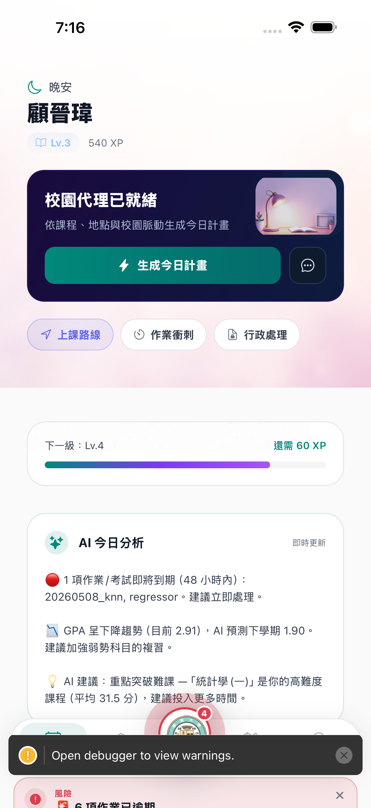
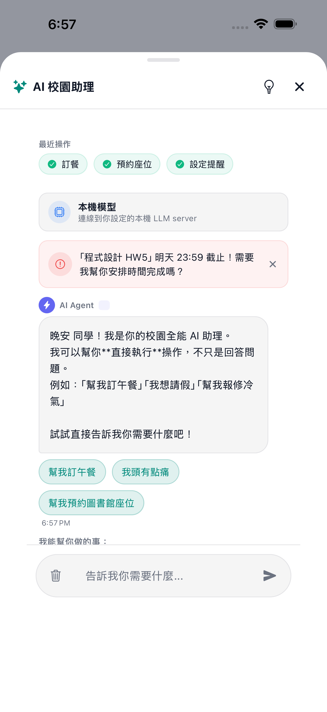

# Campus One

[](https://github.com/Miiduoa/graduation/actions/workflows/ci.yml)

**Flagship project · 校園資訊與行動助手原型**  
Mobile + Web + Backend 的 monorepo。目標不是再做一個校園入口，而是把分散的課程、校務、訊息、地圖與學習資訊整理成「現在下一步要做什麼」。

**第一次看這個 repo：** [2-minute reviewer path](docs/REVIEW_IN_2_MINUTES.md) · [Portfolio case study](https://miiduoa.github.io/case-studies/campus-one/)

<p>
  
  
  
  
</p>

## 30 秒看這個專案

Campus One 的重點不是「做很多校園功能」，而是把 **Mobile、Web、Backend、角色權限、導航與測試** 接成同一套產品流程。

| 想確認什麼 | 直接看 |
|---|---|
| 兩分鐘審查路徑 | [REVIEW_IN_2_MINUTES](docs/REVIEW_IN_2_MINUTES.md) |
| 系統怎麼接起來 | [ARCHITECTURE_OVERVIEW](docs/ARCHITECTURE_OVERVIEW.md) |
| 為什麼這樣設計 | [Architecture Decision Records](docs/adr/README.md) |
| App 實際介面 | [Mobile demo 說明](apps/mobile/DEMO.md) |
| 跨角色與資料流 | [APP_ROLE_DATA_FLOW_ARCHITECTURE](docs/APP_ROLE_DATA_FLOW_ARCHITECTURE.md) |
| AI 怎麼被限制在產品流程內 | [AI_ASSISTANT_ARCHITECTURE](docs/AI_ASSISTANT_ARCHITECTURE.md) |
| 測試到底驗了什麼 | [TESTING_EVIDENCE](docs/TESTING_EVIDENCE.md) |
| API 與後端邊界 | [API](docs/API.md) |

### Mobile snapshot

<p>
  
  
</p>

這兩張圖直接來自 repo 內的 Mobile 實作；README 不放概念 mockup 取代實際畫面。


## Why

學生每天需要在課表、LMS、公告、群組訊息、交通與校園服務之間切換。  
Campus One 想做的不是再多一個功能入口，而是把這些資訊整理成同一個行動流程：

1. **知道今天發生什麼**
2. **看出哪些事情有風險或截止壓力**
3. **直接前往對應頁面處理**
4. **在 Mobile / Web 間維持一致的資料與角色邏輯**

這是一個持續迭代的校園產品原型，部分功能使用示範資料或可切換的外部服務；README 只描述目前 repo 中實際存在的架構與流程。

---

## What is inside

### Mobile

以 **Expo / React Native** 為主，包含：

- 今日行動與校園入口
- 課程、作業、成績與學習相關畫面
- 訊息、群組與跨角色流程
- 校園地圖、室內導覽、公車與地點收藏
- 學習風險與行動建議
- 可選的離線 AI / local LLM 路徑
- deep link、通知與安全導頁護欄

主要程式位於 `apps/mobile/`。

### Web

以 **Next.js** 建立學生與管理／教學情境的 Web 介面，與 Mobile 共用部分型別與商業邏輯。

主要程式位於 `apps/web/`。

### Backend

後端包含：

- Firebase Functions
- Firestore / Storage 規則與資料
- 共用後端邏輯
- AI server / training 實驗程式
- backend tests

主要位於 `backend/`。

---

## Architecture

```text
graduation/
├── apps/
│   ├── mobile/          # Expo / React Native
│   └── web/             # Next.js
├── backend/
│   ├── functions/       # Firebase Functions
│   ├── firestore/
│   ├── storage/
│   ├── ai-server/
│   └── tests/
├── packages/            # shared packages
├── docs/                # architecture / demo / verification notes
├── scripts/             # verification and workflow scripts
└── package.json         # pnpm workspace entry
```

完整系統邊界與資料方向：[Architecture overview](docs/ARCHITECTURE_OVERVIEW.md) · [ADRs](docs/adr/README.md)

### Current stack

| Layer | Main tools |
|---|---|
| Mobile | Expo 54, React Native 0.81, React Navigation, Firebase |
| Web | Next.js 16, React 19, TypeScript |
| Backend | Firebase Functions, Firestore, Storage |
| Shared | pnpm workspace, TypeScript |
| Testing | Jest, Vitest, Firebase rules tests, Maestro E2E |
| Optional AI path | local LLM / llama.rn and backend AI experiments |

---

## Engineering approach

這個專案最大的練習不是把畫面做滿，而是處理跨端系統會遇到的幾個問題。

### 1. Shared logic

Mobile 與 Web 不各自重寫所有邏輯，能共用的資料結構與規則放進 workspace package，降低同一功能在兩端出現不一致的機率。

### 2. Navigation guardrails

深連結、訊息 action 與多角色畫面容易導向不存在或不該開啟的頁面，因此專案加入 route registry、safe navigation 與相關測試。

### 3. Offline / degraded mode

部分校園服務不是永遠可用，因此部分流程設計成示範資料、快取或離線能力可以獨立運作，而不是整個 App 一斷線就失效。

### 4. Grade notifications use explicit recipients

The teacher grading screen is still a local demo, not a TronClass grade writer. It only publishes a local grade event after checking the teacher account, explicit student UID, assignment IDs and score. It does not infer a recipient from a name or student number.

- [Grading screen](apps/mobile/src/screens/TeacherGradingScreen.tsx)
- [Delivery checks](apps/mobile/src/services/prepareGradingDelivery.ts)
- [Recipient isolation tests](apps/mobile/src/__tests__/prepareGradingDelivery.test.ts)

### 5. AI is a layer, not the product

AI 功能只負責整理、推理與提供下一步建議；課程、訊息、導航等核心流程本身仍有一般程式邏輯與護欄。

---

## Run locally

需求：

- Node.js 22（CI / Expo 工具鏈基準；package engines 仍保留 Node 20.19.4+ 相容範圍）
- pnpm 10

安裝：

```bash
git clone https://github.com/Miiduoa/graduation.git
cd graduation
pnpm install
```

Web：

```bash
pnpm dev:web
```

Mobile：

```bash
pnpm dev:mobile
```

iOS simulator：

```bash
pnpm ios:sim
```

---

## Verification

根目錄已提供下列工程指令：

```bash
pnpm lint
pnpm typecheck
pnpm format:check
pnpm test:rules
```

Mobile 另外包含 Jest 與 Maestro E2E flows；Web 使用 Vitest。

各項測試數字與安全稽核結果會隨版本改變，不在首頁維護可能過時的統計。請查看 [可追溯的 CI 測試紀錄](docs/TESTING_EVIDENCE.md) 與 [依賴風險清單](docs/DEPENDENCY_RISK_REGISTER.md)；主要 CI 的成功不代表原生 Maestro E2E 或全部安全警示皆已通過。

一般 CI 會驗證 Expo Doctor、公開 app config 與 `eas.json` build profile，但**不需要 `EXPO_TOKEN`、也不會提交 EAS Cloud build**。真正的 iOS / Android 雲端建置放在手動的 `EAS Build` / `Release` workflow，只有執行雲端建置時才需要 Expo 帳號憑證。

GitHub Actions：  
https://github.com/Miiduoa/graduation/actions

---

## Documentation

`docs/` 保留較完整的架構、資料流與驗證紀錄。比較值得先看的文件：

- [Architecture overview](docs/ARCHITECTURE_OVERVIEW.md)
- [Architecture Decision Records](docs/adr/README.md)
- [Testing evidence](docs/TESTING_EVIDENCE.md)
- `docs/APP_ROLE_DATA_FLOW_ARCHITECTURE.md`
- `docs/CROSS_ROLE_DATA_FLOW.md`
- `docs/AI_ASSISTANT_ARCHITECTURE.md`
- `docs/REMAINING_BUGS_AUDIT.md`

README 刻意不把所有內部函式與每次更新紀錄搬上來；細節放在文件與程式碼裡，首頁只保留能快速理解專案的資訊。

---

## Limitations

- 這是校園情境的產品原型，不是正式校務系統。
- 部分資料與角色流程使用 demo data。
- 外部 LMS、地圖、即時交通或 AI 服務是否可用，取決於環境設定與憑證。
- local LLM 與 AI training 路徑屬實驗性功能，不代表所有裝置都能以相同效能執行。
- repo 中仍保留研究、驗證與口試文件，因此結構比一般單一 App 專案更大。

---

## Author

顧晉瑋 · Providence University, Information Management  
GitHub: https://github.com/Miiduoa
