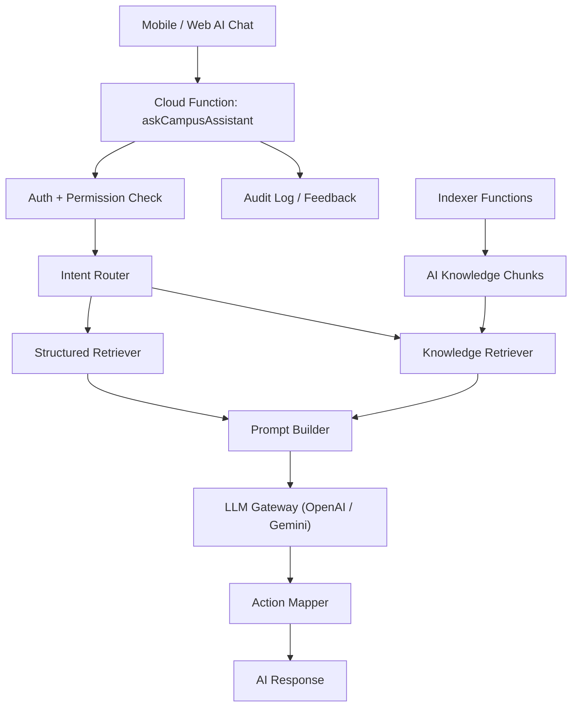

# AI 助理可實作架構方案

本文件針對目前專題的 `React Native + Firebase + Cloud Functions` 架構，整理出一套可落地的 AI 助理設計。目標不是讓 AI 「讀全部資料」，而是讓 AI 在合法授權下，按問題檢索需要的資料後再回答。

## 1. 目標

### 你們想達成的事

- AI 能根據使用者個人資料回答。
- AI 能整合校園公開資料、群組資料、課程資料。
- AI 能做個人化建議，例如作業提醒、學習規劃、選課建議。
- 未來可逐步加入機器學習模型。

### 不應該做的事

- 不要把所有 Firestore 資料一次丟進 prompt。
- 不要讓手機端直接持有正式 AI 金鑰去讀高敏感資料。
- 不要一開始就自行訓練聊天大模型。

## 2. 現況摘要

目前專案已經有 AI 雛形：

- Mobile 端會在 [apps/mobile/src/screens/AIChatScreen.tsx](/Volumes/外接硬碟/畢業專題/apps/mobile/src/screens/AIChatScreen.tsx) 收集公告、活動、餐點、地點、課程、待繳作業、週報等資料後送到 AI。
- AI prompt 組裝邏輯位於 [apps/mobile/src/services/ai.ts](/Volumes/外接硬碟/畢業專題/apps/mobile/src/services/ai.ts)。
- 後端已有排程型摘要能力，例如每日簡報與週報，位於 [backend/functions/index.js](/Volumes/外接硬碟/畢業專題/backend/functions/index.js)。
- Firestore 規則已具備 `school`、`group`、`user` 分層，可作為 AI 權限基礎，位於 [backend/firestore/firestore.rules](/Volumes/外接硬碟/畢業專題/backend/firestore/firestore.rules)。

### 目前做法的主要問題

1. AI provider 是從前端直接呼叫，正式環境不適合承載敏感資料。
2. 上下文靠前端硬塞，資料量一大就會爆 token、延遲變高、費用增加。
3. 沒有明確的「AI 可讀資料範圍」與審計紀錄。
4. 沒有知識索引層，群組貼文、公告全文、教材內容很難精準檢索。

## 3. 建議總體方向

先做 `後端 AI 代理 + 權限控管 + 檢索式生成（RAG）`，再視需求加入推薦模型。

### 核心原則

- `LLM 負責生成答案`，不是直接拿來當資料庫。
- `結構化查詢優先`，例如作業、成績、課表直接查 Firestore。
- `非結構化內容走檢索`，例如公告全文、群組討論、教材、FAQ。
- `權限先判斷再取資料`，而不是取完再過濾。
- `模型訓練是第二階段`，第一階段先把資料流與檢索做對。

## 4. 目標架構



## 5. 模組拆分

### A. 前端

前端只負責：

- 傳送使用者問題。
- 傳送目前畫面或情境，例如 `screen=AIChat`、`groupId`、`courseId`。
- 顯示 AI 回覆與可執行動作。

前端不應再負責：

- 直接拼大段 system prompt。
- 直接持有正式 AI 金鑰讀敏感資料。
- 自己決定能不能讀某筆資料。

### B. 後端入口

新增 Cloud Function，例如：

- `askCampusAssistant`
- `recordAIFeedback`
- `rebuildKnowledgeIndex`

`askCampusAssistant` 流程：

1. 驗證 Firebase Auth。
2. 解析請求內容與情境。
3. 判斷意圖。
4. 根據意圖抓取授權資料。
5. 對非結構化內容做檢索。
6. 組 prompt。
7. 呼叫 LLM。
8. 回傳答案、建議操作、引用來源。
9. 寫入 AI 使用紀錄。

### C. 意圖路由器

先不要一開始就做很複雜的 agent。先把問題分成幾類即可：

- `personal_schedule`
- `assignment_status`
- `grades_analysis`
- `announcement_qa`
- `group_knowledge_qa`
- `campus_service_qa`
- `course_recommendation`
- `general_chat`

這一層可先用規則判斷，之後再改成小型分類模型。

### D. Structured Retriever

這一層負責查可精準結構化的資料：

- `users/{uid}`
- `users/{uid}/groups`
- `users/{uid}/enrollments`
- `users/{uid}/dailyBriefs`
- `users/{uid}/weeklyReports`
- `schools/{schoolId}/announcements`
- `schools/{schoolId}/clubEvents`
- `groups/{groupId}/assignments`
- `groups/{groupId}/members`

這些資料不要先全文轉 embedding，直接查詢最快也最準。

### E. Knowledge Retriever

這一層處理全文內容：

- 公告全文
- 群組貼文與留言
- 教材摘要
- 課程說明
- 校園 FAQ

做法：

1. 新增索引文件，把原始內容切 chunk。
2. 每個 chunk 存 metadata。
3. 問題進來後先依 `schoolId`、`groupId`、`visibility` 過濾。
4. 再做關鍵字或向量檢索。

## 6. 建議的資料分層

| 資料類型 | 來源 | 讀取方式 | 是否需要 embedding |
|---|---|---|---|
| 課表 | user / schedule | 結構化查詢 | 否 |
| 待繳作業 | groups assignments | 結構化查詢 | 否 |
| 成績 / GPA | grades / enrollments | 結構化查詢 | 否 |
| 公告標題與日期 | announcements | 結構化查詢 | 否 |
| 公告全文 | announcements body | 檢索 | 是 |
| 群組 Q&A / 貼文 | groups posts/comments | 檢索 | 是 |
| 教材 / 講義摘要 | course materials | 檢索 | 是 |
| 餐廳、地點、活動 | school public data | 結構化查詢 | 通常否 |
| 週報 / 學習摘要 | users weeklyReports | 結構化查詢 | 否 |

## 7. 建議新增的 Firestore 結構

### 7.1 AI 對話紀錄

```text
users/{uid}/aiSessions/{sessionId}
users/{uid}/aiSessions/{sessionId}/messages/{messageId}
```

欄位建議：

- `createdAt`
- `updatedAt`
- `title`
- `lastIntent`
- `lastContextSummary`

### 7.2 AI 知識索引

```text
schools/{schoolId}/aiKnowledge/{chunkId}
groups/{groupId}/aiKnowledge/{chunkId}
```

欄位建議：

- `sourceType`: `announcement` | `group_post` | `comment` | `material` | `faq`
- `sourceId`
- `schoolId`
- `groupId`
- `visibility`: `public` | `school` | `group`
- `title`
- `text`
- `summary`
- `tags`
- `keywordTokens`
- `embedding`
- `embeddingModel`
- `updatedAt`

### 7.3 AI 執行與稽核紀錄

```text
aiLogs/{logId}
```

欄位建議：

- `uid`
- `schoolId`
- `sessionId`
- `intent`
- `sources`
- `latencyMs`
- `provider`
- `model`
- `promptTokens`
- `completionTokens`
- `createdAt`

## 8. 建議新增的 Functions

### 核心問答

- `askCampusAssistant`
  - AI 主入口

### 索引更新

- `onAnnouncementCreatedForAI`
- `onAnnouncementUpdatedForAI`
- `onGroupPostCreatedForAI`
- `onCommentCreatedForAI`
- `onCourseMaterialUpdatedForAI`

### 衍生資料

- `generateUserLearningProfile`
- `generateCourseRecommendationCandidates`
- `recordAIFeedback`

### 週期任務

- `refreshEmbeddings`
- `purgeOldAILogs`

## 9. askCampusAssistant 建議回傳格式

```json
{
  "content": "你這週有 2 份作業快截止，最早是資料庫期末報告，截止時間是 2026-03-24。",
  "citations": [
    {
      "type": "assignment",
      "id": "asg_123",
      "label": "資料庫期末報告"
    }
  ],
  "suggestions": ["設定提醒", "查看作業", "安排今晚計畫"],
  "actions": [
    {
      "label": "設定提醒",
      "action": "schedule_reminder",
      "params": {
        "assignmentId": "asg_123"
      }
    }
  ],
  "debug": {
    "intent": "assignment_status",
    "sourcesUsed": 3
  }
}
```

正式版可關閉 `debug`。

## 10. 權限與隱私規則

AI 層必須遵守跟 App 一樣的資料權限，不可以因為是後端就直接讀全部。

### 最低要求

1. 只能讀使用者本人資料。
2. 群組內容必須先驗證使用者是否為群組成員。
3. 學校內資料必須先驗證是否屬於該校範圍。
4. 管理資料、站務資料、其他人的私訊不能預設開放給 AI。
5. AI 回答中不能回傳不必要個資。

### 建議做法

- 在 `askCampusAssistant` 內建立 `getAuthorizedContext(uid, request)`。
- 所有 retriever 都只能透過這個入口取資料。
- `aiLogs` 只記 metadata，不記完整敏感正文，必要時只保留摘要。

## 11. 向量檢索怎麼選

### 專題最務實的做法

分兩階段：

#### 第一階段

- 先做 `metadata filter + keyword search + top-k 摘要`。
- 適用於資料量還不大、需要先快速完成 Demo。

#### 第二階段

- 再加真正的 embedding 檢索。
- 資料量大於數千 chunks 時再上向量資料庫。

### 可選方案

- `Firestore + keyword search`
  - 最快。
  - 適合畢專第一版。
- `Firestore metadata + 外部 vector DB`
  - 較完整。
  - 例如 Pinecone、Qdrant、pgvector。
- `全自建向量搜尋`
  - 不建議。
  - 成本高、維護重。

## 12. 機器學習與深度學習怎麼放

### 建議先做的 ML 類型

不要先訓練聊天模型。先做下列小模型比較實際：

- `作業逾期風險預測`
- `課程推薦排序`
- `活動推薦`
- `公告分類`
- `常見問題意圖分類`

### 適合的模型

- 表格資料：`XGBoost`、`LightGBM`、`RandomForest`
- 文字分類：`small transformer` 或直接用 embedding + classifier
- 推薦：`ranking model` 或規則 + 打分模型

### 訓練資料來源

- 修課紀錄
- 成績走勢
- 作業準時率
- 使用者點擊、收藏、報名、查詢行為
- AI 回覆後的 feedback

### 訓練原則

- 必須先匿名化或去識別化。
- 要有使用者同意與隱私聲明。
- 不要直接拿所有聊天紀錄去做模型訓練。

## 13. 三階段落地路線

### Phase 1: 安全重構

目標：把 AI 從前端搬到後端。

- 建立 `askCampusAssistant`
- Mobile 改成呼叫 Cloud Function
- 後端接管 prompt 與 provider key
- 將目前 `AIChatScreen` 的資料收集邏輯改成只傳必要參數

### Phase 2: RAG 上線

目標：讓 AI 能回答公告全文、群組知識、課程內容。

- 建立 `aiKnowledge` chunk
- 實作索引 functions
- 支援 metadata filter
- 先上 keyword search，再補 embedding

### Phase 3: ML 個人化

目標：讓 AI 不只是回答，還能推薦。

- 逾期風險分數
- 課程推薦分數
- 學習節奏建議
- 活動推薦排序

## 14. 對現有檔案的具體調整建議

### 前端

- [apps/mobile/src/screens/AIChatScreen.tsx](/Volumes/外接硬碟/畢業專題/apps/mobile/src/screens/AIChatScreen.tsx)
  - 保留 UI。
  - 移除大量 context 組裝。
  - 改為呼叫 `httpsCallable(functions, "askCampusAssistant")`。

- [apps/mobile/src/services/ai.ts](/Volumes/外接硬碟/畢業專題/apps/mobile/src/services/ai.ts)
  - 改成前端 SDK 包裝層。
  - 不再直接持有 OpenAI / Gemini 呼叫邏輯。

### 後端

- [backend/functions/index.js](/Volumes/外接硬碟/畢業專題/backend/functions/index.js)
  - 新增 `askCampusAssistant`
  - 新增內容索引 functions
  - 將目前每日簡報與週報輸出接入 AI 衍生資料層

### 安全規則

- [backend/firestore/firestore.rules](/Volumes/外接硬碟/畢業專題/backend/firestore/firestore.rules)
  - 新增 `aiSessions`
  - 新增 `aiKnowledge`
  - 新增 `aiLogs` 的讀寫規則

## 15. 不建議的做法

- 不要把 `EXPO_PUBLIC_OPENAI_API_KEY` 當正式方案。
- 不要每次都把所有公告、所有作業、所有群組留言送進 LLM。
- 不要讓 AI 直接讀完整 `users` 集合。
- 不要直接訓練自己的聊天大模型當第一版。
- 不要在沒有資料治理的情況下收集全部聊天內容做訓練。

## 16. 推薦結論

對這個專題，最適合的路線是：

1. 先把 AI 呼叫搬到 Cloud Functions。
2. 將資料分成 `結構化查詢` 與 `知識檢索` 兩條路。
3. 用權限控管包住所有 retriever。
4. 先做 RAG，再做小型推薦模型。
5. 把自行訓練大型聊天模型排到最後，甚至可以不做。

這樣的成果在畢專口試上也比較有說服力，因為你們能清楚說明：

- AI 怎麼拿資料
- 為什麼不讀全部
- 怎麼控管權限
- 怎麼逐步升級到機器學習與個人化推薦
