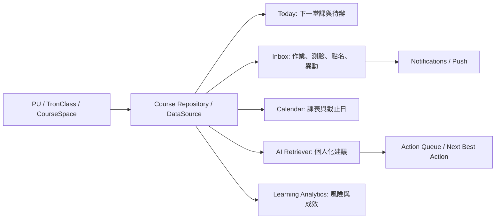
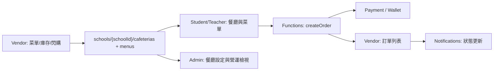
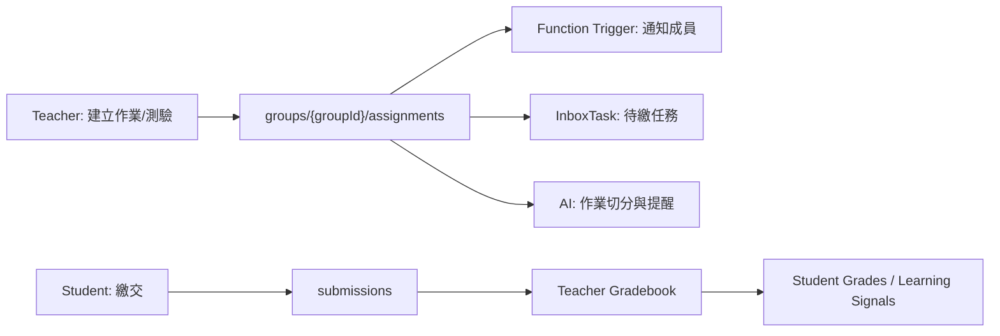
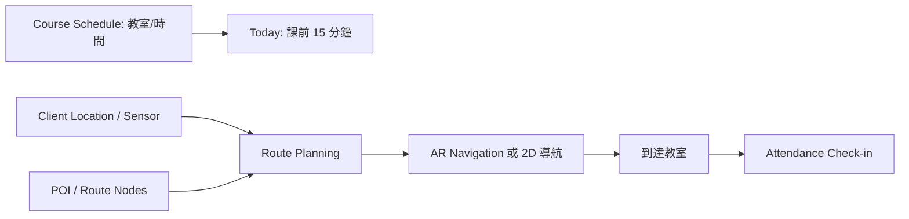
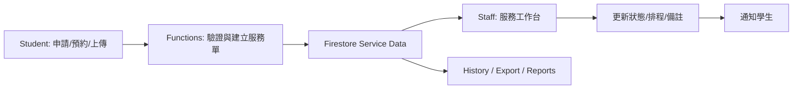

# APP 功能、角色、資料流架構設計文件

本文整理 Campus One / Campus Agent OS 在「專題完整願景」下的功能、角色、資料來源、權限與跨功能資料流。內容以目前 repo 的 Mobile、Web、Firebase Functions、Firestore rules、AI 架構與產品藍圖為基礎，並標示哪些屬於現有能力、哪些屬於願景或待補強能力。

## 1. 系統總覽

Campus One 的產品定位不是單一功能集合，而是把課程、校務、校園生活、訊息、AI 建議與行動執行接成閉環的 Campus Agent OS。使用者不需要先判斷要去哪個系統查資料，而是由 App 根據角色、時間、課程、地點與待辦，提示下一個可執行動作。

### 1.1 系統分層

| 層級 | 主要位置 | 責任 | 資料使用原則 |
|---|---|---|---|
| Mobile App | `apps/mobile` | 主要行動體驗、5-tab 導航、離線快取、推播、Widget、AR/地圖、AI 對話入口 | 透過 DataSource、repository、service 存取資料，不在 Screen 直接實作敏感資料邏輯 |
| Web / PWA | `apps/web` | 桌面與瀏覽器入口、登入、公告、課程、地圖、餐廳、教師課程頁 | 與 Mobile 共用 Firebase / backend 資料邊界，適合補足教師與管理工作台 |
| Firebase Auth | Firebase | 使用者身份、PU 學號登入、SSO custom token | 身份驗證來源；角色與服務權限仍需搭配 Firestore membership / service role |
| Firestore / Storage | `backend/firestore`、`backend/storage` | App-native、即時、協作、個人化與快取投影資料 | 適合通知、群組、訊息、偏好、成就、AI action queue；不作為敏感校務與金流最終權威 |
| Cloud Functions | `backend/functions` | 認證、權限檢查、資料代理、通知、支付、校務/TronClass 整合、AI 入口 | 涉及 secret、校務帳密、金流、角色管理、敏感驗證的操作都應在後端完成 |
| AI Server | `backend/ai-server` | RAG、模型 provider、訓練/評估、自動成長流程 | AI 不直接讀全部資料；必須透過授權 retriever 取得最小必要上下文 |
| Shared contracts | `packages/shared` | 共用型別、學校設定、PU auth contract、通知與畢業學分規則 | 避免 mobile / web / functions 各自複製角色與資料契約 |

### 1.2 角色導向 5-tab 入口

Mobile 的主心理模型固定為五個入口：

```text
Today -> 角色入口 -> 校園 -> 收件匣 -> 我的
```

第二個 tab 依角色切換：

| RoleGroup | 第二 tab | 主要任務 |
|---|---|---|
| `student` | 課程 | 課表、課程、作業、測驗、成績、學習分析 |
| `teacher` | 教學 | 開課、教材、點名、評量、成績簿、課中互動 |
| `staff` | 服務 | 宿舍、列印、健康、場館、服務工單 |
| `department_head` | 審核 | 部門報表、審核流程、課程/公告/服務簽核 |
| `admin` | 管理 | 全校公告、角色、資料設定、餐廳/校園服務管理 |

訪客沒有完整個人化 tab 權限，只能使用公開資料入口，例如公告、地圖、交通、餐廳公開菜單。

### 1.3 狀態標示

文件中的功能狀態使用以下標記：

| 狀態 | 意義 |
|---|---|
| 現有 | repo 中已有畫面、型別、service、function 或 rules 支援 |
| 部分現有 | 已有雛形，但資料流、權限、導航或後端驗證尚未完整 |
| 願景/待補強 | 產品藍圖中合理需要，但尚需正式 schema、API、rules 或 UI 補齊 |

## 2. 角色與權限模型

### 2.1 角色定義

| 角色 | 對應實作/來源 | 可見功能 | 可執行動作 | 不可做 |
|---|---|---|---|---|
| `visitor` | 未登入或公開瀏覽 | 公開公告、活動、地圖、POI、交通、餐廳公開菜單 | 搜尋公開資訊、啟動公開路線導航 | 查看個人課表、成績、私訊、支付、訂餐、宿舍、個人通知 |
| `student` / `alumni` | `users.role`、school member | Today、課程、校園、收件匣、我的 | 查課表/成績、交作業、測驗、簽到、訂餐、付款、報修、預約、發文、私訊 | 管理他人成績、修改課程官方資料、管理店家與全校設定 |
| `teacher` / `professor` | `users.role`、course/group manager | Today、教學、校園、收件匣、我的 | 建課程、管理教材、開點名、建立測驗/作業、批改、發布成績、管理課程討論 | 修改全校角色與金流設定、存取非任課學生私有資料 |
| `staff` | `users.role`、`serviceRoles` | Today、服務、校園、收件匣、我的 | 處理宿舍、列印、健康、包裹、場館等服務資料 | 讀取非服務範圍內的成績、私訊、支付細節 |
| `department_head` / `principal` | `users.role=principal` | Today、審核、校園、收件匣、我的 | 查看部門報表、審核工作流、查看必要彙整資料 | 直接越權讀取個人敏感明細，除非流程授權 |
| `admin` | `users.role=admin` 或 school member admin | Today、管理、校園、收件匣、我的 | 管理全校公告、活動、角色、服務權限、餐廳設定、系統報表 | 直接在 client 寫入敏感資料；敏感操作仍需 Functions |
| `vendor` / `operator` | `schools/{schoolId}/cafeterias/{cafeteriaId}/operators/{uid}` | 店家管理、訂單、菜單、閃購、營運統計 | 菜單 CRUD、接單、更新訂單狀態、建立促銷 | 查看其他店家營運資料、修改全校餐廳設定、查看學生非訂單個資 |

### 2.2 權限控制層

| 控制層 | 現有依據 | 控制內容 |
|---|---|---|
| Tab 層 | `getTabsForRole()` | 依角色切換第二 tab，限制主要入口 |
| Screen 層 | `canAccessScreen()`、`RouteGuard` | 保護管理、成績簿、點名、課程建立、學習分析等畫面 |
| UI 層 | `RoleGatedSection`、`usePermissions()` | 隱藏無權限按鈕、區塊與操作入口 |
| DataSource / repository 層 | `src/data/source.ts`、feature repositories | 將畫面資料存取導向 mock/firebase/hybrid/source，不讓 Screen 直接耦合資料庫細節 |
| Backend 層 | Functions authz helpers | 校務登入、支付、角色更新、服務工單、店家操作、AI 授權上下文 |
| Rules 層 | `backend/firestore/firestore.rules` | Firestore 最後防線，限制 self、school member、group member、editor、service role、cafeteria operator |

### 2.3 角色行動政策

AI 與主動建議功能中的行動應遵守角色 action policy：

| 角色 | 可由 AI 或 App 建議的動作 | 寫入效果 |
|---|---|---|
| `student` | 導航、設定提醒、作業切分、草稿訊息、開啟連結、課堂簽到 | 本機提醒、user queue、個人草稿 |
| `teacher` | 導航、提醒、草稿訊息、送出草稿、課堂操作、開啟連結 | group/course data、user queue |
| `staff` | 導航、草稿訊息、送出草稿、開啟連結 | school/service data，需 service role |
| `department` | 導航、草稿訊息、送出草稿、開啟連結 | school/approval data，需審核權限 |
| `admin` / `school` | 導航、草稿訊息、送出草稿、開啟連結 | school data，需 admin |

高敏感動作不可由 AI 直接完成，應先進入 `users/{uid}/actionQueue`，標示 `requiresConfirmation=true`，再由使用者或授權角色確認。

## 3. 功能與資料矩陣

### 3.1 Today

| 項目 | 狀態 | 使用者連結 | 主要資料 | 資料來源 | 輸出/影響 |
|---|---|---|---|---|---|
| 今日課表與下一堂課 | 現有 | 學生、教師 | 課程、時間、教室、授課者 | PU/TronClass backend、DataSource、cache | Today card、課前導航、課堂入口 |
| 待辦與作業截止 | 現有/部分現有 | 學生、教師 | assignments、quizzes、dueAt、submission 狀態 | group/course data、TronClass、Firestore projection | 收件匣任務、AI 作業切分、推播提醒 |
| 公告與活動摘要 | 現有 | 所有角色、訪客 | announcements、events | Firestore public data、school adapter | Today feed、通知、搜尋 |
| Next Best Action | 部分現有 | 已登入角色 | nextBestActions、riskSnapshots、pulseAggregates | `users/{uid}/...`、AI/Functions 衍生資料 | 優先處理建議、導航/提醒/草稿 |
| AI 今日摘要 | 部分現有 | 已登入角色 | 課表、待辦、公告、週報、風險 | AI retriever、dailyBriefs、weeklyReports | 每日簡報、推播、AI Chat 起始上下文 |

Today 的核心不是顯示所有功能，而是根據使用者現在最可能需要的校園行動排序。課程、地點、時間與待辦是 Today 的主要資料軸。

### 3.2 課程 / LMS

| 功能 | 狀態 | 角色 | 使用資料 | 權威來源 | 連到其他功能 |
|---|---|---|---|---|---|
| 課程空間 Course Hub | 現有/部分現有 | 學生、教師 | courseSpaces、groups、members、announcements | TronClass / Firestore group projection | Today、收件匣、AI、成績簿 |
| 教材單元 | 現有/部分現有 | 學生、教師 | modules、materials、resourceUrl、week | TronClass / groups modules | 課前預習、AI 課程問答、離線快取 |
| 作業與繳交 | 現有 | 學生、教師 | assignments、submissions、attachments、feedback | Firestore groups assignments、TronClass | 收件匣、通知、成績簿、學習風險 |
| 測驗/考試 | 部分現有 | 學生、教師 | quizzes、questions、attempts、scores | TronClass / 待正式化 question bank | 成績、學習分析、AI 複習建議 |
| 點名/出缺席 | 現有/部分現有 | 學生、教師 | attendanceSessions、records、qrToken、location | Functions + Firestore group sessions | Today 課堂入口、風險雷達、通知 |
| 成績簿 | 部分現有 | 學生、教師 | gradeItems、gradebookRows、finalScores | TronClass / Firestore gradebook | 學習分析、畢業學分、AI 風險分析 |
| 課中互動 | 部分現有 | 學生、教師 | liveSessions、polls、questions、reactions | Firestore group liveSessions + Functions | Classroom mode、收件匣、學習分析 |
| 學習分析 | 部分現有 | 學生、教師、系主任 | learningSignals、riskSnapshots、attendance、grades | Functions 衍生資料、AI server | Today、AI 建議、部門報表 |
| 畢業學分試算 | 現有 | 學生 | enrollments、grades、grad requirements | PU / user enrollments / shared rules | AI 選課建議、我的、課程推薦 |

正式願景中，`groups.type === "course"` 可作過渡，但長期應正式化 `courseSpaces`，把社團、讀書會與正式課程分離。

### 3.3 校園服務

| 功能 | 狀態 | 角色 | 使用資料 | 資料來源 | 跨功能連結 |
|---|---|---|---|---|---|
| 地圖 / POI | 現有 | 所有角色、訪客 | POI、分類、座標、開放時間、reviews、crowd reports | Firestore public school data、adapter | 課前導航、搜尋、AI 校園問答 |
| AR 導航 / 無障礙路線 | 部分現有/願景 | 所有角色、訪客 | 路網節點、GPS、IMU、可通行狀態、資料等級 | client sensors + backend managed route data | 課表、地圖、Today、回報閉環 |
| 餐廳 / 菜單 | 現有 | 所有角色、訪客 | cafeterias、menus、ratings、pilotStatus | Firestore school cafeterias/menus、cafeteria scraper | 訂餐、支付、店家管理、AI 推薦 |
| 訂餐 / 取餐 | 部分現有 | 學生、教師、vendor | orders、orderItems、pickupTime、status | Functions + Firestore orders | 支付、通知、店家管理 |
| 支付 / 錢包 | 部分現有 | 學生、教師、admin | wallet、transactions、ledger、payment intents | Functions、金流 provider webhook | 訂餐、列印、退款、資料匯出 |
| 圖書館 | 現有/部分現有 | 所有登入角色 | books、loans、seats、reservations | backend adapter / Firestore projection | Today 推薦、AI 查詢、座位預約 |
| 交通 / 公車 | 現有 | 所有角色、訪客 | busRoutes、busArrivals、TDX data | Functions with TDX secret、Firestore projection | 課後交通、Today、AI 路線建議 |
| 宿舍 | 部分現有 | 學生、staff | dormInfo、repairRequests、packages、washing | Functions + Firestore service data | 服務工單、通知、職員處理 |
| 健康中心 | 部分現有 | 學生、staff | appointments、records、timeSlots | Functions + Firestore / institutional adapter | 預約通知、個人資料、服務端管理 |
| 列印服務 | 部分現有 | 學生、教師、staff | printers、printJobs、files、cost | Functions + Storage + Firestore | 支付、通知、職員管理 |
| 失物招領 | 現有 | 所有角色、staff/admin | lostFoundItems、status、reporter、claimedBy | Firestore public/app-native data | 通知、管理審核、搜尋 |

### 3.4 收件匣

| 類型 | 狀態 | 來源 | 使用者看到的動作 | 寫入/更新 |
|---|---|---|---|---|
| 通知 | 現有 | Functions triggers、push tokens、user notifications | 查看、標記已讀、開啟目標畫面 | `users/{uid}/notifications` 或 root projection |
| 課程任務 | 現有/部分現有 | assignments、quizzes、attendance、group updates | 繳交、進入課堂、查看變更 | submissions、attendanceRecords、read state |
| 群組與討論 | 現有 | groups、posts、comments、members | 閱讀、回覆、發文、管理成員 | group posts/comments/messages |
| 私訊 | 現有 | conversations、messages | 回覆、已讀、開啟聊天室 | conversations/messages readBy |
| 審核任務 | 願景/待補強 | approvals、admin queue、service requests | 通過、退回、要求補件 | approval records、admin logs |
| AI 建議待確認 | 部分現有 | assistant actions、risk/nextBestAction | 確認、取消、稍後處理 | `users/{uid}/actionQueue` |

收件匣應是可執行工作佇列，不只是通知列表。每個 item 都應有 intent、urgency、actionTarget 與權限檢查。

### 3.5 我的

| 功能 | 狀態 | 使用資料 | 權限 |
|---|---|---|---|
| 個人資料 | 現有 | `users/{uid}`、school membership、service roles、merchant assignments | 只能讀/改本人可改欄位；role、balance、schoolId 不由 client 任意修改 |
| 設定 / 偏好 | 現有 | user settings、theme、language、accessibility、notification preferences | 本人讀寫 |
| 通知設定 | 現有 | pushTokens、notification preferences | 本人讀寫，推播 token 清理於登出時處理 |
| 資料匯出 | 現有 | user profile、favorites、groups、notifications 等 | Functions 產出，避免 client 自行掃描敏感資料 |
| 帳號刪除 | 現有 | Auth、user data、scoped storage | Functions 執行正式刪除；client 清本機 cache/session |
| 成就 | 現有 | achievements、userAchievements | 使用者讀取，進度多由後端或規則化流程更新 |
| QR Code / Widget | 現有 | 使用者身份、快速入口、Today data | 不應暴露敏感 token；Widget 使用最小必要快取 |

### 3.6 AI 助理

| 功能 | 狀態 | 可用資料 | 安全原則 |
|---|---|---|---|
| 校園公開問答 | 現有/部分現有 | 公告、活動、菜單、POI、交通、公開知識 | 可讀公開資料，可附來源 |
| 個人化問答 | 部分現有 | 課表、作業、成績摘要、週報、學分、通知 | 只能讀本人授權資料 |
| 課程知識 RAG | 願景/待補強 | 教材、公告全文、討論、FAQ chunk | 先驗證 group/course membership，再檢索 |
| 作業切分與提醒 | 部分現有 | assignment、dueAt、calendar、actionQueue | 建議可建立草稿或提醒；高敏感動作需確認 |
| 學習風險提醒 | 部分現有 | riskSnapshots、learningSignals、grades、attendance | 回答避免暴露他人個資，教師端只看任課/授權範圍 |
| 行動建議 | 部分現有 | nextBestActions、context graph、role policy | action 必須符合角色 policy 與 permission scope |
| AI 稽核與回饋 | 願景/待補強 | aiLogs、feedback、provider metadata | logs 只保留 metadata 或摘要，不保存完整敏感正文 |

AI 不應把所有 Firestore 資料塞進 prompt。正式流程應是：Auth -> intent routing -> authorized retriever -> prompt builder -> LLM gateway -> action mapper -> audit/feedback。

### 3.7 管理 / 審核 / 服務 / 店家

| 角色入口 | 狀態 | 管理資料 | 主要動作 | 下游影響 |
|---|---|---|---|---|
| Admin | 現有/部分現有 | announcements、events、members、serviceRoles、cafeterias、settings、adminLogs | 發布/刪除公告、角色指派、服務角色、店家設定、資料清理 | 所有角色可見內容、通知、權限 |
| Department Head | 願景/部分現有 | department reports、approval workflows、analytics | 審核、查看部門報表、課程/公告簽核 | 收件匣審核任務、教師/學生通知 |
| Staff | 部分現有 | repairRequests、printJobs、packages、healthAppointments、facility orders | 處理、更新狀態、通知使用者 | 學生服務狀態、推播、歷史紀錄 |
| Vendor / Operator | 部分現有 | cafeterias、menus、orders、flashDeals、stats | 菜單 CRUD、接單、更新狀態、促銷 | 學生菜單、訂單、支付、營運報表 |
| Teacher | 部分現有 | courseSpaces、members、assignments、quizzes、gradebook、attendance | 發布教材、點名、批改、互動、成績發布 | 學生 Today、收件匣、AI 分析 |

## 4. 跨功能資料流

### 4.1 課程資料 -> Today / 收件匣 / AI / 行事曆 / 學習分析



資料流重點：

- 課表、課程成員、作業、測驗、點名與成績是學習主流程的核心資料。
- Today 只取使用者當下最重要的片段，例如下一堂課、即將截止作業、課前導航。
- 收件匣接收可執行任務，並保留 actionTarget。
- AI 透過授權 retriever 讀取課程上下文，不直接掃描所有群組。
- 學習分析使用出缺席、成績、作業準時率與互動資料產生 riskSnapshots。

### 4.2 餐廳店家資料 -> 學生菜單 / 訂單 / 支付 / 管理端



資料流重點：

- 店家更新的菜單會影響學生看到的菜單、AI 餐點推薦與 Today/校園餐飲入口。
- 訂單建立、付款、退款、webhook 驗證必須走 Functions。
- 店家只能看自己被指派 cafeteria 的訂單與統計。
- Admin 可審核與設定餐廳，但不應由 client 直接修改敏感金流資料。

### 4.3 群組/作業資料 -> 通知 / AI 建議 / 成績簿 / 教師端



資料流重點：

- 作業/測驗建立後，學生的收件匣、推播與 AI 建議同步更新。
- 學生 submission 只能由本人建立或修改自己的提交資料；教師/管理者依 group manager 權限批改。
- 成績發布會觸發學生通知，也會進入學習分析與風險模型。

### 4.4 地圖/交通/課表 -> 課前導航閉環



資料流重點：

- 課表提供目的地與時間，POI/路網提供路線，client sensors 提供目前位置。
- AR 導航必須有資料可信度與降級策略；GPS/羅盤品質不足時改用 2D 地圖與文字路徑。
- 抵達教室後可銜接點名、Classroom Mode、課堂互動。

### 4.5 宿舍/健康/列印服務 -> 學生申請 / 職員處理 / 通知回饋



資料流重點：

- 宿舍報修、健康預約、列印任務都屬於服務流程資料，建立與狀態更新應走後端驗證。
- 職員只能處理自己 service role domain 內的資料。
- 學生只看自己的申請、預約與紀錄。

## 5. 資料使用與安全

### 5.1 資料分類

| 分類 | 例子 | 可讀角色 | 寫入/修改方式 |
|---|---|---|---|
| 公開資料 | 公告、活動、POI、公開菜單、公車到站、圖書館公開書目 | 訪客與所有角色 | 管理端或 Functions，少數 app-native review/report 允許登入者新增 |
| 校內資料 | school directory、校內公告全文、群組知識、課程成員摘要 | school member、授權角色 | Functions 或具 editor/admin 權限者 |
| 個人資料 | profile、課表、通知、偏好、成就、個人行事曆 | 本人；必要時授權服務角色 | 本人可改低敏欄位，role/balance/schoolId 不由 client 任意更改 |
| 學業敏感資料 | 成績、出缺席、修課紀錄、風險分析 | 本人、任課教師、授權主管 | 後端/校務 adapter 或 course manager，Rules 僅作最後防線 |
| 協作資料 | 群組、貼文、留言、作業、submission、peer review | group member / manager | Firestore rules 控制 group membership 與 manager 權限 |
| 服務資料 | 宿舍、包裹、健康、列印、洗衣、座位預約 | 本人、service role、admin/editor | Functions 建立與更新，service role domain 控制 |
| 金流/權威資料 | wallet、transactions、payment intents、refunds、ledger | 本人、admin/finance backend | Functions + provider webhook；client 不直接寫交易權威資料 |
| AI 資料 | aiSessions、messages、actionQueue、aiKnowledge、aiLogs | 本人或授權 retriever | 對話本人可存取；actionQueue 需確認；aiLogs 最小化保存 |

### 5.2 Firestore / Backend / Client cache 邊界

| 邊界 | 適合放的資料 | 不適合放的資料 |
|---|---|---|
| Firestore canonical | 使用者 profile、通知、群組、訊息、貼文、偏好、成就、行事曆、AI action queue、app-native reviews/reports | 校務帳密、金流 secret、支付最終驗證、成績/出缺席的唯一權威 |
| Backend / Adapter canonical | PU 登入、TronClass、成績、出缺席、校務紀錄、支付、圖書館/健康/宿舍權威服務、角色管理 | 純 UI 狀態、本機偏好、可離線暫存草稿 |
| Client cache | 離線閱讀、暫存操作、待同步佇列、展示 fallback、Widget 快取 | 可被竄改後造成權限提升或金流結果改變的權威資料 |

### 5.3 AI 安全規則

AI 層必須遵守與 App 相同或更嚴格的資料權限：

1. 先驗證 Firebase Auth，再建立使用者上下文。
2. 依 intent 決定需要哪些 retriever，不一次讀所有資料。
3. 每個 retriever 先檢查 `isSelf`、school membership、group membership、course manager、service role 或 admin。
4. Prompt 只放最小必要資料，避免傳送完整個資、完整私訊或無關敏感內容。
5. 回答需附 evidence refs 或 citations，方便使用者知道資料來源。
6. 高敏感 action 只建立草稿或待確認 queue，不由模型直接完成。
7. `aiLogs` 只保存 metadata、來源 ID、intent、latency、provider 等稽核資訊，避免保存完整敏感正文。

### 5.4 Runtime data modes

| 模式 | 使用情境 | 文件與 Demo 說明 |
|---|---|---|
| `mock` | UI 開發、專題展示、不連正式服務 | 必須標示為示範資料，不宣稱即時或正式校務資料 |
| `firebase` | Firebase 整合、rules、demo runtime | 可驗證 Auth、Firestore、Functions 與推播資料流 |
| `hybrid` | 真實校務整合目標模式 | App-native 走 Firebase，校務/TronClass/支付等走 backend adapter，失敗時可 fallback 快取 |

正式對外展示時，需清楚標示資料來源等級與 freshness，尤其是 AR 導航、校務成績、支付、健康與宿舍資料。

## 6. 驗收檢查表

| 檢查項 | 驗收標準 |
|---|---|
| 功能覆蓋 | Today、課程/LMS、校園、收件匣、我的、AI、管理/審核/服務/店家均有角色、資料來源、操作、輸出資料 |
| 角色邊界 | 每個角色都有可看、可寫、需後端驗證、不可做的清楚邊界 |
| 資料邊界 | 文件不把校務、成績、金流、健康等敏感資料描述為 client 直接權威寫入 |
| Firestore rules 一致性 | self、school member、group member、service role、cafeteria operator、admin/editor 的資料流與現有 rules 不衝突 |
| AI 安全 | AI 不直接讀全部資料；必須透過授權 retriever 與最小必要上下文 |
| 願景標示 | 現有、部分現有、願景/待補強功能有明確區分 |

## 7. 實作備註

- 本文件不新增 public API、不修改 Firestore schema、不改程式碼，只作為架構與專題報告用設計文件。
- 後續若要把願景轉為實作，應先補齊 courseSpaces、questionBanks、gradeItems、approval workflows、service dashboards、AI retrievers 與相關 rules/tests。
- 若新增正式 collection，需同步更新 shared types、DataSource/repository、Functions validation、Firestore indexes、security rules 與 rules tests。
