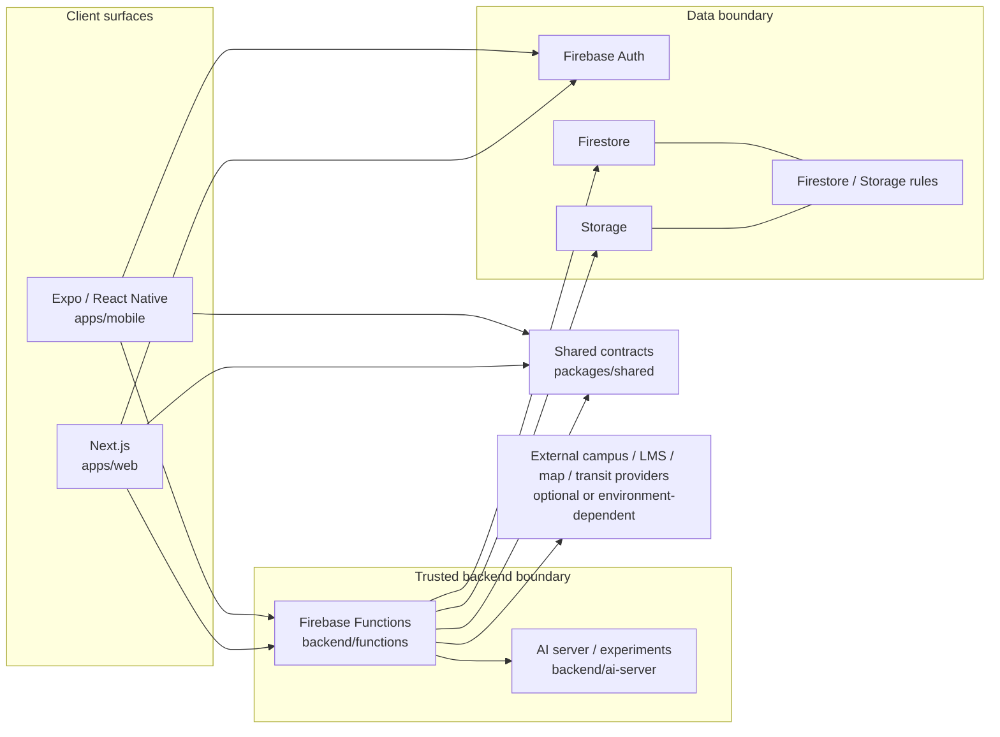

# Campus One architecture overview

這張圖只畫目前 repo 中能對應到程式與 workflow 的主要邊界。它不是部署拓撲圖，也不把尚未接上的校務、交通或支付 provider 畫成已完成服務。



## Request path

對需要身份與敏感資料的流程，repo 的目標路徑是：

```text
Mobile / Web
    ↓
route + UI permission
    ↓
typed repository / service boundary
    ↓
Firebase Auth identity
    ↓
Cloud Function authorization
    ↓
Firestore / Storage security rules
    ↓
data or external provider
```

UI 是否顯示按鈕不是安全邊界。Client guard 主要改善操作與導航；真正的資料限制仍必須由 backend authorization 與 rules 執行。

## Role model

Mobile 的主要入口保持固定，但第二個 tab 依角色切換：

```text
Today → role workspace → Campus → Inbox → Me
```

| Role | Workspace | Main responsibility |
|---|---|---|
| student | 課程 | 課表、作業、學習與個人校園行動 |
| teacher | 教學 | 課程、點名、評量、成績與課堂流程 |
| staff | 服務 | 宿舍、場館、健康等校園服務 |
| department_head | 審核 | 部門報表與審核流程 |
| admin | 管理 | 全校設定、角色與管理流程 |

完整角色／資料矩陣：[APP_ROLE_DATA_FLOW_ARCHITECTURE](APP_ROLE_DATA_FLOW_ARCHITECTURE.md)。

## Shared contract boundary

`packages/shared` 只放跨端必須一致的 contract 與規則，例如 TypeScript domain types、角色相關 contract、school configuration 與 selected business rules。平台 UI、navigation adapter、device capability 與 backend-only secret logic 留在各自邊界。

## AI boundary

AI 路徑不是資料權威來源。授權 context 先經 retriever / tool boundary，再由模型提出 suggestion、draft 或 candidate action；高敏感 write 需要 confirmation。詳細設計：[AI_ASSISTANT_ARCHITECTURE](AI_ASSISTANT_ARCHITECTURE.md)。

## Degraded mode

外部服務需要憑證、網路或校方整合，因此部分流程保留 mock、cache、Firebase 或 hybrid data path。目標不是讓 demo 永遠顯示成功，而是讓 provider 失敗時，快取狀態可辨識、失敗 action 不被偽裝成成功，核心導航仍可工作，角色與資料權限也不因 provider 改變。

## Verification boundary

CI 將 security audit、lint/typecheck、Mobile/Web/Functions tests、Firestore rules、Expo/EAS config 與 Web production build 分開驗證。完整數字見 [TESTING_EVIDENCE](TESTING_EVIDENCE.md)。

## What this diagram does not claim

- 不是正式 production network topology。
- 沒有假裝 Firebase、AI、外部 provider 的 HA、backup、SLO 已完成。
- demo / mock data 不是校方權威資料。
- local LLM 與 backend AI experiments 不代表每台裝置都有相同可用性。